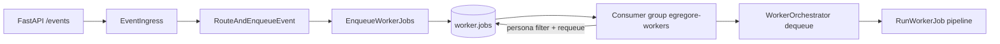

# Egregore architecture notes

## Hexagonal boundaries (Phases 1–8)

Dependency direction: `interfaces/` → `application/` → `domain/`; `infrastructure/` implements application ports; `bootstrap/container.py` is the composition root.

- **Orchestration:** `EnqueueWorkerJobs` implements `OrchestrationPort`; enqueue from `RouteAndEnqueueEvent`, `StartEngagement`, bus ingress — not from `WorkerOrchestrator`.
- **Worker execution:** `WorkerOrchestrator` dequeues and delegates to `RunWorkerJob` + pipeline services (`context_builder`, `agent_executor`, `result_validator`, `finding_publisher`, `job_finalizer`).
- **Observability ports:** `MetricsPort`, `CorrelationIdPort`, `WorkerTracingPort`, `TraceFlushPort` — adapters in `cys_core/infrastructure/observability/`.
- **Domain purity:** no `cys_core.infrastructure` imports in domain; plan YAML I/O in `application/plans/plan_loader.py`; policy lookups in `infrastructure/policy/*_adapter.py`.

Arch gate:

```bash
make -C projects/egregore verify-architecture
```

See [ARCHITECTURE_DEBT.md](ARCHITECTURE_DEBT.md) for resolved phases and open follow-ups.

## Worker job queue (Stream B)

Single Kafka topic for all personas:



- **Enqueue:** `RouteAndEnqueueEvent` / `StartEngagement` → `EnqueueWorkerJobs` → `worker.jobs` (persona in payload).
- **Consume:** shared consumer group `egregore-workers`; persona-scoped daemons skip foreign jobs and re-enqueue them.
- **Fallback:** in-memory queue when Kafka is unavailable (`cys_infrastructure_fallback_total`).

Legacy per-persona topics (`worker.jobs.{persona}`) are deprecated in code; k8s topic migration is deferred until cluster access returns.

## Agent catalog (Stream C)

- **Prod:** `USE_DYNAMIC_CATALOG=true`, `USE_MEMORY_FALLBACK=false` → Postgres catalog only.
- **Dev:** memory fallback may merge filesystem personas for local testing.
- **Seed:** API `POST /catalog/seed` is the supported bootstrap path.

See [CATALOG_RUNTIME_INVENTORY.md](CATALOG_RUNTIME_INVENTORY.md).
