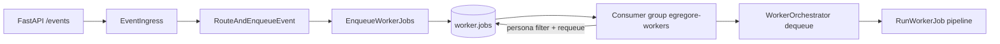
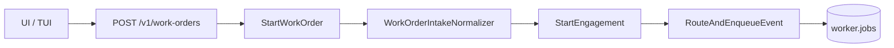
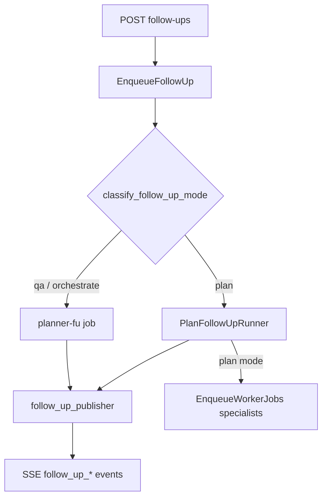

# Egregore architecture notes

## Hexagonal boundaries (Phases 1–8)

Dependency direction: `interfaces/` → `application/` → `domain/`; `infrastructure/` implements application ports; `bootstrap/container.py` is the composition root.

- **Orchestration:** `EnqueueWorkerJobs` implements `OrchestrationPort`; enqueue from `RouteAndEnqueueEvent`, `StartEngagement`, bus ingress — not from `WorkerOrchestrator`.
- **Worker execution:** `WorkerOrchestrator` dequeues and delegates to `RunWorkerJob` + pipeline services (`context_builder`, `agent_executor`, `result_validator`, `finding_publisher`, `job_finalizer`).
- **Observability ports:** `MetricsPort`, `CorrelationIdPort`, `WorkerTracingPort`, `TraceFlushPort` — adapters in `cys_core/infrastructure/observability/`.
- **Domain purity:** no `cys_core.infrastructure` imports in domain; plan YAML I/O in `application/plans/plan_loader.py`; policy lookups in `infrastructure/policy/*_adapter.py`.

Arch gate:

```bash
make -C projects/egregore verify-architecture
```

See [ARCHITECTURE_DEBT.md](ARCHITECTURE_DEBT.md) for resolved phases and open follow-ups.

## Worker job queue (Stream B)

Single Kafka topic for all personas:



- **Enqueue:** `RouteAndEnqueueEvent` / `StartEngagement` → `EnqueueWorkerJobs` → `worker.jobs` (persona in payload).
- **Consume:** shared consumer group `egregore-workers`; persona-scoped daemons skip foreign jobs and re-enqueue them.
- **Fallback:** in-memory queue when Kafka is unavailable (`cys_infrastructure_fallback_total`).

Legacy per-persona topics (`worker.jobs.{persona}`) are deprecated in code; k8s topic migration is deferred until cluster access returns.

## Agent catalog (Stream C)

- **Prod:** `USE_DYNAMIC_CATALOG=true`, `USE_MEMORY_FALLBACK=false` → Postgres catalog only.
- **Dev:** memory fallback may merge filesystem personas for local testing.
- **Seed:** API `POST /catalog/seed` is the supported bootstrap path.

See [CATALOG_RUNTIME_INVENTORY.md](CATALOG_RUNTIME_INVENTORY.md).

## Work orders (operator layer)

Work orders are the operator-facing API over engagements. `engagement_id` = `work_order_id` for all downstream orchestration.



- **Start:** `POST /v1/work-orders` → `StartWorkOrder` → structured `intake` normalized → `StartEngagement` + planner enqueue.
- **Store:** `WorkOrderStorePort` (Postgres) — list/detail for operator console; engagement remains execution SSOT.
- **Legacy:** `POST /v1/engagements` and `GET /v1/engagements` remain as deprecated aliases.

Operator contract: [operator-console-contract.md](operator-console-contract.md).

## Follow-up orchestration

After a work order reaches `closed`, operators may send follow-ups (`qa`, `orchestrate`, `plan`) via `POST /v1/work-orders/{id}/follow-ups`.



- **Enqueue:** `EnqueueFollowUp` classifies intent (`classify_follow_up_mode`) and enqueues `planner-fu-*` or delegates to `PlanFollowUpRunner`.
- **Plan mode:** `PlanFollowUpRunner` runs meta-planner via `application/planning/` (`CatalogPlannerStrategy`), emits `follow_up_plan_*` SSE, then enqueues specialist jobs with `follow_up_id`.
- **Publish:** `follow_up_publisher` / `follow_up_aggregator` stream operator chat; control personas (planner/critic/coordinator) skip bus finding publish.
- **Limits:** `EGREGORE_MAX_FOLLOW_UPS`, `EGREGORE_MAX_FOLLOW_UP_PLANS`, `EGREGORE_FOLLOW_UP_ENABLED`, `EGREGORE_FOLLOW_UP_PLAN_ENABLED` in `bootstrap/settings.py`.

## Planning module (`application/planning/`)

Initial investigation planning and follow-up re-plan share the planning runtime:

| Component | Role |
|-----------|------|
| `CatalogPlannerStrategy` | LLM plan from datasource catalog + signals |
| `prompt_builder` / `signals` | Context assembly for meta-planner |
| `post_processors` | Normalize plan steps before enqueue |
| `PlanInvestigation` | Thin delegate for `engagement.start` path |

`PlanFollowUpRunner` reuses the same strategy for closed-WO catalog re-plan.

## Job store and result validation

- **`JobStorePort`:** durable job records with `follow_up_id` on `JobRecordSummary`; HITL pause/resume survives restart.
- **`WorkerResultValidator`:** schema/guardrail checks on worker output before `finding_publisher`; failures surface as job errors without bus publish.
- **`intake_normalizer`:** maps `WorkOrderIntake` domain model → event payload + episodic memory seed.
