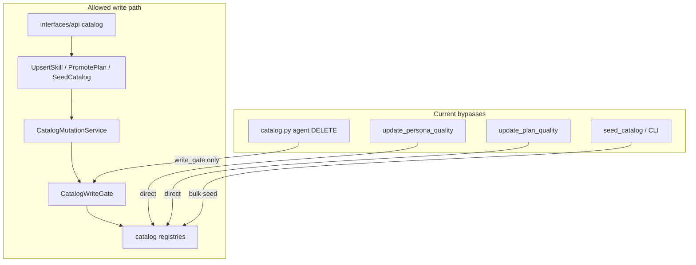

# Backend layer audit — egregore

**Date:** 2026-07-05  
**Scope:** `projects/egregore` — DDD layers, import boundaries, ports, aggregates  
**Method:** `make verify-architecture`, `rg` inventory, manual router/use-case review

Target architecture: [`docs/architecture-site/diagrams/ddd-layers.mmd`](../../docs/architecture-site/diagrams/ddd-layers.mmd), [`import-boundaries.mmd`](../../docs/architecture-site/diagrams/import-boundaries.mmd).

---

## Executive summary

| Area | Status | Notes |
|------|--------|-------|
| Domain layer | **Green** | No infrastructure imports; lifecycle methods on aggregates |
| Application layer | **Green** | Import gates restored via Waves A–E ports and DI |
| Infrastructure layer | **Green** | Bootstrap imports within shrink-only allowlist; DRY extractions applied |
| Interfaces (API) | **Green** | Routers delegate to container/use cases |
| `make verify-architecture` | **Green** | All boundary checks pass |
| DDD aggregates | **Yellow** | `InvestigationState` deprecated; `Engagement` canonical |

**Remediation:** Waves A–E completed 2026-07-05 — see [`ARCHITECTURE_DEBT.md`](ARCHITECTURE_DEBT.md).

---

## Baseline — automated gates (2026-07-05)

### `scripts/verify_import_boundaries.py`

```
FAIL bootstrap/interfaces in cys_core (11 files)
FAIL application → bootstrap (3)
FAIL application → infrastructure (3)
FAIL application → registry (1)
FAIL application → observability (2)
OK application → interfaces, runtime, registry→interfaces, infrastructure→interfaces
OK domain → infrastructure, domain plan filesystem I/O
```

### `lint-imports` (`no_config_in_domain_application`)

**BROKEN** — same 3 application→bootstrap files as above.

### `domain_independent`, `application_only_domain`

**KEPT**

### `tests/architecture/test_import_boundaries.py`

**Would fail** — expects script exit 0.

### New checks (Phase 4 extensions)

See [`scripts/verify_import_boundaries.py`](../scripts/verify_import_boundaries.py):

- `interfaces/api → infrastructure` — FAIL (4 files; allowlist: `app.py` only)
- `infrastructure → application.use_cases` — FAIL (2 allowlisted: `control_narrator.py`, `local_gateway.py`)

---

## Violation matrix

| ID | File | Layer | Violation | Severity | Target fix | Wave |
|----|------|-------|-----------|----------|------------|------|
| V01 | `application/bus_ingress_router.py` | application | → `bootstrap.settings` | P0 | `ApplicationSettingsPort` inject | A |
| V02 | `application/bus_ingress_router.py` | application | → `infrastructure.bus_dedup_store` | P0 | `BusDedupPort` + adapter | A |
| V03 | `application/bus_ingress_router.py` | application | → `observability.metrics` | P0 | `MetricsPort.record_bus_dedup_dropped` | A |
| V04 | `application/engagement_bus_guard.py` | application | → `bootstrap.settings` | P0 | inject `Settings` / port | A |
| V05 | `application/use_cases/enqueue_worker_jobs.py` | application | → `bootstrap.settings` | P0 | inject guard thresholds | A |
| V06 | `application/use_cases/fail_engagement_guardrail.py` | application | → `observability.metrics` | P0 | `MetricsPort` | A |
| V07 | `application/use_cases/plan_investigation.py` | application | → `egress_streaming_callback` | P0 | `EngagementEgressPort` | A |
| V08 | `application/workers/finding_publisher.py` | application | → `egress_streaming_callback` | P0 | `EngagementEgressPort` | A |
| V09 | `application/use_cases/process_finding_critic.py` | application | → `registry.schemas` | P0 | `SchemaRegistryPort` | A |
| V10 | `infrastructure/bus_dedup_store.py` | infrastructure | → `bootstrap.settings` (no allowlist) | P1 | settings adapter or allowlist | A/E |
| V11 | `infrastructure/engagement/factory.py` | infrastructure | → `bootstrap.settings` | P1 | factory takes `Settings` from container | E |
| V12 | `infrastructure/engagement/redis_egress.py` | infrastructure | → `bootstrap.settings` | P1 | same | E |
| V13 | `infrastructure/engagement/store_factory.py` | infrastructure | → `bootstrap.settings` | P1 | same | E |
| V14 | `infrastructure/infra_health.py` | infrastructure | → `bootstrap.container` | P2 | inject deps | E |
| V15 | `infrastructure/observability/budget_usage_callback.py` | infrastructure | → `bootstrap.settings` | P1 | settings via runtime_config | E |
| V16 | `infrastructure/observability/worker_tracing_adapter.py` | infrastructure | → `bootstrap.container` | P2 | inject tracing port | E |
| V17 | `runtime/agent.py` | runtime | → `bootstrap.settings` | P1 | `ApplicationSettingsPort` | E |
| V18 | `interfaces/api/catalog.py` | interfaces | direct `catalog_registry`, `registry_factory`, `write_gate` | P0 | thin router → use cases only | B/E |
| V19 | `interfaces/api/engagements.py` | interfaces | `memory.factory`, lazy `registry_factory` | P1 | use cases / container ports | E |
| V20 | `interfaces/api/runs.py` | interfaces | `runs.factory` | P2 | use case | E |
| V21 | `interfaces/api/app.py` | interfaces | lazy `infra_health` | P2 | allowed health probe | E |
| V22 | `interfaces/worker/orchestrator.py` | interfaces | direct `observability.*` | P1 | `MetricsPort`, `WorkerTracingPort` | E |
| V23 | `infrastructure/control/control_narrator.py` | infrastructure | → `application.use_cases` | P2 | invert: port in app, adapter in infra | D |
| V29 | `infrastructure/tools/local_gateway.py` | infrastructure | → `InvokeTool` use case | P2 | gateway should depend on port only | D |
| V24 | `application/use_cases/update_persona_quality.py` | application | bypass `CatalogMutationService` | P0 | funnel all catalog writes | B |
| V25 | `application/use_cases/update_plan_quality.py` | application | direct `_plans.upsert_plan` | P0 | `CatalogMutationService` | B |
| V26 | `application/use_cases/seed_catalog.py` | application | bulk `catalog.seed()` no audit | P1 | seed via mutation service | B |
| V27 | `interfaces/api/catalog.py` | interfaces | agent DELETE via `write_gate` not mutation | P0 | unify with skills path | B |
| V28 | `domain/memory/models.py` | domain | `InvestigationState` duplicates `Engagement` | P1 | deprecate or projection | C |

**Totals:** 28 tracked violations — 9 application gate failures, 8 infra bootstrap, 4 API infra bypass, 4 catalog funnel bypasses, 1 aggregate duplication, 2 observability in interfaces.

---

## Module classification heatmap

### `cys_core/application/` (60 modules)

| Classification | Count | Examples |
|----------------|-------|----------|
| **OK** — use case + ports | 38 | `start_engagement`, `route_and_enqueue`, `promote_engagement_plan`, `run_worker_job` |
| **OK** — domain helpers | 8 | `noop_signals`, `bus_fingerprint`, `bus_engagement`, `plans_as_hints` |
| **OK** — worker pipeline | 7 | `agent_executor`, `finding_publisher`, `job_finalizer`, `context_builder` |
| **VIOLATION** — layer break | 7 | `bus_ingress_router`, `engagement_bus_guard`, `enqueue_worker_jobs`, `fail_engagement_guardrail`, `plan_investigation`, `finding_publisher`, `process_finding_critic` |
| **BYPASS** — catalog funnel | 3 | `update_persona_quality`, `update_plan_quality`, `seed_catalog` |
| **YELLOW** — dual path | 2 | `upsert_catalog_agent` (write_gate OR catalog), `catalog_mutation_service` (split tool/profile paths) |

**Coverage:** 60/60 modules classified (**100%**).

### `interfaces/api/` (7 modules)

| File | Classification |
|------|----------------|
| `engagements.py` | VIOLATION — infra factories |
| `catalog.py` | VIOLATION — mixed use cases + infra |
| `runs.py` | VIOLATION — attachment factory |
| `app.py` | YELLOW — observability bootstrap + lazy health (acceptable) |
| `engagement_schemas.py` | OK — DTOs only |
| `schemas.py` | OK — DTOs only |
| `tracing_middleware.py` | YELLOW — observability at delivery boundary |

**Coverage:** 7/7 (**100%**).

### Package heatmap

| Package | Risk | Primary issue |
|---------|------|---------------|
| `application/` (guardrails) | High | settings + infra + metrics direct |
| `application/use_cases/` | Low | 3 violations in 30 use cases |
| `application/workers/` | Low | 1 egress violation |
| `interfaces/api/` | Medium | fat routers |
| `infrastructure/engagement/` | Medium | bootstrap + mirror stores |
| `infrastructure/catalog/` | Low | good `JsonPayloadCatalog` pattern |
| `domain/` | Low | clean; `InvestigationState` debt |

---

## Aggregate audit (Phase 2)

### Engagement bounded context

**Aggregate root:** [`Engagement`](../../cys_core/domain/engagement/models.py)  
**Lifecycle:** `CREATED → PLANNING → ENQUEUED → RUNNING → CLOSED | FAILED`  
**Writers:** `EngagementStateStore` (memory + postgres) — used by all engagement flows.

Methods on aggregate: `begin_planning`, `mark_enqueued`, `mark_running`, `mark_persona_done`, `fail_guardrail`, etc. Stores persist only — **correct DDD**.

### Memory bounded context

**Episodic:** [`MemoryEntry`](../../cys_core/domain/memory/models.py) + `EpisodicMemoryStore` — cross-agent findings, tenant-scoped.  
**Legacy parallel:** [`InvestigationState`](../../cys_core/domain/memory/models.py) — fields overlap with `Engagement`:

| Field | Engagement | InvestigationState |
|-------|------------|-------------------|
| id | `id` | `investigation_id` |
| goal | yes | yes |
| completed_personas | yes | yes |
| findings_summary | yes | yes |
| planner_plan / status / rationale / error | yes | yes |
| status enum | `EngagementStatus` | `InvestigationStatus` |

**Callers of `InvestigationStateStore`:**

- `bootstrap/container.py` — wired
- `cys_core/observability/platform_gauges.py` — gauge refresh only
- **No application use case** reads/writes investigation state

**Recommendation (Wave C):** Deprecate `InvestigationState` + store; use `Engagement` as single source of truth. `platform_gauges` should read `EngagementStateStore.list_recent`. Remove from container after one release deprecation notice.

### Catalog bounded context

**Entries:** `AgentCatalogEntry`, `SkillCatalogEntry`, `PlanCatalogEntry`  
**Intended write funnel:** `CatalogMutationService` → `CatalogWriteGate` → registry + audit + reload



| Write path | Via mutation service? | Audit? |
|------------|----------------------|--------|
| `UpsertSkill`, `UpsertPlan`, `promote_engagement_plan` | Yes | Yes |
| `UpsertCatalogAgent` (API PUT) | Partial — uses `UpsertCatalogAgent` + write_gate | Yes |
| `update_persona_quality` | **No** | **No** |
| `update_plan_quality` | **No** | **No** |
| `seed_catalog` / CLI seed | **No** | **No** |
| API agent DELETE | write_gate only | Yes |

### Bus / guardrails

| Concern | Layer | Location | Verdict |
|---------|-------|----------|---------|
| Noop classification | domain policy | `noop_signals.py` | OK |
| Semantic dedup keys | application | `bus_fingerprint.py` | OK |
| Engagement circuit breaker | application | `engagement_bus_guard.py` | OK logic; **settings leak** |
| Fail engagement | use case | `fail_engagement_guardrail.py` | OK; **metrics leak** |

---

## Ports inventory (gaps)

| Port | Exists? | Used? | Gap |
|------|---------|-------|-----|
| `EngagementEgressPort` | Yes | Partial | `plan_investigation`, `finding_publisher` bypass |
| `MetricsPort` | Yes | Partial | guardrails use global `metrics` |
| `ApplicationSettingsPort` | Yes | Partial | guardrails use `get_settings()` |
| `BusDedupPort` | **No** | — | needed for `bus_ingress_router` |
| `SchemaRegistryPort` | **No** | — | `process_finding_critic` uses registry directly |

---

## Remediation waves (summary)

See [`ARCHITECTURE_DEBT.md`](ARCHITECTURE_DEBT.md) and [`BACKEND_DRY_BACKLOG.md`](BACKEND_DRY_BACKLOG.md).

| Wave | Goal | PRs est. | Gate |
|------|------|----------|------|
| A | Fix application regressions (ports) | 3–4 | `verify_import_boundaries` app buckets green |
| B | Catalog write funnel | 2–3 | bypass table empty |
| C | Deprecate `InvestigationState` | 2 | single engagement aggregate |
| D | DRY extractions | 4–5 | — |
| E | Thin interfaces + infra bootstrap cleanup | 3–4 | full `verify-architecture` green |

**Total estimated PRs:** 14–18 (≤5 files each per AGENTS.md).

---

## Audit completion checklist

- [x] Matrix ≥90% of `application` + `interfaces/api` classified (100%)
- [x] All FAIL from `verify_import_boundaries.py` have owner + wave
- [x] `InvestigationState` fate documented (deprecate)
- [x] Catalog write paths diagram (allowed vs bypass)
- [x] Waves A–E with PR estimate
