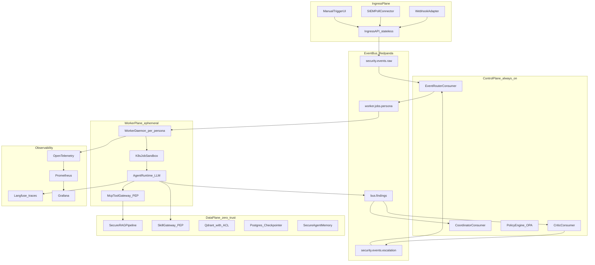
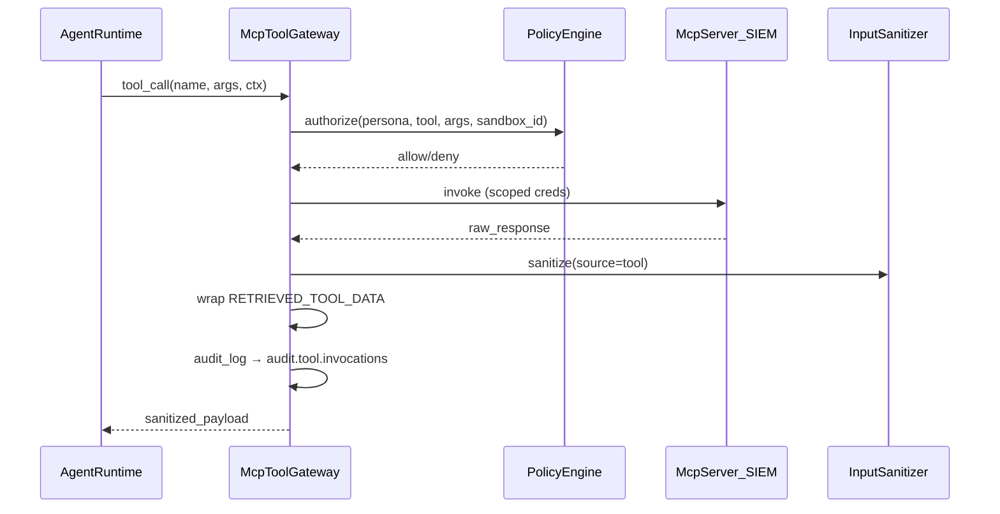
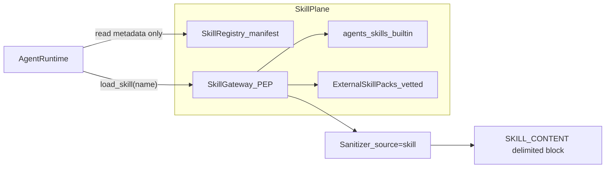
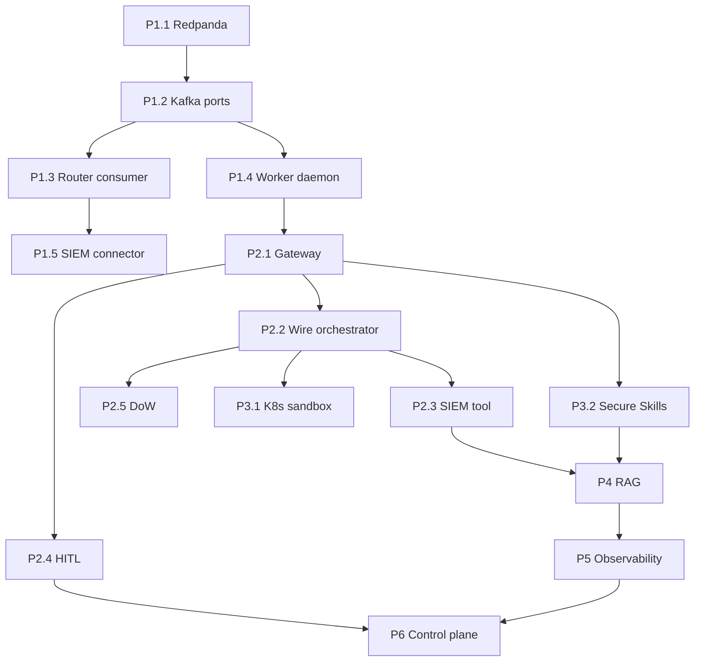

> **Note:** Historical production roadmap. Post-DDD layout and canonical paths: [ARCHITECTURE.md](ARCHITECTURE.md), [REFACTOR_COMPLETE.md](REFACTOR_COMPLETE.md). Legacy `graph/` and `coordinator/deep_assessment.py` removed.

---
name: Secure Multi-Agent Platform
overview: "Мастер-план production self-hosted платформы: Ingress API + Redpanda/Kafka → worker daemons в sandbox → MCP Tool Gateway с zero-trust санитизацией → Secure RAG → observability (Langfuse/Prometheus/Grafana). Строится поверх существующего domain security layer и event-driven scaffold."
todos:
  - id: phase1-kafka
    content: "Phase 1: Redpanda + KafkaJobQueue/KafkaBusTransport + router consumer + worker daemon"
    status: pending
  - id: phase1-connector
    content: "Phase 1: SIEM poll connector → Ingress API (normalized SecurityEvent)"
    status: pending
  - id: phase2-gateway
    content: "Phase 2: MCP Tool Gateway (PEP) — sanitize tool I/O, audit topic, wire orchestrator"
    status: pending
  - id: phase2-siem-tool
    content: "Phase 2: First real tool query_siem_readonly via gateway"
    status: pending
  - id: phase3-sandbox
    content: "Phase 3: K8sSandboxConnector + NetworkPolicy + HPA worker deployments"
    status: pending
  - id: phase4-rag
    content: "Phase 4: Secure RAG pipeline (ingest, Qdrant ACL, rag_query tool, adversarial tests)"
    status: pending
  - id: phase5-obs
    content: "Phase 5: Prometheus metrics + Grafana dashboards + Langfuse/OTel correlation_id propagation"
    status: pending
  - id: phase6-control
    content: "Phase 6: Critic/coordinator Kafka consumers + escalation loop + durable status store"
    status: pending
  - id: phase2-hitl
    content: "Phase 2: HITL 3-tier (gateway PEP + LangGraph resume API + critic post-finding gate)"
    status: pending
  - id: phase2-dow
    content: "Phase 2: DoW controls — token/cost budgets per job, recursion_limit, tool-chain depth caps"
    status: pending
  - id: phase5-adversarial-ci
    content: "Phase 5: Abuse-case matrix CI gates (AI Agent Security §9) — block releases on policy drift"
    status: pending
  - id: phase4-data-classification
    content: "Phase 4: DataClassification layer — context minimization, retention, GDPR cascade delete"
    status: pending
  - id: phase3-skills
    content: "Phase 3b: Secure Skill Gateway — registry, vetting, sanitize-on-load, per-persona allowlist"
    status: pending
  - id: orchestration
    content: "См. §12 — master Cursor agent, max 3 subagents, branch/merge rules"
    status: pending
isProject: false
---

# Master Plan: Secure Multi-Agent SOC Platform (Production)

## 1. Ментальная модель: что есть «ядро», а что — слои

Агент — **не центр вселенной**. Центр — **Policy Engine + Orchestration**. Агент (LLM) — исполнитель внутри изолированного run'а.



| Слой | Роль | Аналог ZTA (NIST SP 800-207) |
|------|------|------------------------------|
| **Ingress API** | Приём events, auth, schema validation | Policy Enforcement Point (edge) |
| **Kafka/Redpanda** | Durable triggers, backpressure, replay | Telemetry + async command bus |
| **EventRouter** | Deterministic dispatch (`agents/plans/*.yaml`) | Policy Engine (routing rules) |
| **Worker daemon** | Consume job → sandbox lifecycle | Compute resource |
| **AgentRuntime** | LLM + middleware + structured output | Application logic |
| **MCP Tool Gateway** | Allowlist, auth, sanitize tool I/O | **PEP для tools** — главная защита от poisoned MCP |
| **Secure RAG** | Knowledge retrieval с ACL | Отдельный data plane |
| **Control plane** | Critic, coordinator, escalation | Governance + human narrative |
| **Observability** | Traces, metrics, audit | Principle 7 — collect & improve |

### Сравнение с Managed Deep Agents

| Managed Deep Agents (LangSmith) | Ваш self-hosted эквивалент |
|--------------------------------|---------------------------|
| `agent.json` + `AGENTS.md` | [`agents/personas/*/agent.yaml`](agents/personas/soc/agent.yaml) + `AGENT.md` |
| `tools.json` + MCP servers | **MCP Tool Gateway** + [`cys_core/registry/mcp_tools.py`](cys_core/registry/mcp_tools.py) (сейчас stub) |
| `interrupt_config` per tool | [`build_interrupt_on`](cys_core/domain/agents/policies.py) + HITL middleware |
| `backend: sandbox` (LangSmith sandbox) | `SandboxConnector` → K8s Job / gVisor |
| `StoreBackend` `/memories/` | Postgres Store + Secure RAG (vector) |
| Hosted threads/runs | Kafka job + `session_id` + Postgres checkpointer |
| Workspace MCP credential vault | K8s secrets + per-persona scoped tokens |

Вы **не покупаете** hosted runtime — вы **реализуете те же границы** сами, с усиленным security layer (у вас он уже сильнее, чем у типичного Managed DA deploy).

---

## 2. Ответы на твои вопросы (коротко)

### «Возле агентов должен быть слой тулинга?»

**Да.** Агент не ходит в SIEM напрямую. Цепочка:

```
LLM → Tool Gateway (PEP) → MCP Server / native tool → external API
         ↑ sanitize in/out, allowlist, rate limit, audit
```

Сейчас: [`AgentRuntime`](cys_core/runtime/agent.py) → [`tool_registry`](cys_core/registry/tools.py) (stubs). [`mcp_tool_registry`](cys_core/registry/mcp_tools.py) **не подключён** к orchestrator.

### «MCP может отдать poisoned prompt?»

**Да, может.** Любой внешний ответ (MCP, SIEM, RAG chunk) = **untrusted data**.

Защита (уже частично есть, нужно расширить на tool output):

1. **Ingress**: [`get_input_sanitizer()`](cys_core/domain/security/sanitizer.py) на events
2. **Prompt boundary**: [`PromptContextMiddleware`](cys_core/middleware/prompt_context_middleware.py) + `USER_DATA` wrappers из [`prompt_context.py`](cys_core/domain/security/prompt_context.py)
3. **Tool output** (новое): каждый ответ MCP → `sanitizer.sanitize(..., source="tool")` → обёртка `RETRIEVED_TOOL_DATA` (аналог RAG delimiters из [RAG Security Cheat Sheet](docs/reference/RAG_Security_Cheat_Sheet.md) §3)
4. **Never execute** tool text as instructions — только structured args через schema validation
5. **Output**: [`OutputGuardrails`](cys_core/domain/security/guardrails.py) + finding schemas

### «Память — векторная?»

**Не одна память, а три типа:**

| Тип | Хранилище | Назначение | Сейчас в проекте |
|-----|-----------|------------|------------------|
| **Краткосрочная (thread)** | Postgres checkpointer / LangGraph state | Контекст одного run/session | [`PersistenceStack`](cys_core/persistence.py) — Postgres или memory |
| **Агентная episodic** | `SecureAgentMemory` + signed checksums | Валидированные факты между turns | [`cys_core/security/memory.py`](cys_core/security/memory.py) — **не vector**, текст + TTL |
| **Долгосрочная knowledge (RAG)** | Qdrant/Weaviate + embeddings | Playbooks, runbooks, compliance docs | **Нет** — Phase 4 |
| **Shared org memory** | Vector store с tenant ACL + bus findings | «Что мы уже знаем про этот IOC» | Через RAG + optional findings index |

Vector — **только для RAG/knowledge**, не для замены checkpointer.

---

## 3. Target architecture (production)

### 3.1 Kafka topics (Redpanda)

| Topic | Producer | Consumer | Retention |
|-------|----------|----------|-----------|
| `security.events.raw` | Ingress API, connectors | `router-consumer` | 7d |
| `worker.jobs.{persona}` | router | `worker-{persona}` daemon | 3d |
| `bus.findings` | workers | critic, coordinator, SIEM export | 30d |
| `security.events.escalation` | critic, workers | router | 7d |
| `audit.tool.invocations` | MCP gateway | SIEM, compliance | 90d |
| `audit.hitl.approvals` | gateway, critic | compliance, forensics | 90d |
| `worker.jobs.paused` | gateway, worker | HITL UI consumer | 3d |
| `rag.ingest.staging` | doc connector | RAG ingestion worker | 1d |

**Порты** уже заложены: [`JobQueueConnector`](cys_core/application/ports.py), [`AgentTransportConnector`](cys_core/application/ports.py) — добавить `KafkaJobQueue`, `KafkaBusTransport` в [`cys_core/infrastructure/`](cys_core/infrastructure/), Redis оставить **только** для rate limiting ([`RedisRateLimiter`](cys_core/security/rate_limit.py)).

### 3.2 Ingress plane

Расширить [`ingress/api.py`](ingress/api.py):

- `POST /events` — validate `SecurityEvent`, auth (mTLS / API key + JWT), publish to `security.events.raw` (**не** enqueue напрямую)
- `POST /investigations` — manual trigger (UI)
- `GET /status` — из [`control/status_store.py`](control/status_store.py)
- `GET /health`, `GET /metrics` — Prometheus
- `GET /jobs/{id}` — job status (`running` | `awaiting_approval` | `completed` | `failed`)
- `POST /jobs/{id}/resume` — HITL approve / edit / reject (LangGraph `Command(resume=...)`)
- `GET /approvals/pending` — очередь pending actions для UI

**Connectors** (отдельные lightweight services, без LLM):

- `connectors/siem_poll/` — poll Splunk/Elastic API → normalize → `POST /events`
- `connectors/webhook_adapter/` — SIEM webhook → same schema

Санитизация на ingress **до** Kafka (fail-closed).

### 3.3 Router consumer

Вынести логику из [`EventIngress`](ingress/router.py):

```
consume security.events.raw
  → EventRouter.route()  # agents/plans/*.yaml
  → publish worker.jobs.{persona}
  → optional: notify_control flag → bus ping
```

Deterministic routing сохраняем — LLM **не решает** кому слать job.

### 3.4 Worker plane

Заменить manual `python main.py worker --once` на **daemon Deployment per persona**:

```yaml
# deploy/k8s/worker-soc.yaml
replicas: HPA by consumer lag on worker.jobs.soc
command: ["python", "-m", "workers.daemon", "--persona", "soc"]
```

Flow в [`WorkerOrchestrator`](workers/orchestrator.py) — доработать:

1. `adequeue` from Kafka (consumer group `workers-soc`)
2. `sandbox.acreate` → **K8s Job** с network policy (egress only to MCP gateway + LLM API)
3. Resolve tools: `mcp_tool_registry.resolve(defn.tools, sandbox_id)` + inject into `AgentRuntime.acreate(extra_tools=...)`
4. `runtime.arun` with session_id `worker:{persona}:{job_id}`
5. Publish finding → `bus.findings`
6. `sandbox.adestroy` always in `finally` (уже есть)

### 3.5 MCP Tool Gateway (новый критический компонент)

Новый сервис `tool_gateway/` — **единственная точка** выхода worker sandbox в внешний мир:



**Controls (OWASP MCP + ZTA + RAG §10):**

- Per-persona tool allowlist (уже в [`agent.yaml`](agents/personas/soc/agent.yaml) + [`ScopeMiddleware`](cys_core/middleware/scope_middleware.py))
- Per-session scoped credentials (JIT, short TTL)
- Args JSON schema validation before MCP call
- Response size limits + injection pattern scan
- Circuit breaker (anomalous tool volume → halt run) — reuse [`CircuitBreaker`](cys_core/domain/security/agent_bus.py)
- Per-tool resource scoping: `allowed_operations` (read/write), `allowed_paths`, `blocked_patterns` (AI Agent Security §1)
- Tool pinning: MCP server URL + tool schema version in agent config; CI blocks drift
- **No direct MCP from agent process** — только через gateway sidecar или network policy

**High-Impact Action Integrity** (AI Agent Security §4 — отдельно от простого approve prompt):

- Решение ≠ исполнение: агент **propose**, gateway **execute** после независимой policy-проверки
- Approval record binds: `actor`, `tool`, `target_resource`, normalized `params_hash`, `expiry`, `approval_id`
- Short-lived authorization artifact (JWT, TTL ≤ 5 min) + replay protection для irreversible ops
- Step-up auth (MFA) для critical: `run_active_scan`, bulk delete, production containment
- Idempotency keys на destructive actions; duplicate → require re-confirm
- Fail-closed если policy lookup, approval validation или audit write fails

### 3.5.1 Human-in-the-Loop — три уровня

| Уровень | Где | Когда | Kafka / API |
|---------|-----|-------|-------------|
| **L1 Pre-action** | MCP Tool Gateway + `HumanInTheLoopMiddleware` | Опасный tool до внешнего вызова | `worker.jobs.paused` → `POST /jobs/{id}/resume` |
| **L2 Post-finding** | `critic-consumer` | Escalation / external notify после finding | `security.events.awaiting_approval` |
| **L3 Governance** | RAG ingest admin, MCP server registry | Новый corpus / новый MCP endpoint | Manual approval workflow |

Заменить текущий блокирующий stub в [`SecurityMiddleware`](cys_core/middleware/security_middleware.py) (prod возвращает error вместо pause) на **настоящий interrupt** → job paused, не failed.

Read-only tools (`query_siem_readonly`, `rag_query`) — auto-approve при LOW risk; write/containment — L1 HITL обязателен.

`hitl_tools` в [`agent.yaml`](agents/personas/redteam/agent.yaml) — source of truth для L1; gateway policy — последний рубеж.

### 3.5.2 Denial of Wallet (DoW) и bounded autonomy

AI Agent Security Key Risk #11 — явные лимиты на каждый worker job:

| Control | Default prod | Где |
|---------|--------------|-----|
| `recursion_limit` | 25 (уже в [`AgentRuntime`](cys_core/runtime/agent.py)) | per job config |
| Max tool calls per job | 50 | gateway + `SecurityMiddleware` |
| Max tokens per job | configurable per persona | Langfuse budget + hard stop |
| Max cost USD per job | e.g. $2 SOC, $5 redteam | Prometheus alert + job kill |
| Max job wall time | 15 min worker, 60 min coordinator | worker daemon watchdog |
| Tool chain depth | max 3 sequential high-risk tools | gateway circuit breaker |
| Kafka consumer pause | при LLM 429 / budget exceeded | backpressure |

Метрики: `cys_job_tokens_total`, `cys_job_cost_usd`, `cys_tool_chain_depth` → Grafana alert на anomaly.

**Excessive autonomy / goal hijacking** (Key Risks #5–6): LLM **не маршрутизирует** jobs ([`EventRouter`](cys_core/domain/events/router.py) deterministic); persona goals immutable из `AGENT.md` digest; worker не может self-assign новый persona или изменить `agents/plans/` — только critic → escalation event.

### 3.6 Sandbox (K8s)

Заменить [`LocalSandboxConnector`](cys_core/infrastructure/sandbox.py):

- K8s Job per run, `run_id` = job_id
- gVisor/Kata или restricted PSP: non-root, read-only rootfs, dropped caps (как в [`docker-compose.secure.yml`](docker-compose.secure.yml))
- Ephemeral workspace: emptyDir `/workspace` (как Deep Agents StateBackend — файлы умирают с job)
- Egress NetworkPolicy: только `tool-gateway:443`, `llm-api:443`
- Secrets: SIEM tokens injected by gateway, **не** в env worker pod

### 3.7 Control plane (always-on consumers)

| Service | Topic in | Topic out | Код |
|---------|----------|-----------|-----|
| `critic-consumer` | `bus.findings` | feedback → job retry; escalation events | [`control/critic_service.py`](control/critic_service.py) |
| `coordinator-consumer` | `bus.findings` | user status, narratives | [`control/coordinator_service.py`](control/coordinator_service.py) |

[`SecureAgentBus`](cys_core/domain/security/agent_bus.py): HMAC, trust levels, replay window — сохранить; Kafka transport вместо Redis pub/sub для durability.

**Trust monitoring:**

- `trust_score` от critic → Prometheus gauge `agent_trust_score{persona}`
- Auto-quarantine persona при `trust < TRUST_SCORE_THRESHOLD` ([`config.py`](config.py))
- [`bus.record_agent_failure`](workers/orchestrator.py) → alert

**Decision / approval manipulation** (AI Agent Security Key Risk #8):

- Critic `trust_score` вычисляется **детерминированно** в `critic-consumer`, не LLM-only
- `requires_hitl()` из [`OutputGuardrails`](cys_core/domain/security/guardrails.py) — не переопределяется model output
- Approval records immutable в `audit.hitl.approvals`; tamper → alert
- Monitor: repeated approval bypass attempts, sudden drop in HITL rate, privilege escalation patterns

**Multi-agent cascading failures** (Key Risk #9) — уже в [`SecureAgentBus`](cys_core/domain/security/agent_bus.py):

- Circuit breakers per agent (`failure_threshold=5`)
- Trust-level message type allowlist (`TRUST_MESSAGE_TYPES`)
- Escalation chain rules: `soc` (INTERNAL) → `network` OK; `soc` → `redteam` (PRIVILEGED) только через critic-approved escalation event, не direct bus
- Sanitize all bus payloads before recipient agent context (`source=agent_bus`)

### 3.8 Secure RAG pipeline (zero trust)

Новый bounded context `cys_core/domain/rag/` + `rag/` service:

**Ingestion (RAG cheat sheet §1, §4, §6, §13):**

- Staging topic `rag.ingest.staging` → scan → hash SHA-256 → provenance metadata
- Injection scan (reuse [`corpus_techniques`](cys_core/domain/security/patterns/corpus_techniques.py) + invisible unicode)
- Chunk with ACL metadata: `tenant`, `classification`, `roles[]`, `owner`
- Embed → Qdrant collection per tenant OR single collection with **pre-filter** (не post-filter)
- Approval workflow for new sources

**Retrieval tool (via MCP Gateway):**

- `rag_query(query, persona_ctx)` — gateway enforces ACL **before** similarity search
- Max 3-5 chunks, 2-4k tokens ([RAG §3](docs/reference/RAG_Security_Cheat_Sheet.md))
- Delimiters: `BEGIN_RETRIEVED_CONTENT` / `END_RETRIEVED_CONTENT`
- Reinforce system prompt after retrieved block
- Fail-closed: retrieval error → no answer from model memory alone ([RAG §14](docs/reference/RAG_Security_Cheat_Sheet.md))
- Signed source attribution in response metadata

**Red-team CI tests** (extend [`tests/adversarial/`](tests/adversarial/)):

- poisoned doc retrieval, cross-tenant leak, stale permissions, cache leakage

### 3.9 Memory wiring в AgentRuntime

Composite model (как Deep Agents `CompositeBackend`):

- **Thread state**: Postgres checkpointer (prod: `PERSISTENCE_CONNECTOR=postgres`, не `force_memory=True` в worker path)
- **Episodic**: `SecureAgentMemory` per `session_id` — sanitize on `add()`, refuse injection ([`tests/adversarial/test_memory_poisoning.py`](tests/adversarial/test_memory_poisoning.py))
- **Knowledge**: RAG tool only — never raw vector DB access from agent
- **Isolation**: per-tenant / per-session namespace; no cross-user memory reads ([`SecureAgentMemory`](cys_core/security/memory.py) per `user_id` + `session_id`)

### 3.10 Data classification & privacy (AI Agent Security §8)

Новый `cys_core/domain/security/classification.py`:

- `DataClassification`: PUBLIC | INTERNAL | CONFIDENTIAL | RESTRICTED
- `SecureContextBuilder`: classify → apply protection per operation (`include_in_context`, `log`, `output`)
- Minimize sensitive data in LLM context — redact RESTRICTED before prompt assembly
- Retention policies + GDPR cascade delete (aligned with RAG §4 deletion)
- Encryption at rest: Postgres, Qdrant, audit topics (prod)

### 3.11 Agent config integrity (AI Console / supply chain)

Key Risk #10 + §13 supply chain:

- `agents/personas/*/agent.yaml` + `AGENT.md` — versioned, signed digest ([`system_prompt_digest`](cys_core/runtime/agent.py))
- CI gate: изменение `tools`, `hitl_tools`, `trust_level`, `bus_recipients` без обновления adversarial tests → block merge
- MCP server registry: allowlist URLs, vetting checklist, no wildcard tools
- Pin embedding model + MCP schema versions in deploy manifest

### 3.12 Secure Skills layer (не tools, не RAG)

**Skills — третий класс контекста.** Критически недооценённая attack surface.

| | Tools | RAG | Skills |
|--|-------|-----|--------|
| Что это | Действия (API calls) | Факты из корпуса | **Процедуры и playbooks** (как думать/действовать) |
| Когда в контекст | При tool call | При retrieval | **On-demand** по trigger (name+description) |
| Хранение | MCP servers / registry | Vector DB | `agents/skills/*/SKILL.md` + optional `scripts/` |
| Риск | Tool abuse | Doc poisoning | **Indirect prompt injection в SKILL.md body** |
| PEP | MCP Tool Gateway | Secure RAG pipeline | **Skill Gateway** (новый) |

Сейчас: skills только у coordinator через Deep Agents ([`coordinator/deep_assessment.py`](coordinator/deep_assessment.py) `skills=[...]`). Workers **не** имеют skill layer. Нет vetting внешних skills.



**Правила (zero trust для skills):**

1. **Два namespace — никогда не смешивать** ([`AGENTS.md`](AGENTS.md)):
   - `agents/skills/` — **product runtime** skills (в git, signed)
   - `.agents/skills/` — **dev/build** skills (не в git, не грузить в prod workers)

2. **Metadata vs body split** (как Anthropic Agent Skills):
   - Всегда в контексте: только YAML `name` + `description` из frontmatter (≤500 tokens total all skills)
   - Body `SKILL.md` — **только после** explicit `load_skill` tool call, через Gateway

3. **Skill Gateway** (`cys_core/registry/skills.py` + `skill_gateway/`):
   - Allowlist per persona: `skills:` в [`agent.yaml`](agents/personas/soc/agent.yaml) (новое поле)
   - SHA-256 hash verify перед load; mismatch → reject + alert
   - `sanitizer.sanitize(body, source="skill")` + wrapper `BEGIN_SKILL_CONTENT` / `END_SKILL_CONTENT`
   - Reinforce SECURITY_RULES после skill block (как RAG §3)
   - `scripts/` в skill bundle — **запрещён auto-exec**; только HITL + sandbox если вообще разрешён

4. **Внешние skills** (third-party packs):
   - Staging: `skills/external/staging/` — **не** в runtime path
   - Vetting pipeline: [Cisco Skill Scanner](docs/reference/CISCO_AI_DEFENCE.md) + injection scan + human L3 approval
   - Registry entry: `skill_id`, `version`, `hash`, `author`, `trust_tier` (builtin | verified | community)
   - Community tier — только personas с `trust_level: privileged` и explicit opt-in
   - Pin version in `agents/manifest.yaml`; CI blocks unpinned external skill updates

5. **Skill ≠ system prompt**: body skill **не может** override `AGENT.md` / SECURITY_RULES; digest check на load

6. **Audit**: `audit.skill.loads` topic — who, which skill, hash, persona, job_id

7. **Adversarial tests** (новые в `tests/adversarial/`):
   - `test_skill_injection_in_body` — poisoned SKILL.md blocked
   - `test_skill_not_in_allowlist` — soc cannot load redteam-only skill
   - `test_external_skill_unsigned` — reject
   - `test_skill_script_no_autoexec` — scripts/ not run without HITL

**Wire в runtime:**

- Workers: `load_skill` as LangChain tool → Skill Gateway (not direct filesystem read)
- Coordinator: migrate from raw `skills=[path]` to Gateway-backed loader
- Manifest: [`agents/manifest.yaml`](agents/manifest.yaml) `skills:` list → source of truth for builtin registry

---

## 4. Observability stack

| Signal | Tool | Integration point |
|--------|------|-------------------|
| LLM traces (prompts, tools, latency) | **Langfuse** | Уже в [`cys_core/llm`](cys_core/llm) via `LANGFUSE_*` — wire в all worker runs |
| Infra + app metrics | **Prometheus** | `/metrics` on API, gateway, workers; kafka exporter; redis exporter |
| Dashboards + alerts | **Grafana** | SOC dashboards: job lag, tool errors, injection blocks, trust scores |
| Distributed traces | **OpenTelemetry** | OTLP exporter → Tempo/Jaeger; propagate `correlation_id` from event through job |
| Audit | **Immutable log** | `audit.tool.invocations` topic → S3/ClickHouse; 90d retention |

**Key metrics:**

- `cys_events_ingested_total{type}`
- `cys_worker_job_duration_seconds{persona,status}`
- `cys_tool_invocations_total{tool,result}`
- `cys_sanitizer_blocks_total{source,verdict}`
- `cys_rag_retrievals_total{tenant,denied}`
- `cys_agent_trust_score{persona}`
- `cys_job_tokens_total{persona}` / `cys_job_cost_usd{persona}` (DoW)
- `cys_hitl_pending_total` / `cys_hitl_approval_bypass_attempts_total`
- `cys_approval_bypass_attempts_total`

**Anomaly detection** (AI Agent Security §6): drift в approval rate, elevated privilege tool usage, injection block spikes, cross-tenant RAG denials.

**Structured audit** для high-risk actions: `action_classification`, `risk_score`, `authorization_outcome`, `approval_id`, `policy_version`, `execution_result` → `audit.tool.invocations` + `audit.hitl.approvals`.

---

## 5. Security controls map (что сохраняем из проекта)

| Control | Location | Prod action |
|---------|----------|-------------|
| Input sanitization | `domain/security/sanitizer.py` | ingress + tool gateway + RAG ingest |
| Prompt boundaries | `prompt_context.py`, `PromptContextMiddleware` | extend for tool/RAG wrappers |
| Tool allowlist | `ScopeMiddleware`, `agent.yaml` | + OPA policies |
| HITL | `HumanInTheLoopMiddleware`, `hitl_tools` | gateway + LangGraph interrupt resume API |
| Output guardrails | `guardrails.py`, finding schemas | all worker outputs |
| A2A bus security | `agent_bus.py` | Kafka + HMAC retained |
| Rate limiting | `RedisRateLimiter` | keep Redis for this only |
| PII redaction | `redaction.py`, `SecureAgentMemory` | all persistence paths |
| Injection patterns RU priority | `patterns/` | RAG ingest + tool output |
| Fail-closed | security exceptions | no fallback to model-only on RAG fail |
| Circuit breakers (multi-agent) | `agent_bus.py` | per-agent + gateway; block cascading |
| SecureAgentMemory | `security/memory.py` | TTL, checksum, injection refuse |
| AgentMonitor | `security/monitor.py` | extend: cost, approval bypass, anomalies |
| recursion_limit | `agent.py` | per-job override from WorkerJob config |

### 5.1 AI Agent Security Cheat Sheet — compliance matrix

| Cheat sheet section | Key risks covered | Plan section | Gap / action |
|---------------------|-------------------|--------------|--------------|
| §1 Tool least privilege | Tool abuse, privilege escalation | §3.5 Gateway, ScopeMiddleware | Add per-resource scoping in gateway |
| §2 Input validation | Prompt injection direct/indirect | §3.2 ingress, §3.5 sanitize tool/RAG | Wire tool output sanitization |
| §3 Memory security | Memory poisoning | §3.9, SecureAgentMemory | Wire into worker path; tenant isolation |
| §4 HITL | Excessive autonomy, high-impact abuse | §3.5.1, resume API | Replace SecurityMiddleware stub |
| §5 Output guardrails | Data exfiltration | guardrails.py, finding schemas | Already strong |
| §6 Monitoring | DoW, anomalies, audit | §4 observability | Add cost/token metrics |
| §7 Multi-agent | Cascading failures, bus trust | §3.7, SecureAgentBus | Escalation trust rules explicit |
| §8 Data protection | Sensitive exposure, GDPR | §3.10 classification | New module Phase 4 |
| §9 Adversarial testing | All abuse cases | §5.2 below | CI release gates |
| Skills (implicit §2 indirect injection) | Skill body poisoning, script auto-exec | §3.12, P3.2 | Skill Gateway + adversarial |

### 5.2 Abuse-case test matrix (CI/CD release gates)

Обязательные тесты в [`tests/adversarial/`](tests/adversarial/) — block release при fail (AI Agent Security §9):

| Abuse case | Validates |
|------------|-----------|
| Prompt override | System instructions not replaced by event/RAG/tool content |
| Tool misuse | Model cannot invoke tool outside `agent.yaml` allowlist |
| Privilege escalation | INTERNAL persona cannot call PRIVILEGED tools |
| Memory poisoning | Injection payload rejected by `SecureAgentMemory.add()` |
| Data exfiltration | base64/URL exfil blocked by guardrails |
| Recursive tool abuse | recursion_limit + chain depth stops runaway loop |
| Approval bypass | HIGH tool cannot execute without valid `approval_id` |
| Multi-agent chaining | Compromised soc cannot message redteam directly |
| Decision manipulation | Low critic trust always triggers L2 HITL |
| DoW | Job killed when token/cost budget exceeded |
| Skill injection | Poisoned SKILL.md body blocked at gateway; not in allowlist → deny |
| Skill script abuse | `scripts/` in skill bundle not executed without HITL |

Regression: каждый fix injection/memory bug → новый adversarial test в том же PR.

**Validation evidence** (prod): agent version, model provider, tool policy hash, test run ID — stored with deploy artifact.

**Zero Trust additions ([cheat sheet](docs/reference/Zero_Trust_Architecture_Cheat_Sheet.md)):**

- mTLS между services ([`deploy/nginx`](deploy/nginx/) уже намечен)
- OPA/Gatekeeper: admission policies for worker pods
- SPIFFE workload identity (optional Phase 3+)
- Per-session JIT credentials for MCP
- Continuous verification in CI: image scan, policy tests

---

## 6. Scaling model

| Component | Scale trigger | Max replicas guidance |
|-----------|---------------|----------------------|
| Ingress API | RPS, CPU | 3-20 (stateless) |
| Router consumer | `security.events.raw` lag | 1-3 (ordering per partition key) |
| Worker SOC | `worker.jobs.soc` lag | 2-50 (cost-bound by LLM) |
| Worker network | same | 2-20 |
| MCP Gateway | tool QPS | 3-30 |
| Critic/Coordinator | `bus.findings` lag | 1-5 each |
| Qdrant | query latency | 3-node cluster |
| Redpanda | throughput | 3 brokers prod |

**Partition key:** `correlation_id` or `event_id` — same incident → same partition → ordered processing.

**Backpressure:** Kafka consumer pause when LLM rate limit hit; DLQ topic `worker.jobs.dlq` for poison jobs.

---

## 7. Implementation phases (детально, минимальный diff)

**Принципы каждой подфазы:**

- **1 PR = 1 подфаза** (ID вида `P1.2.3`)
- **≤5 файлов** изменено (идеал 1–3); если больше — разбить
- **Тесты обязательны** до merge; `cys_core/domain` coverage 100% не ломаем
- **Feature flags** где возможно — main всегда green
- **Не трогать** deprecated `graph/` кроме явной подфазы

**Легенда колонок:**

| Колонка | Значение |
|---------|----------|
| ID | Уникальный идентификатор подфазы |
| Branch | `feat/<ID>-<short-name>` |
| Files | Ожидаемый touch set |
| Subagent | Тип Cursor subagent (см. §12) |
| Depends | Блокирующие подфазы |

---

### Phase 1 — Event bus foundation

**Цель:** API → Kafka → worker daemon → finding. Redis queue остаётся fallback.

#### P1.1 — Redpanda infra (0 deps)

| ID | Задача | Branch | Files | Tests |
|----|--------|--------|-------|-------|
| P1.1.1 | Добавить `redpanda` service в [`docker-compose.yml`](docker-compose.yml) | `feat/P1.1.1-redpanda-compose` | `docker-compose.yml` | manual: `rpk topic list` |
| P1.1.2 | `KAFKA_BOOTSTRAP_SERVERS`, `USE_KAFKA` в [`config.py`](config.py) | `feat/P1.1.2-kafka-config` | `config.py`, `.env.example` | `tests/infrastructure/test_config_kafka.py` |
| P1.1.3 | Документировать local dev в [`docs/DEVELOPMENT.md`](docs/DEVELOPMENT.md) | `docs/P1.1.3-kafka-dev` | `docs/DEVELOPMENT.md` | — |

#### P1.2 — Kafka ports (depends P1.1.2)

| ID | Задача | Branch | Files | Tests |
|----|--------|--------|-------|-------|
| P1.2.1 | `cys_core/infrastructure/kafka_queue.py` — `KafkaJobQueue` implements port | `feat/P1.2.1-kafka-queue` | `kafka_queue.py`, `queue.py` (factory) | `tests/infrastructure/test_kafka_queue.py` |
| P1.2.2 | `cys_core/infrastructure/kafka_bus.py` — `KafkaBusTransport` | `feat/P1.2.2-kafka-bus` | `kafka_bus.py`, `bus_transport.py` | `tests/infrastructure/test_kafka_bus.py` |
| P1.2.3 | `get_job_queue()` / `get_bus_transport()` — select by `USE_KAFKA` | `feat/P1.2.3-kafka-factory` | `queue.py`, `bus_transport.py` | extend factory tests |

#### P1.3 — Router consumer (depends P1.2)

| ID | Задача | Branch | Files | Tests |
|----|--------|--------|-------|-------|
| P1.3.1 | `ingress/router_consumer.py` — consume `security.events.raw` | `feat/P1.3.1-router-consumer` | `ingress/router_consumer.py` | `tests/ingress/test_router_consumer.py` |
| P1.3.2 | `EventIngress.ingest` → publish raw only (enqueue в consumer) | `feat/P1.3.2-ingest-publish` | `ingress/router.py`, `ingress/api.py` | update `tests/ingress/` |
| P1.3.3 | CLI `python main.py router` — run consumer daemon | `feat/P1.3.3-router-cli` | `main.py` | smoke in `tests/infrastructure/test_cli.py` |

#### P1.4 — Worker daemon (depends P1.2)

| ID | Задача | Branch | Files | Tests |
|----|--------|--------|-------|-------|
| P1.4.1 | `workers/daemon.py` — loop `process_next`, SIGTERM graceful | `feat/P1.4.1-worker-daemon` | `workers/daemon.py` | `tests/workers/test_daemon.py` |
| P1.4.2 | `--persona`, `--max-jobs`, `--idle-timeout` flags в `main.py` | `feat/P1.4.2-worker-cli` | `main.py` | CLI tests |
| P1.4.3 | DLQ topic `worker.jobs.dlq` + poison job routing | `feat/P1.4.3-dlq` | `kafka_queue.py`, `orchestrator.py` | unit test |

#### P1.5 — SIEM connector MVP (depends P1.3.2, parallel ok)

| ID | Задача | Branch | Files | Tests |
|----|--------|--------|-------|-------|
| P1.5.1 | `connectors/siem_poll/models.py` — normalize to `SecurityEvent` | `feat/P1.5.1-siem-models` | `connectors/siem_poll/models.py` | unit |
| P1.5.2 | `connectors/siem_poll/client.py` — mock SIEM + poll loop | `feat/P1.5.2-siem-poll` | `connectors/siem_poll/client.py` | unit with httpx mock |
| P1.5.3 | Sanitize payload before `POST /events` | `feat/P1.5.3-siem-sanitize` | `connectors/siem_poll/client.py` | adversarial fixture |

**Phase 1 exit:** `ingest` → Kafka → router → job topic → `worker --persona soc --max-jobs 1` → `bus.findings`.

---

### Phase 2 — MCP Tool Gateway + HITL + DoW

#### P2.1 — Gateway skeleton (depends P1)

| ID | Задача | Branch | Files | Tests |
|----|--------|--------|-------|-------|
| P2.1.1 | `tool_gateway/__init__.py`, `tool_gateway/models.py` — request/response schemas | `feat/P2.1.1-gw-models` | `tool_gateway/models.py` | pydantic validation |
| P2.1.2 | `tool_gateway/server.py` — FastAPI `POST /invoke` stub | `feat/P2.1.2-gw-server` | `tool_gateway/server.py` | `tests/tool_gateway/test_server.py` |
| P2.1.3 | Sanitize outbound response in gateway | `feat/P2.1.3-gw-sanitize` | `tool_gateway/sanitize.py` | adversarial |

#### P2.2 — Wire orchestrator (depends P2.1)

| ID | Задача | Branch | Files | Tests |
|----|--------|--------|-------|-------|
| P2.2.1 | `mcp_tools.py` — HTTP client to gateway | `feat/P2.2.1-mcp-client` | `mcp_tools.py` | unit |
| P2.2.2 | `WorkerOrchestrator` passes `sandbox_id`, uses `mcp_tool_registry` | `feat/P2.2.2-orchestrator-mcp` | `orchestrator.py` | `tests/workers/` |
| P2.2.3 | `AgentRuntime.acreate(extra_tools=...)` from orchestrator | `feat/P2.2.3-runtime-extra-tools` | `agent.py`, `orchestrator.py` | existing + 1 test |

#### P2.3 — First real tool (depends P2.2)

| ID | Задача | Branch | Files | Tests |
|----|--------|--------|-------|-------|
| P2.3.1 | `query_siem_readonly` MCP adapter (mock SIEM) | `feat/P2.3.1-siem-tool` | `tool_gateway/adapters/siem.py` | integration |
| P2.3.2 | Add tool to `agents/personas/soc/agent.yaml` | `feat/P2.3.2-soc-tool-yaml` | `agent.yaml`, `tools.py` stub removal | registry test |
| P2.3.3 | `audit.tool.invocations` publish from gateway | `feat/P2.3.3-audit-topic` | `tool_gateway/audit.py` | unit |

#### P2.4 — HITL L1 (depends P2.1)

| ID | Задача | Branch | Files | Tests |
|----|--------|--------|-------|-------|
| P2.4.1 | `worker.jobs.paused` topic + job status model | `feat/P2.4.1-paused-topic` | `domain/workers/models.py`, kafka | unit |
| P2.4.2 | `SecurityMiddleware` → interrupt not error (prod) | `feat/P2.4.2-hitl-interrupt` | `security_middleware.py` | middleware tests |
| P2.4.3 | `POST /jobs/{id}/resume` in ingress API | `feat/P2.4.3-resume-api` | `ingress/api.py` | API test |
| P2.4.4 | Approval record + `audit.hitl.approvals` | `feat/P2.4.4-approval-audit` | `tool_gateway/approval.py` | adversarial bypass test |

#### P2.5 — DoW (depends P2.2, parallel P2.4)

| ID | Задача | Branch | Files | Tests |
|----|--------|--------|-------|-------|
| P2.5.1 | `WorkerJob` fields: `max_tokens`, `max_cost_usd` | `feat/P2.5.1-job-budgets` | `domain/workers/models.py` | unit |
| P2.5.2 | Budget check in `AgentRuntime` / middleware | `feat/P2.5.2-budget-mw` | `security_middleware.py` | DoW adversarial |
| P2.5.3 | Tool chain depth in gateway | `feat/P2.5.3-chain-depth` | `tool_gateway/policy.py` | unit |

**Phase 2 exit:** SOC enriches via SIEM tool; HIGH tool pauses; poisoned MCP blocked; budget kill works.

---

### Phase 3 — Sandbox + Secure Skills

#### P3.1 — K8s sandbox (depends P2)

| ID | Задача | Branch | Files | Tests |
|----|--------|--------|-------|-------|
| P3.1.1 | `K8sSandboxConnector` port impl (interface only + local fallback) | `feat/P3.1.1-k8s-sandbox-port` | `infrastructure/k8s_sandbox.py` | unit with mock k8s client |
| P3.1.2 | `deploy/k8s/worker-job-template.yaml` | `feat/P3.1.2-k8s-job-yaml` | `deploy/k8s/` | manifest lint |
| P3.1.3 | NetworkPolicy manifest egress → gateway only | `feat/P3.1.3-netpol` | `deploy/k8s/networkpolicy.yaml` | — |
| P3.1.4 | Factory: `SANDBOX_CONNECTOR=local|k8s` | `feat/P3.1.4-sandbox-factory` | `sandbox.py`, `config.py` | factory test |

#### P3.2 — Secure Skills (depends P2.1 gateway pattern, parallel P3.1)

| ID | Задача | Branch | Files | Tests |
|----|--------|--------|-------|-------|
| P3.2.1 | `cys_core/domain/skills/models.py` — `SkillManifest`, `SkillTrustTier` | `feat/P3.2.1-skill-models` | `domain/skills/` | 100% domain |
| P3.2.2 | `cys_core/registry/skill_registry.py` — load from manifest | `feat/P3.2.2-skill-registry` | `registry/skill_registry.py` | registry test |
| P3.2.3 | `skill_gateway/load.py` — hash verify + sanitize + delimiters | `feat/P3.2.3-skill-gateway` | `skill_gateway/` | adversarial injection |
| P3.2.4 | LangChain tool `load_skill(name)` → gateway | `feat/P3.2.4-load-skill-tool` | `registry/tools.py` or `skills_tool.py` | integration |
| P3.2.5 | `skills:` allowlist in `agent.yaml` + soc example | `feat/P3.2.5-agent-skills-yaml` | `agents/personas/soc/agent.yaml` | registry |
| P3.2.6 | Coordinator: replace raw path with Gateway loader | `feat/P3.2.6-coordinator-skills` | `coordinator/deep_assessment.py` | coordinator test |
| P3.2.7 | External skill staging + vetting checklist doc | `feat/P3.2.7-external-skills` | `docs/SKILLS_VETTING.md`, `agents/skills/external/.gitkeep` | — |
| P3.2.8 | `audit.skill.loads` topic | `feat/P3.2.8-skill-audit` | `skill_gateway/audit.py` | unit |

**Phase 3 exit:** Worker in k8s (or flagged local); `load_skill` only via gateway; external skills blocked without hash.

---

### Phase 4 — Secure RAG + data classification

#### P4.1 — Domain models

| ID | Задача | Branch | Files |
|----|--------|--------|-------|
| P4.1.1 | `domain/rag/models.py` — Chunk, Provenance, ACL metadata | `feat/P4.1.1-rag-models` | 2 files |
| P4.1.2 | `domain/security/classification.py` | `feat/P4.1.2-classification` | 1–2 files |
| P4.1.3 | Tests 100% domain coverage | `feat/P4.1.3-rag-domain-tests` | `tests/domain/rag/`, `tests/domain/security/` |

#### P4.2 — Ingestion pipeline

| ID | Задача | Branch | Files |
|----|--------|--------|-------|
| P4.2.1 | `rag/ingest/scanner.py` — hash + injection scan | `feat/P4.2.1-ingest-scan` | 2 files |
| P4.2.2 | `rag/ingest/chunker.py` — ACL metadata per chunk | `feat/P4.2.2-chunker` | 2 files |
| P4.2.3 | Qdrant client wrapper + docker-compose service | `feat/P4.2.3-qdrant` | compose + `rag/store.py` |
| P4.2.4 | Consumer `rag.ingest.staging` | `feat/P4.2.4-ingest-consumer` | `rag/ingest/consumer.py` |

#### P4.3 — Retrieval tool

| ID | Задача | Branch | Files |
|----|--------|--------|-------|
| P4.3.1 | `rag_query` via tool_gateway (ACL pre-filter) | `feat/P4.3.1-rag-tool` | gateway + rag |
| P4.3.2 | Fail-closed on retrieval error | `feat/P4.3.2-rag-fail-closed` | rag + runtime |
| P4.3.3 | Adversarial: poison, cross-tenant, stale ACL | `feat/P4.3.3-rag-adversarial` | `tests/adversarial/` |

**Phase 4 exit:** Doc ingest → Qdrant; soc `rag_query` with ACL; adversarial green.

---

### Phase 5 — Observability + CI gates

| ID | Задача | Branch |
|----|--------|--------|
| P5.1.1 | `cys_core/observability/metrics.py` — Prometheus registry | `feat/P5.1.1-metrics` |
| P5.1.2 | Wire metrics in gateway, worker, ingress | `feat/P5.1.2-metrics-wire` |
| P5.1.3 | `deploy/grafana/dashboards/cys-agi.json` | `feat/P5.1.3-grafana` |
| P5.2.1 | OTel trace context propagation (`correlation_id`) | `feat/P5.2.1-otel` |
| P5.2.2 | Langfuse tags per job | `feat/P5.2.2-langfuse` |
| P5.3.1 | `.github/workflows/adversarial-gate.yml` — full §5.2 matrix | `feat/P5.3.1-ci-gate` |
| P5.3.2 | Block PR if `agent.yaml` tools change without test diff | `feat/P5.3.2-policy-ci` |

---

### Phase 6 — Control plane production

| ID | Задача | Branch |
|----|--------|--------|
| P6.1.1 | `control/critic_daemon.py` — Kafka consumer | `feat/P6.1.1-critic-daemon` |
| P6.1.2 | `control/coordinator_daemon.py` | `feat/P6.1.2-coordinator-daemon` |
| P6.2.1 | L2 HITL: `requires_hitl` → `security.events.awaiting_approval` | `feat/P6.2.1-hitl-l2` |
| P6.2.2 | Escalation: critic approve → `security.events.escalation` | `feat/P6.2.2-escalation` |
| P6.2.3 | Bus rule: block direct soc→redteam | `feat/P6.2.3-bus-trust` |
| P6.3.1 | Durable status store (Postgres, not memory) | `feat/P6.3.1-status-pg` |

**Phase 6 exit:** Full autonomous loop with human gate on escalation.

---

### Phase dependency graph



---

## 12. Cursor master agent → subagents (оркестрация разработки)

Ты запускаешь **master agent** в Cursor с этим планом. Master **не пишет код сам** — декомпозирует подфазы и спавнит subagents.

### 12.1 Жёсткие лимиты

| Правило | Значение |
|---------|----------|
| Max parallel subagents | **3** (иначе OOM/CPU death) |
| 1 subagent = 1 подфаза ID | Например только `P2.3.1` |
| Max files per subagent PR | **5** (идеал 1–3) |
| Subagent не merge сам | Только master или ты вручную |
| Не edit `.cursor/plans/` | Кроме явного запроса |

### 12.2 Типы subagents

| Subagent type | Когда назначать |
|---------------|-----------------|
| `explore` | P*.1.* research, read-only аудит перед кодом |
| `generalPurpose` | P*.2–P*.4 feature impl + tests |
| `shell` | git branch, pytest, docker compose, **не** логика |
| `best-of-n-runner` | Только если 2+ подхода (редко); всё равно ≤3 total |

**Запрещено** параллелить две подфазы с **общими файлами** (см. Depends).

### 12.3 Workflow master agent

```
1. READ  подфазу P{x}.{y}.{z} из §7
2. CHECK  Depends выполнены (main содержит merged PR)
3. SPAWN  ≤3 subagents с prompt:
   - subphase ID + branch name
   - ALLOWED_FILES list (из таблицы)
   - FORBIDDEN: unrelated refactors, plan file edits
   - REQUIRED: pytest command + exit criteria
4. WAIT   все subagents complete
5. REVIEW diff каждого — scope check
6. RUN    USE_MEMORY_FALLBACK=true STAGE=test uv run pytest tests/ -q
7. MERGE  по порядку Depends (см. §12.5)
8. NEXT   batch подфаз без file overlap
```

### 12.4 Branch naming & lifecycle

```
feat/<PHASE-ID>-<kebab-description>
例: feat/P2.3.1-siem-tool
```

| Шаг | Действие |
|-----|----------|
| Create | `git checkout -b feat/P1.2.1-kafka-queue main` |
| Work | subagent commits на ветку (small commits ok) |
| PR | title: `[P1.2.1] KafkaJobQueue port` |
| CI | pytest + domain coverage gate |
| Merge | **squash merge** в `main` (1 commit per subphase) |
| Delete branch | после merge |

**Hotfix:** `fix/P2.4.2-hitl-interrupt-regression` — вне плана, cherry-pick allowed.

### 12.5 Merge order rules

1. **Строго по Depends** — никогда merge P2.2.2 до P2.1.2
2. **Parallel PRs** только если **disjoint files** (e.g. P1.5.1 + P1.4.1 ok)
3. **Rebase** feature branch на `main` перед merge если main ушёл вперёд
4. **Conflict resolution** — master agent, не subagent (subagent теряет контекст)
5. После merge подфазы — master обновляет mental checklist (можно коммент в PR)

### 12.6 Subagent prompt template

```markdown
## Subphase: P2.3.1 — query_siem_readonly MCP adapter

### Branch
feat/P2.3.1-siem-tool (create from latest main)

### Allowed files (ONLY these)
- tool_gateway/adapters/siem.py
- tests/tool_gateway/test_siem_adapter.py

### Depends (must be on main)
- P2.1.2, P2.2.1

### Tasks
1. Implement read-only SIEM query adapter (mock backend for tests)
2. Add unit + integration tests
3. Do NOT touch orchestrator, agent.yaml (that's P2.3.2)

### Verify
USE_MEMORY_FALLBACK=true STAGE=test uv run pytest tests/tool_gateway/ -q

### Exit criteria
- All tests pass
- ≤2 files changed (+ test file)
```

### 12.7 Parallel batch examples (≤3 subagents)

| Batch | Subagents | Why safe |
|-------|-----------|----------|
| A | P1.4.1, P1.5.1, P1.3.1 | Disjoint: workers/, connectors/, ingress/ |
| B | P2.4.1, P2.5.1, P3.2.1 | Disjoint domains after P2.1 merged |
| **Bad** | P2.2.1 + P2.2.2 | Both touch mcp/orchestrator chain — sequential only |

### 12.8 Что master agent мониторит

- pytest exit code
- `git diff --stat` ≤5 files
- Нет secrets в diff
- Нет `.agents/` в product PR
- Adversarial tests added when touching security path

---

## 13. Skills в фазах — summary

| Подфаза | Deliverable |
|---------|-------------|
| P3.2.1–P3.2.3 | Skill Gateway + domain models |
| P3.2.4–P3.2.6 | Runtime wire (workers + coordinator) |
| P3.2.7–P3.2.8 | External skills vetting + audit |
| P5.3.1 | CI: `test_skill_injection`, `test_skill_not_in_allowlist` in adversarial gate |

Skills **не блокируют** Phase 1–2 (Kafka + MCP). Skills **параллельны** K8s sandbox (P3.1 vs P3.2).

### 12.9 Старт: первая тройка subagents (прямо сейчас)

После прочтения плана master agent запускает **batch 0** (3 parallel, disjoint files):

| Slot | Subphase | Subagent | Branch |
|------|----------|----------|--------|
| 1 | P1.1.1 | `shell` + `generalPurpose` | `feat/P1.1.1-redpanda-compose` |
| 2 | P1.1.2 | `generalPurpose` | `feat/P1.1.2-kafka-config` |
| 3 | P1.1.3 | `generalPurpose` | `docs/P1.1.3-kafka-dev` |

Merge order: P1.1.1 → P1.1.2 → P1.1.3.

**Batch 1** (после merge batch 0, max 3):

| Slot | Subphase | Notes |
|------|----------|-------|
| 1 | P1.2.1 | KafkaJobQueue |
| 2 | P1.4.1 | worker daemon (parallel ok) |
| 3 | — | **не занимать** — резерв или P1.1.3 если не merged |

P1.2.2 и P1.2.3 — **sequential** после P1.2.1 (оба трогают factory).

---

## 8. Что НЕ трогаем / deprecated

- `graph/` и `coordinator/deep_assessment.py` — **удалены** (см. REFACTOR_COMPLETE.md)
- Domain security tests — **100% coverage gate** на `cys_core/domain` сохраняем
- [`agents/plans/*.yaml`](agents/plans/) — routing rules, не batch pipeline
- Redis — только rate limit, не primary queue в prod

---

## 9. Dev vs prod stack

| Service | Dev (docker-compose) | Prod (K8s) |
|---------|---------------------|------------|
| Events | Redpanda single node | Redpanda 3-node |
| Queue | Kafka topics | same |
| Workers | 1 replica per persona | HPA |
| Sandbox | optional local stub / minikube Job | gVisor Jobs |
| DB | Postgres 16 | Postgres HA |
| Vector | Qdrant single | Qdrant cluster |
| Observability | Langfuse + Prometheus local | Managed or self-hosted HA |

---

## 10. Риски и mitigations

| Risk | Mitigation |
|------|------------|
| MCP supply chain compromise | Gateway allowlist, response sanitization, tool pinning, MCP registry vetting |
| RAG poisoning | Hash + ingest scan + fail-closed retrieval |
| LLM cost explosion (DoW) | Per-job token/cost budget, recursion_limit, HPA max, consumer pause |
| Approval bypass / manipulation | Gateway PEP, signed approval records, deterministic critic |
| Goal hijacking | Deterministic EventRouter; immutable persona digest |
| Cascading multi-agent failure | SecureAgentBus circuit breakers + escalation trust rules |
| Agent config tampering | Signed agent.yaml digest, CI gates on tool policy changes |
| Memory poisoning | SecureAgentMemory + tenant isolation |
| Skill poisoning | Skill Gateway sanitize + hash + per-persona allowlist; no direct fs read |
| Kafka ordering vs parallelism | partition by `correlation_id` |
| Legacy graph code confusion | keep deprecated, document in README |

---

## 11. Reference documents (all must stay aligned)

| Document | Covers |
|----------|--------|
| [Zero Trust Architecture](docs/reference/Zero_Trust_Architecture_Cheat_Sheet.md) | ZTA PEP/PDP, mTLS, policy-as-code, telemetry loop |
| [RAG Security](docs/reference/RAG_Security_Cheat_Sheet.md) | Ingest poison, ACL chunks, context delimiters, fail-closed |
| [AI Agent Security](docs/reference/AI_Agent_Security_Cheat_Sheet.md) | Tools, HITL, memory, multi-agent, DoW, adversarial CI |
| [LLM Prompt Injection Prevention](docs/reference/LLM_Prompt_Injection_Prevention_Cheat_Sheet.md) | Patterns reused in sanitizer (cross-ref, no duplicate logic) |
| [Cisco AI Defence / Skill Scanner](docs/reference/CISCO_AI_DEFENCE.md) | External skill vetting pipeline (P3.2.7) |
| [agents/skills/README.md](agents/skills/README.md) | Product skills vs `.agents/skills/` dev skills |
