# Plan: API / Worker / Agent Runtime split (three planes, one grid)

> Черновой план, не ADR. Цель — зафиксировать текущее состояние, целевую архитектуру
> и открытые вопросы для дальнейшего обсуждения. Ничего здесь не implementation-ready
> без отдельного review шагов 1–2 (см. §7).

## 0. Задача одной фразой

Разнести **API** (FastAPI, приём запросов) и **Worker** (consumer очереди) как отдельные
сервисы — это уже сделано. Дальше: научить Worker **не исполнять LLM/tool-loop агента
в своём процессе**, а порождать его в изолированном рантайме (microVM / gVisor / Kata /
Firecracker / Docker sandbox — на выбор), при этом агент как участник A2A-шины
(`SecureAgentBus` + Kafka/Redis transport) и всех её ограничений (trust levels,
escalation gates, signed messages) остаётся ровно тем же — просто физически исполняется
не в процессе Worker'а, а в отдельной песочнице, которую Worker порождает и с которой
не делит память/процесс.

**Важное замечание по терминологии.** В ADR-006 и `MASTER_PLAN_SECURE_PLATFORM.md`
термин **"control plane"** уже занят — там это critic/coordinator/policy-engine слой
(governance, качество, эскалации). Чтобы не путать два разных смысла, здесь тот
компонент, который решает «куда и как породить агента для этого job'а», называется
**Dispatcher**, а не control plane. Если в дальнейшем документе встретится
"control plane" — это старый (bus-role) смысл, если "Dispatcher" — новый (execution
placement) смысл.

## 1. Текущее состояние (как есть в коде)

### 1.1. Сервисы уже разделены на уровне процессов/deploy

| Сервис | Entrypoint | Файл | Deploy |
|---|---|---|---|
| API | `egregore serve` | `api/src/interfaces/api/app.py` (`FastAPI`, 501 строк) | отдельный контейнер, `deploy/docker-compose.dev.yml:1-24` |
| Worker | `egregore worker --daemon` | `api/src/interfaces/worker/daemon.py` | отдельный контейнер, `deploy/docker-compose.dev.yml:26-45` |
| MCP Tool Gateway | отдельное FastAPI-приложение | `api/src/interfaces/gateways/tool/server.py` | уже отдельный сервис (PEP для tool I/O) |
| Router / Critic / Coordinator | `egregore router|critic|coordinator` | `api/src/interfaces/ingress/router_consumer.py`, `api/src/interfaces/control_plane/{critic,coordinator}_daemon.py` | consumer-демоны на шине, уже отдельные процессы |

Всё это — **один и тот же Docker-образ** (`deploy/Dockerfile`, комментарий в самом
файле: *"API + worker (same image, different command)"*), с общим `bootstrap.container`
(672 строки DI) и общим кодом `cys_core`. То есть разделение сегодня — по процессу и
команде CLI, не по границе деплоя/репозитория. Это осознанный и разумный текущий выбор
(общий домен, общие модели), троганьть не обязательно ради самого разделения.

### 1.2. Где именно агент исполняется сегодня

`WorkerDaemon.run()` (`daemon.py:36-87`) в цикле вызывает
`WorkerOrchestrator.process_next()` → `run_job()` (`orchestrator.py:98-234`), который:

1. дергает `enrich_job_budget`, `JobBudgetTracker`, таймауты — это policy/бюджет,
   не исполнение;
2. вызывает `sandbox = get_sandbox_connector()` и получает `SandboxCredentials`
   (`sandbox_id`, `endpoint`, `token`) — **но это только выдача токена**, не реальный
   спуск агента в изолированную среду;
3. сам же вызывает `self._run_worker_job.execute(job, ...)`, который гоняет
   `AgentRuntime` (LLM+tool loop, `cys_core/runtime/agent.py`, 666 строк) **в том же
   процессе Worker'а**.

Это прямо задокументировано как известный разрыв в самом коде —
`k8s_sandbox.py:28-38` (docstring класса `K8sSandboxConnector`):

> *"Known remaining gap ... the agent's LLM/tool loop still executes in the calling
> worker process, not inside the Job's pod ... Moving actual agent execution into the
> pod ... is a separate, larger architectural change left for a follow-up session."*

То есть именно то, о чём вы спрашиваете, уже сформулировано как техдолг — просто не
сделано.

### 1.3. Заготовка под dispatcher-паттерн уже существует, но не подключена

`interfaces/cli/main.py:82-106`, команда `run-sandboxed-job`:

```python
def cmd_run_sandboxed_job(args):
    """Execute one already-dequeued WorkerJob directly, bypassing the queue.
    Child-container entrypoint for delegated sandbox execution (see
    DockerAgentSandboxConnector) ...
    """
```

Это ровно "child entrypoint" под dispatcher-паттерн: получить уже сериализованный
`WorkerJob` через stdin, выполнить `orch.run_job(job)` **без повторного dequeue** (чтобы
не было гонки/дублей), напечатать `RunResult` в stdout. Класс `DockerAgentSandboxConnector`,
на который ссылается docstring, **не существует в кодовой базе** — это единственный
недостающий кусок, который бы реально запускал этот entrypoint внутри контейнера/VM.

Три текущих `SandboxConnector` (`sandbox.py`) — `LocalSandboxConnector` (in-process
stub), `DockerSandboxConnector` (`sandbox_v2.py`, тоже stub, просто возвращает
metadata), `K8sSandboxConnector` (`k8s_sandbox.py`, **реально** создаёт K8s Job и ждёт
готовности пода — но исполняет в поде не агента, а просто держит его как "слот", т.к.
шаг 1.2 п.3 всё ещё дергается в Worker'е).

### 1.4. Bus / A2A-грид — то, что не должно измениться

`SecureAgentBus` (`cys_core/domain/security/agent_bus.py`, 241 строка):
подписанные HMAC-сообщения, `AgentTrustLevel` (UNTRUSTED/INTERNAL/PRIVILEGED/SYSTEM),
allowed recipients/message types per agent, escalation-only paths, circuit breaker per
agent, sanitize payload по trust level, replay-защита (5 минут TTL на сообщение),
mTLS subject проверка. Это **логический** протокол — он не завязан на то, в каком
процессе/контейнере/VM живёт агент, только на то, что у агента есть подписывающий ключ
и he умеет said/receive через транспорт.

Транспорт (`cys_core/infrastructure/bus_transport.py`): `InMemoryBusTransport` (dev),
`RedisBusTransport` (pub/sub), `KafkaBusTransport` (`kafka_bus.py`, Redpanda в
`deploy/docker-compose.yml:43-68`). Job-очередь — отдельно (`queue.py`, `kafka_queue.py`).

Уже есть готовый механизм краткоживущих credentials для песочницы —
`mint_sandbox_token` (`cys_core/domain/security/sandbox_tokens.py`, используется в
`k8s_sandbox.py:219-226`): подписанный токен на `run_id + persona + tenant_id + job_id`
с TTL. Это ровно то, чем должен пользоваться агент, порождённый в microVM/контейнере,
чтобы аутентифицироваться на шине и в MCP Tool Gateway — не нужно придумывать новый
механизм идентичности, он уже есть, просто ещё не используется агентом изнутри
песочницы (потому что агент пока не исполняется в песочнице).

## 2. Целевая архитектура

Три плоскости вместо двух:

```mermaid
flowchart LR
    subgraph API["API plane (FastAPI, stateless)"]
        A1[interfaces/api/app.py]
    end

    subgraph Q["Job queue (Kafka/Redis) — не меняется"]
        JQ[worker.jobs.persona]
    end

    subgraph WORKER["Worker plane = Dispatcher"]
        W1[WorkerDaemon: dequeue]
        W2[WorkerOrchestrator: budget/policy/timeout]
        W3[ExecutionBackend port]
    end

    subgraph RUNTIME["Agent Execution plane (ephemeral, isolated)"]
        R1[run-sandboxed-job entrypoint]
        R2[AgentRuntime: LLM + tool loop]
    end

    subgraph GRID["A2A grid — не меняется"]
        BUS[SecureAgentBus + transport]
        MCP[MCP Tool Gateway PEP]
    end

    A1 -->|enqueue| JQ --> W1 --> W2 --> W3
    W3 -->|spawn + короткоживущий token| R1 --> R2
    R2 <-->|подписанные сообщения| BUS
    R2 -->|tool calls| MCP
    R2 -->|результат через job_store, не return value| W2
```



Ключевая идея: **Dispatcher (бывший Worker) больше не гоняет LLM-loop сам**. Он:

1. dequeue job из очереди (как сейчас);
2. проверяет бюджет/policy/dependency (как сейчас, это дёшево и не требует изоляции);
3. решает, в какой рантайм отправить job (`ExecutionBackend` — новый порт, см. §7 Phase 1);
4. просит `SandboxConnector` реально поднять изолированный процесс/под/VM с командой
   `run-sandboxed-job` и передать туда сериализованный `WorkerJob` + короткоживущий
   `mint_sandbox_token`;
5. ждёт результат **не через прямой return из функции**, а через тот же канал, которым
   сегодня уже пользуется HITL/timeout путь — `job_store`/`status_store`
   (`control_plane/job_store.py`, `postgres_status_store.py`) — это уже async-safe путь,
   годится и для "результат пришёл из другого пода/VM".

Агент внутри `RUNTIME` — самостоятельный процесс со своим `AgentRuntime`, но
подключается к той же шине с тем же протоколом (`A2A_PROTOCOL_VERSION`,
HMAC-подпись тем же `signing_key`) и тем же `SecureAgentBus.register_agent(...)` —
то есть с точки зрения шины ничего не поменялось: это по-прежнему просто ещё один
зарегистрированный agent_id с trust level и allowed recipients. Сеть вокруг него
(NetworkPolicy) ограничивается egress только к: bus transport, MCP Tool Gateway,
LLM API — ровно то, что уже описано в `deploy/k8s/networkpolicy.yaml` и в разделе
"Sandbox (K8s)" `MASTER_PLAN_SECURE_PLATFORM.md:337-342`.

## 3. Сравнение изоляции для Agent Execution plane

Сравнение по инженерным осям, а не по бренду — учитывая, что инфраструктура уже
Kubernetes (`deploy/k8s/worker-job-template.yaml`, `K8sSandboxConnector` уже создаёт
`batch/v1.Job`).

| | Docker/runc (текущий baseline) | gVisor (runsc) | Kata Containers (QEMU) | Kata + Firecracker VMM | сырой Firecracker (firecracker-containerd / ignite) | managed sandbox-as-a-service (E2B/Modal/Fly Machines) |
|---|---|---|---|---|---|---|
| Изоляция ядра | shared host kernel, только namespaces/cgroups/seccomp | user-space syscall proxy (sentry), **не делит kernel** с host в части syscalls | полноценная VM (QEMU), отдельное ядро гостя | VM через Firecracker VMM (легче QEMU), отдельное ядро | то же, но без Kata-обвязки (OCI shim) | зависит от вендора, обычно Firecracker внутри |
| Blast radius при 0-day в ядре host | весь узел | ограничен sentry, но не ноль | практически изолирован (нужен ещё и VMM/hypervisor escape) | так же, меньше attack surface VMM чем QEMU | так же | не под вашим контролем |
| Cold start | мс | +10-50мс к runc (userspace proxy overhead) | сотни мс - секунды (полный VM boot) | ~125мс заявлено Firecracker (быстрее QEMU) | то же, что Kata+FC | обычно оптимизировано вендором, но сетевой RTT добавляется |
| CPU/RAM overhead на инстанс | минимальный | +10-30% CPU на syscall-heavy workload (LLM tool calls = много syscalls на I/O) | полный VM overhead (память гостевой ОС) | заметно меньше, чем QEMU, но выше runc | то же | не видно, платите per-use |
| Сетевой egress контроль | K8s NetworkPolicy (L3/L4) | K8s NetworkPolicy + сохраняется CNI | нужен отдельный VM-network setup (tap/bridge), NetworkPolicy сложнее прокинуть | то же | то же | контролируется через API вендора, меньше гибкости |
| Интеграция с текущим кодом | `DockerSandboxConnector`/`K8sSandboxConnector` уже есть как stub, доработать `create_job` не меняя spec | **только `runtimeClassName: gvisor` в `worker-job-template.yaml`**, ноль изменений в `K8sSandboxConnector` | нужен `runtimeClassName: kata-qemu` + Kata runtime на нодах | `runtimeClassName: kata-fc` + отдельный node pool с nested virt / bare metal | не вписывается в чистый K8s Job без containerd shim, отдельная система планирования | новый SDK-клиент вместо `SandboxConnector`, теряется единообразие с K8s |
| Операционная стоимость | нулевая (уже есть) | низкая — RuntimeClass на существующих нодах (GKE/EKS поддерживают из коробки) | средняя — нужен nested virtualization или bare-metal ноды, свой node pool | высокая — Firecracker обычно вне managed K8s control plane без спец. поддержки (не работает "из коробки" в GKE/EKS без bare metal) | высокая, вне K8s job-модели, свой scheduler | низкая своя, но vendor lock-in + цена за изоляцию + данные уходят к третьей стороне (compliance риск для SOC-платформы — вероятно неприемлемо для investigation data) |
| Зрелость / кто использует | производственный стандарт | Google (GKE Sandbox), gVisor open-source, зрелый | используется в managed K8s (например, часть serverless-платформ) | AWS Lambda/Fargate под капотом | Firecracker сам по себе (AWS), но "голый" — требует своей оркестрации | Modal/E2B/Fly — молодые продукты для code-interpreter use case, не для security tooling с egress к внутренним SIEM |

**Рекомендация по осям (не решение — вход для обсуждения):**

- Если цель — закрыть задокументированный gap ("agent исполняется в процессе Worker'а")
  **дешёво и без смены инфраструктуры** → gVisor как `runtimeClassName`. Меняется
  ровно один YAML, `K8sSandboxConnector` не трогается вообще. Хороший **default**.
- Если нужна изоляция уровня "агент может по указанию оператора исполнять произвольный
  shell/exploit-код и это должно быть железно от хоста" (например, персоны
  `redteam`/`hunter` с реальным tool execution, не read-only) → Kata поверх этих же
  Job, но уже дороже по инфраструктуре (нужны bare-metal или nested-virt ноды).
  Здесь может иметь смысл **разная изоляция по persona trust level**
  (`AgentTrustLevel` уже есть в `agent_bus.py:32-36` — можно переиспользовать эту же
  классификацию для выбора `runtimeClassName`, а не изобретать новую).
- Firecracker "в чистом виде" и managed sandbox-as-a-service — оставить как справочную
  точку сравнения, а не как план: первое не вписывается в текущий K8s Job flow без
  отдельной системы, второе означает, что данные расследования (SIEM findings,
  evidence) уходят к третьей стороне — вероятно неприемлемо для этого продукта
  (SOC/pentest платформа, `docs/SECURE_DEPLOYMENT.md` уже задаёт другую планку
  доверия).
- Docker/runc остаётся как dev/local режим (уже есть, дешёвый, для итерации).

## 4. Как именно "агент существует сам по себе, но остаётся в гриде"

Это главный концептуальный вопрос из запроса, и ответ — он уже почти весь есть в коде,
просто не собран вместе:

1. **Identity**: при spawn'е Dispatcher вызывает `mint_sandbox_token(run_id, persona,
   tenant_id, job_id, ttl_s, secret=signing_key)` (уже существует,
   `k8s_sandbox.py:219-226`) — этот токен и есть "пропуск" агента в грид, отдельный от
   учётки Worker'а.
2. **Bus participation**: агент внутри песочницы поднимает свой `SecureAgentBus` клиент
   (тот же класс, тот же `signing_key`, тот же `profile_id` → та же policy) и
   регистрируется как тот же `agent_id`/persona, что и раньше — просто физически в
   другом процессе. Шина не знает и не должна знать, где физически исполняется её
   участник — это уже так спроектировано (`SecureAgentBus` не хранит process/host info).
3. **Tool access**: агент не получает прямой доступ к внешним системам — только через
   MCP Tool Gateway (`interfaces/gateways/tool/server.py`), который уже отдельный
   сервис с своим auth (`require_gateway_role`) и `sandbox_id`-scoped policy
   (`interfaces/gateways/tool/policy.py`). Ничего менять не нужно, только убедиться,
   что egress NetworkPolicy разрешает исходящий трафик именно туда.
4. **Result path**: агент не возвращает `RunResult` вызывающему процессу напрямую
   (как сейчас `orch.run_job()` делает синхронный `return`) — пишет в `job_store`
   (уже есть write path в этом направлении, используется для timeout/salvage сценариев
   `orchestrator.py:180-221`) либо публикует финальное событие на findings-топик, а
   Dispatcher читает статус оттуда. Это уже частично так работает для async-путей —
   нужно унифицировать под "агент вообще не в этом процессе", а не только "агент
   зависает/таймаутит".

## 5. Открытые вопросы / риски (честно — до конца не решено)

- **HITL resume ломает предположение "runtime рядом".** `interfaces/worker/hitl_resume.py:16-24`
  сегодня вызывает `get_runtime()` напрямую в процессе, который обслуживает HTTP-запрос
  на resume — то есть подразумевает, что рантайм агента и API живут рядом/доступны
  напрямую. Если рантайм — эфемерная VM, которая уже уничтожена к моменту, когда
  человек approve'ит HITL, resume должен не "достучаться до старого процесса", а
  **заново заспавнить sandboxed run** с checkpoint state из Postgres checkpointer
  (`SessionMem` в `MASTER_PLAN_SECURE_PLATFORM.md`). Это отдельный кусок работы, не
  тривиальный.
- **Cold start vs job timeout.** `worker_soft_timeout_fraction`/`resolve_worker_job_timeout`
  (`orchestrator.py:169-173`) считают таймаут от момента dequeue. VM/Kata boot добавляет
  сотни мс — секунды поверх этого, нужно либо увеличить бюджет, либо warm pool.
  gVisor почти не имеет этой проблемы (близко к runc), поэтому и выбран как default
  в §3.
- **Трейсинг/логи из чужого процесса.** Сейчас `flush_langfuse()` и OTel вызываются
  явно в `daemon.py:70-71,84-86` в конце каждого job'а, в том же процессе. Если LLM-loop
  переезжает в другой под/VM — там должен быть свой OTel/Langfuse экспорт с тем же
  `correlation_id` (уже прокидывается через `bind_correlation_id`, `structlog.contextvars`
  — механизм на месте, просто должен инициализироваться и в новом процессе тоже).
- **Один job = одна VM, кто оркестрирует destroy() при краше Dispatcher'а.**
  `K8sSandboxConnector.destroy()` (`k8s_sandbox.py:233-254`) сегодня вызывается из
  `finally` в вызывающем процессе. Если Dispatcher падает раньше — job'овская Job
  в K8s не удаляется программно, но `activeDeadlineSeconds`/`ttlSecondsAfterFinished`
  уже выставлены как страховка (`k8s_sandbox.py:104-107`) — это ок, просто держать
  в уме при выборе TTL для VM-based рантаймов (Kata boot дольше, TTL должен быть щедрее).
- **Тираж стоимости**: 1 микроVM на job при высоком throughput'е (много personas,
  много одновременных engagements) — ощутимо дороже, чем текущий in-process pool.
  Нужно решить: per-job spawn (просто, дорого) vs warm pool переиспользуемых
  sandboxes с быстрым "нанять для job, освободить после" (сложнее, дешевле). Это
  решение стоит принимать после того, как будет реальная нагрузка/метрика, не заранее.

## 6. Не в скоупе этого плана

- Смена broker'а/шины (Kafka/Redpanda остаются).
- Смена protocol'а A2A (`SecureAgentBus` остаётся как есть).
- Разделение `cys_core` на отдельные Python-пакеты/repo — сегодняшний shared-code
  монорепо-подход для API/Worker/Runtime не мешает целям этого плана, трогать не нужно.

## 7. Фазы (черновые, для обсуждения, не commitment)

1. **Phase 1 — extract port, no behavior change.** В `WorkerOrchestrator` выделить
   `ExecutionBackend` порт с единственной реализацией `InProcessExecutionBackend`,
   которая делает то же, что сегодня (`self._run_worker_job.execute(...)`). Ничего не
   меняется в поведении, только появляется точка расширения.
2. **Phase 2 — subprocess backend (validate the contract, no containers yet).**
   `SubprocessExecutionBackend` запускает `egregore run-sandboxed-job` как локальный
   дочерний процесс (не контейнер), передаёт `WorkerJob` через stdin, читает `RunResult`
   из stdout — именно так, как уже задумано в `cmd_run_sandboxed_job`. Цель фазы —
   убедиться, что "агент в отдельном процессе + результат через IPC/job_store, а не
   return" работает end-to-end, до того как добавлять сложность контейнера/VM.
3. **Phase 3 — container backend, closing the documented gap.** Реализовать
   `DockerAgentSandboxConnector` (класс, на который уже ссылается docstring в
   `cli/main.py:86`) — сначала под plain Docker/runc локально, затем как реальный
   K8s Job, который **исполняет** `run-sandboxed-job` (а не просто держит пустой под,
   как сейчас `K8sSandboxConnector`).
4. **Phase 4 — gVisor RuntimeClass.** Чисто инфраструктурное изменение
   (`runtimeClassName: gvisor` в `deploy/k8s/worker-job-template.yaml`), без изменений
   в Python-коде. Замер latency/overhead на реальных personas.
5. **Phase 5 — tiered isolation by trust level (опционально, по результатам Phase 4).**
   Если для части persona (`redteam`, `hunter`, произвольный tool-exec) gVisor
   недостаточно — Kata Containers для этих persona конкретно, выбор
   `runtimeClassName` по `AgentTrustLevel`/persona catalog entry, не глобально.
6. **Phase 6 — HITL resume rework** (см. риск в §5) — обязателен до продакшена этого
   плана, если HITL вообще используется с sandboxed execution.
7. **Phase 7 — warm pool** (опционально, только если cold start реально мешает SLA
   после замеров в Phase 4).

Каждая фаза независимо откатываема (feature flag на `ExecutionBackend`), Phase 1-2
не требуют инфраструктурных изменений вообще и могут быть сделаны для валидации
подхода до любого разговора про Kata/Firecracker.
