# Plan: API / Worker / Agent Runtime split (three planes, one grid)

> Черновой план, не ADR. Цель — зафиксировать текущее состояние, целевую архитектуру
> и открытые вопросы для дальнейшего обсуждения. Ничего здесь не implementation-ready
> без отдельного review шагов 1–2 (см. §7).
>
> **Обновление.** Изначально этот документ был только про API/Worker/Agent Runtime
> split (§0–§7). По итогам дополнительного review добавлены три требования, которые
> должны выполняться параллельно с этим split, а не после него — иначе разбиение на
> микросервисы просто зацементирует текущие проблемы в новых границах процессов:
>
> - **§8** — ядро должно стать domain-agnostic (сегодня SOC жёстко зашит в `cys_core`,
>   не только в контент-пакетах, где это нормально).
> - **§9** — модель памяти агента: honest gap-анализ (не "только findings", как
>   казалось на первый взгляд, но реального semantic/long-term слоя нет).
> - **§10** — validation & hardening baseline на основе OWASP Cheat Sheet Series
>   (`refs/CheatSheetSeries-master/cheatsheets/`, в первую очередь
>   `AI_Agent_Security_Cheat_Sheet.md`), чтобы Dispatcher/Runtime split не создавал
>   новую границу без соответствующих проверок на ней.
> - **§11** — AuthN/AuthZ отдельно и подробно: OIDC (Keycloak) + ReBAC (OpenFGA),
>   короткоживущие credentials и TTL агента, read-only по умолчанию для важных
>   ресурсов, санитизация всех входов. Самый критичный раздел документа — без него
>   всё остальное исполняется от имени "кого угодно" и "куда угодно".

## 0. Задача одной фразой

Разнести **API** (FastAPI, приём запросов) и **Worker** (consumer очереди) как отдельные
сервисы — это уже сделано. Дальше: научить Worker **не исполнять LLM/tool-loop агента
в своём процессе**, а порождать его в изолированном рантайме (microVM / gVisor / Kata /
Firecracker / Docker sandbox — на выбор), при этом агент как участник A2A-шины
(`SecureAgentBus` + Kafka/Redis transport) и всех её ограничений (trust levels,
escalation gates, signed messages) остаётся ровно тем же — просто физически исполняется
не в процессе Worker'а, а в отдельной песочнице, которую Worker порождает и с которой
не делит память/процесс.

**Важное замечание по терминологии.** В ADR-006 и `MASTER_PLAN_SECURE_PLATFORM.md`
термин **"control plane"** уже занят — там это critic/coordinator/policy-engine слой
(governance, качество, эскалации). Чтобы не путать два разных смысла, здесь тот
компонент, который решает «куда и как породить агента для этого job'а», называется
**Dispatcher**, а не control plane. Если в дальнейшем документе встретится
"control plane" — это старый (bus-role) смысл, если "Dispatcher" — новый (execution
placement) смысл.

## 1. Текущее состояние (как есть в коде)

### 1.1. Сервисы уже разделены на уровне процессов/deploy

| Сервис | Entrypoint | Файл | Deploy |
|---|---|---|---|
| API | `egregore serve` | `backend/shared/src/interfaces/api/app.py` (`FastAPI`, 501 строк) | отдельный контейнер, `deploy/docker-compose.dev.yml:1-24` |
| Worker | `egregore worker --daemon` | `backend/shared/src/interfaces/worker/daemon.py` | отдельный контейнер, `deploy/docker-compose.dev.yml:26-45` |
| MCP Tool Gateway | отдельное FastAPI-приложение | `backend/shared/src/interfaces/gateways/tool/server.py` | уже отдельный сервис (PEP для tool I/O) |
| Router / Critic / Coordinator | `egregore router|critic|coordinator` | `backend/shared/src/interfaces/ingress/router_consumer.py`, `backend/shared/src/interfaces/control_plane/{critic,coordinator}_daemon.py` | consumer-демоны на шине, уже отдельные процессы |

Всё это — **один и тот же Docker-образ** (`deploy/Dockerfile`, комментарий в самом
файле: *"API + worker (same image, different command)"*), с общим `bootstrap.container`
(672 строки DI) и общим кодом `cys_core`. То есть разделение сегодня — по процессу и
команде CLI, не по границе деплоя/репозитория. Это осознанный и разумный текущий выбор
(общий домен, общие модели), троганьть не обязательно ради самого разделения.

### 1.2. Где именно агент исполняется сегодня

`WorkerDaemon.run()` (`daemon.py:36-87`) в цикле вызывает
`WorkerOrchestrator.process_next()` → `run_job()` (`orchestrator.py:98-234`), который:

1. дергает `enrich_job_budget`, `JobBudgetTracker`, таймауты — это policy/бюджет,
   не исполнение;
2. вызывает `sandbox = get_sandbox_connector()` и получает `SandboxCredentials`
   (`sandbox_id`, `endpoint`, `token`) — **но это только выдача токена**, не реальный
   спуск агента в изолированную среду;
3. сам же вызывает `self._run_worker_job.execute(job, ...)`, который гоняет
   `AgentRuntime` (LLM+tool loop, `cys_core/runtime/agent.py`, 666 строк) **в том же
   процессе Worker'а**.

Это прямо задокументировано как известный разрыв в самом коде —
`k8s_sandbox.py:28-38` (docstring класса `K8sSandboxConnector`):

> *"Known remaining gap ... the agent's LLM/tool loop still executes in the calling
> worker process, not inside the Job's pod ... Moving actual agent execution into the
> pod ... is a separate, larger architectural change left for a follow-up session."*

То есть именно то, о чём вы спрашиваете, уже сформулировано как техдолг — просто не
сделано.

### 1.3. Заготовка под dispatcher-паттерн уже существует, но не подключена

`interfaces/cli/main.py:82-106`, команда `run-sandboxed-job`:

```python
def cmd_run_sandboxed_job(args):
    """Execute one already-dequeued WorkerJob directly, bypassing the queue.
    Child-container entrypoint for delegated sandbox execution (see
    DockerAgentSandboxConnector) ...
    """
```

Это ровно "child entrypoint" под dispatcher-паттерн: получить уже сериализованный
`WorkerJob` через stdin, выполнить `orch.run_job(job)` **без повторного dequeue** (чтобы
не было гонки/дублей), напечатать `RunResult` в stdout. Класс `DockerAgentSandboxConnector`,
на который ссылается docstring, **не существует в кодовой базе** — это единственный
недостающий кусок, который бы реально запускал этот entrypoint внутри контейнера/VM.

Три текущих `SandboxConnector` (`sandbox.py`) — `LocalSandboxConnector` (in-process
stub), `DockerSandboxConnector` (`sandbox_v2.py`, тоже stub, просто возвращает
metadata), `K8sSandboxConnector` (`k8s_sandbox.py`, **реально** создаёт K8s Job и ждёт
готовности пода — но исполняет в поде не агента, а просто держит его как "слот", т.к.
шаг 1.2 п.3 всё ещё дергается в Worker'е).

### 1.4. Bus / A2A-грид — то, что не должно измениться

`SecureAgentBus` (`cys_core/domain/security/agent_bus.py`, 241 строка):
подписанные HMAC-сообщения, `AgentTrustLevel` (UNTRUSTED/INTERNAL/PRIVILEGED/SYSTEM),
allowed recipients/message types per agent, escalation-only paths, circuit breaker per
agent, sanitize payload по trust level, replay-защита (5 минут TTL на сообщение),
mTLS subject проверка. Это **логический** протокол — он не завязан на то, в каком
процессе/контейнере/VM живёт агент, только на то, что у агента есть подписывающий ключ
и he умеет said/receive через транспорт.

Транспорт (`cys_core/infrastructure/bus_transport.py`): `InMemoryBusTransport` (dev),
`RedisBusTransport` (pub/sub), `KafkaBusTransport` (`kafka_bus.py`, Redpanda в
`deploy/docker-compose.yml:43-68`). Job-очередь — отдельно (`queue.py`, `kafka_queue.py`).

Уже есть готовый механизм краткоживущих credentials для песочницы —
`mint_sandbox_token` (`cys_core/domain/security/sandbox_tokens.py`, используется в
`k8s_sandbox.py:219-226`): подписанный токен на `run_id + persona + tenant_id + job_id`
с TTL. Это ровно то, чем должен пользоваться агент, порождённый в microVM/контейнере,
чтобы аутентифицироваться на шине и в MCP Tool Gateway — не нужно придумывать новый
механизм идентичности, он уже есть, просто ещё не используется агентом изнутри
песочницы (потому что агент пока не исполняется в песочнице).

## 2. Целевая архитектура

Три плоскости вместо двух:

```mermaid
flowchart LR
    subgraph API["API plane (FastAPI, stateless)"]
        A1[interfaces/api/app.py]
    end

    subgraph Q["Job queue (Kafka/Redis) — не меняется"]
        JQ[worker.jobs.persona]
    end

    subgraph WORKER["Worker plane = Dispatcher"]
        W1[WorkerDaemon: dequeue]
        W2[WorkerOrchestrator: budget/policy/timeout]
        W3[ExecutionBackend port]
    end

    subgraph RUNTIME["Agent Execution plane (ephemeral, isolated)"]
        R1[run-sandboxed-job entrypoint]
        R2[AgentRuntime: LLM + tool loop]
    end

    subgraph GRID["A2A grid — не меняется"]
        BUS[SecureAgentBus + transport]
        MCP[MCP Tool Gateway PEP]
    end

    A1 -->|enqueue| JQ --> W1 --> W2 --> W3
    W3 -->|spawn + короткоживущий token| R1 --> R2
    R2 <-->|подписанные сообщения| BUS
    R2 -->|tool calls| MCP
    R2 -->|результат через job_store, не return value| W2
```



Ключевая идея: **Dispatcher (бывший Worker) больше не гоняет LLM-loop сам**. Он:

1. dequeue job из очереди (как сейчас);
2. проверяет бюджет/policy/dependency (как сейчас, это дёшево и не требует изоляции);
3. решает, в какой рантайм отправить job (`ExecutionBackend` — новый порт, см. §7 Phase 1);
4. просит `SandboxConnector` реально поднять изолированный процесс/под/VM с командой
   `run-sandboxed-job` и передать туда сериализованный `WorkerJob` + короткоживущий
   `mint_sandbox_token`;
5. ждёт результат **не через прямой return из функции**, а через тот же канал, которым
   сегодня уже пользуется HITL/timeout путь — `job_store`/`status_store`
   (`control_plane/job_store.py`, `postgres_status_store.py`) — это уже async-safe путь,
   годится и для "результат пришёл из другого пода/VM".

Агент внутри `RUNTIME` — самостоятельный процесс со своим `AgentRuntime`, но
подключается к той же шине с тем же протоколом (`A2A_PROTOCOL_VERSION`,
HMAC-подпись тем же `signing_key`) и тем же `SecureAgentBus.register_agent(...)` —
то есть с точки зрения шины ничего не поменялось: это по-прежнему просто ещё один
зарегистрированный agent_id с trust level и allowed recipients. Сеть вокруг него
(NetworkPolicy) ограничивается egress только к: bus transport, MCP Tool Gateway,
LLM API — ровно то, что уже описано в `deploy/k8s/networkpolicy.yaml` и в разделе
"Sandbox (K8s)" `MASTER_PLAN_SECURE_PLATFORM.md:337-342`.

## 3. Сравнение изоляции для Agent Execution plane

Сравнение по инженерным осям, а не по бренду — учитывая, что инфраструктура уже
Kubernetes (`deploy/k8s/worker-job-template.yaml`, `K8sSandboxConnector` уже создаёт
`batch/v1.Job`).

| | Docker/runc (текущий baseline) | gVisor (runsc) | Kata Containers (QEMU) | Kata + Firecracker VMM | сырой Firecracker (firecracker-containerd / ignite) | managed sandbox-as-a-service (E2B/Modal/Fly Machines) |
|---|---|---|---|---|---|---|
| Изоляция ядра | shared host kernel, только namespaces/cgroups/seccomp | user-space syscall proxy (sentry), **не делит kernel** с host в части syscalls | полноценная VM (QEMU), отдельное ядро гостя | VM через Firecracker VMM (легче QEMU), отдельное ядро | то же, но без Kata-обвязки (OCI shim) | зависит от вендора, обычно Firecracker внутри |
| Blast radius при 0-day в ядре host | весь узел | ограничен sentry, но не ноль | практически изолирован (нужен ещё и VMM/hypervisor escape) | так же, меньше attack surface VMM чем QEMU | так же | не под вашим контролем |
| Cold start | мс | +10-50мс к runc (userspace proxy overhead) | сотни мс - секунды (полный VM boot) | ~125мс заявлено Firecracker (быстрее QEMU) | то же, что Kata+FC | обычно оптимизировано вендором, но сетевой RTT добавляется |
| CPU/RAM overhead на инстанс | минимальный | +10-30% CPU на syscall-heavy workload (LLM tool calls = много syscalls на I/O) | полный VM overhead (память гостевой ОС) | заметно меньше, чем QEMU, но выше runc | то же | не видно, платите per-use |
| Сетевой egress контроль | K8s NetworkPolicy (L3/L4) | K8s NetworkPolicy + сохраняется CNI | нужен отдельный VM-network setup (tap/bridge), NetworkPolicy сложнее прокинуть | то же | то же | контролируется через API вендора, меньше гибкости |
| Интеграция с текущим кодом | `DockerSandboxConnector`/`K8sSandboxConnector` уже есть как stub, доработать `create_job` не меняя spec | **только `runtimeClassName: gvisor` в `worker-job-template.yaml`**, ноль изменений в `K8sSandboxConnector` | нужен `runtimeClassName: kata-qemu` + Kata runtime на нодах | `runtimeClassName: kata-fc` + отдельный node pool с nested virt / bare metal | не вписывается в чистый K8s Job без containerd shim, отдельная система планирования | новый SDK-клиент вместо `SandboxConnector`, теряется единообразие с K8s |
| Операционная стоимость | нулевая (уже есть) | низкая — RuntimeClass на существующих нодах (GKE/EKS поддерживают из коробки) | средняя — нужен nested virtualization или bare-metal ноды, свой node pool | высокая — Firecracker обычно вне managed K8s control plane без спец. поддержки (не работает "из коробки" в GKE/EKS без bare metal) | высокая, вне K8s job-модели, свой scheduler | низкая своя, но vendor lock-in + цена за изоляцию + данные уходят к третьей стороне (compliance риск для SOC-платформы — вероятно неприемлемо для investigation data) |
| Зрелость / кто использует | производственный стандарт | Google (GKE Sandbox), gVisor open-source, зрелый | используется в managed K8s (например, часть serverless-платформ) | AWS Lambda/Fargate под капотом | Firecracker сам по себе (AWS), но "голый" — требует своей оркестрации | Modal/E2B/Fly — молодые продукты для code-interpreter use case, не для security tooling с egress к внутренним SIEM |

**Рекомендация по осям (не решение — вход для обсуждения):**

- Если цель — закрыть задокументированный gap ("agent исполняется в процессе Worker'а")
  **дешёво и без смены инфраструктуры** → gVisor как `runtimeClassName`. Меняется
  ровно один YAML, `K8sSandboxConnector` не трогается вообще. Хороший **default**.
- Если нужна изоляция уровня "агент может по указанию оператора исполнять произвольный
  shell/exploit-код и это должно быть железно от хоста" (например, персоны
  `redteam`/`hunter` с реальным tool execution, не read-only) → Kata поверх этих же
  Job, но уже дороже по инфраструктуре (нужны bare-metal или nested-virt ноды).
  Здесь может иметь смысл **разная изоляция по persona trust level**
  (`AgentTrustLevel` уже есть в `agent_bus.py:32-36` — можно переиспользовать эту же
  классификацию для выбора `runtimeClassName`, а не изобретать новую).
- Firecracker "в чистом виде" и managed sandbox-as-a-service — оставить как справочную
  точку сравнения, а не как план: первое не вписывается в текущий K8s Job flow без
  отдельной системы, второе означает, что данные расследования (SIEM findings,
  evidence) уходят к третьей стороне — вероятно неприемлемо для этого продукта
  (SOC/pentest платформа, `docs/SECURE_DEPLOYMENT.md` уже задаёт другую планку
  доверия).
- Docker/runc остаётся как dev/local режим (уже есть, дешёвый, для итерации).

## 4. Как именно "агент существует сам по себе, но остаётся в гриде"

Это главный концептуальный вопрос из запроса, и ответ — он уже почти весь есть в коде,
просто не собран вместе:

1. **Identity**: при spawn'е Dispatcher вызывает `mint_sandbox_token(run_id, persona,
   tenant_id, job_id, ttl_s, secret=signing_key)` (уже существует,
   `k8s_sandbox.py:219-226`) — этот токен и есть "пропуск" агента в грид, отдельный от
   учётки Worker'а.
2. **Bus participation**: агент внутри песочницы поднимает свой `SecureAgentBus` клиент
   (тот же класс, тот же `signing_key`, тот же `profile_id` → та же policy) и
   регистрируется как тот же `agent_id`/persona, что и раньше — просто физически в
   другом процессе. Шина не знает и не должна знать, где физически исполняется её
   участник — это уже так спроектировано (`SecureAgentBus` не хранит process/host info).
3. **Tool access**: агент не получает прямой доступ к внешним системам — только через
   MCP Tool Gateway (`interfaces/gateways/tool/server.py`), который уже отдельный
   сервис с своим auth (`require_gateway_role`) и `sandbox_id`-scoped policy
   (`interfaces/gateways/tool/policy.py`). Ничего менять не нужно, только убедиться,
   что egress NetworkPolicy разрешает исходящий трафик именно туда.
4. **Result path**: агент не возвращает `RunResult` вызывающему процессу напрямую
   (как сейчас `orch.run_job()` делает синхронный `return`) — пишет в `job_store`
   (уже есть write path в этом направлении, используется для timeout/salvage сценариев
   `orchestrator.py:180-221`) либо публикует финальное событие на findings-топик, а
   Dispatcher читает статус оттуда. Это уже частично так работает для async-путей —
   нужно унифицировать под "агент вообще не в этом процессе", а не только "агент
   зависает/таймаутит".

## 5. Открытые вопросы / риски (честно — до конца не решено)

- **HITL resume ломает предположение "runtime рядом".** `interfaces/worker/hitl_resume.py:16-24`
  сегодня вызывает `get_runtime()` напрямую в процессе, который обслуживает HTTP-запрос
  на resume — то есть подразумевает, что рантайм агента и API живут рядом/доступны
  напрямую. Если рантайм — эфемерная VM, которая уже уничтожена к моменту, когда
  человек approve'ит HITL, resume должен не "достучаться до старого процесса", а
  **заново заспавнить sandboxed run** с checkpoint state из Postgres checkpointer
  (`SessionMem` в `MASTER_PLAN_SECURE_PLATFORM.md`). Это отдельный кусок работы, не
  тривиальный.
- **Cold start vs job timeout.** `worker_soft_timeout_fraction`/`resolve_worker_job_timeout`
  (`orchestrator.py:169-173`) считают таймаут от момента dequeue. VM/Kata boot добавляет
  сотни мс — секунды поверх этого, нужно либо увеличить бюджет, либо warm pool.
  gVisor почти не имеет этой проблемы (близко к runc), поэтому и выбран как default
  в §3.
- **Трейсинг/логи из чужого процесса.** Сейчас `flush_langfuse()` и OTel вызываются
  явно в `daemon.py:70-71,84-86` в конце каждого job'а, в том же процессе. Если LLM-loop
  переезжает в другой под/VM — там должен быть свой OTel/Langfuse экспорт с тем же
  `correlation_id` (уже прокидывается через `bind_correlation_id`, `structlog.contextvars`
  — механизм на месте, просто должен инициализироваться и в новом процессе тоже).
- **Один job = одна VM, кто оркестрирует destroy() при краше Dispatcher'а.**
  `K8sSandboxConnector.destroy()` (`k8s_sandbox.py:233-254`) сегодня вызывается из
  `finally` в вызывающем процессе. Если Dispatcher падает раньше — job'овская Job
  в K8s не удаляется программно, но `activeDeadlineSeconds`/`ttlSecondsAfterFinished`
  уже выставлены как страховка (`k8s_sandbox.py:104-107`) — это ок, просто держать
  в уме при выборе TTL для VM-based рантаймов (Kata boot дольше, TTL должен быть щедрее).
- **Тираж стоимости**: 1 микроVM на job при высоком throughput'е (много personas,
  много одновременных engagements) — ощутимо дороже, чем текущий in-process pool.
  Нужно решить: per-job spawn (просто, дорого) vs warm pool переиспользуемых
  sandboxes с быстрым "нанять для job, освободить после" (сложнее, дешевле). Это
  решение стоит принимать после того, как будет реальная нагрузка/метрика, не заранее.

## 6. Не в скоупе этого плана

- Смена broker'а/шины (Kafka/Redpanda остаются).
- Смена protocol'а A2A (`SecureAgentBus` остаётся как есть).
- Разделение `cys_core` на отдельные Python-пакеты/repo — сегодняшний shared-code
  монорепо-подход для API/Worker/Runtime не мешает целям этого плана, трогать не нужно.

## 7. Фазы (черновые, для обсуждения, не commitment)

> Подробная разбивка каждой фазы на под-фазы с маленьким diff'ом —
> [`MICROSERVICES_SPLIT_PHASES_DETAIL.md`](MICROSERVICES_SPLIT_PHASES_DETAIL.md).
> Там же — три конкретных архитектурных находки (process-local state в
> `tool_execution_tracker.py`, HITL resume уже сегодня исполняется мимо Dispatcher'а
> без sandboxing, и коллизия двойного `SandboxConnector.create()` для одного `run_id`),
> которые не были видны на уровне этого документа и меняют порядок работ внутри
> Phase 2/3/6.

1. **Phase 1 — extract port, no behavior change.** В `WorkerOrchestrator` выделить
   `ExecutionBackend` порт с единственной реализацией `InProcessExecutionBackend`,
   которая делает то же, что сегодня (`self._run_worker_job.execute(...)`). Ничего не
   меняется в поведении, только появляется точка расширения.
2. **Phase 2 — subprocess backend (validate the contract, no containers yet).**
   `SubprocessExecutionBackend` запускает `egregore run-sandboxed-job` как локальный
   дочерний процесс (не контейнер), передаёт `WorkerJob` через stdin, читает `RunResult`
   из stdout — именно так, как уже задумано в `cmd_run_sandboxed_job`. Цель фазы —
   убедиться, что "агент в отдельном процессе + результат через IPC/job_store, а не
   return" работает end-to-end, до того как добавлять сложность контейнера/VM.
3. **Phase 3 — container backend, closing the documented gap.** Реализовать
   `DockerAgentSandboxConnector` (класс, на который уже ссылается docstring в
   `cli/main.py:86`) — сначала под plain Docker/runc локально, затем как реальный
   K8s Job, который **исполняет** `run-sandboxed-job` (а не просто держит пустой под,
   как сейчас `K8sSandboxConnector`).
4. **Phase 4 — gVisor RuntimeClass.** Чисто инфраструктурное изменение
   (`runtimeClassName: gvisor` в `deploy/k8s/worker-job-template.yaml`), без изменений
   в Python-коде. Замер latency/overhead на реальных personas.
5. **Phase 5 — tiered isolation by trust level (опционально, по результатам Phase 4).**
   Если для части persona (`redteam`, `hunter`, произвольный tool-exec) gVisor
   недостаточно — Kata Containers для этих persona конкретно, выбор
   `runtimeClassName` по `AgentTrustLevel`/persona catalog entry, не глобально.
6. **Phase 6 — HITL resume rework** (см. риск в §5) — обязателен до продакшена этого
   плана, если HITL вообще используется с sandboxed execution.
7. **Phase 7 — warm pool** (опционально, только если cold start реально мешает SLA
   после замеров в Phase 4).

Каждая фаза независимо откатываема (feature flag на `ExecutionBackend`), Phase 1-2
не требуют инфраструктурных изменений вообще и могут быть сделаны для валидации
подхода до любого разговора про Kata/Firecracker.

---

## 8. Требование: ядро должно быть domain-agnostic, а не SOC-only

### 8.1. Честно про текущее состояние

`docs/NON_SOC_DOMAIN.md` и `docs/NON_SOC_DOMAIN_PACK_GUIDE.md` уже существуют и прямо
признают: это **цель, не реализация**. Guide пишет буквально "Current catalog policy
defaults are still SOC-shaped (`DEFAULT_PROFILE_ID=cybersec-soc`)" и описывает миграцию
в `cys_core/domain/catalog/product_packs.py` как **target**, а не сделанную работу.
Ни один код в `cys_core` сегодня не читает non-SOC профиль-пак сквозно — есть только
`cybersec-soc`.

### 8.2. Конкретные точки жёсткой SOC-связанности в core (блокируют non-SOC домен)

| Где | Что не так |
|---|---|
| `cys_core/domain/events/models.py:7-28` | `EventType` — закрытый `Literal[...]` из SOC-строк (`siem.alert`, `edr.alert`, `netflow.beacon`, ...). `SecurityEvent.type` и `RoutingRule.event_types` структурно не пускают новый тип события без правки core-файла. |
| `cys_core/domain/findings/models.py:19-33,36-190` | `WorkerAgentName` — закрытый `Literal` из 13 SOC-персон (`redteam`, `soc`, `dfir`, ...), плюс 9 конкретных SOC `Finding`-классов (`RedTeamFinding`, `SocFinding`, `DfirFinding`, ...) с ATT&CK-полями (`KillChainFields`) прямо в core domain. Персона объявляет `output_schema: SocFinding` в YAML — значит, новая non-SOC персона требует **нового Python-класса в core**, что прямо противоречит заявлению guide "just add YAML". |
| `cys_core/domain/policy/defaults.py:11-16+` | `ESCALATION_ONLY_PATHS` хардкодит пары SOC-персон (`("soc","redteam")`, ...), `READ_ONLY_TOOLS` хардкодит десятки SIEM/threat-intel имён инструментов как core-константы, а не catalog-контент. |
| `cys_core/registry/tools.py:632-634,666-668` | `ToolRegistry` безусловно делает `_ALL_TOOLS.extend(build_siem_tools())` при импорте/reload — SIEM-инструменты вшиты в глобальный реестр, а не регистрируются по активному профиль-паку. |
| `cys_core/domain/catalog/profile_id.py:5`, `engagement/models.py` | `DEFAULT_PROFILE_ID = "cybersec-soc"` — мягкая, но вездесущая связанность (fallback, если профиль не указан явно). |
| `src/connectors/` | Единственный коннектор ingest — `siem_poll`. `EventIngress` (`interfaces/ingress/router.py`) сам по себе домен-агностичен (`event_type`/`payload`/`severity`), просто больше ничего не реализовано. |

### 8.3. Что уже нормально (не трогать ради самого разделения)

`EventIngress`, `AgentRegistryPort`, `catalog/models.py` (`ProfilePack`, `AgentCatalogEntry`
— в основном общие имена полей), `catalog/product_packs.py` (`ProductProfilePack`,
`DomainPack`, `PersonaPack` — уже написан generic, просто никуда не подключён),
механика `Engagement`/`EngagementPlan` (используется как единственная единица работы
везде — это нормализуемо переименованием, не редизайном).

### 8.4. Целевая модель и рефактор-цели

1. `EventType`/`WorkerAgentName`: заменить закрытые `Literal` на `str` + валидацию
   через каталог активного профиль-пака (профиль-пак объявляет разрешённый список,
   а не core).
2. 9 SOC-специфичных `Finding`-классов и `KillChainFields` — вынести из
   `cys_core/domain/findings` в модуль профиль-пака (например,
   `packs/cybersec_soc/findings.py`), в core оставить только generic
   `FindingEnvelope` с произвольным структурным payload.
3. `ESCALATION_ONLY_PATHS`/`READ_ONLY_TOOLS` — перенести из `policy/defaults.py` в
   policy-payload профиль-пака `cybersec-soc` (механизм для этого уже есть —
   `ProfilePolicyPayload`/`get_profile_policy_port()`, нужно просто туда переложить
   значения, а не изобретать новый).
4. `registry/tools.py` — сделать регистрацию `build_siem_tools()` условной (по
   активному профиль-паку), а не безусловной при импорте модуля.
5. Подключить уже написанный, но неиспользуемый `product_packs.py` как реальный
   механизм загрузки профиль-паков в рантайме, вместо параллельного SOC-only пути.
6. **Критерий приёмки, а не просто рефактор ради рефактора**: написать второй,
   настоящий non-SOC профиль-пак (пусть игрушечный — например,
   "general-assistant"/"customer-support") и убедиться, что для этого **не нужно
   трогать `cys_core/domain`**. Если нужно — ядро всё ещё не domain-agnostic, и это
   единственный надёжный способ проверить факт, а не декларацию.

Это отдельный, самостоятельный трек работы — не блокирует и не блокируется §1–§7
(Dispatcher/Agent Runtime split), но должен идти параллельно, иначе SOC-специфика
просто "зацементируется" внутри нового `RUNTIME`-плейна (например, если 9 SOC
`Finding`-классов останутся в core, любой non-SOC агент, порождённый Dispatcher'ом,
всё равно будет вынужден работать через SOC-типизированный output).

---

## 9. Требование: память агента — persistent + episodic + semantic, а не только findings

### 9.1. Честно про текущее состояние (опровергает исходное предположение)

Память — **не** "только findings". Уже реализован Postgres-backed episodic слой:
`cys_core/domain/memory/models.py` (`MemoryEntry{scope, content, memory_type, source_agent,
source_job_id, trust_score, checksum}`, `memory_type ∈ {finding, pending_finding, ioc,
lesson, preference, conversation, intake}`), `domain/memory/services.py`
(`MemoryWriteService.append_finding/append_pending_finding/append_conversation_turn`,
`MemoryReadService.query_investigation/query_conversation_turns/list_by_tenant`, TTL
24×7 часов), backend — `PostgresEpisodicMemoryStore`
(`cys_core/infrastructure/memory/stores.py`, таблица `agent_memory_entries`, миграция
`migrations/001_memory_tables.sql`). Это реально хранит findings, pending findings, IOC
**и conversation turns** — шире, чем казалось на первый взгляд. Плюс отдельно —
рабочая память треда: LangGraph `PostgresSaver`/`PostgresStore`
(`cys_core/persistence.py:18-113`), это то, что в `MASTER_PLAN_SECURE_PLATFORM.md`
названо `SessionMem[Postgres_Checkpointer]` — тоже реально, не аспирационно.

### 9.2. Реальные, точные пробелы (а не общее "памяти мало")

1. **Semantic/long-term память объявлена в схеме, но мертва.** `memory_type` содержит
   `"lesson"` и `"preference"`, но **ни один вызов в `src/` не создаёт запись с таким
   типом** — это declared-but-dead schema slot, не реализованный функционал.
2. **Нет cross-engagement памяти по персоне+тенанту.** `MemoryScope` имеет
   опциональное поле `persona`, но и `MemoryReadService.list_by_tenant`, и API-эндпоинт
   `GET /v1/memory?tenant_id=` (`interfaces/api/engagements.py:160-233`) фильтруют
   только по `tenant_id` — агент не может спросить "что я (эта персона) узнал на
   прошлых engagement'ах для этого тенанта".
3. **`SecureAgentMemory` (`cys_core/security/memory.py`) — мёртвый код, а не episodic
   слой.** Используется только в тестах (`tests/infrastructure/test_memory.py`,
   `tests/adversarial/conftest.py`). `MASTER_PLAN_SECURE_PLATFORM.md` (узел
   `AgentMem[SecureAgentMemory]`) описывает его как основной episodic-слой — это
   устаревшее место в документе; реальная реализация — `domain/memory` из §9.1.
   Нужно либо подключить `SecureAgentMemory` реально, либо (проще и правильнее)
   поправить документ, чтобы не вводил в заблуждение.
4. **Reflexion "lessons" не переживают рестарт.** `infrastructure/reflexion/memory.py`
   (`InMemoryReflexionStore`) — process-local список без Postgres-бэкенда и TTL,
   теряется при рестарте пода.
5. **RAG/Qdrant — только внешние знания, не память агента.** `infrastructure/rag/store.py`
   хранит `RagChunk` с tenant ACL, но ничего не пишет туда из опыта агента; сам
   `MASTER_PLAN_SECURE_PLATFORM.md:187` признаёт этот ряд как "Нет — Phase 4".

### 9.3. Целевая модель памяти (три яруса, стандартная для агентных систем)

| Ярус | Что | Статус | Что нужно сделать |
|---|---|---|---|
| Working (текущий run/thread) | LangGraph checkpointer | ✅ есть | ничего |
| Episodic (что было в этом investigation/session) | `domain/memory` Postgres-стек | ✅ есть, но без persona-индекса | добавить `persona` в ключ выборки (`list_by_tenant` → `list_by_tenant_and_persona`), индекс `(tenant_id, persona)` в миграции |
| Semantic/long-term (переживает engagement, доступен той же persona+tenant в будущих engagement'ах) | нет | ❌ нет | добавить `MemoryWriteService.append_lesson/append_preference`, шаг дистилляции в конце engagement (summarizer-джоб в `application/workers/*`), путь чтения в `context_builder.py` при старте нового engagement для той же persona+tenant |

### 9.4. Требования безопасности к новому semantic-ярусу (это прямое применение
`AI_Agent_Security_Cheat_Sheet.md`, раздел "Memory & Context Security" — не общие слова,
а конкретные требования к тому, что строится в 9.3)

- Валидация/санитайз перед записью — переиспользовать `InputSanitizer`
  (`get_input_sanitizer()`, уже используется в `agent_bus.py`), не изобретать новый.
- Явный, но **длиннее**, чем у episodic-яруса TTL (episodic — 24×7ч; semantic по
  определению должен жить дольше одного engagement, но не "вечно" — нужна явная
  политика истечения, а не отсутствие TTL).
- Лимиты размера/количества записей на persona+tenant (по аналогии с
  `MAX_MEMORY_ITEMS`/`MAX_ITEM_LENGTH` из cheat sheet — сегодня в `domain/memory` таких
  лимитов на уровне semantic-яруса ещё нет, добавить вместе с новым функционалом).
- Checksum/integrity-проверка — по образцу уже существующего паттерна в
  `infrastructure/memory/stores.py`, не с нуля.
- **Изоляция по tenant_id+persona обязательна с первого дня** — это тот же урок, что
  в `Multi_Tenant_Security_Cheat_Sheet.md`: ключи памяти/кэша всегда должны быть
  tenant+persona-scoped и не угадываемыми, иначе semantic-память станет каналом
  cross-tenant утечки данных расследований.
- **Каскадное удаление.** Semantic-ярус — это новое долгоживущее состояние про
  тенанта, значит он расширяет поверхность retention/GDPR. Удаление тенанта должно
  каскадно удалять его semantic-память (тот же принцип, что в
  `RAG_Security_Cheat_Sheet.md`, секция "Data Deletion and Retention": удаление
  источника обязано явно распространяться на все производные, а не считаться
  автоматическим).

---

## 10. Требование: validation & hardening baseline (чтобы систему не пвнили в проде)

Собрано из `AI_Agent_Security_Cheat_Sheet.md`, `MCP_Security_Cheat_Sheet.md`,
`LLM_Prompt_Injection_Prevention_Cheat_Sheet.md`, `RAG_Security_Cheat_Sheet.md`,
`Secure_AI_Model_Ops_Cheat_Sheet.md`, `Secure_Coding_with_AI_Cheat_Sheet.md`,
`Multi_Tenant_Security_Cheat_Sheet.md`, `Zero_Trust_Architecture_Cheat_Sheet.md`,
`Secrets_Management_Cheat_Sheet.md` и широкого прохода по остальным cheat sheet'ам
(Authorization, JWT, OAuth2, Session Management, SSRF, Deserialization, Mass Assignment,
IDOR, DoS, Kubernetes/Docker Security, Network Segmentation, Logging, Key Management,
Software Supply Chain, REST/WebSocket Security, Business Logic Security). Формат —
там, где контроль уже есть в коде, помечено **[есть]** с указанием, что именно нужно
доусилить; там, где контроля нет — **[нет]**.

### 10.1. A2A-шина и сообщения между агентами

- **[есть]** `SecureAgentBus` — HMAC-подпись, trust levels, escalation gates, replay-окно
  5 минут (`agent_bus.py`). **Доусилить**: MCP cheat sheet §7 требует ещё и nonce-based
  dedup (не только временное окно) — в коде уже есть `infrastructure/bus_dedup_store.py`,
  нужно **проверить**, что он реализует именно nonce+timestamp защиту от replay, а не
  предполагать это по названию файла.
- **[нет]** Pinning схемы/типов сообщений по хэшу с алертом на rug-pull (MCP §2, §7) —
  сегодня допустимые `message_type` статичны в `_allowed_types()`, но нет механизма
  "зафиксировать хэш и алертить на изменение" для inter-agent контрактов при апдейте
  персон.

### 10.2. MCP Tool Gateway (уже PEP, но не полный)

- **[есть]** `interfaces/gateways/tool/{policy,sanitize,approval,audit}.py` — отдельный
  сервис, авторизация (`require_gateway_role`), `sandbox_id`-scoped policy.
- **[нет]** SSRF-защита для tool'ов, которые фетчат URL: MCP §5 и
  `Server_Side_Request_Forgery_Prevention_Cheat_Sheet.md` требуют allowlist по
  **резолвленному IP**, не по hostname (иначе DNS-rebinding обходит allowlist) —
  нужно **проверить**, есть ли это уже в `tool/adapters/*`, и добавить, если нет.
- **[нет/проверить]** Pin tool-схем по SHA-256 с проверкой перед каждым вызовом
  (rug-pull detection, MCP §2/§7) — не обнаружено в `tool/policy.py`/`tool/mappers.py`
  на момент этого review, нужна отдельная точка проверки.

### 10.3. High-impact actions / HITL

- **[есть, частично]** `interfaces/gateways/tool/approval.py` уже использует
  `params_hash` (привязка approval к конкретным параметрам) — это ровно паттерн
  из `AI_Agent_Security_Cheat_Sheet.md` §4 ("bind approval to the exact action").
  **Доусилить**: при переходе на sandboxed execution (§1–§7) убедиться, что этот
  approval переживает то, что agent исполняется в отдельном под/VM, а не только
  в текущем in-process сценарии (`hitl_resume.py` сегодня подразумевает runtime
  рядом — см. риск в §5).
- **[нет]** Fail-closed явно на всех уровнях: если approval validation/policy lookup/
  audit logging падает — действие должно быть отклонено, а не пропущено. Нужно явно
  проверить каждый из этих путей в `approval.py`/`policy.py`, а не полагаться на
  "исключение всплывёт само".

### 10.4. Multi-tenant изоляция

Развёрнуто отдельно и подробно в **§11** (AuthN/AuthZ — там же ReBAC, OIDC,
короткоживущие credentials, TTL агента, read-only-by-default, санитизация всех
входов) — это оказалось достаточно большим и важным треком, чтобы не сжимать его в
один пункт чеклиста. Коротко: `tenant_id` уже выводится из проверенных JWT-claims
(`require_tenant_match`, ADR-005), но с конкретной дырой (§11.3), и применимо
напрямую к §9 (semantic-память) — ключи должны быть tenant+persona-scoped, не по
одному tenant_id (см. §9.4).

### 10.5. RAG/Qdrant

- Fail-closed на retrieval failure — не отвечать "из памяти модели", если Qdrant
  недоступен (`RAG_Security_Cheat_Sheet.md`, Section 14).
- Per-chunk ACL + tenant namespace isolation в Qdrant, не только на уровне документа
  (Section 4, 6) — нужно явно проверить `rag/store.py` на это, т.к. эта cheat sheet
  прямо предупреждает, что post-retrieval фильтрация (fetch all → filter) слабее, чем
  pre-retrieval.

### 10.6. Prompt injection / output validation

- **[есть]** `MemoryContextMiddleware` уже оборачивает retrieved-контент как untrusted
  `USER_DATA` (`middleware/memory_context_middleware.py`) — ровно паттерн из MCP §12 /
  LLM Prompt Injection cheat sheet ("tool response is untrusted data"). **Доусилить**:
  применить тот же паттерн равномерно ко всем tool outputs, не только к memory context.
- **[нет]** Абьюз-кейс матрица как обязательный CI-гейт (`AI_Agent_Security_Cheat_Sheet.md`
  §9: prompt override, tool misuse, privilege escalation, memory poisoning, data
  exfiltration, recursive tool abuse, approval bypass, multi-agent chaining). Директория
  `tests/adversarial/` уже существует — расширить её именно до этой матрицы и сделать
  обязательным CI-гейтом при изменении tool policy/approval logic/credential scopes,
  а не оставлять как обычные тесты.

### 10.7. DoW / бюджеты (уже сильная сторона, не трогать)

`JobBudgetTracker`, `worker_max_dependency_deferrals`, per-profile
`job_cost_per_1k_tokens_usd`, soft/hard job timeouts — это уже покрывает большую часть
`AI_Agent_Security_Cheat_Sheet.md` §"Denial of Wallet". Ничего добавлять не нужно, кроме
переноса той же дисциплины на Agent Execution plane (§1–§7), если бюджет считается
иначе при исполнении в отдельном поде/VM.

### 10.8. Container/K8s hardening (применимо напрямую к §3)

- Pod Security Admission уровня `restricted` для новых Agent Runtime подов: non-root,
  read-only rootfs, drop all capabilities (`Kubernetes_Security_Cheat_Sheet.md`,
  `Docker_Security_Cheat_Sheet.md`).
- NetworkPolicy трёхуровневой сегментации, чтобы скомпрометированный Agent Runtime под
  не мог достучаться до Postgres/Qdrant напрямую, только через MCP Tool Gateway
  (`Network_Segmentation_Cheat_Sheet.md`) — расширяет то, что уже описано в §2/§4.

### 10.9. Secrets

- **[проверить]** `bus_signing_key_bytes`/секрет для `mint_sandbox_token` — в проде
  должны приходить из secrets manager/Vault, а не из plain env var в `bootstrap/settings.py`
  (`Secrets_Management_Cheat_Sheet.md`, §2.5, §4).

### 10.10. Supply chain

- SBOM (CycloneDX/SPDX, cosign/Sigstore) для образа Agent Runtime — это тот образ,
  который реально исполняет LLM-направленный код, поэтому к нему нужна та же
  строгость, что уже применяется к skill supply chain
  (`agents/skills/skill-supply-chain`) — распространить на container image.

### 10.11. Логирование/ошибки

- **[проверить]** Формат ошибок API (`interfaces/api/{errors,llm_errors,run_errors}.py`)
  на соответствие RFC 7807 (problem-details), без утечки stack trace/внутренних путей
  в 5xx (`Error_Handling_Cheat_Sheet.md`).
- Никогда не логировать секреты/session id/полные tool-промпты — только
  идентификаторы правил и token count (`Logging_Cheat_Sheet.md`).

Пункты §10 — не отдельная фаза, а checklist, который должен закрываться **вместе** с
фазами §7 и треками §8–§9: каждая новая граница (Dispatcher↔Runtime, новый non-SOC
профиль-пак, новый semantic memory tier) должна сразу проходить через этот список, а
не быть добавлена "потом". Один из пунктов чеклиста (AuthN/AuthZ, §10.4) развёрнут
отдельно и подробно ниже, в §11 — без него весь остальной план бессмысленен в проде.

---

## 11. Требование: AuthN/AuthZ — OIDC + ReBAC, короткоживущие credentials, TTL агента,
## sandboxing, read-only по умолчанию, санитизация всех входов

Это самый критичный раздел из всех: без правильной модели идентичности и авторизации
всё остальное в этом документе (Dispatcher/Runtime split, domain-agnostic ядро, память,
hardening-чеклист) исполняется от имени "кого угодно" и "куда угодно". Хорошая новость
— фундамент уже заложен и он неплохой; плохая — три ключевых переключателя выключены
по умолчанию, и ReBAC сегодня защищает только человеческую/workspace-сторону, но не
агента как исполнителя.

### 11.1. Что уже есть — не изобретать заново

- **OIDC (Keycloak)**: `KeycloakJwtVerifier` (`cys_core/infrastructure/auth/keycloak.py`)
  — настоящая проверка через JWKS (`PyJWKClient`, кэш 300с), белый список алгоритмов
  `RS256/384/512, ES256/384/512` (никакого `none`, никакой HS256-confusion-атаки),
  обязательные `exp`/`sub`/`iss`, отдельная проверка `aud`/`azp`. Это не заглушка —
  реальная, аккуратно написанная реализация.
- **ReBAC (OpenFGA)**: `src/authz/model.fga` — Zanzibar-стиль отношений:
  `organization`(admin/member/platform_admin) → `workspace`(owner/editor/viewer/
  can_create_agent/can_run/can_admin) → `workspace_agent`(can_view/can_edit/
  can_delete/can_run) → `datasource`(consumer/can_query) → `engagement`(can_view/
  can_operate). Это **настоящая ReBAC-модель**, которую вы просили, а не RBAC —
  разрешения выводятся из графа отношений (organization → workspace → agent), а не
  из плоского списка ролей. Не нужно строить новую модель — нужно её **расширить**
  (см. §11.4) и **включить** (см. §11.2).
- **`AuthzService`** (`cys_core/application/authz/service.py`) — режимы
  `off|shadow|enforce`, fail-closed на ошибках порта именно в `enforce`, метрики
  `authz_check_total/deny_total/error_total` в Prometheus.
- **Tenant binding**: `require_tenant_match` (`tenant_bind.py`) привязывает
  `tenant_id` к JWT `organization_id`, а не к клиентскому заголовку.
- **Уже есть готовый rollout-план** — `docs/auth/shadow-to-enforce-rollout.md`,
  `docs/auth/role-matrix-as-is.md`, `docs/auth/oidc-openfga.md`, ADR-005 (статус
  Accepted). Этот документ (§11) не заменяет их, а фокусируется на том, что рядом с
  ADR-005 ещё не закрыто — особенно на стороне агента/раннтайма, а не человека.

### 11.2. Критическая находка: все три переключателя выключены по умолчанию

`bootstrap/settings.py`: `AUTH_ENABLED=False`, `RBAC_ENABLED=False`,
`AUTHZ_MODE="off"` — это **дефолты**. В режиме `off` `AuthzService.check()` **всегда**
возвращает `True` безусловно (`service.py:53-54`), а `require_role_setting(...)`
(`interfaces/api/auth.py:22-23`) вообще пропускает проверку токена, если
`auth_enabled` ложно. То есть **из коробки, без явной конфигурации, API не
аутентифицирует и не авторизует вообще никого** — любой может дёрнуть любой
эндпоинт, представившись любым tenant'ом.

Это обязан быть жёсткий release-gate: любой deploy-манифест (docker-compose/K8s) для
окружения, достижимого не только с localhost, должен явно выставлять
`AUTH_ENABLED=1`, `RBAC_ENABLED=1`, `AUTHZ_MODE=enforce` (после прохождения стадий из
`shadow-to-enforce-rollout.md`). Рекомендация: добавить startup-assertion — при
`STAGE=prod` и `AUTH_ENABLED=0`/`AUTHZ_MODE!=enforce` процесс должен **отказываться
стартовать** без явного override-флага, чтобы это не могло тихо уехать в прод
незамеченным.

### 11.3. Конкретная дыра в tenant-binding: пустой `organization_id` обходит проверку

`require_tenant_match` (`tenant_bind.py:40-44`): если в JWT нет claim'а
`organization_id`, функция возвращает **запрошенный** `tenant_id` без каких-либо
проверок ("legacy tokens... empty org allows any tenant for backward compat"). Это
явно признанный временный escape hatch. До того как `enforce` реально пойдёт в прод
с настоящими данными клиентов — либо требовать от IdP всегда эмитить `organization_id`
(и отклонять токены без него), либо явно ограничить этот escape hatch окном миграции
через отдельный флаг, а не оставлять его постоянным поведением.

### 11.4. Ключевой пробел: ReBAC защищает людей/workspace, но не агента-исполнителя

`model.fga` — про объекты, видимые человеку: `workspace`, `workspace_agent` (это
записи каталога персон, не runtime-инстанс агента), `datasource`, `engagement`. А
авторизация MCP Tool Gateway (`interfaces/gateways/tool/auth.py`) — это **только**
грубая проверка одной общей роли `egregore-gateway` через `require_role_setting`, без
единого обращения к OpenFGA. Отношение `datasource#can_query` в модели **уже
объявлено**, но **не используется** в пути реального вызова инструмента.

Это значит: сегодня один JWT с ролью gateway может дёрнуть **любой** tool/datasource,
который резолвится для вызывающей персоны — нет per-request, per-persona,
per-datasource ReBAC-проверки именно там, где она нужнее всего (в момент вызова
инструмента). Целевое состояние: `interfaces/gateways/tool/policy.py`/`handler.py`
должны на каждый tool-call вызывать `AuthzService.check(f"workspace_agent:{persona}",
"can_query"/аналог, f"datasource:{name}")` — переиспользуя **тот же** OpenFGA-сервис,
что уже построен для человеческой стороны, а не изобретая параллельный механизм.

### 11.5. Короткоживущие credentials — скелет есть, но не enforced (это и есть TTL агента)

`mint_sandbox_token` (`cys_core/domain/security/sandbox_tokens.py:33-48`) — уже
подписанный, TTL-ограниченный токен на `run_id + persona + tenant_id + job_id`.
Собственный docstring функции честно признаёт: *"Not a capability token by itself...
Verifying it at the MCP Tool Gateway (reject tool calls from an expired or mismatched
run_id) is the next hardening step, not yet wired."*

Это и есть точный ответ на "agent ttl" из вашего запроса: TTL уже заложен в токен, но
**никто его не проверяет**. Tool Gateway обязан на каждый вызов валидировать этот
токен — отклонять вызовы от `run_id`, чей job уже завершился/протаймаутил или чей TTL
истёк. Это прямо стыкуется с §1–§7 (Dispatcher/Runtime split): когда агент
исполняется в отдельном поде/VM (Phase 3), именно этот токен — единственное, что
доказывает "этот конкретный эфемерный процесс имеет право быть на этом job'е, в этом
временном окне". Без верификации на Gateway изоляция через sandboxing — это
"security theater": процесс изолирован, но его credentials никто не проверяет, так
что скомпрометированный/переживший свой TTL процесс всё ещё может дёргать
инструменты.

Отдельно стоит явно решить (не в этом документе — отдельный вопрос для обсуждения):
`bus_signing_key` — один статический HMAC-ключ на все agent'ы/персоны/тенанты. Нет
механизма ротации на несколько активных версий ключа (нужен для zero-downtime
rotation, см. `Secrets_Management_Cheat_Sheet.md` §2.4). Один долгоживущий общий
секрет — больший blast radius при утечке, чем per-tenant/per-persona ключи; это
осознанный компромисс сегодняшней архитектуры, менять не обязательно прямо сейчас, но
стоит держать в списке решений, а не считать закрытым вопросом.

### 11.6. Read-only по умолчанию для важных ресурсов

- `READ_ONLY_TOOLS` (core policy constant, см. §8.2) — правильное направление
  (default-deny на запись), но сегодня зашито в core как SOC-специфичный список; сам
  принцип "read-only по умолчанию" должен остаться сквозным даже после переноса
  списка в профиль-пак (§8.4.3) — не потерять его при рефакторинге.
- **[нет]** Отдельная read-only роль БД. В `bootstrap/settings.py` есть только один
  `postgres_user` (`settings.py:151`) — единая учётка и для чтения (episodic memory
  reads, RAG retrieval, status/job queries), и для записи. Нужна отдельная
  least-privilege read-only Postgres-роль для всех путей чтения, не переиспользующая
  учётку с правами записи (`Database_Security_Cheat_Sheet.md`).
- Инструменты, которые по названию/назначению read-only (`query_siem_readonly`,
  `investigate_incident` и т.п.) должны быть read-only **на уровне транспорта/драйвера**
  (read-only DB-роль, read-only Qdrant API-ключ/scope), а не только "по конвенции
  имени" — сегодня это гарантируется только договорённостью, не механизмом.
- Sandboxed Agent Runtime поды (§3, §10.8) — read-only root filesystem по умолчанию;
  это тот же принцип "read-only by default", просто на уровне ОС/контейнера, а не
  данных — уже учтено в §10.8, здесь просто явная перекрёстная ссылка, чтобы принцип
  был виден в одном месте целиком.

### 11.7. Санитизация всех входов

- `InputSanitizer`/`get_input_sanitizer()` уже подключён в 14 местах:
  `agent_bus.py` (inter-agent сообщения), `domain/memory/validator.py` (запись в
  память), `infrastructure/reflexion/memory.py`, `middleware/prompt_context_middleware.py`,
  `interfaces/rag/ingest/scanner.py`, `connectors/siem_poll/client.py`,
  `infrastructure/catalog/catalog_write_gate.py`, `interfaces/api/workspaces.py` и
  другие. Покрытие уже достаточно широкое — это база, не с нуля.
- **[нет] Пробел именно на входной границе API.** `interfaces/api/engagement_ingress.py`,
  `work_orders.py`, `engagements.py` — **ни один** из них не вызывает sanitizer
  (проверено прямым поиском по коду). Сегодня санитизация происходит только ниже по
  потоку, внутри воркера, **после** того как job уже дошёл до dequeue. Это значит:
  между ingress и обработкой несанитизированный payload лежит в очереди/Kafka-топике
  и в `job_store` — любой потребитель, читающий сырое сообщение раньше, чем worker
  до него доберётся (дашборды, другие подписчики того же топика, replay/debug
  инструменты), видит несанитизированный контент.
- Pydantic-валидация на входе (`engagement_schemas.py`, `work_order_schemas.py`) —
  это проверка **формы/типов**, не то же самое, что санитизация **контента** (снятие
  injection-паттернов). Сегодня на границе есть только первое, второе — только
  глубоко внутри пайплайна. Рекомендация: добавить санитизацию (или как минимум
  явную пометку "не просканировано" с fail-closed поведением у любого потребителя,
  который её не учитывает) прямо на входной границе API, а не только в момент
  потребления воркером — это прямое применение принципа "validate as early as
  possible, at the trust boundary" из `Input_Validation_Cheat_Sheet.md`, и то же
  самое, что уже частично сделано для RAG-контента (`rag/ingest/scanner.py`), но не
  для engagement/event ingestion.

### 11.8. Как это связано с остальным планом

- **§1–7 (Dispatcher/Runtime split)**: credentials эфемерного агента (§11.5) — это
  ровно то, что доказывает его право быть на гриде. Не пропускать верификацию токена
  на Tool Gateway только потому, что контейнеризация в Phase 3 уже "работает" —
  "изолирован, но с непроверяемым токеном" не даёт реальной security-гарантии.
- **§8 (domain-agnostic ядро)**: перенос `READ_ONLY_TOOLS`/`ESCALATION_ONLY_PATHS` в
  профиль-пак (§8.4.3) должен происходить **вместе** с переносом ReBAC-проверки
  datasource/tool в тот же профиль-пак-driven механизм (§11.4) — иначе non-SOC пак
  снова не сможет определить свои правила без правки core.
- **§9 (память)**: semantic-память должна проверять tenant+persona через тот же
  ReBAC-механизм, что и остальные объекты (§9.4 уже требует tenant+persona-scoping —
  здесь это тот же принцип, применённый на уровне авторизации, а не только на уровне
  ключей хранения).
- **§10 (hardening-чеклист)**: §10.4 теперь — короткая ссылка сюда, не дублирует.

---

## 12. 5 Почему: анализ первопричин ключевых находок §5/§9/§11

Дочерний документ [`MICROSERVICES_SPLIT_PHASES_DETAIL.md`](MICROSERVICES_SPLIT_PHASES_DETAIL.md)
уже разобрал Открытия A–I (process-locality, Dispatcher-bypass, sandbox-connector,
job_store-схема, live-infra test lane) через 5 почему → 5 решений на каждом уровне.
Ниже — та же дисциплина применена к самым конкретным, единичным находкам **этого**
документа (не к целым трекам вроде §8/§9.3/весь §10 — те не инциденты, а
многошаговые программы работ, для 5 почему нужен единичный, датируемый факт). Риск
HITL resume из §5 намеренно не повторяется здесь — это тот же факт, что Открытие B,
уже разобран там.

### §9.2.4 — Reflexion lessons не переживают рестарт

1. Почему lessons из Reflexion-цикла теряются при рестарте пода? Потому что
   `InMemoryReflexionStore` (`infrastructure/reflexion/memory.py`) хранит их в
   process-local Python-списке, без Postgres-бэкенда и TTL.
2. Почему выбрали in-memory, а не Postgres сразу? Потому что Reflexion добавлялся как
   лёгкий cамо-критики-цикл в рамках одного job/session — "пережить рестарт" не было
   заявленным требованием в момент реализации.
3. Почему не перевели на durable-бэкенд, когда стало ясно, что это тянет на memory
   tier (см. целевую модель §9.3)? Потому что Reflexion строился независимо от
   Postgres-стека `domain/memory` — два соседних подмодуля (session-local
   само-критика vs. cross-session episodic-память) никогда не объединялись.
4. Почему не объединили? Потому что нет единой точки владения/ревью-шага "это новое
   состояние — тир памяти? если да, то какой, и получает ли он нужный TTL/tenant-
   scoping" при добавлении нового stateful-подмодуля.
5. *(первопричина)* Тот же архитектурный пробел, что и в Открытиях A/D/I (см. синтез
   в `PHASES_DETAIL.md`) — module-level process-local state используется там, где
   нужна durability за пределами одного процесса/рестарта — просто в третьем,
   независимом подмодуле (Reflexion), а не в tool-tracker'е или job-budget'е.

**Решение на каждом уровне:**

1. *(lessons теряются при рестарте)* — перевести `InMemoryReflexionStore` на запись
   через `MemoryWriteService.append_lesson` (§9.3 уже предполагает именно этот
   memory_type) вместо отдельного in-memory списка — переиспользует уже готовую
   Postgres-инфраструктуру, не новый подмодуль.
2. *(in-memory выбран изначально без требования durability)* — если решение не
   меняется прямо сейчас, явно задокументировать в докстринге модуля, что это
   "session-local scratch, не память" — чтобы не стало незаметно load-bearing для
   чего-то, что ожидает durability.
3. *(не объединили с domain/memory, когда стало актуально)* — реализовать объединение
   по факту — это и есть целевой фикс из §9.3 ("добавить
   `MemoryWriteService.append_lesson`"), Reflexion становится вызывающим этого
   сервиса, а не параллельным хранилищем.
4. *(нет единой точки владения)* — добавить в CONTRIBUTING.md/архитектурный документ
   лёгкий чеклист-вопрос: "добавляете состояние, живущее дольше одного вызова?
   Сначала свериться с §9.3 этого плана."
5. *(первопричина)* — тот же фикс, что и первопричина #1 в `PHASES_DETAIL.md`:
   консолидировать все ad-hoc "запомнить между вызовами" подмодули на существующей
   ярусной модели памяти (`domain/memory`), а не изобретать хранилище заново для
   каждой новой фичи.

### §11.2 — все три authz-переключателя выключены по умолчанию

1. Почему API из коробки никого не аутентифицирует/не авторизует? Потому что
   `AUTH_ENABLED`, `RBAC_ENABLED`, `AUTHZ_MODE` по умолчанию выключены/`off` в
   `bootstrap/settings.py`.
2. Почему дефолт именно "выключено", а не "включено"? Потому что включение по
   умолчанию сломало бы любое окружение без настроенного IdP/OpenFGA (локальная
   разработка, первый запуск) — дефолты выбраны ради "работает из коробки".
3. Почему "удобно для dev" победило "безопасно по умолчанию"? Потому что нет
   отдельного профиля настроек, различающего "dev-удобные дефолты" и
   "prod-безопасные дефолты" — один плоский дефолт действует для любого `STAGE`.
4. Почему нет такого разделения по `STAGE`? Потому что `STAGE` (dev/test/prod)
   существует как настройка, но ничего сегодня не ветвит security-critical дефолты
   по его значению.
5. *(первопричина)* Нет startup-time проверки, которая жёстко привязывала бы
   небезопасные дефолты к невозможности `STAGE=prod` — один и тот же глобальный
   дефолт обслуживает два принципиально конфликтующих требования (dev-удобство и
   prod-безопасность).

**Решение на каждом уровне:**

1. *(никто не аутентифицирован по умолчанию)* — рекомендация самого плана: добавить
   startup-assertion — при `STAGE=prod` и (`AUTH_ENABLED=0` или `AUTHZ_MODE!=enforce`)
   процесс должен отказываться стартовать без явного override-флага.
2. *(off по умолчанию ради dev-удобства)* — оставить dev/test-дефолты как есть — это
   законный, осознанный выбор для локальной итерации, менять не нужно.
3. *("удобно из коробки" победило)* — явно задокументировать и выставить в
   prod-деплой-манифестах (`docker-compose.prod.yml`/K8s prod overlay)
   `AUTH_ENABLED=1`/`RBAC_ENABLED=1`/`AUTHZ_MODE=enforce` — не полагаться на дефолты
   для прода вообще.
4. *(нет ветвления по STAGE)* — реализовать startup-assertion из пункта 1 как реальный
   код в `bootstrap` — именно это превращает "должно быть" в "не может случайно не
   быть".
5. *(первопричина)* — тот же код из пункта 1/4: guard, который не даёт стартовать в
   проде с небезопасными дефолтами — единственный способ, чтобы "insecure by default"
   не могло тихо доехать до окружения, достижимого не только с localhost.

### §11.3 — пустой `organization_id` обходит tenant-проверку

1. Почему пустой `organization_id` в JWT пропускает любой запрошенный `tenant_id` без
   проверки? Потому что `require_tenant_match` явно фолбэчится на доверие
   запрошенному `tenant_id`, если claim'а нет.
2. Почему такой фолбэк вообще существует? Ради "legacy tokens" — токенов, выпущенных
   до того, как `organization_id` попал в набор claim'ов, нужен был обратно-совместимый
   путь.
3. Почему это не было заскоуплено с TTL/дедлайном сразу? Потому что реализовано как
   быстрый compatibility-шим на время миграции, без сопутствующего механизма
   "выключить, когда все токены будут нести claim".
4. Почему это не свёрнуто до сих пор? Потому что нет отслеживаемого сигнала
   завершения миграции (например, "X% активных токенов уже несут organization_id"
   или жёсткой даты cutover'а) — у escape hatch нет срока годности, поэтому он просто
   живёт бессрочно по умолчанию.
5. *(первопричина)* Временные backward-compat шимы в auth-коде в этой кодовой базе не
   имеют enforced expiry/sunset-механизма — после мержа они неотличимы от постоянного
   дизайна.

**Решение на каждом уровне:**

1. *(пустой org_id обходит проверку сегодня)* — немедленно: спрятать фолбэк за явный
   settings-флаг (`ALLOW_LEGACY_TENANT_TOKENS`, дефолт `False`) вместо безусловного
   поведения — превращает риск в opt-in, а не тихий дефолт.
2. *(фолбэк существует ради legacy-токенов)* — проверить, выпускает ли хоть один
   реальный issuer токены без `organization_id` сегодня; если нет (или после
   миграции) — удалить фолбэк полностью.
3. *(не заскоуплено с самого начала)* — для любого будущего compat-шима требовать
   сопутствующий трекаемый тикет/дату истечения прямо в докстринге/комментарии в
   момент мержа — процессный, не кодовый фикс.
4. *(нет сигнала завершения миграции)* — добавить метрику/лог-строку на каждое
   срабатывание фолбэка (`tenant_bind_fallback_used` counter) — превращает "никто не
   знает, безопасно ли убрать" в наблюдаемый в Grafana факт.
5. *(первопричина)* — тот же фикс, что и пункт 1: сделать escape hatch явным,
   мониторимым, off-by-default флагом вместо безусловного legacy-поведения —
   закрывает и текущую дыру, и паттерн "шимы никогда не истекают" для будущих.

### §11.4 — ReBAC защищает людей/workspace, но не агента-исполнителя

1. Почему JWT с общей ролью `egregore-gateway` может вызвать любой tool/datasource?
   Потому что авторизация MCP Tool Gateway проверяет только одну грубую роль через
   `require_role_setting`, никогда не обращаясь к OpenFGA на уровне конкретного
   tool-call'а.
2. Почему OpenFGA не подключили к Gateway, когда строили ReBAC для человеческой
   стороны? Потому что модель `model.fga` скоупилась под объекты, видимые человеку
   (`workspace`, `workspace_agent`-как-запись-каталога) — потребность Gateway
   (персона-как-runtime-исполнитель, вызывающий конкретный datasource) не входила в
   скоуп того первого прохода.
3. Почему `datasource#can_query` объявлено в модели, но не используется? Потому что
   отношение добавили, предвидя эту потребность, но подключение реальной проверки в
   request-путь Gateway заскоупили как отдельную последующую работу, не сделали в
   том же проходе.
4. Почему последующая работа не сделана до сих пор? Потому что (по собственной
   формулировке этого плана) это правильно определено как часть большего трека §11
   AuthZ, который явно помечен как не реализованный по всему фронту — это пункт
   известного, отслеживаемого backlog'а, а не случайный пропуск.
5. *(первопричина)* ReBAC-покрытие строилось сначала для человеческой половины
   системы (разумная приоритизация), но так и не расширилось на
   агент-исполнительскую половину — поэтому сегодня есть реальная дыра авторизации
   именно на границе (tool call), которая получает меньше всего существующей
   проверки.

**Решение на каждом уровне:**

1. *(любой gateway-role JWT вызывает любой tool)* — реализовать вызов, который план
   уже специфицирует: `AuthzService.check(f"workspace_agent:{persona}",
   "can_query"/аналог, f"datasource:{name}")` в `tool/policy.py`/`handler.py`, на
   каждый tool-call.
2. *(ReBAC не подключили к Gateway изначально)* — переиспользовать тот же
   `AuthzService`/OpenFGA-клиент, что уже построен для человеческой стороны — новый
   механизм не нужен, план это явно указывает.
3. *(can_query объявлено, но не используется)* — подключить его прямо сейчас, раз
   отношение уже существует в `model.fga` — это чистое связывание уже готового,
   не новое моделирование.
4. *(последующая работа не сделана)* — трактовать как заскоуленную задачу с
   владельцем/датой (не "когда-нибудь"), учитывая масштаб blast radius (любой
   tool-call, любая персона, любой datasource), если оставить открытым.
5. *(первопричина)* — расширить уже существующие отношения `model.fga` проверкой на
   Gateway request-пути — здесь фикс первопричины и фикс симптома совпадают (в
   отличие от A/D): нужно просто закончить подключение того, что уже
   спроектировано, не отдельное архитектурное изменение.

### §11.5 — sandbox-токен минтится, но никогда не проверяется на Gateway

1. Почему процесс с истёкшим/несовпадающим `run_id` всё ещё может успешно вызывать
   инструменты? Потому что `mint_sandbox_token` выдаёт подписанный, TTL-ограниченный
   токен, но MCP Tool Gateway никогда не проверяет его на входящих tool-call'ах.
2. Почему проверку не подключили, когда строили минтинг? По собственному докстрингу
   функции: минтинг строился первым как *"not a capability token by itself...
   verifying it at the Gateway is the next hardening step, not yet wired"* —
   намеренно последовательная фича из двух частей, из которых поставилась только
   первая.
3. Почему вторая часть (verification) не поставилась в том же проходе? Вероятно,
   приоритизация — минтинг разблокировал сторону выдачи credential'ов (§1–7
   Dispatcher/Runtime split), не требуя изменений на стороне Gateway — вышел как
   самостоятельно полезный, меньший diff.
4. Почему её не подхватили с тех пор? Потому что, как и §11.4, это часть большего,
   явно помеченного как незавершённый трек §11 AuthZ — известный пробел, не
   неожиданность.
5. *(первопричина)* Тот же паттерн, что и §11.4: security-контроль разделили на
   "выдать credential" и "проверить credential" как два отдельных изменения, и
   поставилась только первая половина — система остаётся уязвимой на весь срок
   существования разрыва между ними, и ничто не форсирует вторую половину.

**Решение на каждом уровне:**

1. *(истёкшие/несовпадающие токены всё ещё работают)* — реализовать verification на
   стороне Gateway сейчас: отклонять любой tool-call, чей `run_id`-токен истёк, или
   чей job уже не в активном статусе по `job_store`.
2. *(verification не подключили при минтинге)* — на будущее: трактовать
   "выдать credential" + "проверить credential" как одну единицу работы — не сливать
   изменения по выдаче security-critical токенов без соответствующей проверки в том
   же ревью.
3. *(часть 2 депriorитизирована как самостоятельно поставляемая)* — для этого
   конкретного токена это было разумным решением (минтинг ценен и до того, как
   verification приземлится, т.к. задаёт форму) — коррекция не нужна, просто закрыть
   разрыв сейчас, раз Phase 3 (реальное sandboxed-исполнение) делает verification
   обязательным, а не опциональным.
4. *(разрыв не подхватили)* — раз sandboxing (§1–7) приземляется в этом же цикле,
   явно привязать Gateway-verification к acceptance criteria Phase 3 — "sandboxed
   execution" не считается готовым с точки зрения безопасности без этого шага тоже.
5. *(первопричина)* — реализовать verification сейчас, до того как какой-либо
   `ExecutionBackend` будет назван production-ready — sandboxed-процесс с
   credential'ом, который никто не проверяет, даёт изоляцию без авторизации, что сам
   план уже верно называет "security theater".

### §11.7 — нет санитизации на входной границе API

1. Почему несанитизированный payload может лежать в очереди/`job_store` до того, как
   worker его санитизирует? Потому что `engagement_ingress.py`/`work_orders.py`/
   `engagements.py` никогда не вызывают `InputSanitizer` — только Pydantic-проверку
   формы/типов; санитизация происходит только позже, внутри worker'а.
2. Почему санитизацию разместили в worker'е, а не на границе API? Потому что worker —
   место, где контент реально доходит до LLM/tool-loop, так что это самое очевидно
   необходимое место — "санитизировать там, где это важно" победило "как можно
   раньше".
3. Почему "как можно раньше" не применили, когда `InputSanitizer` раскатывали на
   остальные 14 точек вызова? Потому что каждая из этих 14 точек добавлялась
   реактивно, по мере обнаружения конкретных injection-векторов (запись в память,
   RAG ingest, bus-сообщения) — входная граница API не была отмечена как отдельный
   вектор в тот момент, вероятно потому что "это просто уходит в очередь, не в LLM
   пока" казалось безопасным.
4. Почему "это просто очередь" казалось безопасным? Потому что риск не в том, что
   worker в конце концов санитизирует — а в том, что **любой другой** потребитель
   того же сырого сообщения из очереди (дашборды, другие подписчики того же топика,
   replay/debug-инструменты) вообще не проходит через санитизацию worker'а.
5. *(первопричина)* Санитизация была смоделирована как "защитить LLM-вызов", а не
   "защитить каждого потребителя недоверенного контента" — поэтому любой потребитель,
   добавленный позже и читающий сырую очередь/`job_store`, обходит единственную
   существующую точку санитизации.

**Решение на каждом уровне:**

1. *(сырой payload лежит в очереди несанитизированным)* — добавить вызовы
   `InputSanitizer` прямо в `engagement_ingress.py`/`work_orders.py`/`engagements.py`
   на границе API, до enqueue — рекомендация самого плана.
2. *(санитизация размещена в worker'е, не на границе)* — оставить существующую
   санитизацию worker'а тоже (defense in depth) — это не "или-или", оба слоя должны
   санитизировать.
3. *(не применили при раскатке, т.к. каждая точка была реактивной)* — на будущее:
   трактовать "любое новое пересечение границы доверия" (не только "любой новый
   LLM-вызов") как триггер для ревью санитизации — расширить это в
   CONTRIBUTING.md/security-документах.
4. *("это просто очередь" казалось безопасным)* — явно задокументировать, что
   содержимое `job_store`/очереди **не доверено** просто потому, что ещё не дошло до
   worker'а — любой потребитель, читающий его напрямую, обязан относиться к нему как
   к недоверенному, как это делает worker.
5. *(первопричина)* — переформулировать политику санитизации с "защитить точку
   LLM-вызова" на "санитизировать на границе доверия, пометить как
   санитизировано, чтобы downstream-потребители могли доверять" — пункт 1 и есть
   технический фикс, но переосмысление в пунктах 3–4 предотвращает следующий
   подобный пробел.

### §5, риск 4 — кто уничтожает sandbox при краше Dispatcher'а

1. Почему K8s Job/sandbox может никогда не быть уничтожен? Потому что
   `K8sSandboxConnector.destroy()` вызывается из `finally` вызывающего
   (Dispatcher) процесса — если этот процесс падает раньше, чем доходит до
   `finally`, `destroy()` не выполняется никогда.
2. Почему очистка полагается на `finally` вызывающего процесса, а не на независимый
   механизм? Потому что для обычного случая (Dispatcher завершается нормально или
   бросает перехватываемое исключение) in-process `finally` — самый простой и прямой
   способ гарантировать очистку, без дополнительной инфраструктуры.
3. Почему нет независимого backstop'а для необычного случая (краш/`kill -9`
   Dispatcher'а)? Потому что `activeDeadlineSeconds`/`ttlSecondsAfterFinished` уже
   сконфигурированы как страховка (по тексту самого плана) — осознанный, уже
   продуманный backstop, не недосмотр.
4. Почему это всё ещё помечено как открытый риск в плане, если backstop уже
   существует? Потому что тайминг backstop'а (TTL-based cleanup) может быть намного
   позже, чем реальный бюджет job'а — между крашем и истечением TTL есть реальное,
   пусть и ограниченное, окно утечки ресурсов — план явно указывает держать это в уме
   при выборе TTL для VM-based рантаймов (Kata boot дольше, значит безопасный пол TTL
   выше).
5. *(первопричина)* Очистка зависит от двух независимо срабатывающих слоёв
   (in-process `finally` как быстрый путь, K8s TTL как медленный backstop) без единой
   унифицированной гарантии — это принятый, ограниченный риск, не баг, но легко
   недо-сконфигурировать TTL и получить окно утечки намного длиннее задуманного.

**Решение на каждом уровне:**

1. *(Job/sandbox не уничтожен при краше)* — фикс кода не нужен для обычного пути
   (`finally` уже обрабатывает) — добавлять нечего.
2. *(полагается на `finally` для обычного случая)* — оставить как есть; это верный
   дизайн именно для того случая, на который он рассчитан.
3. *(нет независимого backstop'а иначе)* — уже существует (TTL) — подтвердить, что он
   реально сконфигурирован значением в каждом деплой-манифесте
   (`deploy/k8s/worker-job-template.yaml` и любой environment-specific overlay), а не
   только задокументирован как хорошая идея.
4. *(тайминг backstop'а может быть слишком щедрым)* — выставить пол TTL явно
   per-runtime-class (gVisor: текущий дефолт в порядке; Kata/VM-based: выше пол, по
   собственной заметке плана) — конкретное изменение settings/манифеста, когда
   Phase 4/5 (gVisor/Kata) реально приземлится, не нужно для Docker/runc сегодня.
5. *(первопричина)* — явно задокументировать принятый риск-window (краш →
   истечение TTL) как известную, ограниченную, мониторимую величину — добавить
   метрику/алерт на "sandbox старше ожидаемого job_timeout всё ещё Running", чтобы
   оператор замечал утечку на практике, а не слепо доверял TTL.

---

## 13. Матрица Эйзенхауэра и нарезка на под-фазы с малым diff'ом

Все находки §12 (плюс два ещё не закрытых системных корня из
`MICROSERVICES_SPLIT_PHASES_DETAIL.md` и структурная работа api→backend/split из
отдельного запроса) — в одной матрице, чтобы решить, с чего реально начинать
исполнение, а не по порядку, в котором находки перечислены в документе.

### Матрица

| | **Срочно** | **Не срочно** |
|---|---|---|
| **Важно** | **Делать первым**: §11.3 (пустой org_id обходит tenant-проверку), §11.4 (ReBAC не защищает агента на Gateway), §11.5 (sandbox-токен не проверяется на Gateway), §11.7 (нет санитизации на входе API), §11.2 (authz off-by-default — дешёвый startup-guard, закрывает риск "случайно доехало до прода") | **Планировать**: root cause #1 остаток (Redis-backed tool_execution_tracker/job_budget для Dispatcher↔child), root cause #3 остаток (миграция схемы `JobRecord.payload`), §9.2.4 (Reflexion durability), FastAPI/worker split (снижает RAM на инстанс — реальная, но не аварийная проблема) |
| **Не важно** | *(пусто — ничего срочного, что не было бы важным, в этом бэклоге нет)* | **Низкий приоритет / делегировать**: §5 риск 4 (TTL-подтверждение — почти нулевые усилия, можно сделать попутно в любой момент), api→backend rename (косметическая/организационная работа, готовит будущий Rust/Go — важна для планов пользователя, но не блокирует ничего сегодня и не является багом) |

**Почему §11.2-11.7/11.3/11.4/11.5/11.7 — срочно, а не просто важно.** Это не
гипотетические будущие риски — это дыры, эксплуатируемые **сегодня** в любом
деплое, достижимом не только с localhost, и/или как только auth когда-либо будет
включён частично (например, `AUTH_ENABLED=1`, но `AUTHZ_MODE` ещё не `enforce`).
Чем дольше они открыты, тем больше вероятность, что это окружение появится раньше,
чем фикс. **Почему api→backend rename — не срочно, несмотря на явный запрос
пользователя.** Матрица оценивает срочность/важность объективно (что горит, что
нет), а не то, что было запрошено раньше по времени — сам rename не чинит баг и не
блокирует ничего из остального бэклога; выполняется после "Делать первым", как и
предполагает сама методика.

### Под-фазы для квадранта "Делать первым" (малый diff на каждую)

**Phase 8 — authz release-gate (§11.2), самый дешёвый и самый широкий по эффекту —
✅ реализовано**

Реализовано иначе, чем в черновике 8.1 ниже: вместо нового файла
`bootstrap/authz_guard.py` фикс встроен прямо в уже существующий
`model_validator(mode="after") validate_runtime_config` в `bootstrap/settings.py`
(там уже был симметричный `if stage == "prod":`-блок для
`USE_MEMORY_FALLBACK`/`REDIS_PASSWORD`/`POSTGRES_PASSWORD`/`BUS_SIGNING_KEY` —
новый guard просто ещё одна проверка в том же месте, а не отдельный модуль).
Новый флаг `ALLOW_INSECURE_PROD_AUTHZ` (default `False`). Тесты в
`tests/bootstrap/test_settings_validation.py`
(`test_settings_prod_rejects_auth_disabled`,
`test_settings_prod_rejects_authz_mode_not_enforce`,
`test_settings_prod_allows_insecure_authz_with_explicit_override`). Поведение
dev/test не изменилось; поведение prod теперь либо валидное, либо явный
`ValidationError` при старте, а не тихий "никого не аутентифицирует".

**Phase 9 — tenant-binding escape hatch за явным флагом (§11.3) — ✅ реализовано**

Реализовано как описано: новый флаг `ALLOW_LEGACY_TENANT_TOKENS` (default
`False` — единственное намеренное изменение дефолтного поведения во всём этом
бэклоге). `tenant_bind.py::require_tenant_match` получил параметр
`allow_legacy_tokens`; пустой `organization_id` без флага теперь бросает новый
`MissingOrganizationClaimError` → HTTP 403 `MISSING_ORGANIZATION_CLAIM` (было —
тихий bypass). Каждое срабатывание fallback'а (когда флаг включён) логируется
как `tenant_bind_fallback_used`. Тесты в `tests/api/test_tenant_bind.py`
(обе ветки флага). Единственный choke point — `require_tenant_match_http` в
`tenant_deps.py` — читает флаг из `get_container().settings`, поэтому все ~40
существующих call sites (`workspaces.py`, `engagements.py`, `work_orders.py`,
`runs.py`, `app.py`) получили фикс без собственных изменений.

**Phase 10 — ReBAC на MCP Tool Gateway (§11.4) — находка скорректирована, НЕ
реализовано в этой сессии**

Черновик ниже (10.1-10.3) писался по прозе родительского документа, без чтения
актуального кода — при проверке перед реализацией выяснилось, что часть этого
уже сделано **другой** сессией, и находка была неточной:

- `cys_core/application/use_cases/invoke_tool.py::_rebac_deny_response` **уже**
  вызывает `AuthzService.check(subject, "can_query",
  f"datasource:{binding.datasource_id}")` на каждый tool-call, за
  `get_tool_datasource_binding()`, с корректным no-op при `AUTHZ_MODE=off`. Это
  не черновик — это существующий, но **непокрытый тестами вообще** код
  (`grep` по тестам не нашёл ни одного теста на `_rebac_deny_response`).
- Реальный, всё ещё открытый пробел — **`_datasource_subject()`** строит
  subject из `workspace_id`/`user_id`/`organization_id` (человеческая/
  workspace-сторона) и **никогда** не использует `command.persona` — то есть
  ReBAC-проверка сегодня отвечает на вопрос "может ли этот workspace/юзер
  видеть этот datasource", но не "может ли **эта персона-исполнитель**" —
  именно то расхождение, которое и описывает §11.4, просто мельче и точнее,
  чем формулировка "любой JWT с ролью gateway может дёрнуть что угодно"
  (это неточно — workspace/org-уровня защита реально есть и реально
  enforced).
- Черновик 10.1 предполагал "чистое подключение уже готового" — тоже неточно:
  `model.fga`, `type datasource → relations → can_query`, ограничивает
  `consumer` типами `[user, workspace, organization#member]` — **`workspace_agent`
  в этом списке нет**. Добавить persona-level проверку — это не "одна строчка
  кода", а **миграция OpenFGA-модели** (расширить allowed consumer types +
  переналить/дописать существующие FGA-tuples для персон) — отдельный,
  больший, требующий версионирования модели кусок работы, не Phase 8/9/12-класса
  "дёшево и безопасно".

**Вывод**: не реализовано в этой сессии сознательно — обнаруженная сложность
(модель-миграция) больше исходной оценки, и торопить security-critical
ReBAC-модель под конец уже длинной сессии — не тот компромисс. Сделано взамен:
задокументирована точная, актуальная формулировка пробела (эта запись). Не
сделано, но должно быть сделано отдельно и в первую очередь **до** любой
модельной миграции: тест на уже существующий `_rebac_deny_response` (сегодня
нулевое покрытие — риск сам по себе, независимо от persona-пробела).

**Phase 11 — верификация sandbox-токена на Gateway (§11.5) — находка
скорректирована, НЕ реализовано в этой сессии**

Проверка перед реализацией показала: `verify_sandbox_token()`
(`cys_core/domain/security/sandbox_tokens.py`) **уже существует и хорошо
покрыт тестами** на уровне крипто/парсинга (`tests/domain/security/
test_sandbox_tokens.py` и ещё 4 файла) — но **не вызывается нигде** в
`interfaces/gateways/tool/`. Хуже, чем ожидалось по прозе плана: сам токен
(`SandboxCredentials.token`) **не используется вообще нигде** в `src/` за
пределами минтинга — нет ни одного места, где агент действительно передаёт
токен в `ToolInvokeRequest`/`ToolInvokeCommand` (у этих моделей нет даже поля
`token`). То есть "подключить verification" — это не только добавить проверку
на Gateway, а ещё и **протянуть токен от `SandboxCredentials` через агентский
tool-calling код до самого запроса** — то есть touch агентского runtime,
который эта сессия не исследовала. Черновик 11.1-11.3 ниже недооценивал объём
работы вдвое.

**Вывод**: не реализовано в этой сессии по той же причине, что Phase 10 —
обнаруженная сложность существенно больше исходной оценки, требует отдельного,
целенаправленного прохода с изучением agent runtime tool-calling кода и живой
проверкой (то, что этот план явно требует для риска такого уровня, см. общий
принцип "не чинить вслепую" из Открытия E/F выше).

**Phase 12 — санитизация на входной границе API (§11.7) — ✅ реализовано,
находка скорректирована по сравнению с черновиком**

Черновик 12.1 предполагал санитизацию в трёх route-файлах
(`engagement_ingress.py`/`work_orders.py`/`engagements.py`) — при реализации
выбран более надёжный choke point: `StartEngagement.execute()`
(`cys_core/application/use_cases/start_engagement.py`) — единственное место,
где **все** текущие и будущие ingress-пути (`POST /v1/engagements`,
event-driven `engagement_request_from_event`, `POST /v1/work-orders`)
сходятся перед тем, как `goal` попадает в `Engagement`/`SecurityEvent`.
Санитизация (`get_input_sanitizer().filter_patterns(...)`, не `.sanitize()` —
последний оборачивает контент LLM-context маркерами, что здесь не нужно и
задвоило бы обёртку, когда worker сам вызовет `.sanitize()` перед LLM-вызовом)
добавлена прямо в начало `execute()`.

Отдельно нашлось: `StartWorkOrder.execute()`
(`cys_core/application/use_cases/start_work_order.py`) для ветки `initial_qa`
строит `WorkerJob`-payload (`operator_message`/`goal`) и кладёт его в очередь
**напрямую**, в обход `StartEngagement.execute()` — то есть один choke point
оказался недостаточным для этой ветки; добавлена вторая санитизация в
`StartWorkOrder.execute()` сразу после вычисления `goal`, до любого
использования переменной. Тесты:
`tests/application/test_start_engagement_sanitizes_goal.py`,
`tests/application/test_start_work_order_intent.py::test_start_work_order_initial_qa_sanitizes_goal_in_enqueued_job`
— оба проверяют **фактическое содержимое** persisted/enqueued объектов
(`engagement_store.upsert.call_args`/`queue.enqueue.call_args`), не только
HTTP-ответ, как и требовало acceptance criteria черновика.

**Дёшево и попутно — §5 риск 4 — ✅ подтверждено, код не нужен**

`deploy/k8s/worker-job-template.yaml:10` — `ttlSecondsAfterFinished: 300`,
реально установлено значением (не просто присутствует в шаблоне).
`activeDeadlineSeconds` — динамически выставляется per-job в
`K8sSandboxConnector`/`K8sExecutionBackend` (`k8s_sandbox.py:133`) из
`self._ttl_seconds`, тоже реальное значение, не placeholder. Пункт закрыт без
кода, как и предполагал черновик для этого случая.

### Порядок исполнения (обновлено по факту)

Phase 8 → 9 → 12 → quick-win §5 риск 4 реализованы и протестированы в этой
сессии. Phase 10 и Phase 11 **намеренно не реализованы** — обнаруженная при
проверке сложность (OpenFGA-модель-миграция для 10; сквозное протягивание
токена через agent runtime для 11) существенно больше, чем черновая оценка
"чистое подключение готового", и торопить security-critical модельные
изменения под конец длинной сессии — больший риск, чем оставить
задокументированным для отдельного прохода. Планируемый квадрант (root cause
#1/#3 остаток, §9.2.4,
FastAPI/worker split) и api→backend rename — после, в порядке, согласованном
отдельно с пользователем (rename — структурная работа с широким blast radius,
заслуживает отдельного внимания, не должна смешиваться в одном diff'е с
security-фиксами выше).

## 14. Ретроспектива Phase A–C (task #38): проблемы процесса, 5 почему, 5 решений

Это разбор не технических находок (те уже задокументированы по мере
обнаружения в §1/§1.1/§1.2 этого документа и в самом plan-файле
`clever-wandering-cosmos.md`), а процесса, которым велась вся операция
"разрезать backend/shared на contracts/worker/api". Задача сама себя
проверила действием (`uv sync` + реальные pytest-запуски после каждой фазы),
и это в целом сработало — ни одна находка ниже не привела к откату уже
закоммиченной фазы. Но по факту потребовалось заметно больше итераций
"переместил → сломалось → почему → исправил", чем предполагал исходный план,
и это заслуживает отдельного разбора, а не растворения в списке уже
исправленных багов.

**Наблюдаемые проблемы за три фазы:**

- Границу пакетов (contracts/worker/api) по факту пришлось перерисовывать
  минимум четыре раза: два раунда import-graph audit в §1, затем два
  отдельных исправления в §1.1, затем более крупное — в §1.2 (meta-planner),
  затем ещё ~20 файлов при непосредственном построении `api`'s DI-контейнера
  в Phase C.
- Находка о meta-planner (§1.2) — `CatalogPlannerStrategy.execute()` реально
  вызывает `self.runtime.arun(...)`, то есть LLM — была неверно закрыта в §1
  как "confirmed non-LLM" на основании частичного чтения кода (только
  trust-score ranking), и это несоответствие не всплывало до тех пор, пока
  Phase C не заставила реально проследить путь вызова при сборке
  `api_container.py`. Это ирония на фоне того, что дисциплина "не гадать,
  всегда проверять по факту исполнения" была явно сформулирована в этой же
  сессии — но применялась реактивно (после того как что-то ломалось), а не
  проактивно на этапе проектирования §1/§2.
- Namespace-package баг (`interfaces/gateways/__init__.py` +
  `interfaces/gateways/tool/__init__.py` в worker затеняли sibling-модуль
  `approval.py` в contracts) — тихий класс ошибок, специфичный для PEP 420
  implicit namespace packages, который исходный дизайн `§2` не предвидел
  вообще: ни один пункт плана не проговаривал явно "любой оставленный
  `__init__.py` в разделяемой директории — потенциальная мина".
- Обратная зависимость (`interfaces/gateways/tool/auth.py` в worker
  импортировал из api-only `interfaces.api.auth`) — прямое нарушение
  собственного governing principle плана (§0: "ничего кроме очереди и
  Postgres не пересекает границу"), которое проскочило мимо Phase B и было
  найдено только потому, что Phase C физически попыталась собрать `api` без
  `worker` на диске.
- Баг с `.python-version` (`uv sync` резолвит не тот Python → падает сборка
  litellm из исходников) обнаружен и исправлен в Phase B, но затем
  переоткрыт заново при создании `api` в Phase C — фикс не был превращён в
  чеклист-шаг для "создание нового пакета", поэтому пришлось находить его
  вторично тем же способом (по факту падения).
- Попытка сделать `backend/shared` зависимым от `egregore-api` (чтобы не
  дублировать транзитный тестовый прогон) была реализована и затем отменена
  — `bootstrap.container` в worker и api оба являются полноценными regular
  packages с разным содержимым, а не namespace-фрагментами одного модуля, так
  что установка обоих в один venv не мёржится, а конфликтует. Эта
  несовместимость не была предсказана на этапе проектирования §2/§3.
- Тестовый набор `backend/shared` сейчас "красный" по 15 из 29 батчей — и
  это осознанно отложено в Phase D, а не исправлено сразу, что расходится с
  собственным правилом плана в §5: "Each phase gets its own commit and a full
  green test run before the next." Это правило де-факто перестало
  соблюдаться начиная с Phase C, как только стал ясен объём необходимой
  тестовой миграции.

### Пять почему (систематический разбор общей первопричины)

1. Почему находки о неверной классификации границы (файлы, meta-planner,
   обратная зависимость, namespace-баг) обнаруживались только в Phase C, уже
   после того как Phase A и Phase B были помечены "проверено, зелено"?
   Потому что "проверено" в Phase A/B означало "старый тестовый набор
   `backend/shared` (монолит) всё ещё проходит", а не "два новых пакета,
   которые должны были разделиться, действительно ведут себя как независимые
   при совместной установке".
2. Почему полноценная проверка "ведут себя как независимые" не проводилась
   раньше Phase C? Потому что до начала Phase C пакета `backend/api` физически
   не существовало — реальная граница api↔contracts и правило "worker
   отсутствует в api" было просто не с чем сверять до тех пор, пока сам `api`
   не был создан.
3. Почему план (§5) устроен так, что полнота границы становится проверяемой
   только на последней фазе извлечения? Потому что план трактует
   contracts/worker/api как последовательные извлечения из одного монолита,
   каждое из которых валидируется против СТАРОГО монолита независимо — а не
   друг против друга — поэтому файл, ошибочно классифицированный как
   "нужен только worker'у", не имеет способа быть пойманным, пока второй
   потребитель (api) физически не попытается его импортировать.
4. Почему план не проверяет каждую фазу сразу против ВСЕХ целевых пакетов,
   а не только против старого монолита? Потому что построить все три
   изолированных целевых venv с первого дня (до того как хоть один файл
   переехал) потребовало бы заранее угадать финальный список зависимостей
   каждого пакета — курица-и-яйцо, которую план решил, отложив "доказать, что
   граница полна" на ту фазу, которая физически оказывается последней, вместо
   того чтобы сделать это отдельным, явным шагом проверки после каждой фазы.
5. *(первопричина)* В плане не было отдельного, постоянного шага вида "после
   каждой фазы дополнительно попробовать собрать заглушку каждого ещё не
   реализованного целевого пакета и построить его DI-контейнер end-to-end" —
   полнота границы api↔worker неявно предполагалась как следствие
   поверхностной эвристики "grep на langchain/langgraph/litellm/deepagents +
   старый монолит зелёный" (§1), а не отслеживалась как самостоятельная,
   именованная цель проверки начиная с Phase A.

### Решение на каждом уровне

1. *(находки всплывали только в Phase C)* — прежде чем Phase D удалит
   транзитный `backend/shared`, выполнить ещё один явный шаг проверки:
   собрать `api` и `worker` как полностью независимые инсталляции без
   какого-либо доступа к `backend/shared`, и построить оба DI-контейнера +
   прогнать оба реальных CLI-entrypoint'а end-to-end — не просто
   pytest-батчи против старого монолита.
2. *(проверка "ведут себя как независимые" была невозможна раньше)* —
   признать законным структурным ограничением именно этого извлечения
   (нельзя было проверить `api`-специфичную границу до появления `api`) —
   здесь изменение процесса не требуется, это не ошибка, а реальное
   ограничение схемы "выделение N пакетов из одного монолита".
3. *(план валидирует каждую фазу против старого монолита, а не против
   siblings)* — для любого БУДУЩЕГО многопакетного извлечения (не только
   этого) добавить явный шаг сразу после того, как появился последний пакет:
   "собрать каждый новый пакет с нулевым доступом к src/ старого монолита,
   проверить каждую цепочку импортов в изоляции" — закрепить это как пункт
   чеклиста в внутреннем playbook/CONTRIBUTING-документе, покрывающем будущие
   разделения пакетов, чтобы следующее извлечение не открывало это заново на
   собственном опыте.
4. *(курица-и-яйцо отложена на последнюю фазу)* — там, где возможно,
   выносить самые рискованные проверки полноты раньше: например, сразу после
   завершения Phase B (worker), до начала Phase C, потратить 30 минут на
   grep по всему дереву worker — "импортируется ли что-либо отсюда по имени
   из `interfaces/api/` или app.py-эквивалентных модулей" — дешёвая
   статическая пре-проверка, которая, вероятно, поймала бы обратную
   зависимость Tool Gateway auth и часть из ~20 неверно классифицированных
   файлов, не дожидаясь, пока это всплывёт при реальной сборке в Phase C.
5. *(первопричина: нет постоянного шага "доказать полноту границы")* —
   закрепить это как именованный, повторяющийся шаг проверки в самом
   шаблоне плана: §7 уже содержит 5 пронумерованных шагов верификации для
   готового разделения — добавить 6-й: "для любой предыдущей фазы, чей пакет
   теперь имеет sibling, против которого его можно проверить, повторно
   убедиться, что этот sibling может быть установлен и его контейнер
   построен с нулевым fallback'ом на старый монолит" — чтобы "полнота
   границы" была отслеживаемым, датированным пунктом чеклиста наравне с
   "тесты зелёные", а не подразумеваемым следствием последнего.
6. **Шаг чеклиста, добавленный по итогам Phase D (task #48, ниже, §15):**
   "после того как тесты redistributed по трём пакетам, прогнать
   `pytest` каждого пакета ПОЛНОСТЬЮ и по отдельности (не батчами по файлу) —
   до первого полного зелёного прогона в изоляции реальные reverse-dependency
   баги (см. §15) оставались незамеченными, потому что старый монолитный
   прогон маскировал их общим `sys.path`".

## 15. Phase D (task #48): redistribution тестов `backend/shared/tests/` —
## находки и исправления

Итог: 810/536/147 тестов зелёных в contracts/worker/api соответственно (0
failures), после первого в истории проекта полностью изолированного прогона
каждого пакета. До этого момента ни один пакет не был реально проверен
в одиночку — старый монолитный прогон (`backend/shared`) всегда видел все
три "слоя" кода одновременно через общий `sys.path`, поэтому обратные
зависимости между будущими пакетами молчали.

**Реальные баги в src/, найденные только этим прогоном (не тестовая
инфраструктура):**

- `bootstrap/product_loader.py` (contracts) напрямую импортировал
  `bootstrap.container.get_container()` — модуль, которого в `contracts`
  физически не существует (только у `api`/`worker` есть свой composition
  root). Использовался только чтобы получить `PromptResolver`, который сам
  по себе не требует ничего кроме `settings` — заменено на прямое
  построение `PromptResolver(build_prompt_backend(...))`, как это уже
  делает `ObservabilityContainer.get_prompt_resolver()` для api/worker.
- `cys_core/infrastructure/auth/keycloak.py` был классифицирован в §1 как
  api-only ("incoming JWT verification"), но `contracts/src/.../auth/
  factory.py` импортирует его напрямую и безусловно на верхнем уровне
  модуля, а `factory.py` используется и `api`'s HTTP ingress, и `worker`'s
  Tool Gateway (обе стороны проверяют один и тот же Keycloak-issued JWT) —
  классификация в §1 была неверной. Перенесено в `contracts` (нулевые
  worker/langchain-зависимости — только `pyjwt`, уже base-зависимость
  contracts).
- `CatalogWriteGate.__init__()` в какой-то момент этой сессии получил
  обязательный keyword-only `tool_catalog` (см. комментарий в самом файле,
  ссылающийся на §2 этого плана), но два теста (`test_catalog_write_gate.py`
  в contracts, `test_suggest_persona_patch.py` в worker) не были обновлены —
  чинили тесты, не код.

**Тестовая инфраструктура, требовавшая исправления (не находки в src/):**

- Автоиспользуемая фикстура `_reset_container_and_memory_catalog` в
  `tests/conftest.py` резолвила `agents/` как `Path.cwd() / "agents"` —
  верно для старого монолита (`backend/shared/agents/`), но `agents/` теперь
  sibling трёх пакетов (`backend/agents/`), на один уровень выше. Отдельная
  ловушка: `bootstrap.settings.settings` — модульный singleton, собранный
  один раз при импорте, до того как автофикстура успевает выставить env —
  monkeypatch одного `AGENTS_ROOT` env недостаточно, нужен прямой
  `monkeypatch.setattr(settings, "agents_root", ...)`.
- Утечка глобального состояния между тестами: `test_redis_async_handler.py`
  вызывал `set_bus_main_event_loop(loop)` и не сбрасывал его — следующий по
  алфавиту тестовый файл (`test_redis_bus_subscriber.py`) получал закрытый
  event loop от предыдущего теста и молча ронял хендлер
  (`RuntimeWarning: coroutine ... was never awaited`, без явного failure).
  Баг существовал и в монолите, но был невидим, пока тесты обоих файлов не
  оказались в одном изолированном прогоне без прочих файлов, маскирующих
  порядок.
- Два независимых теста разных вещей были случайно названы
  `test_product_packs.py` / `test_litellm_provider.py` в разных
  поддиректориях — переименованы, а не объединены (это не дубликаты).
- `verify_import_boundaries.py` (генерирует hexagonal-layering отчёт для
  ОДНОГО `src/cys_core` дерева) скопирован без изменений в
  `{contracts,worker,api}/scripts/` — `ROOT = Path(__file__).resolve()
  .parents[1]` автоматически адаптируется к тому, в каком пакете лежит
  копия, поэтому один и тот же файл корректен во всех трёх местах без
  редактирования.
