# Plan: API / Worker / Agent Runtime split (three planes, one grid)

> Черновой план, не ADR. Цель — зафиксировать текущее состояние, целевую архитектуру
> и открытые вопросы для дальнейшего обсуждения. Ничего здесь не implementation-ready
> без отдельного review шагов 1–2 (см. §7).
>
> **Обновление.** Изначально этот документ был только про API/Worker/Agent Runtime
> split (§0–§7). По итогам дополнительного review добавлены три требования, которые
> должны выполняться параллельно с этим split, а не после него — иначе разбиение на
> микросервисы просто зацементирует текущие проблемы в новых границах процессов:
>
> - **§8** — ядро должно стать domain-agnostic (сегодня SOC жёстко зашит в `cys_core`,
>   не только в контент-пакетах, где это нормально).
> - **§9** — модель памяти агента: honest gap-анализ (не "только findings", как
>   казалось на первый взгляд, но реального semantic/long-term слоя нет).
> - **§10** — validation & hardening baseline на основе OWASP Cheat Sheet Series
>   (`refs/CheatSheetSeries-master/cheatsheets/`, в первую очередь
>   `AI_Agent_Security_Cheat_Sheet.md`), чтобы Dispatcher/Runtime split не создавал
>   новую границу без соответствующих проверок на ней.
> - **§11** — AuthN/AuthZ отдельно и подробно: OIDC (Keycloak) + ReBAC (OpenFGA),
>   короткоживущие credentials и TTL агента, read-only по умолчанию для важных
>   ресурсов, санитизация всех входов. Самый критичный раздел документа — без него
>   всё остальное исполняется от имени "кого угодно" и "куда угодно".

## 0. Задача одной фразой

Разнести **API** (FastAPI, приём запросов) и **Worker** (consumer очереди) как отдельные
сервисы — это уже сделано. Дальше: научить Worker **не исполнять LLM/tool-loop агента
в своём процессе**, а порождать его в изолированном рантайме (microVM / gVisor / Kata /
Firecracker / Docker sandbox — на выбор), при этом агент как участник A2A-шины
(`SecureAgentBus` + Kafka/Redis transport) и всех её ограничений (trust levels,
escalation gates, signed messages) остаётся ровно тем же — просто физически исполняется
не в процессе Worker'а, а в отдельной песочнице, которую Worker порождает и с которой
не делит память/процесс.

**Важное замечание по терминологии.** В ADR-006 и `MASTER_PLAN_SECURE_PLATFORM.md`
термин **"control plane"** уже занят — там это critic/coordinator/policy-engine слой
(governance, качество, эскалации). Чтобы не путать два разных смысла, здесь тот
компонент, который решает «куда и как породить агента для этого job'а», называется
**Dispatcher**, а не control plane. Если в дальнейшем документе встретится
"control plane" — это старый (bus-role) смысл, если "Dispatcher" — новый (execution
placement) смысл.

## 1. Текущее состояние (как есть в коде)

### 1.1. Сервисы уже разделены на уровне процессов/deploy

| Сервис | Entrypoint | Файл | Deploy |
|---|---|---|---|
| API | `egregore serve` | `backend/shared/src/interfaces/api/app.py` (`FastAPI`, 501 строк) | отдельный контейнер, `deploy/docker-compose.dev.yml:1-24` |
| Worker | `egregore worker --daemon` | `backend/shared/src/interfaces/worker/daemon.py` | отдельный контейнер, `deploy/docker-compose.dev.yml:26-45` |
| MCP Tool Gateway | отдельное FastAPI-приложение | `backend/shared/src/interfaces/gateways/tool/server.py` | уже отдельный сервис (PEP для tool I/O) |
| Router / Critic / Coordinator | `egregore router|critic|coordinator` | `backend/shared/src/interfaces/ingress/router_consumer.py`, `backend/shared/src/interfaces/control_plane/{critic,coordinator}_daemon.py` | consumer-демоны на шине, уже отдельные процессы |

Всё это — **один и тот же Docker-образ** (`deploy/Dockerfile`, комментарий в самом
файле: *"API + worker (same image, different command)"*), с общим `bootstrap.container`
(672 строки DI) и общим кодом `cys_core`. То есть разделение сегодня — по процессу и
команде CLI, не по границе деплоя/репозитория. Это осознанный и разумный текущий выбор
(общий домен, общие модели), троганьть не обязательно ради самого разделения.

### 1.2. Где именно агент исполняется сегодня

`WorkerDaemon.run()` (`daemon.py:36-87`) в цикле вызывает
`WorkerOrchestrator.process_next()` → `run_job()` (`orchestrator.py:98-234`), который:

1. дергает `enrich_job_budget`, `JobBudgetTracker`, таймауты — это policy/бюджет,
   не исполнение;
2. вызывает `sandbox = get_sandbox_connector()` и получает `SandboxCredentials`
   (`sandbox_id`, `endpoint`, `token`) — **но это только выдача токена**, не реальный
   спуск агента в изолированную среду;
3. сам же вызывает `self._run_worker_job.execute(job, ...)`, который гоняет
   `AgentRuntime` (LLM+tool loop, `cys_core/runtime/agent.py`, 666 строк) **в том же
   процессе Worker'а**.

Это прямо задокументировано как известный разрыв в самом коде —
`k8s_sandbox.py:28-38` (docstring класса `K8sSandboxConnector`):

> *"Known remaining gap ... the agent's LLM/tool loop still executes in the calling
> worker process, not inside the Job's pod ... Moving actual agent execution into the
> pod ... is a separate, larger architectural change left for a follow-up session."*

То есть именно то, о чём вы спрашиваете, уже сформулировано как техдолг — просто не
сделано.

### 1.3. Заготовка под dispatcher-паттерн уже существует, но не подключена

`interfaces/cli/main.py:82-106`, команда `run-sandboxed-job`:

```python
def cmd_run_sandboxed_job(args):
    """Execute one already-dequeued WorkerJob directly, bypassing the queue.
    Child-container entrypoint for delegated sandbox execution (see
    DockerAgentSandboxConnector) ...
    """
```

Это ровно "child entrypoint" под dispatcher-паттерн: получить уже сериализованный
`WorkerJob` через stdin, выполнить `orch.run_job(job)` **без повторного dequeue** (чтобы
не было гонки/дублей), напечатать `RunResult` в stdout. Класс `DockerAgentSandboxConnector`,
на который ссылается docstring, **не существует в кодовой базе** — это единственный
недостающий кусок, который бы реально запускал этот entrypoint внутри контейнера/VM.

Три текущих `SandboxConnector` (`sandbox.py`) — `LocalSandboxConnector` (in-process
stub), `DockerSandboxConnector` (`sandbox_v2.py`, тоже stub, просто возвращает
metadata), `K8sSandboxConnector` (`k8s_sandbox.py`, **реально** создаёт K8s Job и ждёт
готовности пода — но исполняет в поде не агента, а просто держит его как "слот", т.к.
шаг 1.2 п.3 всё ещё дергается в Worker'е).

### 1.4. Bus / A2A-грид — то, что не должно измениться

`SecureAgentBus` (`cys_core/domain/security/agent_bus.py`, 241 строка):
подписанные HMAC-сообщения, `AgentTrustLevel` (UNTRUSTED/INTERNAL/PRIVILEGED/SYSTEM),
allowed recipients/message types per agent, escalation-only paths, circuit breaker per
agent, sanitize payload по trust level, replay-защита (5 минут TTL на сообщение),
mTLS subject проверка. Это **логический** протокол — он не завязан на то, в каком
процессе/контейнере/VM живёт агент, только на то, что у агента есть подписывающий ключ
и he умеет said/receive через транспорт.

Транспорт (`cys_core/infrastructure/bus_transport.py`): `InMemoryBusTransport` (dev),
`RedisBusTransport` (pub/sub), `KafkaBusTransport` (`kafka_bus.py`, Redpanda в
`deploy/docker-compose.yml:43-68`). Job-очередь — отдельно (`queue.py`, `kafka_queue.py`).

Уже есть готовый механизм краткоживущих credentials для песочницы —
`mint_sandbox_token` (`cys_core/domain/security/sandbox_tokens.py`, используется в
`k8s_sandbox.py:219-226`): подписанный токен на `run_id + persona + tenant_id + job_id`
с TTL. Это ровно то, чем должен пользоваться агент, порождённый в microVM/контейнере,
чтобы аутентифицироваться на шине и в MCP Tool Gateway — не нужно придумывать новый
механизм идентичности, он уже есть, просто ещё не используется агентом изнутри
песочницы (потому что агент пока не исполняется в песочнице).

## 2. Целевая архитектура

Три плоскости вместо двух:

```mermaid
flowchart LR
    subgraph API["API plane (FastAPI, stateless)"]
        A1[interfaces/api/app.py]
    end

    subgraph Q["Job queue (Kafka/Redis) — не меняется"]
        JQ[worker.jobs.persona]
    end

    subgraph WORKER["Worker plane = Dispatcher"]
        W1[WorkerDaemon: dequeue]
        W2[WorkerOrchestrator: budget/policy/timeout]
        W3[ExecutionBackend port]
    end

    subgraph RUNTIME["Agent Execution plane (ephemeral, isolated)"]
        R1[run-sandboxed-job entrypoint]
        R2[AgentRuntime: LLM + tool loop]
    end

    subgraph GRID["A2A grid — не меняется"]
        BUS[SecureAgentBus + transport]
        MCP[MCP Tool Gateway PEP]
    end

    A1 -->|enqueue| JQ --> W1 --> W2 --> W3
    W3 -->|spawn + короткоживущий token| R1 --> R2
    R2 <-->|подписанные сообщения| BUS
    R2 -->|tool calls| MCP
    R2 -->|результат через job_store, не return value| W2
```



Ключевая идея: **Dispatcher (бывший Worker) больше не гоняет LLM-loop сам**. Он:

1. dequeue job из очереди (как сейчас);
2. проверяет бюджет/policy/dependency (как сейчас, это дёшево и не требует изоляции);
3. решает, в какой рантайм отправить job (`ExecutionBackend` — новый порт, см. §7 Phase 1);
4. просит `SandboxConnector` реально поднять изолированный процесс/под/VM с командой
   `run-sandboxed-job` и передать туда сериализованный `WorkerJob` + короткоживущий
   `mint_sandbox_token`;
5. ждёт результат **не через прямой return из функции**, а через тот же канал, которым
   сегодня уже пользуется HITL/timeout путь — `job_store`/`status_store`
   (`control_plane/job_store.py`, `postgres_status_store.py`) — это уже async-safe путь,
   годится и для "результат пришёл из другого пода/VM".

Агент внутри `RUNTIME` — самостоятельный процесс со своим `AgentRuntime`, но
подключается к той же шине с тем же протоколом (`A2A_PROTOCOL_VERSION`,
HMAC-подпись тем же `signing_key`) и тем же `SecureAgentBus.register_agent(...)` —
то есть с точки зрения шины ничего не поменялось: это по-прежнему просто ещё один
зарегистрированный agent_id с trust level и allowed recipients. Сеть вокруг него
(NetworkPolicy) ограничивается egress только к: bus transport, MCP Tool Gateway,
LLM API — ровно то, что уже описано в `deploy/k8s/networkpolicy.yaml` и в разделе
"Sandbox (K8s)" `MASTER_PLAN_SECURE_PLATFORM.md:337-342`.

## 3. Сравнение изоляции для Agent Execution plane

Сравнение по инженерным осям, а не по бренду — учитывая, что инфраструктура уже
Kubernetes (`deploy/k8s/worker-job-template.yaml`, `K8sSandboxConnector` уже создаёт
`batch/v1.Job`).

| | Docker/runc (текущий baseline) | gVisor (runsc) | Kata Containers (QEMU) | Kata + Firecracker VMM | сырой Firecracker (firecracker-containerd / ignite) | managed sandbox-as-a-service (E2B/Modal/Fly Machines) |
|---|---|---|---|---|---|---|
| Изоляция ядра | shared host kernel, только namespaces/cgroups/seccomp | user-space syscall proxy (sentry), **не делит kernel** с host в части syscalls | полноценная VM (QEMU), отдельное ядро гостя | VM через Firecracker VMM (легче QEMU), отдельное ядро | то же, но без Kata-обвязки (OCI shim) | зависит от вендора, обычно Firecracker внутри |
| Blast radius при 0-day в ядре host | весь узел | ограничен sentry, но не ноль | практически изолирован (нужен ещё и VMM/hypervisor escape) | так же, меньше attack surface VMM чем QEMU | так же | не под вашим контролем |
| Cold start | мс | +10-50мс к runc (userspace proxy overhead) | сотни мс - секунды (полный VM boot) | ~125мс заявлено Firecracker (быстрее QEMU) | то же, что Kata+FC | обычно оптимизировано вендором, но сетевой RTT добавляется |
| CPU/RAM overhead на инстанс | минимальный | +10-30% CPU на syscall-heavy workload (LLM tool calls = много syscalls на I/O) | полный VM overhead (память гостевой ОС) | заметно меньше, чем QEMU, но выше runc | то же | не видно, платите per-use |
| Сетевой egress контроль | K8s NetworkPolicy (L3/L4) | K8s NetworkPolicy + сохраняется CNI | нужен отдельный VM-network setup (tap/bridge), NetworkPolicy сложнее прокинуть | то же | то же | контролируется через API вендора, меньше гибкости |
| Интеграция с текущим кодом | `DockerSandboxConnector`/`K8sSandboxConnector` уже есть как stub, доработать `create_job` не меняя spec | **только `runtimeClassName: gvisor` в `worker-job-template.yaml`**, ноль изменений в `K8sSandboxConnector` | нужен `runtimeClassName: kata-qemu` + Kata runtime на нодах | `runtimeClassName: kata-fc` + отдельный node pool с nested virt / bare metal | не вписывается в чистый K8s Job без containerd shim, отдельная система планирования | новый SDK-клиент вместо `SandboxConnector`, теряется единообразие с K8s |
| Операционная стоимость | нулевая (уже есть) | низкая — RuntimeClass на существующих нодах (GKE/EKS поддерживают из коробки) | средняя — нужен nested virtualization или bare-metal ноды, свой node pool | высокая — Firecracker обычно вне managed K8s control plane без спец. поддержки (не работает "из коробки" в GKE/EKS без bare metal) | высокая, вне K8s job-модели, свой scheduler | низкая своя, но vendor lock-in + цена за изоляцию + данные уходят к третьей стороне (compliance риск для SOC-платформы — вероятно неприемлемо для investigation data) |
| Зрелость / кто использует | производственный стандарт | Google (GKE Sandbox), gVisor open-source, зрелый | используется в managed K8s (например, часть serverless-платформ) | AWS Lambda/Fargate под капотом | Firecracker сам по себе (AWS), но "голый" — требует своей оркестрации | Modal/E2B/Fly — молодые продукты для code-interpreter use case, не для security tooling с egress к внутренним SIEM |

**Рекомендация по осям (не решение — вход для обсуждения):**

- Если цель — закрыть задокументированный gap ("agent исполняется в процессе Worker'а")
  **дешёво и без смены инфраструктуры** → gVisor как `runtimeClassName`. Меняется
  ровно один YAML, `K8sSandboxConnector` не трогается вообще. Хороший **default**.
- Если нужна изоляция уровня "агент может по указанию оператора исполнять произвольный
  shell/exploit-код и это должно быть железно от хоста" (например, персоны
  `redteam`/`hunter` с реальным tool execution, не read-only) → Kata поверх этих же
  Job, но уже дороже по инфраструктуре (нужны bare-metal или nested-virt ноды).
  Здесь может иметь смысл **разная изоляция по persona trust level**
  (`AgentTrustLevel` уже есть в `agent_bus.py:32-36` — можно переиспользовать эту же
  классификацию для выбора `runtimeClassName`, а не изобретать новую).
- Firecracker "в чистом виде" и managed sandbox-as-a-service — оставить как справочную
  точку сравнения, а не как план: первое не вписывается в текущий K8s Job flow без
  отдельной системы, второе означает, что данные расследования (SIEM findings,
  evidence) уходят к третьей стороне — вероятно неприемлемо для этого продукта
  (SOC/pentest платформа, `docs/SECURE_DEPLOYMENT.md` уже задаёт другую планку
  доверия).
- Docker/runc остаётся как dev/local режим (уже есть, дешёвый, для итерации).

## 4. Как именно "агент существует сам по себе, но остаётся в гриде"

Это главный концептуальный вопрос из запроса, и ответ — он уже почти весь есть в коде,
просто не собран вместе:

1. **Identity**: при spawn'е Dispatcher вызывает `mint_sandbox_token(run_id, persona,
   tenant_id, job_id, ttl_s, secret=signing_key)` (уже существует,
   `k8s_sandbox.py:219-226`) — этот токен и есть "пропуск" агента в грид, отдельный от
   учётки Worker'а.
2. **Bus participation**: агент внутри песочницы поднимает свой `SecureAgentBus` клиент
   (тот же класс, тот же `signing_key`, тот же `profile_id` → та же policy) и
   регистрируется как тот же `agent_id`/persona, что и раньше — просто физически в
   другом процессе. Шина не знает и не должна знать, где физически исполняется её
   участник — это уже так спроектировано (`SecureAgentBus` не хранит process/host info).
3. **Tool access**: агент не получает прямой доступ к внешним системам — только через
   MCP Tool Gateway (`interfaces/gateways/tool/server.py`), который уже отдельный
   сервис с своим auth (`require_gateway_role`) и `sandbox_id`-scoped policy
   (`interfaces/gateways/tool/policy.py`). Ничего менять не нужно, только убедиться,
   что egress NetworkPolicy разрешает исходящий трафик именно туда.
4. **Result path**: агент не возвращает `RunResult` вызывающему процессу напрямую
   (как сейчас `orch.run_job()` делает синхронный `return`) — пишет в `job_store`
   (уже есть write path в этом направлении, используется для timeout/salvage сценариев
   `orchestrator.py:180-221`) либо публикует финальное событие на findings-топик, а
   Dispatcher читает статус оттуда. Это уже частично так работает для async-путей —
   нужно унифицировать под "агент вообще не в этом процессе", а не только "агент
   зависает/таймаутит".

## 5. Открытые вопросы / риски (честно — до конца не решено)

- **HITL resume ломает предположение "runtime рядом".** `interfaces/worker/hitl_resume.py:16-24`
  сегодня вызывает `get_runtime()` напрямую в процессе, который обслуживает HTTP-запрос
  на resume — то есть подразумевает, что рантайм агента и API живут рядом/доступны
  напрямую. Если рантайм — эфемерная VM, которая уже уничтожена к моменту, когда
  человек approve'ит HITL, resume должен не "достучаться до старого процесса", а
  **заново заспавнить sandboxed run** с checkpoint state из Postgres checkpointer
  (`SessionMem` в `MASTER_PLAN_SECURE_PLATFORM.md`). Это отдельный кусок работы, не
  тривиальный.
- **Cold start vs job timeout.** `worker_soft_timeout_fraction`/`resolve_worker_job_timeout`
  (`orchestrator.py:169-173`) считают таймаут от момента dequeue. VM/Kata boot добавляет
  сотни мс — секунды поверх этого, нужно либо увеличить бюджет, либо warm pool.
  gVisor почти не имеет этой проблемы (близко к runc), поэтому и выбран как default
  в §3.
- **Трейсинг/логи из чужого процесса.** Сейчас `flush_langfuse()` и OTel вызываются
  явно в `daemon.py:70-71,84-86` в конце каждого job'а, в том же процессе. Если LLM-loop
  переезжает в другой под/VM — там должен быть свой OTel/Langfuse экспорт с тем же
  `correlation_id` (уже прокидывается через `bind_correlation_id`, `structlog.contextvars`
  — механизм на месте, просто должен инициализироваться и в новом процессе тоже).
- **Один job = одна VM, кто оркестрирует destroy() при краше Dispatcher'а.**
  `K8sSandboxConnector.destroy()` (`k8s_sandbox.py:233-254`) сегодня вызывается из
  `finally` в вызывающем процессе. Если Dispatcher падает раньше — job'овская Job
  в K8s не удаляется программно, но `activeDeadlineSeconds`/`ttlSecondsAfterFinished`
  уже выставлены как страховка (`k8s_sandbox.py:104-107`) — это ок, просто держать
  в уме при выборе TTL для VM-based рантаймов (Kata boot дольше, TTL должен быть щедрее).
- **Тираж стоимости**: 1 микроVM на job при высоком throughput'е (много personas,
  много одновременных engagements) — ощутимо дороже, чем текущий in-process pool.
  Нужно решить: per-job spawn (просто, дорого) vs warm pool переиспользуемых
  sandboxes с быстрым "нанять для job, освободить после" (сложнее, дешевле). Это
  решение стоит принимать после того, как будет реальная нагрузка/метрика, не заранее.

## 6. Не в скоупе этого плана

- Смена broker'а/шины (Kafka/Redpanda остаются).
- Смена protocol'а A2A (`SecureAgentBus` остаётся как есть).
- Разделение `cys_core` на отдельные Python-пакеты/repo — сегодняшний shared-code
  монорепо-подход для API/Worker/Runtime не мешает целям этого плана, трогать не нужно.

## 7. Фазы (черновые, для обсуждения, не commitment)

> Подробная разбивка каждой фазы на под-фазы с маленьким diff'ом —
> [`MICROSERVICES_SPLIT_PHASES_DETAIL.md`](MICROSERVICES_SPLIT_PHASES_DETAIL.md).
> Там же — три конкретных архитектурных находки (process-local state в
> `tool_execution_tracker.py`, HITL resume уже сегодня исполняется мимо Dispatcher'а
> без sandboxing, и коллизия двойного `SandboxConnector.create()` для одного `run_id`),
> которые не были видны на уровне этого документа и меняют порядок работ внутри
> Phase 2/3/6.

1. **Phase 1 — extract port, no behavior change.** В `WorkerOrchestrator` выделить
   `ExecutionBackend` порт с единственной реализацией `InProcessExecutionBackend`,
   которая делает то же, что сегодня (`self._run_worker_job.execute(...)`). Ничего не
   меняется в поведении, только появляется точка расширения.
2. **Phase 2 — subprocess backend (validate the contract, no containers yet).**
   `SubprocessExecutionBackend` запускает `egregore run-sandboxed-job` как локальный
   дочерний процесс (не контейнер), передаёт `WorkerJob` через stdin, читает `RunResult`
   из stdout — именно так, как уже задумано в `cmd_run_sandboxed_job`. Цель фазы —
   убедиться, что "агент в отдельном процессе + результат через IPC/job_store, а не
   return" работает end-to-end, до того как добавлять сложность контейнера/VM.
3. **Phase 3 — container backend, closing the documented gap.** Реализовать
   `DockerAgentSandboxConnector` (класс, на который уже ссылается docstring в
   `cli/main.py:86`) — сначала под plain Docker/runc локально, затем как реальный
   K8s Job, который **исполняет** `run-sandboxed-job` (а не просто держит пустой под,
   как сейчас `K8sSandboxConnector`).
4. **Phase 4 — gVisor RuntimeClass.** Чисто инфраструктурное изменение
   (`runtimeClassName: gvisor` в `deploy/k8s/worker-job-template.yaml`), без изменений
   в Python-коде. Замер latency/overhead на реальных personas.
5. **Phase 5 — tiered isolation by trust level (опционально, по результатам Phase 4).**
   Если для части persona (`redteam`, `hunter`, произвольный tool-exec) gVisor
   недостаточно — Kata Containers для этих persona конкретно, выбор
   `runtimeClassName` по `AgentTrustLevel`/persona catalog entry, не глобально.
6. **Phase 6 — HITL resume rework** (см. риск в §5) — обязателен до продакшена этого
   плана, если HITL вообще используется с sandboxed execution.
7. **Phase 7 — warm pool** (опционально, только если cold start реально мешает SLA
   после замеров в Phase 4).

Каждая фаза независимо откатываема (feature flag на `ExecutionBackend`), Phase 1-2
не требуют инфраструктурных изменений вообще и могут быть сделаны для валидации
подхода до любого разговора про Kata/Firecracker.

---

## 8. Требование: ядро должно быть domain-agnostic, а не SOC-only

### 8.1. Честно про текущее состояние

`docs/NON_SOC_DOMAIN.md` и `docs/NON_SOC_DOMAIN_PACK_GUIDE.md` уже существуют и прямо
признают: это **цель, не реализация**. Guide пишет буквально "Current catalog policy
defaults are still SOC-shaped (`DEFAULT_PROFILE_ID=cybersec-soc`)" и описывает миграцию
в `cys_core/domain/catalog/product_packs.py` как **target**, а не сделанную работу.
Ни один код в `cys_core` сегодня не читает non-SOC профиль-пак сквозно — есть только
`cybersec-soc`.

### 8.2. Конкретные точки жёсткой SOC-связанности в core (блокируют non-SOC домен)

| Где | Что не так |
|---|---|
| `cys_core/domain/events/models.py:7-28` | `EventType` — закрытый `Literal[...]` из SOC-строк (`siem.alert`, `edr.alert`, `netflow.beacon`, ...). `SecurityEvent.type` и `RoutingRule.event_types` структурно не пускают новый тип события без правки core-файла. |
| `cys_core/domain/findings/models.py:19-33,36-190` | `WorkerAgentName` — закрытый `Literal` из 13 SOC-персон (`redteam`, `soc`, `dfir`, ...), плюс 9 конкретных SOC `Finding`-классов (`RedTeamFinding`, `SocFinding`, `DfirFinding`, ...) с ATT&CK-полями (`KillChainFields`) прямо в core domain. Персона объявляет `output_schema: SocFinding` в YAML — значит, новая non-SOC персона требует **нового Python-класса в core**, что прямо противоречит заявлению guide "just add YAML". |
| `cys_core/domain/policy/defaults.py:11-16+` | `ESCALATION_ONLY_PATHS` хардкодит пары SOC-персон (`("soc","redteam")`, ...), `READ_ONLY_TOOLS` хардкодит десятки SIEM/threat-intel имён инструментов как core-константы, а не catalog-контент. |
| `cys_core/registry/tools.py:632-634,666-668` | `ToolRegistry` безусловно делает `_ALL_TOOLS.extend(build_siem_tools())` при импорте/reload — SIEM-инструменты вшиты в глобальный реестр, а не регистрируются по активному профиль-паку. |
| `cys_core/domain/catalog/profile_id.py:5`, `engagement/models.py` | `DEFAULT_PROFILE_ID = "cybersec-soc"` — мягкая, но вездесущая связанность (fallback, если профиль не указан явно). |
| `src/connectors/` | Единственный коннектор ingest — `siem_poll`. `EventIngress` (`interfaces/ingress/router.py`) сам по себе домен-агностичен (`event_type`/`payload`/`severity`), просто больше ничего не реализовано. |

### 8.3. Что уже нормально (не трогать ради самого разделения)

`EventIngress`, `AgentRegistryPort`, `catalog/models.py` (`ProfilePack`, `AgentCatalogEntry`
— в основном общие имена полей), `catalog/product_packs.py` (`ProductProfilePack`,
`DomainPack`, `PersonaPack` — уже написан generic, просто никуда не подключён),
механика `Engagement`/`EngagementPlan` (используется как единственная единица работы
везде — это нормализуемо переименованием, не редизайном).

### 8.4. Целевая модель и рефактор-цели

1. `EventType`/`WorkerAgentName`: заменить закрытые `Literal` на `str` + валидацию
   через каталог активного профиль-пака (профиль-пак объявляет разрешённый список,
   а не core).
2. 9 SOC-специфичных `Finding`-классов и `KillChainFields` — вынести из
   `cys_core/domain/findings` в модуль профиль-пака (например,
   `packs/cybersec_soc/findings.py`), в core оставить только generic
   `FindingEnvelope` с произвольным структурным payload.
3. `ESCALATION_ONLY_PATHS`/`READ_ONLY_TOOLS` — перенести из `policy/defaults.py` в
   policy-payload профиль-пака `cybersec-soc` (механизм для этого уже есть —
   `ProfilePolicyPayload`/`get_profile_policy_port()`, нужно просто туда переложить
   значения, а не изобретать новый).
4. `registry/tools.py` — сделать регистрацию `build_siem_tools()` условной (по
   активному профиль-паку), а не безусловной при импорте модуля.
5. Подключить уже написанный, но неиспользуемый `product_packs.py` как реальный
   механизм загрузки профиль-паков в рантайме, вместо параллельного SOC-only пути.
6. **Критерий приёмки, а не просто рефактор ради рефактора**: написать второй,
   настоящий non-SOC профиль-пак (пусть игрушечный — например,
   "general-assistant"/"customer-support") и убедиться, что для этого **не нужно
   трогать `cys_core/domain`**. Если нужно — ядро всё ещё не domain-agnostic, и это
   единственный надёжный способ проверить факт, а не декларацию.

Это отдельный, самостоятельный трек работы — не блокирует и не блокируется §1–§7
(Dispatcher/Agent Runtime split), но должен идти параллельно, иначе SOC-специфика
просто "зацементируется" внутри нового `RUNTIME`-плейна (например, если 9 SOC
`Finding`-классов останутся в core, любой non-SOC агент, порождённый Dispatcher'ом,
всё равно будет вынужден работать через SOC-типизированный output).

---

## 9. Требование: память агента — persistent + episodic + semantic, а не только findings

### 9.1. Честно про текущее состояние (опровергает исходное предположение)

Память — **не** "только findings". Уже реализован Postgres-backed episodic слой:
`cys_core/domain/memory/models.py` (`MemoryEntry{scope, content, memory_type, source_agent,
source_job_id, trust_score, checksum}`, `memory_type ∈ {finding, pending_finding, ioc,
lesson, preference, conversation, intake}`), `domain/memory/services.py`
(`MemoryWriteService.append_finding/append_pending_finding/append_conversation_turn`,
`MemoryReadService.query_investigation/query_conversation_turns/list_by_tenant`, TTL
24×7 часов), backend — `PostgresEpisodicMemoryStore`
(`cys_core/infrastructure/memory/stores.py`, таблица `agent_memory_entries`, миграция
`migrations/001_memory_tables.sql`). Это реально хранит findings, pending findings, IOC
**и conversation turns** — шире, чем казалось на первый взгляд. Плюс отдельно —
рабочая память треда: LangGraph `PostgresSaver`/`PostgresStore`
(`cys_core/persistence.py:18-113`), это то, что в `MASTER_PLAN_SECURE_PLATFORM.md`
названо `SessionMem[Postgres_Checkpointer]` — тоже реально, не аспирационно.

### 9.2. Реальные, точные пробелы (а не общее "памяти мало")

1. **Semantic/long-term память объявлена в схеме, но мертва.** `memory_type` содержит
   `"lesson"` и `"preference"`, но **ни один вызов в `src/` не создаёт запись с таким
   типом** — это declared-but-dead schema slot, не реализованный функционал.
2. **Нет cross-engagement памяти по персоне+тенанту.** `MemoryScope` имеет
   опциональное поле `persona`, но и `MemoryReadService.list_by_tenant`, и API-эндпоинт
   `GET /v1/memory?tenant_id=` (`interfaces/api/engagements.py:160-233`) фильтруют
   только по `tenant_id` — агент не может спросить "что я (эта персона) узнал на
   прошлых engagement'ах для этого тенанта".
3. **`SecureAgentMemory` (`cys_core/security/memory.py`) — мёртвый код, а не episodic
   слой.** Используется только в тестах (`tests/infrastructure/test_memory.py`,
   `tests/adversarial/conftest.py`). `MASTER_PLAN_SECURE_PLATFORM.md` (узел
   `AgentMem[SecureAgentMemory]`) описывает его как основной episodic-слой — это
   устаревшее место в документе; реальная реализация — `domain/memory` из §9.1.
   Нужно либо подключить `SecureAgentMemory` реально, либо (проще и правильнее)
   поправить документ, чтобы не вводил в заблуждение.
4. **Reflexion "lessons" не переживают рестарт.** `infrastructure/reflexion/memory.py`
   (`InMemoryReflexionStore`) — process-local список без Postgres-бэкенда и TTL,
   теряется при рестарте пода.
5. **RAG/Qdrant — только внешние знания, не память агента.** `infrastructure/rag/store.py`
   хранит `RagChunk` с tenant ACL, но ничего не пишет туда из опыта агента; сам
   `MASTER_PLAN_SECURE_PLATFORM.md:187` признаёт этот ряд как "Нет — Phase 4".

### 9.3. Целевая модель памяти (три яруса, стандартная для агентных систем)

| Ярус | Что | Статус | Что нужно сделать |
|---|---|---|---|
| Working (текущий run/thread) | LangGraph checkpointer | ✅ есть | ничего |
| Episodic (что было в этом investigation/session) | `domain/memory` Postgres-стек | ✅ есть, но без persona-индекса | добавить `persona` в ключ выборки (`list_by_tenant` → `list_by_tenant_and_persona`), индекс `(tenant_id, persona)` в миграции |
| Semantic/long-term (переживает engagement, доступен той же persona+tenant в будущих engagement'ах) | нет | ❌ нет | добавить `MemoryWriteService.append_lesson/append_preference`, шаг дистилляции в конце engagement (summarizer-джоб в `application/workers/*`), путь чтения в `context_builder.py` при старте нового engagement для той же persona+tenant |

### 9.4. Требования безопасности к новому semantic-ярусу (это прямое применение
`AI_Agent_Security_Cheat_Sheet.md`, раздел "Memory & Context Security" — не общие слова,
а конкретные требования к тому, что строится в 9.3)

- Валидация/санитайз перед записью — переиспользовать `InputSanitizer`
  (`get_input_sanitizer()`, уже используется в `agent_bus.py`), не изобретать новый.
- Явный, но **длиннее**, чем у episodic-яруса TTL (episodic — 24×7ч; semantic по
  определению должен жить дольше одного engagement, но не "вечно" — нужна явная
  политика истечения, а не отсутствие TTL).
- Лимиты размера/количества записей на persona+tenant (по аналогии с
  `MAX_MEMORY_ITEMS`/`MAX_ITEM_LENGTH` из cheat sheet — сегодня в `domain/memory` таких
  лимитов на уровне semantic-яруса ещё нет, добавить вместе с новым функционалом).
- Checksum/integrity-проверка — по образцу уже существующего паттерна в
  `infrastructure/memory/stores.py`, не с нуля.
- **Изоляция по tenant_id+persona обязательна с первого дня** — это тот же урок, что
  в `Multi_Tenant_Security_Cheat_Sheet.md`: ключи памяти/кэша всегда должны быть
  tenant+persona-scoped и не угадываемыми, иначе semantic-память станет каналом
  cross-tenant утечки данных расследований.
- **Каскадное удаление.** Semantic-ярус — это новое долгоживущее состояние про
  тенанта, значит он расширяет поверхность retention/GDPR. Удаление тенанта должно
  каскадно удалять его semantic-память (тот же принцип, что в
  `RAG_Security_Cheat_Sheet.md`, секция "Data Deletion and Retention": удаление
  источника обязано явно распространяться на все производные, а не считаться
  автоматическим).

---

## 10. Требование: validation & hardening baseline (чтобы систему не пвнили в проде)

Собрано из `AI_Agent_Security_Cheat_Sheet.md`, `MCP_Security_Cheat_Sheet.md`,
`LLM_Prompt_Injection_Prevention_Cheat_Sheet.md`, `RAG_Security_Cheat_Sheet.md`,
`Secure_AI_Model_Ops_Cheat_Sheet.md`, `Secure_Coding_with_AI_Cheat_Sheet.md`,
`Multi_Tenant_Security_Cheat_Sheet.md`, `Zero_Trust_Architecture_Cheat_Sheet.md`,
`Secrets_Management_Cheat_Sheet.md` и широкого прохода по остальным cheat sheet'ам
(Authorization, JWT, OAuth2, Session Management, SSRF, Deserialization, Mass Assignment,
IDOR, DoS, Kubernetes/Docker Security, Network Segmentation, Logging, Key Management,
Software Supply Chain, REST/WebSocket Security, Business Logic Security). Формат —
там, где контроль уже есть в коде, помечено **[есть]** с указанием, что именно нужно
доусилить; там, где контроля нет — **[нет]**.

### 10.1. A2A-шина и сообщения между агентами

- **[есть]** `SecureAgentBus` — HMAC-подпись, trust levels, escalation gates, replay-окно
  5 минут (`agent_bus.py`). **Доусилить**: MCP cheat sheet §7 требует ещё и nonce-based
  dedup (не только временное окно) — в коде уже есть `infrastructure/bus_dedup_store.py`,
  нужно **проверить**, что он реализует именно nonce+timestamp защиту от replay, а не
  предполагать это по названию файла.
- **[нет]** Pinning схемы/типов сообщений по хэшу с алертом на rug-pull (MCP §2, §7) —
  сегодня допустимые `message_type` статичны в `_allowed_types()`, но нет механизма
  "зафиксировать хэш и алертить на изменение" для inter-agent контрактов при апдейте
  персон.

### 10.2. MCP Tool Gateway (уже PEP, но не полный)

- **[есть]** `interfaces/gateways/tool/{policy,sanitize,approval,audit}.py` — отдельный
  сервис, авторизация (`require_gateway_role`), `sandbox_id`-scoped policy.
- **[нет]** SSRF-защита для tool'ов, которые фетчат URL: MCP §5 и
  `Server_Side_Request_Forgery_Prevention_Cheat_Sheet.md` требуют allowlist по
  **резолвленному IP**, не по hostname (иначе DNS-rebinding обходит allowlist) —
  нужно **проверить**, есть ли это уже в `tool/adapters/*`, и добавить, если нет.
- **[нет/проверить]** Pin tool-схем по SHA-256 с проверкой перед каждым вызовом
  (rug-pull detection, MCP §2/§7) — не обнаружено в `tool/policy.py`/`tool/mappers.py`
  на момент этого review, нужна отдельная точка проверки.

### 10.3. High-impact actions / HITL

- **[есть, частично]** `interfaces/gateways/tool/approval.py` уже использует
  `params_hash` (привязка approval к конкретным параметрам) — это ровно паттерн
  из `AI_Agent_Security_Cheat_Sheet.md` §4 ("bind approval to the exact action").
  **Доусилить**: при переходе на sandboxed execution (§1–§7) убедиться, что этот
  approval переживает то, что agent исполняется в отдельном под/VM, а не только
  в текущем in-process сценарии (`hitl_resume.py` сегодня подразумевает runtime
  рядом — см. риск в §5).
- **[нет]** Fail-closed явно на всех уровнях: если approval validation/policy lookup/
  audit logging падает — действие должно быть отклонено, а не пропущено. Нужно явно
  проверить каждый из этих путей в `approval.py`/`policy.py`, а не полагаться на
  "исключение всплывёт само".

### 10.4. Multi-tenant изоляция

Развёрнуто отдельно и подробно в **§11** (AuthN/AuthZ — там же ReBAC, OIDC,
короткоживущие credentials, TTL агента, read-only-by-default, санитизация всех
входов) — это оказалось достаточно большим и важным треком, чтобы не сжимать его в
один пункт чеклиста. Коротко: `tenant_id` уже выводится из проверенных JWT-claims
(`require_tenant_match`, ADR-005), но с конкретной дырой (§11.3), и применимо
напрямую к §9 (semantic-память) — ключи должны быть tenant+persona-scoped, не по
одному tenant_id (см. §9.4).

### 10.5. RAG/Qdrant

- Fail-closed на retrieval failure — не отвечать "из памяти модели", если Qdrant
  недоступен (`RAG_Security_Cheat_Sheet.md`, Section 14).
- Per-chunk ACL + tenant namespace isolation в Qdrant, не только на уровне документа
  (Section 4, 6) — нужно явно проверить `rag/store.py` на это, т.к. эта cheat sheet
  прямо предупреждает, что post-retrieval фильтрация (fetch all → filter) слабее, чем
  pre-retrieval.

### 10.6. Prompt injection / output validation

- **[есть]** `MemoryContextMiddleware` уже оборачивает retrieved-контент как untrusted
  `USER_DATA` (`middleware/memory_context_middleware.py`) — ровно паттерн из MCP §12 /
  LLM Prompt Injection cheat sheet ("tool response is untrusted data"). **Доусилить**:
  применить тот же паттерн равномерно ко всем tool outputs, не только к memory context.
- **[нет]** Абьюз-кейс матрица как обязательный CI-гейт (`AI_Agent_Security_Cheat_Sheet.md`
  §9: prompt override, tool misuse, privilege escalation, memory poisoning, data
  exfiltration, recursive tool abuse, approval bypass, multi-agent chaining). Директория
  `tests/adversarial/` уже существует — расширить её именно до этой матрицы и сделать
  обязательным CI-гейтом при изменении tool policy/approval logic/credential scopes,
  а не оставлять как обычные тесты.

### 10.7. DoW / бюджеты (уже сильная сторона, не трогать)

`JobBudgetTracker`, `worker_max_dependency_deferrals`, per-profile
`job_cost_per_1k_tokens_usd`, soft/hard job timeouts — это уже покрывает большую часть
`AI_Agent_Security_Cheat_Sheet.md` §"Denial of Wallet". Ничего добавлять не нужно, кроме
переноса той же дисциплины на Agent Execution plane (§1–§7), если бюджет считается
иначе при исполнении в отдельном поде/VM.

### 10.8. Container/K8s hardening (применимо напрямую к §3)

- Pod Security Admission уровня `restricted` для новых Agent Runtime подов: non-root,
  read-only rootfs, drop all capabilities (`Kubernetes_Security_Cheat_Sheet.md`,
  `Docker_Security_Cheat_Sheet.md`).
- NetworkPolicy трёхуровневой сегментации, чтобы скомпрометированный Agent Runtime под
  не мог достучаться до Postgres/Qdrant напрямую, только через MCP Tool Gateway
  (`Network_Segmentation_Cheat_Sheet.md`) — расширяет то, что уже описано в §2/§4.

### 10.9. Secrets

- **[проверить]** `bus_signing_key_bytes`/секрет для `mint_sandbox_token` — в проде
  должны приходить из secrets manager/Vault, а не из plain env var в `bootstrap/settings.py`
  (`Secrets_Management_Cheat_Sheet.md`, §2.5, §4).

### 10.10. Supply chain

- SBOM (CycloneDX/SPDX, cosign/Sigstore) для образа Agent Runtime — это тот образ,
  который реально исполняет LLM-направленный код, поэтому к нему нужна та же
  строгость, что уже применяется к skill supply chain
  (`agents/skills/skill-supply-chain`) — распространить на container image.

### 10.11. Логирование/ошибки

- **[проверить]** Формат ошибок API (`interfaces/api/{errors,llm_errors,run_errors}.py`)
  на соответствие RFC 7807 (problem-details), без утечки stack trace/внутренних путей
  в 5xx (`Error_Handling_Cheat_Sheet.md`).
- Никогда не логировать секреты/session id/полные tool-промпты — только
  идентификаторы правил и token count (`Logging_Cheat_Sheet.md`).

Пункты §10 — не отдельная фаза, а checklist, который должен закрываться **вместе** с
фазами §7 и треками §8–§9: каждая новая граница (Dispatcher↔Runtime, новый non-SOC
профиль-пак, новый semantic memory tier) должна сразу проходить через этот список, а
не быть добавлена "потом". Один из пунктов чеклиста (AuthN/AuthZ, §10.4) развёрнут
отдельно и подробно ниже, в §11 — без него весь остальной план бессмысленен в проде.

---

## 11. Требование: AuthN/AuthZ — OIDC + ReBAC, короткоживущие credentials, TTL агента,
## sandboxing, read-only по умолчанию, санитизация всех входов

Это самый критичный раздел из всех: без правильной модели идентичности и авторизации
всё остальное в этом документе (Dispatcher/Runtime split, domain-agnostic ядро, память,
hardening-чеклист) исполняется от имени "кого угодно" и "куда угодно". Хорошая новость
— фундамент уже заложен и он неплохой; плохая — три ключевых переключателя выключены
по умолчанию, и ReBAC сегодня защищает только человеческую/workspace-сторону, но не
агента как исполнителя.

### 11.1. Что уже есть — не изобретать заново

- **OIDC (Keycloak)**: `KeycloakJwtVerifier` (`cys_core/infrastructure/auth/keycloak.py`)
  — настоящая проверка через JWKS (`PyJWKClient`, кэш 300с), белый список алгоритмов
  `RS256/384/512, ES256/384/512` (никакого `none`, никакой HS256-confusion-атаки),
  обязательные `exp`/`sub`/`iss`, отдельная проверка `aud`/`azp`. Это не заглушка —
  реальная, аккуратно написанная реализация.
- **ReBAC (OpenFGA)**: `src/authz/model.fga` — Zanzibar-стиль отношений:
  `organization`(admin/member/platform_admin) → `workspace`(owner/editor/viewer/
  can_create_agent/can_run/can_admin) → `workspace_agent`(can_view/can_edit/
  can_delete/can_run) → `datasource`(consumer/can_query) → `engagement`(can_view/
  can_operate). Это **настоящая ReBAC-модель**, которую вы просили, а не RBAC —
  разрешения выводятся из графа отношений (organization → workspace → agent), а не
  из плоского списка ролей. Не нужно строить новую модель — нужно её **расширить**
  (см. §11.4) и **включить** (см. §11.2).
- **`AuthzService`** (`cys_core/application/authz/service.py`) — режимы
  `off|shadow|enforce`, fail-closed на ошибках порта именно в `enforce`, метрики
  `authz_check_total/deny_total/error_total` в Prometheus.
- **Tenant binding**: `require_tenant_match` (`tenant_bind.py`) привязывает
  `tenant_id` к JWT `organization_id`, а не к клиентскому заголовку.
- **Уже есть готовый rollout-план** — `docs/auth/shadow-to-enforce-rollout.md`,
  `docs/auth/role-matrix-as-is.md`, `docs/auth/oidc-openfga.md`, ADR-005 (статус
  Accepted). Этот документ (§11) не заменяет их, а фокусируется на том, что рядом с
  ADR-005 ещё не закрыто — особенно на стороне агента/раннтайма, а не человека.

### 11.2. Критическая находка: все три переключателя выключены по умолчанию

`bootstrap/settings.py`: `AUTH_ENABLED=False`, `RBAC_ENABLED=False`,
`AUTHZ_MODE="off"` — это **дефолты**. В режиме `off` `AuthzService.check()` **всегда**
возвращает `True` безусловно (`service.py:53-54`), а `require_role_setting(...)`
(`interfaces/api/auth.py:22-23`) вообще пропускает проверку токена, если
`auth_enabled` ложно. То есть **из коробки, без явной конфигурации, API не
аутентифицирует и не авторизует вообще никого** — любой может дёрнуть любой
эндпоинт, представившись любым tenant'ом.

Это обязан быть жёсткий release-gate: любой deploy-манифест (docker-compose/K8s) для
окружения, достижимого не только с localhost, должен явно выставлять
`AUTH_ENABLED=1`, `RBAC_ENABLED=1`, `AUTHZ_MODE=enforce` (после прохождения стадий из
`shadow-to-enforce-rollout.md`). Рекомендация: добавить startup-assertion — при
`STAGE=prod` и `AUTH_ENABLED=0`/`AUTHZ_MODE!=enforce` процесс должен **отказываться
стартовать** без явного override-флага, чтобы это не могло тихо уехать в прод
незамеченным.

### 11.3. Конкретная дыра в tenant-binding: пустой `organization_id` обходит проверку

`require_tenant_match` (`tenant_bind.py:40-44`): если в JWT нет claim'а
`organization_id`, функция возвращает **запрошенный** `tenant_id` без каких-либо
проверок ("legacy tokens... empty org allows any tenant for backward compat"). Это
явно признанный временный escape hatch. До того как `enforce` реально пойдёт в прод
с настоящими данными клиентов — либо требовать от IdP всегда эмитить `organization_id`
(и отклонять токены без него), либо явно ограничить этот escape hatch окном миграции
через отдельный флаг, а не оставлять его постоянным поведением.

### 11.4. Ключевой пробел: ReBAC защищает людей/workspace, но не агента-исполнителя

`model.fga` — про объекты, видимые человеку: `workspace`, `workspace_agent` (это
записи каталога персон, не runtime-инстанс агента), `datasource`, `engagement`. А
авторизация MCP Tool Gateway (`interfaces/gateways/tool/auth.py`) — это **только**
грубая проверка одной общей роли `egregore-gateway` через `require_role_setting`, без
единого обращения к OpenFGA. Отношение `datasource#can_query` в модели **уже
объявлено**, но **не используется** в пути реального вызова инструмента.

Это значит: сегодня один JWT с ролью gateway может дёрнуть **любой** tool/datasource,
который резолвится для вызывающей персоны — нет per-request, per-persona,
per-datasource ReBAC-проверки именно там, где она нужнее всего (в момент вызова
инструмента). Целевое состояние: `interfaces/gateways/tool/policy.py`/`handler.py`
должны на каждый tool-call вызывать `AuthzService.check(f"workspace_agent:{persona}",
"can_query"/аналог, f"datasource:{name}")` — переиспользуя **тот же** OpenFGA-сервис,
что уже построен для человеческой стороны, а не изобретая параллельный механизм.

### 11.5. Короткоживущие credentials — скелет есть, но не enforced (это и есть TTL агента)

`mint_sandbox_token` (`cys_core/domain/security/sandbox_tokens.py:33-48`) — уже
подписанный, TTL-ограниченный токен на `run_id + persona + tenant_id + job_id`.
Собственный docstring функции честно признаёт: *"Not a capability token by itself...
Verifying it at the MCP Tool Gateway (reject tool calls from an expired or mismatched
run_id) is the next hardening step, not yet wired."*

Это и есть точный ответ на "agent ttl" из вашего запроса: TTL уже заложен в токен, но
**никто его не проверяет**. Tool Gateway обязан на каждый вызов валидировать этот
токен — отклонять вызовы от `run_id`, чей job уже завершился/протаймаутил или чей TTL
истёк. Это прямо стыкуется с §1–§7 (Dispatcher/Runtime split): когда агент
исполняется в отдельном поде/VM (Phase 3), именно этот токен — единственное, что
доказывает "этот конкретный эфемерный процесс имеет право быть на этом job'е, в этом
временном окне". Без верификации на Gateway изоляция через sandboxing — это
"security theater": процесс изолирован, но его credentials никто не проверяет, так
что скомпрометированный/переживший свой TTL процесс всё ещё может дёргать
инструменты.

Отдельно стоит явно решить (не в этом документе — отдельный вопрос для обсуждения):
`bus_signing_key` — один статический HMAC-ключ на все agent'ы/персоны/тенанты. Нет
механизма ротации на несколько активных версий ключа (нужен для zero-downtime
rotation, см. `Secrets_Management_Cheat_Sheet.md` §2.4). Один долгоживущий общий
секрет — больший blast radius при утечке, чем per-tenant/per-persona ключи; это
осознанный компромисс сегодняшней архитектуры, менять не обязательно прямо сейчас, но
стоит держать в списке решений, а не считать закрытым вопросом.

### 11.6. Read-only по умолчанию для важных ресурсов

- `READ_ONLY_TOOLS` (core policy constant, см. §8.2) — правильное направление
  (default-deny на запись), но сегодня зашито в core как SOC-специфичный список; сам
  принцип "read-only по умолчанию" должен остаться сквозным даже после переноса
  списка в профиль-пак (§8.4.3) — не потерять его при рефакторинге.
- **[нет]** Отдельная read-only роль БД. В `bootstrap/settings.py` есть только один
  `postgres_user` (`settings.py:151`) — единая учётка и для чтения (episodic memory
  reads, RAG retrieval, status/job queries), и для записи. Нужна отдельная
  least-privilege read-only Postgres-роль для всех путей чтения, не переиспользующая
  учётку с правами записи (`Database_Security_Cheat_Sheet.md`).
- Инструменты, которые по названию/назначению read-only (`query_siem_readonly`,
  `investigate_incident` и т.п.) должны быть read-only **на уровне транспорта/драйвера**
  (read-only DB-роль, read-only Qdrant API-ключ/scope), а не только "по конвенции
  имени" — сегодня это гарантируется только договорённостью, не механизмом.
- Sandboxed Agent Runtime поды (§3, §10.8) — read-only root filesystem по умолчанию;
  это тот же принцип "read-only by default", просто на уровне ОС/контейнера, а не
  данных — уже учтено в §10.8, здесь просто явная перекрёстная ссылка, чтобы принцип
  был виден в одном месте целиком.

### 11.7. Санитизация всех входов

- `InputSanitizer`/`get_input_sanitizer()` уже подключён в 14 местах:
  `agent_bus.py` (inter-agent сообщения), `domain/memory/validator.py` (запись в
  память), `infrastructure/reflexion/memory.py`, `middleware/prompt_context_middleware.py`,
  `interfaces/rag/ingest/scanner.py`, `connectors/siem_poll/client.py`,
  `infrastructure/catalog/catalog_write_gate.py`, `interfaces/api/workspaces.py` и
  другие. Покрытие уже достаточно широкое — это база, не с нуля.
- **[нет] Пробел именно на входной границе API.** `interfaces/api/engagement_ingress.py`,
  `work_orders.py`, `engagements.py` — **ни один** из них не вызывает sanitizer
  (проверено прямым поиском по коду). Сегодня санитизация происходит только ниже по
  потоку, внутри воркера, **после** того как job уже дошёл до dequeue. Это значит:
  между ingress и обработкой несанитизированный payload лежит в очереди/Kafka-топике
  и в `job_store` — любой потребитель, читающий сырое сообщение раньше, чем worker
  до него доберётся (дашборды, другие подписчики того же топика, replay/debug
  инструменты), видит несанитизированный контент.
- Pydantic-валидация на входе (`engagement_schemas.py`, `work_order_schemas.py`) —
  это проверка **формы/типов**, не то же самое, что санитизация **контента** (снятие
  injection-паттернов). Сегодня на границе есть только первое, второе — только
  глубоко внутри пайплайна. Рекомендация: добавить санитизацию (или как минимум
  явную пометку "не просканировано" с fail-closed поведением у любого потребителя,
  который её не учитывает) прямо на входной границе API, а не только в момент
  потребления воркером — это прямое применение принципа "validate as early as
  possible, at the trust boundary" из `Input_Validation_Cheat_Sheet.md`, и то же
  самое, что уже частично сделано для RAG-контента (`rag/ingest/scanner.py`), но не
  для engagement/event ingestion.

### 11.8. Как это связано с остальным планом

- **§1–7 (Dispatcher/Runtime split)**: credentials эфемерного агента (§11.5) — это
  ровно то, что доказывает его право быть на гриде. Не пропускать верификацию токена
  на Tool Gateway только потому, что контейнеризация в Phase 3 уже "работает" —
  "изолирован, но с непроверяемым токеном" не даёт реальной security-гарантии.
- **§8 (domain-agnostic ядро)**: перенос `READ_ONLY_TOOLS`/`ESCALATION_ONLY_PATHS` в
  профиль-пак (§8.4.3) должен происходить **вместе** с переносом ReBAC-проверки
  datasource/tool в тот же профиль-пак-driven механизм (§11.4) — иначе non-SOC пак
  снова не сможет определить свои правила без правки core.
- **§9 (память)**: semantic-память должна проверять tenant+persona через тот же
  ReBAC-механизм, что и остальные объекты (§9.4 уже требует tenant+persona-scoping —
  здесь это тот же принцип, применённый на уровне авторизации, а не только на уровне
  ключей хранения).
- **§10 (hardening-чеклист)**: §10.4 теперь — короткая ссылка сюда, не дублирует.

---

## 12. 5 Почему: анализ первопричин ключевых находок §5/§9/§11

Дочерний документ [`MICROSERVICES_SPLIT_PHASES_DETAIL.md`](MICROSERVICES_SPLIT_PHASES_DETAIL.md)
уже разобрал Открытия A–I (process-locality, Dispatcher-bypass, sandbox-connector,
job_store-схема, live-infra test lane) через 5 почему → 5 решений на каждом уровне.
Ниже — та же дисциплина применена к самым конкретным, единичным находкам **этого**
документа (не к целым трекам вроде §8/§9.3/весь §10 — те не инциденты, а
многошаговые программы работ, для 5 почему нужен единичный, датируемый факт). Риск
HITL resume из §5 намеренно не повторяется здесь — это тот же факт, что Открытие B,
уже разобран там.

### §9.2.4 — Reflexion lessons не переживают рестарт

1. Почему lessons из Reflexion-цикла теряются при рестарте пода? Потому что
   `InMemoryReflexionStore` (`infrastructure/reflexion/memory.py`) хранит их в
   process-local Python-списке, без Postgres-бэкенда и TTL.
2. Почему выбрали in-memory, а не Postgres сразу? Потому что Reflexion добавлялся как
   лёгкий cамо-критики-цикл в рамках одного job/session — "пережить рестарт" не было
   заявленным требованием в момент реализации.
3. Почему не перевели на durable-бэкенд, когда стало ясно, что это тянет на memory
   tier (см. целевую модель §9.3)? Потому что Reflexion строился независимо от
   Postgres-стека `domain/memory` — два соседних подмодуля (session-local
   само-критика vs. cross-session episodic-память) никогда не объединялись.
4. Почему не объединили? Потому что нет единой точки владения/ревью-шага "это новое
   состояние — тир памяти? если да, то какой, и получает ли он нужный TTL/tenant-
   scoping" при добавлении нового stateful-подмодуля.
5. *(первопричина)* Тот же архитектурный пробел, что и в Открытиях A/D/I (см. синтез
   в `PHASES_DETAIL.md`) — module-level process-local state используется там, где
   нужна durability за пределами одного процесса/рестарта — просто в третьем,
   независимом подмодуле (Reflexion), а не в tool-tracker'е или job-budget'е.

**Решение на каждом уровне:**

1. *(lessons теряются при рестарте)* — перевести `InMemoryReflexionStore` на запись
   через `MemoryWriteService.append_lesson` (§9.3 уже предполагает именно этот
   memory_type) вместо отдельного in-memory списка — переиспользует уже готовую
   Postgres-инфраструктуру, не новый подмодуль.
2. *(in-memory выбран изначально без требования durability)* — если решение не
   меняется прямо сейчас, явно задокументировать в докстринге модуля, что это
   "session-local scratch, не память" — чтобы не стало незаметно load-bearing для
   чего-то, что ожидает durability.
3. *(не объединили с domain/memory, когда стало актуально)* — реализовать объединение
   по факту — это и есть целевой фикс из §9.3 ("добавить
   `MemoryWriteService.append_lesson`"), Reflexion становится вызывающим этого
   сервиса, а не параллельным хранилищем.
4. *(нет единой точки владения)* — добавить в CONTRIBUTING.md/архитектурный документ
   лёгкий чеклист-вопрос: "добавляете состояние, живущее дольше одного вызова?
   Сначала свериться с §9.3 этого плана."
5. *(первопричина)* — тот же фикс, что и первопричина #1 в `PHASES_DETAIL.md`:
   консолидировать все ad-hoc "запомнить между вызовами" подмодули на существующей
   ярусной модели памяти (`domain/memory`), а не изобретать хранилище заново для
   каждой новой фичи.

### §11.2 — все три authz-переключателя выключены по умолчанию

1. Почему API из коробки никого не аутентифицирует/не авторизует? Потому что
   `AUTH_ENABLED`, `RBAC_ENABLED`, `AUTHZ_MODE` по умолчанию выключены/`off` в
   `bootstrap/settings.py`.
2. Почему дефолт именно "выключено", а не "включено"? Потому что включение по
   умолчанию сломало бы любое окружение без настроенного IdP/OpenFGA (локальная
   разработка, первый запуск) — дефолты выбраны ради "работает из коробки".
3. Почему "удобно для dev" победило "безопасно по умолчанию"? Потому что нет
   отдельного профиля настроек, различающего "dev-удобные дефолты" и
   "prod-безопасные дефолты" — один плоский дефолт действует для любого `STAGE`.
4. Почему нет такого разделения по `STAGE`? Потому что `STAGE` (dev/test/prod)
   существует как настройка, но ничего сегодня не ветвит security-critical дефолты
   по его значению.
5. *(первопричина)* Нет startup-time проверки, которая жёстко привязывала бы
   небезопасные дефолты к невозможности `STAGE=prod` — один и тот же глобальный
   дефолт обслуживает два принципиально конфликтующих требования (dev-удобство и
   prod-безопасность).

**Решение на каждом уровне:**

1. *(никто не аутентифицирован по умолчанию)* — рекомендация самого плана: добавить
   startup-assertion — при `STAGE=prod` и (`AUTH_ENABLED=0` или `AUTHZ_MODE!=enforce`)
   процесс должен отказываться стартовать без явного override-флага.
2. *(off по умолчанию ради dev-удобства)* — оставить dev/test-дефолты как есть — это
   законный, осознанный выбор для локальной итерации, менять не нужно.
3. *("удобно из коробки" победило)* — явно задокументировать и выставить в
   prod-деплой-манифестах (`docker-compose.prod.yml`/K8s prod overlay)
   `AUTH_ENABLED=1`/`RBAC_ENABLED=1`/`AUTHZ_MODE=enforce` — не полагаться на дефолты
   для прода вообще.
4. *(нет ветвления по STAGE)* — реализовать startup-assertion из пункта 1 как реальный
   код в `bootstrap` — именно это превращает "должно быть" в "не может случайно не
   быть".
5. *(первопричина)* — тот же код из пункта 1/4: guard, который не даёт стартовать в
   проде с небезопасными дефолтами — единственный способ, чтобы "insecure by default"
   не могло тихо доехать до окружения, достижимого не только с localhost.

### §11.3 — пустой `organization_id` обходит tenant-проверку

1. Почему пустой `organization_id` в JWT пропускает любой запрошенный `tenant_id` без
   проверки? Потому что `require_tenant_match` явно фолбэчится на доверие
   запрошенному `tenant_id`, если claim'а нет.
2. Почему такой фолбэк вообще существует? Ради "legacy tokens" — токенов, выпущенных
   до того, как `organization_id` попал в набор claim'ов, нужен был обратно-совместимый
   путь.
3. Почему это не было заскоуплено с TTL/дедлайном сразу? Потому что реализовано как
   быстрый compatibility-шим на время миграции, без сопутствующего механизма
   "выключить, когда все токены будут нести claim".
4. Почему это не свёрнуто до сих пор? Потому что нет отслеживаемого сигнала
   завершения миграции (например, "X% активных токенов уже несут organization_id"
   или жёсткой даты cutover'а) — у escape hatch нет срока годности, поэтому он просто
   живёт бессрочно по умолчанию.
5. *(первопричина)* Временные backward-compat шимы в auth-коде в этой кодовой базе не
   имеют enforced expiry/sunset-механизма — после мержа они неотличимы от постоянного
   дизайна.

**Решение на каждом уровне:**

1. *(пустой org_id обходит проверку сегодня)* — немедленно: спрятать фолбэк за явный
   settings-флаг (`ALLOW_LEGACY_TENANT_TOKENS`, дефолт `False`) вместо безусловного
   поведения — превращает риск в opt-in, а не тихий дефолт.
2. *(фолбэк существует ради legacy-токенов)* — проверить, выпускает ли хоть один
   реальный issuer токены без `organization_id` сегодня; если нет (или после
   миграции) — удалить фолбэк полностью.
3. *(не заскоуплено с самого начала)* — для любого будущего compat-шима требовать
   сопутствующий трекаемый тикет/дату истечения прямо в докстринге/комментарии в
   момент мержа — процессный, не кодовый фикс.
4. *(нет сигнала завершения миграции)* — добавить метрику/лог-строку на каждое
   срабатывание фолбэка (`tenant_bind_fallback_used` counter) — превращает "никто не
   знает, безопасно ли убрать" в наблюдаемый в Grafana факт.
5. *(первопричина)* — тот же фикс, что и пункт 1: сделать escape hatch явным,
   мониторимым, off-by-default флагом вместо безусловного legacy-поведения —
   закрывает и текущую дыру, и паттерн "шимы никогда не истекают" для будущих.

### §11.4 — ReBAC защищает людей/workspace, но не агента-исполнителя

1. Почему JWT с общей ролью `egregore-gateway` может вызвать любой tool/datasource?
   Потому что авторизация MCP Tool Gateway проверяет только одну грубую роль через
   `require_role_setting`, никогда не обращаясь к OpenFGA на уровне конкретного
   tool-call'а.
2. Почему OpenFGA не подключили к Gateway, когда строили ReBAC для человеческой
   стороны? Потому что модель `model.fga` скоупилась под объекты, видимые человеку
   (`workspace`, `workspace_agent`-как-запись-каталога) — потребность Gateway
   (персона-как-runtime-исполнитель, вызывающий конкретный datasource) не входила в
   скоуп того первого прохода.
3. Почему `datasource#can_query` объявлено в модели, но не используется? Потому что
   отношение добавили, предвидя эту потребность, но подключение реальной проверки в
   request-путь Gateway заскоупили как отдельную последующую работу, не сделали в
   том же проходе.
4. Почему последующая работа не сделана до сих пор? Потому что (по собственной
   формулировке этого плана) это правильно определено как часть большего трека §11
   AuthZ, который явно помечен как не реализованный по всему фронту — это пункт
   известного, отслеживаемого backlog'а, а не случайный пропуск.
5. *(первопричина)* ReBAC-покрытие строилось сначала для человеческой половины
   системы (разумная приоритизация), но так и не расширилось на
   агент-исполнительскую половину — поэтому сегодня есть реальная дыра авторизации
   именно на границе (tool call), которая получает меньше всего существующей
   проверки.

**Решение на каждом уровне:**

1. *(любой gateway-role JWT вызывает любой tool)* — реализовать вызов, который план
   уже специфицирует: `AuthzService.check(f"workspace_agent:{persona}",
   "can_query"/аналог, f"datasource:{name}")` в `tool/policy.py`/`handler.py`, на
   каждый tool-call.
2. *(ReBAC не подключили к Gateway изначально)* — переиспользовать тот же
   `AuthzService`/OpenFGA-клиент, что уже построен для человеческой стороны — новый
   механизм не нужен, план это явно указывает.
3. *(can_query объявлено, но не используется)* — подключить его прямо сейчас, раз
   отношение уже существует в `model.fga` — это чистое связывание уже готового,
   не новое моделирование.
4. *(последующая работа не сделана)* — трактовать как заскоуленную задачу с
   владельцем/датой (не "когда-нибудь"), учитывая масштаб blast radius (любой
   tool-call, любая персона, любой datasource), если оставить открытым.
5. *(первопричина)* — расширить уже существующие отношения `model.fga` проверкой на
   Gateway request-пути — здесь фикс первопричины и фикс симптома совпадают (в
   отличие от A/D): нужно просто закончить подключение того, что уже
   спроектировано, не отдельное архитектурное изменение.

### §11.5 — sandbox-токен минтится, но никогда не проверяется на Gateway

1. Почему процесс с истёкшим/несовпадающим `run_id` всё ещё может успешно вызывать
   инструменты? Потому что `mint_sandbox_token` выдаёт подписанный, TTL-ограниченный
   токен, но MCP Tool Gateway никогда не проверяет его на входящих tool-call'ах.
2. Почему проверку не подключили, когда строили минтинг? По собственному докстрингу
   функции: минтинг строился первым как *"not a capability token by itself...
   verifying it at the Gateway is the next hardening step, not yet wired"* —
   намеренно последовательная фича из двух частей, из которых поставилась только
   первая.
3. Почему вторая часть (verification) не поставилась в том же проходе? Вероятно,
   приоритизация — минтинг разблокировал сторону выдачи credential'ов (§1–7
   Dispatcher/Runtime split), не требуя изменений на стороне Gateway — вышел как
   самостоятельно полезный, меньший diff.
4. Почему её не подхватили с тех пор? Потому что, как и §11.4, это часть большего,
   явно помеченного как незавершённый трек §11 AuthZ — известный пробел, не
   неожиданность.
5. *(первопричина)* Тот же паттерн, что и §11.4: security-контроль разделили на
   "выдать credential" и "проверить credential" как два отдельных изменения, и
   поставилась только первая половина — система остаётся уязвимой на весь срок
   существования разрыва между ними, и ничто не форсирует вторую половину.

**Решение на каждом уровне:**

1. *(истёкшие/несовпадающие токены всё ещё работают)* — реализовать verification на
   стороне Gateway сейчас: отклонять любой tool-call, чей `run_id`-токен истёк, или
   чей job уже не в активном статусе по `job_store`.
2. *(verification не подключили при минтинге)* — на будущее: трактовать
   "выдать credential" + "проверить credential" как одну единицу работы — не сливать
   изменения по выдаче security-critical токенов без соответствующей проверки в том
   же ревью.
3. *(часть 2 депriorитизирована как самостоятельно поставляемая)* — для этого
   конкретного токена это было разумным решением (минтинг ценен и до того, как
   verification приземлится, т.к. задаёт форму) — коррекция не нужна, просто закрыть
   разрыв сейчас, раз Phase 3 (реальное sandboxed-исполнение) делает verification
   обязательным, а не опциональным.
4. *(разрыв не подхватили)* — раз sandboxing (§1–7) приземляется в этом же цикле,
   явно привязать Gateway-verification к acceptance criteria Phase 3 — "sandboxed
   execution" не считается готовым с точки зрения безопасности без этого шага тоже.
5. *(первопричина)* — реализовать verification сейчас, до того как какой-либо
   `ExecutionBackend` будет назван production-ready — sandboxed-процесс с
   credential'ом, который никто не проверяет, даёт изоляцию без авторизации, что сам
   план уже верно называет "security theater".

### §11.7 — нет санитизации на входной границе API

1. Почему несанитизированный payload может лежать в очереди/`job_store` до того, как
   worker его санитизирует? Потому что `engagement_ingress.py`/`work_orders.py`/
   `engagements.py` никогда не вызывают `InputSanitizer` — только Pydantic-проверку
   формы/типов; санитизация происходит только позже, внутри worker'а.
2. Почему санитизацию разместили в worker'е, а не на границе API? Потому что worker —
   место, где контент реально доходит до LLM/tool-loop, так что это самое очевидно
   необходимое место — "санитизировать там, где это важно" победило "как можно
   раньше".
3. Почему "как можно раньше" не применили, когда `InputSanitizer` раскатывали на
   остальные 14 точек вызова? Потому что каждая из этих 14 точек добавлялась
   реактивно, по мере обнаружения конкретных injection-векторов (запись в память,
   RAG ingest, bus-сообщения) — входная граница API не была отмечена как отдельный
   вектор в тот момент, вероятно потому что "это просто уходит в очередь, не в LLM
   пока" казалось безопасным.
4. Почему "это просто очередь" казалось безопасным? Потому что риск не в том, что
   worker в конце концов санитизирует — а в том, что **любой другой** потребитель
   того же сырого сообщения из очереди (дашборды, другие подписчики того же топика,
   replay/debug-инструменты) вообще не проходит через санитизацию worker'а.
5. *(первопричина)* Санитизация была смоделирована как "защитить LLM-вызов", а не
   "защитить каждого потребителя недоверенного контента" — поэтому любой потребитель,
   добавленный позже и читающий сырую очередь/`job_store`, обходит единственную
   существующую точку санитизации.

**Решение на каждом уровне:**

1. *(сырой payload лежит в очереди несанитизированным)* — добавить вызовы
   `InputSanitizer` прямо в `engagement_ingress.py`/`work_orders.py`/`engagements.py`
   на границе API, до enqueue — рекомендация самого плана.
2. *(санитизация размещена в worker'е, не на границе)* — оставить существующую
   санитизацию worker'а тоже (defense in depth) — это не "или-или", оба слоя должны
   санитизировать.
3. *(не применили при раскатке, т.к. каждая точка была реактивной)* — на будущее:
   трактовать "любое новое пересечение границы доверия" (не только "любой новый
   LLM-вызов") как триггер для ревью санитизации — расширить это в
   CONTRIBUTING.md/security-документах.
4. *("это просто очередь" казалось безопасным)* — явно задокументировать, что
   содержимое `job_store`/очереди **не доверено** просто потому, что ещё не дошло до
   worker'а — любой потребитель, читающий его напрямую, обязан относиться к нему как
   к недоверенному, как это делает worker.
5. *(первопричина)* — переформулировать политику санитизации с "защитить точку
   LLM-вызова" на "санитизировать на границе доверия, пометить как
   санитизировано, чтобы downstream-потребители могли доверять" — пункт 1 и есть
   технический фикс, но переосмысление в пунктах 3–4 предотвращает следующий
   подобный пробел.

### §5, риск 4 — кто уничтожает sandbox при краше Dispatcher'а

1. Почему K8s Job/sandbox может никогда не быть уничтожен? Потому что
   `K8sSandboxConnector.destroy()` вызывается из `finally` вызывающего
   (Dispatcher) процесса — если этот процесс падает раньше, чем доходит до
   `finally`, `destroy()` не выполняется никогда.
2. Почему очистка полагается на `finally` вызывающего процесса, а не на независимый
   механизм? Потому что для обычного случая (Dispatcher завершается нормально или
   бросает перехватываемое исключение) in-process `finally` — самый простой и прямой
   способ гарантировать очистку, без дополнительной инфраструктуры.
3. Почему нет независимого backstop'а для необычного случая (краш/`kill -9`
   Dispatcher'а)? Потому что `activeDeadlineSeconds`/`ttlSecondsAfterFinished` уже
   сконфигурированы как страховка (по тексту самого плана) — осознанный, уже
   продуманный backstop, не недосмотр.
4. Почему это всё ещё помечено как открытый риск в плане, если backstop уже
   существует? Потому что тайминг backstop'а (TTL-based cleanup) может быть намного
   позже, чем реальный бюджет job'а — между крашем и истечением TTL есть реальное,
   пусть и ограниченное, окно утечки ресурсов — план явно указывает держать это в уме
   при выборе TTL для VM-based рантаймов (Kata boot дольше, значит безопасный пол TTL
   выше).
5. *(первопричина)* Очистка зависит от двух независимо срабатывающих слоёв
   (in-process `finally` как быстрый путь, K8s TTL как медленный backstop) без единой
   унифицированной гарантии — это принятый, ограниченный риск, не баг, но легко
   недо-сконфигурировать TTL и получить окно утечки намного длиннее задуманного.

**Решение на каждом уровне:**

1. *(Job/sandbox не уничтожен при краше)* — фикс кода не нужен для обычного пути
   (`finally` уже обрабатывает) — добавлять нечего.
2. *(полагается на `finally` для обычного случая)* — оставить как есть; это верный
   дизайн именно для того случая, на который он рассчитан.
3. *(нет независимого backstop'а иначе)* — уже существует (TTL) — подтвердить, что он
   реально сконфигурирован значением в каждом деплой-манифесте
   (`deploy/k8s/worker-job-template.yaml` и любой environment-specific overlay), а не
   только задокументирован как хорошая идея.
4. *(тайминг backstop'а может быть слишком щедрым)* — выставить пол TTL явно
   per-runtime-class (gVisor: текущий дефолт в порядке; Kata/VM-based: выше пол, по
   собственной заметке плана) — конкретное изменение settings/манифеста, когда
   Phase 4/5 (gVisor/Kata) реально приземлится, не нужно для Docker/runc сегодня.
5. *(первопричина)* — явно задокументировать принятый риск-window (краш →
   истечение TTL) как известную, ограниченную, мониторимую величину — добавить
   метрику/алерт на "sandbox старше ожидаемого job_timeout всё ещё Running", чтобы
   оператор замечал утечку на практике, а не слепо доверял TTL.

---

## 13. Матрица Эйзенхауэра и нарезка на под-фазы с малым diff'ом

Все находки §12 (плюс два ещё не закрытых системных корня из
`MICROSERVICES_SPLIT_PHASES_DETAIL.md` и структурная работа api→backend/split из
отдельного запроса) — в одной матрице, чтобы решить, с чего реально начинать
исполнение, а не по порядку, в котором находки перечислены в документе.

### Матрица

| | **Срочно** | **Не срочно** |
|---|---|---|
| **Важно** | **Делать первым**: §11.3 (пустой org_id обходит tenant-проверку), §11.4 (ReBAC не защищает агента на Gateway), §11.5 (sandbox-токен не проверяется на Gateway), §11.7 (нет санитизации на входе API), §11.2 (authz off-by-default — дешёвый startup-guard, закрывает риск "случайно доехало до прода") | **Планировать**: root cause #1 остаток (Redis-backed tool_execution_tracker/job_budget для Dispatcher↔child), root cause #3 остаток (миграция схемы `JobRecord.payload`), §9.2.4 (Reflexion durability). ~~FastAPI/worker split~~ — **✅ выполнено** (task #38, детали §14-16). |
| **Не важно** | *(пусто — ничего срочного, что не было бы важным, в этом бэклоге нет)* | **Низкий приоритет / делегировать**: §5 риск 4 (TTL-подтверждение — почти нулевые усилия, можно сделать попутно в любой момент). ~~api→backend rename~~ — **✅ выполнено** (task #37). |

**Почему §11.2-11.7/11.3/11.4/11.5/11.7 — срочно, а не просто важно.** Это не
гипотетические будущие риски — это дыры, эксплуатируемые **сегодня** в любом
деплое, достижимом не только с localhost, и/или как только auth когда-либо будет
включён частично (например, `AUTH_ENABLED=1`, но `AUTHZ_MODE` ещё не `enforce`).
Чем дольше они открыты, тем больше вероятность, что это окружение появится раньше,
чем фикс. **Почему api→backend rename — не срочно, несмотря на явный запрос
пользователя.** Матрица оценивает срочность/важность объективно (что горит, что
нет), а не то, что было запрошено раньше по времени — сам rename не чинит баг и не
блокирует ничего из остального бэклога; выполняется после "Делать первым", как и
предполагает сама методика.

### Под-фазы для квадранта "Делать первым" (малый diff на каждую)

**Phase 8 — authz release-gate (§11.2), самый дешёвый и самый широкий по эффекту —
✅ реализовано**

Реализовано иначе, чем в черновике 8.1 ниже: вместо нового файла
`bootstrap/authz_guard.py` фикс встроен прямо в уже существующий
`model_validator(mode="after") validate_runtime_config` в `bootstrap/settings.py`
(там уже был симметричный `if stage == "prod":`-блок для
`USE_MEMORY_FALLBACK`/`REDIS_PASSWORD`/`POSTGRES_PASSWORD`/`BUS_SIGNING_KEY` —
новый guard просто ещё одна проверка в том же месте, а не отдельный модуль).
Новый флаг `ALLOW_INSECURE_PROD_AUTHZ` (default `False`). Тесты в
`tests/bootstrap/test_settings_validation.py`
(`test_settings_prod_rejects_auth_disabled`,
`test_settings_prod_rejects_authz_mode_not_enforce`,
`test_settings_prod_allows_insecure_authz_with_explicit_override`). Поведение
dev/test не изменилось; поведение prod теперь либо валидное, либо явный
`ValidationError` при старте, а не тихий "никого не аутентифицирует".

**Phase 9 — tenant-binding escape hatch за явным флагом (§11.3) — ✅ реализовано**

Реализовано как описано: новый флаг `ALLOW_LEGACY_TENANT_TOKENS` (default
`False` — единственное намеренное изменение дефолтного поведения во всём этом
бэклоге). `tenant_bind.py::require_tenant_match` получил параметр
`allow_legacy_tokens`; пустой `organization_id` без флага теперь бросает новый
`MissingOrganizationClaimError` → HTTP 403 `MISSING_ORGANIZATION_CLAIM` (было —
тихий bypass). Каждое срабатывание fallback'а (когда флаг включён) логируется
как `tenant_bind_fallback_used`. Тесты в `tests/api/test_tenant_bind.py`
(обе ветки флага). Единственный choke point — `require_tenant_match_http` в
`tenant_deps.py` — читает флаг из `get_container().settings`, поэтому все ~40
существующих call sites (`workspaces.py`, `engagements.py`, `work_orders.py`,
`runs.py`, `app.py`) получили фикс без собственных изменений.

**Phase 10 — ReBAC на MCP Tool Gateway (§11.4) — находка скорректирована, НЕ
реализовано в этой сессии**

Черновик ниже (10.1-10.3) писался по прозе родительского документа, без чтения
актуального кода — при проверке перед реализацией выяснилось, что часть этого
уже сделано **другой** сессией, и находка была неточной:

- `cys_core/application/use_cases/invoke_tool.py::_rebac_deny_response` **уже**
  вызывает `AuthzService.check(subject, "can_query",
  f"datasource:{binding.datasource_id}")` на каждый tool-call, за
  `get_tool_datasource_binding()`, с корректным no-op при `AUTHZ_MODE=off`. Это
  не черновик — это существующий, но **непокрытый тестами вообще** код
  (`grep` по тестам не нашёл ни одного теста на `_rebac_deny_response`).
- Реальный, всё ещё открытый пробел — **`_datasource_subject()`** строит
  subject из `workspace_id`/`user_id`/`organization_id` (человеческая/
  workspace-сторона) и **никогда** не использует `command.persona` — то есть
  ReBAC-проверка сегодня отвечает на вопрос "может ли этот workspace/юзер
  видеть этот datasource", но не "может ли **эта персона-исполнитель**" —
  именно то расхождение, которое и описывает §11.4, просто мельче и точнее,
  чем формулировка "любой JWT с ролью gateway может дёрнуть что угодно"
  (это неточно — workspace/org-уровня защита реально есть и реально
  enforced).
- Черновик 10.1 предполагал "чистое подключение уже готового" — тоже неточно:
  `model.fga`, `type datasource → relations → can_query`, ограничивает
  `consumer` типами `[user, workspace, organization#member]` — **`workspace_agent`
  в этом списке нет**. Добавить persona-level проверку — это не "одна строчка
  кода", а **миграция OpenFGA-модели** (расширить allowed consumer types +
  переналить/дописать существующие FGA-tuples для персон) — отдельный,
  больший, требующий версионирования модели кусок работы, не Phase 8/9/12-класса
  "дёшево и безопасно".

**Вывод**: не реализовано в этой сессии сознательно — обнаруженная сложность
(модель-миграция) больше исходной оценки, и торопить security-critical
ReBAC-модель под конец уже длинной сессии — не тот компромисс. Сделано взамен:
задокументирована точная, актуальная формулировка пробела (эта запись). Не
сделано, но должно быть сделано отдельно и в первую очередь **до** любой
модельной миграции: тест на уже существующий `_rebac_deny_response` (сегодня
нулевое покрытие — риск сам по себе, независимо от persona-пробела).

**Phase 11 — верификация sandbox-токена на Gateway (§11.5) — находка
скорректирована, НЕ реализовано в этой сессии**

Проверка перед реализацией показала: `verify_sandbox_token()`
(`cys_core/domain/security/sandbox_tokens.py`) **уже существует и хорошо
покрыт тестами** на уровне крипто/парсинга (`tests/domain/security/
test_sandbox_tokens.py` и ещё 4 файла) — но **не вызывается нигде** в
`interfaces/gateways/tool/`. Хуже, чем ожидалось по прозе плана: сам токен
(`SandboxCredentials.token`) **не используется вообще нигде** в `src/` за
пределами минтинга — нет ни одного места, где агент действительно передаёт
токен в `ToolInvokeRequest`/`ToolInvokeCommand` (у этих моделей нет даже поля
`token`). То есть "подключить verification" — это не только добавить проверку
на Gateway, а ещё и **протянуть токен от `SandboxCredentials` через агентский
tool-calling код до самого запроса** — то есть touch агентского runtime,
который эта сессия не исследовала. Черновик 11.1-11.3 ниже недооценивал объём
работы вдвое.

**Вывод**: не реализовано в этой сессии по той же причине, что Phase 10 —
обнаруженная сложность существенно больше исходной оценки, требует отдельного,
целенаправленного прохода с изучением agent runtime tool-calling кода и живой
проверкой (то, что этот план явно требует для риска такого уровня, см. общий
принцип "не чинить вслепую" из Открытия E/F выше).

**Phase 12 — санитизация на входной границе API (§11.7) — ✅ реализовано,
находка скорректирована по сравнению с черновиком**

Черновик 12.1 предполагал санитизацию в трёх route-файлах
(`engagement_ingress.py`/`work_orders.py`/`engagements.py`) — при реализации
выбран более надёжный choke point: `StartEngagement.execute()`
(`cys_core/application/use_cases/start_engagement.py`) — единственное место,
где **все** текущие и будущие ingress-пути (`POST /v1/engagements`,
event-driven `engagement_request_from_event`, `POST /v1/work-orders`)
сходятся перед тем, как `goal` попадает в `Engagement`/`SecurityEvent`.
Санитизация (`get_input_sanitizer().filter_patterns(...)`, не `.sanitize()` —
последний оборачивает контент LLM-context маркерами, что здесь не нужно и
задвоило бы обёртку, когда worker сам вызовет `.sanitize()` перед LLM-вызовом)
добавлена прямо в начало `execute()`.

Отдельно нашлось: `StartWorkOrder.execute()`
(`cys_core/application/use_cases/start_work_order.py`) для ветки `initial_qa`
строит `WorkerJob`-payload (`operator_message`/`goal`) и кладёт его в очередь
**напрямую**, в обход `StartEngagement.execute()` — то есть один choke point
оказался недостаточным для этой ветки; добавлена вторая санитизация в
`StartWorkOrder.execute()` сразу после вычисления `goal`, до любого
использования переменной. Тесты:
`tests/application/test_start_engagement_sanitizes_goal.py`,
`tests/application/test_start_work_order_intent.py::test_start_work_order_initial_qa_sanitizes_goal_in_enqueued_job`
— оба проверяют **фактическое содержимое** persisted/enqueued объектов
(`engagement_store.upsert.call_args`/`queue.enqueue.call_args`), не только
HTTP-ответ, как и требовало acceptance criteria черновика.

**Дёшево и попутно — §5 риск 4 — ✅ подтверждено, код не нужен**

`deploy/k8s/worker-job-template.yaml:10` — `ttlSecondsAfterFinished: 300`,
реально установлено значением (не просто присутствует в шаблоне).
`activeDeadlineSeconds` — динамически выставляется per-job в
`K8sSandboxConnector`/`K8sExecutionBackend` (`k8s_sandbox.py:133`) из
`self._ttl_seconds`, тоже реальное значение, не placeholder. Пункт закрыт без
кода, как и предполагал черновик для этого случая.

### Порядок исполнения (обновлено по факту)

Phase 8 → 9 → 12 → quick-win §5 риск 4 реализованы и протестированы в этой
сессии. Phase 10 и Phase 11 **намеренно не реализованы** — обнаруженная при
проверке сложность (OpenFGA-модель-миграция для 10; сквозное протягивание
токена через agent runtime для 11) существенно больше, чем черновая оценка
"чистое подключение готового", и торопить security-critical модельные
изменения под конец длинной сессии — больший риск, чем оставить
задокументированным для отдельного прохода.

**Обновление (следующая сессия): api→backend rename (task #37) и FastAPI/worker
split (task #38, Phase A-D + meta-planner follow-up — §14-16) оба выполнены и
провалидированы (contracts/worker/api изолированно проходят pytest/ruff/ty
check/import-linter/architecture tests, `backend/shared` удалён).** Root cause
#1/#3 остаток и §9.2.4 (Reflexion durability) остаются в бэклоге, не
затронуты этой работой. Единственный оставшийся пункт напрямую из этой сессии
— объединение `/v1/engagements`/`/v1/work-orders` (см. §16, публичный API,
ждёт решения пользователя о целевой форме).

## 14. Ретроспектива Phase A–C (task #38): проблемы процесса, 5 почему, 5 решений

Это разбор не технических находок (те уже задокументированы по мере
обнаружения в §1/§1.1/§1.2 этого документа и в самом plan-файле
`clever-wandering-cosmos.md`), а процесса, которым велась вся операция
"разрезать backend/shared на contracts/worker/api". Задача сама себя
проверила действием (`uv sync` + реальные pytest-запуски после каждой фазы),
и это в целом сработало — ни одна находка ниже не привела к откату уже
закоммиченной фазы. Но по факту потребовалось заметно больше итераций
"переместил → сломалось → почему → исправил", чем предполагал исходный план,
и это заслуживает отдельного разбора, а не растворения в списке уже
исправленных багов.

**Наблюдаемые проблемы за три фазы:**

- Границу пакетов (contracts/worker/api) по факту пришлось перерисовывать
  минимум четыре раза: два раунда import-graph audit в §1, затем два
  отдельных исправления в §1.1, затем более крупное — в §1.2 (meta-planner),
  затем ещё ~20 файлов при непосредственном построении `api`'s DI-контейнера
  в Phase C.
- Находка о meta-planner (§1.2) — `CatalogPlannerStrategy.execute()` реально
  вызывает `self.runtime.arun(...)`, то есть LLM — была неверно закрыта в §1
  как "confirmed non-LLM" на основании частичного чтения кода (только
  trust-score ranking), и это несоответствие не всплывало до тех пор, пока
  Phase C не заставила реально проследить путь вызова при сборке
  `api_container.py`. Это ирония на фоне того, что дисциплина "не гадать,
  всегда проверять по факту исполнения" была явно сформулирована в этой же
  сессии — но применялась реактивно (после того как что-то ломалось), а не
  проактивно на этапе проектирования §1/§2.
- Namespace-package баг (`interfaces/gateways/__init__.py` +
  `interfaces/gateways/tool/__init__.py` в worker затеняли sibling-модуль
  `approval.py` в contracts) — тихий класс ошибок, специфичный для PEP 420
  implicit namespace packages, который исходный дизайн `§2` не предвидел
  вообще: ни один пункт плана не проговаривал явно "любой оставленный
  `__init__.py` в разделяемой директории — потенциальная мина".
- Обратная зависимость (`interfaces/gateways/tool/auth.py` в worker
  импортировал из api-only `interfaces.api.auth`) — прямое нарушение
  собственного governing principle плана (§0: "ничего кроме очереди и
  Postgres не пересекает границу"), которое проскочило мимо Phase B и было
  найдено только потому, что Phase C физически попыталась собрать `api` без
  `worker` на диске.
- Баг с `.python-version` (`uv sync` резолвит не тот Python → падает сборка
  litellm из исходников) обнаружен и исправлен в Phase B, но затем
  переоткрыт заново при создании `api` в Phase C — фикс не был превращён в
  чеклист-шаг для "создание нового пакета", поэтому пришлось находить его
  вторично тем же способом (по факту падения).
- Попытка сделать `backend/shared` зависимым от `egregore-api` (чтобы не
  дублировать транзитный тестовый прогон) была реализована и затем отменена
  — `bootstrap.container` в worker и api оба являются полноценными regular
  packages с разным содержимым, а не namespace-фрагментами одного модуля, так
  что установка обоих в один venv не мёржится, а конфликтует. Эта
  несовместимость не была предсказана на этапе проектирования §2/§3.
- Тестовый набор `backend/shared` сейчас "красный" по 15 из 29 батчей — и
  это осознанно отложено в Phase D, а не исправлено сразу, что расходится с
  собственным правилом плана в §5: "Each phase gets its own commit and a full
  green test run before the next." Это правило де-факто перестало
  соблюдаться начиная с Phase C, как только стал ясен объём необходимой
  тестовой миграции.

### Пять почему (систематический разбор общей первопричины)

1. Почему находки о неверной классификации границы (файлы, meta-planner,
   обратная зависимость, namespace-баг) обнаруживались только в Phase C, уже
   после того как Phase A и Phase B были помечены "проверено, зелено"?
   Потому что "проверено" в Phase A/B означало "старый тестовый набор
   `backend/shared` (монолит) всё ещё проходит", а не "два новых пакета,
   которые должны были разделиться, действительно ведут себя как независимые
   при совместной установке".
2. Почему полноценная проверка "ведут себя как независимые" не проводилась
   раньше Phase C? Потому что до начала Phase C пакета `backend/api` физически
   не существовало — реальная граница api↔contracts и правило "worker
   отсутствует в api" было просто не с чем сверять до тех пор, пока сам `api`
   не был создан.
3. Почему план (§5) устроен так, что полнота границы становится проверяемой
   только на последней фазе извлечения? Потому что план трактует
   contracts/worker/api как последовательные извлечения из одного монолита,
   каждое из которых валидируется против СТАРОГО монолита независимо — а не
   друг против друга — поэтому файл, ошибочно классифицированный как
   "нужен только worker'у", не имеет способа быть пойманным, пока второй
   потребитель (api) физически не попытается его импортировать.
4. Почему план не проверяет каждую фазу сразу против ВСЕХ целевых пакетов,
   а не только против старого монолита? Потому что построить все три
   изолированных целевых venv с первого дня (до того как хоть один файл
   переехал) потребовало бы заранее угадать финальный список зависимостей
   каждого пакета — курица-и-яйцо, которую план решил, отложив "доказать, что
   граница полна" на ту фазу, которая физически оказывается последней, вместо
   того чтобы сделать это отдельным, явным шагом проверки после каждой фазы.
5. *(первопричина)* В плане не было отдельного, постоянного шага вида "после
   каждой фазы дополнительно попробовать собрать заглушку каждого ещё не
   реализованного целевого пакета и построить его DI-контейнер end-to-end" —
   полнота границы api↔worker неявно предполагалась как следствие
   поверхностной эвристики "grep на langchain/langgraph/litellm/deepagents +
   старый монолит зелёный" (§1), а не отслеживалась как самостоятельная,
   именованная цель проверки начиная с Phase A.

### Решение на каждом уровне

1. *(находки всплывали только в Phase C)* — прежде чем Phase D удалит
   транзитный `backend/shared`, выполнить ещё один явный шаг проверки:
   собрать `api` и `worker` как полностью независимые инсталляции без
   какого-либо доступа к `backend/shared`, и построить оба DI-контейнера +
   прогнать оба реальных CLI-entrypoint'а end-to-end — не просто
   pytest-батчи против старого монолита.
2. *(проверка "ведут себя как независимые" была невозможна раньше)* —
   признать законным структурным ограничением именно этого извлечения
   (нельзя было проверить `api`-специфичную границу до появления `api`) —
   здесь изменение процесса не требуется, это не ошибка, а реальное
   ограничение схемы "выделение N пакетов из одного монолита".
3. *(план валидирует каждую фазу против старого монолита, а не против
   siblings)* — для любого БУДУЩЕГО многопакетного извлечения (не только
   этого) добавить явный шаг сразу после того, как появился последний пакет:
   "собрать каждый новый пакет с нулевым доступом к src/ старого монолита,
   проверить каждую цепочку импортов в изоляции" — закрепить это как пункт
   чеклиста в внутреннем playbook/CONTRIBUTING-документе, покрывающем будущие
   разделения пакетов, чтобы следующее извлечение не открывало это заново на
   собственном опыте.
4. *(курица-и-яйцо отложена на последнюю фазу)* — там, где возможно,
   выносить самые рискованные проверки полноты раньше: например, сразу после
   завершения Phase B (worker), до начала Phase C, потратить 30 минут на
   grep по всему дереву worker — "импортируется ли что-либо отсюда по имени
   из `interfaces/api/` или app.py-эквивалентных модулей" — дешёвая
   статическая пре-проверка, которая, вероятно, поймала бы обратную
   зависимость Tool Gateway auth и часть из ~20 неверно классифицированных
   файлов, не дожидаясь, пока это всплывёт при реальной сборке в Phase C.
5. *(первопричина: нет постоянного шага "доказать полноту границы")* —
   закрепить это как именованный, повторяющийся шаг проверки в самом
   шаблоне плана: §7 уже содержит 5 пронумерованных шагов верификации для
   готового разделения — добавить 6-й: "для любой предыдущей фазы, чей пакет
   теперь имеет sibling, против которого его можно проверить, повторно
   убедиться, что этот sibling может быть установлен и его контейнер
   построен с нулевым fallback'ом на старый монолит" — чтобы "полнота
   границы" была отслеживаемым, датированным пунктом чеклиста наравне с
   "тесты зелёные", а не подразумеваемым следствием последнего.
6. **Шаг чеклиста, добавленный по итогам Phase D (task #48, ниже, §15):**
   "после того как тесты redistributed по трём пакетам, прогнать
   `pytest` каждого пакета ПОЛНОСТЬЮ и по отдельности (не батчами по файлу) —
   до первого полного зелёного прогона в изоляции реальные reverse-dependency
   баги (см. §15) оставались незамеченными, потому что старый монолитный
   прогон маскировал их общим `sys.path`".

## 15. Phase D (task #48): redistribution тестов `backend/shared/tests/` —
## находки и исправления

Итог: 810/536/147 тестов зелёных в contracts/worker/api соответственно (0
failures), после первого в истории проекта полностью изолированного прогона
каждого пакета. До этого момента ни один пакет не был реально проверен
в одиночку — старый монолитный прогон (`backend/shared`) всегда видел все
три "слоя" кода одновременно через общий `sys.path`, поэтому обратные
зависимости между будущими пакетами молчали.

**Реальные баги в src/, найденные только этим прогоном (не тестовая
инфраструктура):**

- `bootstrap/product_loader.py` (contracts) напрямую импортировал
  `bootstrap.container.get_container()` — модуль, которого в `contracts`
  физически не существует (только у `api`/`worker` есть свой composition
  root). Использовался только чтобы получить `PromptResolver`, который сам
  по себе не требует ничего кроме `settings` — заменено на прямое
  построение `PromptResolver(build_prompt_backend(...))`, как это уже
  делает `ObservabilityContainer.get_prompt_resolver()` для api/worker.
- `cys_core/infrastructure/auth/keycloak.py` был классифицирован в §1 как
  api-only ("incoming JWT verification"), но `contracts/src/.../auth/
  factory.py` импортирует его напрямую и безусловно на верхнем уровне
  модуля, а `factory.py` используется и `api`'s HTTP ingress, и `worker`'s
  Tool Gateway (обе стороны проверяют один и тот же Keycloak-issued JWT) —
  классификация в §1 была неверной. Перенесено в `contracts` (нулевые
  worker/langchain-зависимости — только `pyjwt`, уже base-зависимость
  contracts).
- `CatalogWriteGate.__init__()` в какой-то момент этой сессии получил
  обязательный keyword-only `tool_catalog` (см. комментарий в самом файле,
  ссылающийся на §2 этого плана), но два теста (`test_catalog_write_gate.py`
  в contracts, `test_suggest_persona_patch.py` в worker) не были обновлены —
  чинили тесты, не код.

**Тестовая инфраструктура, требовавшая исправления (не находки в src/):**

- Автоиспользуемая фикстура `_reset_container_and_memory_catalog` в
  `tests/conftest.py` резолвила `agents/` как `Path.cwd() / "agents"` —
  верно для старого монолита (`backend/shared/agents/`), но `agents/` теперь
  sibling трёх пакетов (`backend/agents/`), на один уровень выше. Отдельная
  ловушка: `bootstrap.settings.settings` — модульный singleton, собранный
  один раз при импорте, до того как автофикстура успевает выставить env —
  monkeypatch одного `AGENTS_ROOT` env недостаточно, нужен прямой
  `monkeypatch.setattr(settings, "agents_root", ...)`.
- Утечка глобального состояния между тестами: `test_redis_async_handler.py`
  вызывал `set_bus_main_event_loop(loop)` и не сбрасывал его — следующий по
  алфавиту тестовый файл (`test_redis_bus_subscriber.py`) получал закрытый
  event loop от предыдущего теста и молча ронял хендлер
  (`RuntimeWarning: coroutine ... was never awaited`, без явного failure).
  Баг существовал и в монолите, но был невидим, пока тесты обоих файлов не
  оказались в одном изолированном прогоне без прочих файлов, маскирующих
  порядок.
- Два независимых теста разных вещей были случайно названы
  `test_product_packs.py` / `test_litellm_provider.py` в разных
  поддиректориях — переименованы, а не объединены (это не дубликаты).
- `verify_import_boundaries.py` (генерирует hexagonal-layering отчёт для
  ОДНОГО `src/cys_core` дерева) скопирован без изменений в
  `{contracts,worker,api}/scripts/` — `ROOT = Path(__file__).resolve()
  .parents[1]` автоматически адаптируется к тому, в каком пакете лежит
  копия, поэтому один и тот же файл корректен во всех трёх местах без
  редактирования.

## 16. Meta-planner moved fully to worker; dirty cross-package imports removed
## (task #51 follow-up, done properly instead of deferred)

### 16.1. The original problem: a stub, not a fix

§14's retrospective already named the meta-planner finding (`CatalogPlannerStrategy.execute()`
actually calls `self.runtime.arun(...)`) as the sharpest irony of Phase A–C: the discipline
"never guess, always verify by execution" was stated explicitly in the same session that
misclassified this. The fix committed at the time was a stub, not a fix: `api`'s
`EngagementContainer.get_meta_planner()`/`get_plan_investigation()` passed `runtime=None`
into a real `MetaPlanner`/`PlanInvestigation`, and `interfaces/api/planner_tasks.py` ran
`StartEngagement.plan_async_background()` as an in-process `asyncio` background task after
the HTTP 202 — i.e. api's own process still owned the call site for agent-runtime code, just
with the runtime object swapped for `None` and a loud comment. This was flagged at the time as
a known, accepted regression (meta-LLM async planning silently doesn't work from the api
build), not a design.

### 16.2. Fixed for real, not deferred further

- `cys_core/application/planning/*` (catalog_planner_strategy.py, prompt_builder.py,
  post_processors.py, runtime.py, signals.py) and `cys_core/application/use_cases/
  {meta_planner,plan_investigation}.py` moved out of `contracts` entirely, into `worker` —
  they need `PlannerRuntime`/`AgentRuntime`, they were never actually bi-consumed the way §1
  first classified them.
- `api`'s `StartEngagement` no longer accepts a `meta_planner` at all. For
  `PlanStrategy.META_LLM` it enqueues `WorkerJob(persona="planner",
  work_kind="engagement_plan")` via the existing `EnqueueWorkerJobs.enqueue_from_routing(...)`
  — the same queue-producer path every other job already goes through — and returns
  immediately. No `asyncio` background task, no runtime object, no langchain-adjacent code
  anywhere in `api`. `interfaces/api/planner_tasks.py` and its three call sites
  (`engagements.py`, `work_orders.py`, `engagement_ingress.py`) are deleted — the enqueue now
  happens inside `StartEngagement.execute()` itself, so the HTTP layer has nothing left to
  trigger after the 202.
- New worker-side `cys_core/application/use_cases/run_engagement_planner.py`
  (`EngagementPlannerRunner`) mirrors the existing `PlanFollowUpRunner` shape exactly (that
  class already proved the pattern: a `WorkerJob` dispatched through the normal persona queue,
  picked up by `RunWorkerJob.execute()`, running the real `MetaPlanner` and then enqueueing the
  resulting persona jobs). `is_engagement_plan_job(payload, persona)`
  (`cys_core/domain/engagement/planner_job.py`) is the new discriminator, checked in
  `RunWorkerJob.execute()` right next to the existing `is_follow_up_plan_planner_job` check.
  `"planner"` was already a registered catalog persona (`agents/planner/agent.yaml`, used
  directly by `CatalogPlannerStrategy` for the planning prompt itself) — reusing the normal
  per-persona job queue for the *dispatch* of planning (not just the LLM call inside it) was a
  deliberate choice over adding a second, parallel consumer-daemon concept next to the
  existing Router/Critic/Coordinator daemons: one queueing mechanism, not two.

### 16.3. Dirty cross-package imports found and fixed alongside

Reviewing every `bootstrap.container` reach-in from `contracts` (not just the two `ty check`
had flagged before) surfaced the same mistake twice more, both worse than the meta-planner
case because nothing pointed at them until this pass:

- `cys_core/registry/product_context.py` and `discovery_tools.py` both had a
  `try: from bootstrap.container import get_container ... except Exception:` fallback for
  resolving the agent catalog — dead in practice (`set_catalog_provider()` is called by both
  containers' `wire_catalog_ports()`), but structurally wrong: `contracts` reaching into
  `api`/`worker`'s own composition root. Fixed by wiring `product_context.set_catalog_provider(...)`
  into both `wire_catalog_ports()` methods (the same pattern `discovery_tools` already used)
  and deleting the fallback import entirely. `discovery_tools.search_tools()`'s direct
  `from cys_core.registry.tools import list_tools` (worker-only module, no fallback at all)
  got the same treatment via a new `set_tool_lister_provider()`, wired only from worker.
- **Bigger find**: `contracts`'s shared `PersistenceContainer`/`CatalogContainer` — the ones
  §1.1 described as having "zero worker/agent-runtime imports, even lazily" — actually
  carried `get_sandbox_connector()`, `get_persistence_context()`/`get_async_persistence_context()`
  (LangGraph checkpoint/store, `cys_core.persistence`), `get_context_summarizer()`,
  `get_reflexion_store()`, and (`CatalogContainer`) `get_tool_registry_port()`, all backed by
  modules that only exist in `worker`. `api`'s own `Container` delegated all five and even
  called `configure_persistence_providers(self.get_persistence_context, ...)` unconditionally
  at bootstrap — none of the five were ever actually invoked from any real `api` code path
  (confirmed by grep), so this was a live footgun rather than a live crash: present, wired,
  and guaranteed to `ModuleNotFoundError` the moment anything ever called them from `api`.
  Fixed by deleting all five from the shared containers and api's `Container`, and moving
  the real implementations directly onto `worker`'s own `Container` (same public method
  names, same caching, just no longer claimed as generic).
- `cys_core/application/use_cases/route_event.py`'s `RouteEvent` took `plan_catalog=`/
  `mutation=` constructor args used for nothing except lazily importing api-only
  `UpdatePlanQuality` inside a `try/except Exception: pass` — silently a no-op every time
  `worker`'s identical `get_route_event()` wiring called it (worker doesn't have that
  module either, despite passing the same `plan_catalog=`/`mutation=` args). Replaced with
  an injected `record_plan_match` hook: `api`'s container builds the real
  `UpdatePlanQuality`-backed closure, `worker`'s passes none.

Running `uv run ty check src` for all three packages for the first time (not just planned in
§1's CI design) surfaced two more real, unrelated bugs it happened to catch along the way:
`jsonschema` used in `api`'s `start_work_order.py::_validate_intake()` behind a bare
`try/except ImportError: pass` was never actually a declared dependency anywhere, so intake
schema validation has been silently disabled this whole time — added as a real dependency,
removed the swallow. And `api`'s `app.py` had a live `POST /workers/process-one` route
calling `get_container().get_worker_orchestrator()` — a method that only exists on `worker`'s
`Container`, unconditionally reachable (no `CONTROL_MODE` guard, no try/except), that would
`AttributeError` on first real request; deleted (equivalent function is already
`egregore worker --once` on `worker`'s own CLI).

### 16.4. Why this took a second pass instead of being caught in Phase C

Phase C's own "zero-shared-fallback" verification (§14 solution 1) proved `api` and `worker` each
*build* and *import* independently — it did not prove that every method reachable on a *shared*
contracts container actually *executes* successfully from both sides, only that both sides can
construct the container object. A container method that imports its worker-only dependency
lazily inside the method body passes both the import-boundary check and a full green test suite
as long as nothing in the test suite happens to call that specific method from the
api-configured container — which nothing did. The generalizable lesson (extending §14's own
solution 5): for any container class installed identically into two sibling packages, "both
packages can construct it" is not sufficient — every public method needs at least one test
invoked from each sibling's own real wiring, or a lazy per-method import inside a
supposedly-generic shared class is invisible until something in production finally calls it.

### 16.5. Follow-up audit — does the new job actually get consumed in a real deployment?

Does the new `WorkerJob(persona="planner", work_kind="engagement_plan")` design actually get
consumed in a real deployment, not just in unit tests that construct
`RunWorkerJob`/`EngagementPlannerRunner` directly? Traced the real queue-consumption path
(`KafkaJobQueue`/`RedisJobQueue`) instead of assuming: job routing by persona is enforced
client-side, not by the queue itself. `KafkaJobQueue._matches_persona` requeues (not drops) a
job that doesn't match a worker's own `--persona` filter; `RedisJobQueue` ignores persona
entirely (one shared list, `job.persona` is only consulted later inside `RunWorkerJob`'s own
dispatch). Both `scripts/dev.sh` and `deploy/docker-compose.dev.yml` start every worker replica
with no `--persona` (catch-all) today, which is why this works — it is an accident of today's
topology, not a guarantee in the code. This isn't new risk introduced by this section (every
existing persona already depended on the same implicit assumption); it's a pre-existing gap this
section's own job additionally now depends on.

Fixed the observability half: `KafkaJobQueue`'s requeue path now increments
`cys_job_queue_persona_requeued_total{persona=...}` (`cys_core/observability/metrics.py`,
`record_job_queue_persona_requeued`) so silent starvation of one persona's queue is visible
instead of invisible; documented the deployment invariant explicitly in `AGENTS.md` (worker pool
must always include a `persona=""` or `persona="planner"` instance). Also added
`test_kafka_queue_catchall_worker_consumes_planner_job` (`tests/infrastructure/
test_kafka_queue.py`) — the complementary case the existing persona-filter test suite was
missing: a `persona=""` worker must return a `persona="planner"` job without requeuing it, not
just that a persona-scoped worker correctly requeues jobs that aren't its own.

**Re-examined whether a heavier end-to-end test was still needed** before writing one:
`WorkerOrchestrator.process_next()` (`interfaces/worker/orchestrator.py:259-263`) is exactly
`job = await self.queue.adequeue(...); return await self.run_job(job)` — no persona logic of its
own — and `WorkerDaemon.run()`'s polling loop just calls `process_next()` repeatedly, also
persona-agnostic. Every bit of the actual routing risk lives entirely inside the queue
connector, which the new test above already exercises directly. A full
`WorkerDaemon`-through-`RunWorkerJob` test would mostly re-integration-test the polling loop
(already covered by `tests/workers/test_daemon.py` with a mocked orchestrator) wrapped around
the queue connector (now covered directly) — not exercise any additional class of bug.
Downgraded from "real gap" to "already sufficiently covered at the two layers where the risk
actually lives"; not pursuing a heavier end-to-end test for this specific question.

**Separately checked a different hypothesis**: does moving the planner-job enqueue from a
fire-and-forget background `asyncio` task (the old `plan_async_background`, called *after* the
HTTP 202 was already sent) into `StartEngagement.execute()` itself (synchronous, *before* the
response) introduce a new failure mode — an enqueue failure now propagating into the HTTP
request instead of failing silently in the background? Checked the sibling code path before
assuming a regression: `DispatchEvent.dispatch_async()` (`cys_core/application/use_cases/
dispatch_event.py`), the pre-existing path every non-META_LLM event/engagement already goes
through, calls `enqueuer.enqueue_from_routing(...)` exactly the same way — synchronously, no
try/except. This is the codebase's existing, established convention for this whole class of
operation (relying on the queue connectors' own in-memory fallback for ordinary broker outages,
plus `app.py`'s global exception handler for the rare case that still raises), not something
`StartEngagement`'s new enqueue call deviates from. No fix needed — confirmed not a regression
rather than assumed it was fine.

### 16.6. Real bug — planner job's own success/failure corrupting engagement state

`RunWorkerJob._execute_engagement_planner()` calls `self._job_finalizer.mark_success(job,
investigation_id)` / `mark_runtime_failure(...)` on the original `persona="planner"` job exactly
like any regular specialist job — but `WorkerJobFinalizer.mark_success()`/`finalize_failure()`
only special-case follow-up planning jobs (`is_follow_up_payload` recognizes
`work_kind="follow_up_plan"`), not the new `work_kind="engagement_plan"`. Two concrete
consequences, traced by reading what the "regular job" code path actually does with
`job.persona="planner"` rather than assuming it was inert:

1. **Success path, STAGED-mode plans only**: `mark_success()`'s `if not is_follow_up_payload(...)
   or is_follow_up_plan_iteration(...)` block calls `EnqueueNextPlannedPersona.execute(job)`
   unconditionally for anything that isn't a recognized follow-up payload. `EngagementPlannerRunner`
   had *already* enqueued the plan's jobs itself (honoring `pipeline_staged` — for STAGED plans,
   only the first persona's job is actually queued, the rest wait as pending). `EnqueueNextPlannedPersona`
   then finds that same first persona (nothing in `completed_personas`/`failed_personas` yet) and
   enqueues its job *again* — a deterministic duplicate job for the first staged persona on every
   STAGED-mode engagement plan (not a rare edge case: STAGED is a real, supported execution mode
   for dependency-chained investigations, just not the default). PARALLEL-mode plans (today's
   default) don't trigger this, since `EnqueueNextPlannedPersona.execute()` returns early for
   `ExecutionMode.PARALLEL` — which is exactly why the contracts/worker/api test suites (dominated
   by PARALLEL-mode fixtures) never caught it.
2. **Failure path**: `finalize_failure()`'s `else` branch (reached because `is_follow_up_payload`
   doesn't recognize `engagement_plan` either) calls `mark_persona_failed(job)`, which writes
   `job.persona` (`"planner"`) into `engagement.failed_personas` — a persona that is never a
   member of `engagement.planner_plan`, corrupting the specialist-completion bookkeeping that
   `EnqueueSynthesisJob`/`Engagement.specialists_terminal()` read.

**Fix**: added `is_engagement_plan_job(job.payload, persona=job.persona)` as an explicit
exclusion in both `mark_success()` and `finalize_failure()` — the exact same shape of guard that
already protects `follow_up_plan` jobs, just extended to cover the new job kind alongside it.
`EngagementPlannerRunner` already fully owns "what happens after the planner job" (enqueuing the
plan's own jobs on success, publishing an "error" status on failure); `job_finalizer.py` no
longer duplicates or corrupts that. Locked in with
`tests/application/workers/test_engagement_plan_job_finalizer.py` — both new tests were verified
to actually fail against the pre-fix code (not just pass trivially) before being committed.

**Root cause, 5-whys style**: (1) why did this ship untested — because `EngagementPlannerRunner`
was built by mirroring `PlanFollowUpRunner`'s *enqueue* behavior, but `job_finalizer.py`'s
*downstream* success/failure handling was never audited for the same follow-up-shaped
special-casing it needed; (2) why wasn't that audit automatic — because `is_follow_up_payload`
and `is_engagement_plan_job` are structurally the same kind of "job kind" check but live in two
different modules (`follow_up/models.py` vs `engagement/planner_job.py`) with no shared registry
or lint rule forcing every consumer of one to also consider the other; (3) why did tests not
catch it — PARALLEL is the default execution mode and every fixture in this session's new test
files used it, so the STAGED-only code path was never exercised; (4) why is that not obviously
wrong in review — the bug is in what does *not* happen (a skipped `if` that should also skip a
new case), which is inherently harder to spot by reading a diff than an added line that does
something wrong; (5) *(root cause)* — introducing a new job "kind" that reuses an existing
generic pipeline (`RunWorkerJob`/`WorkerJobFinalizer`) requires enumerating every place that
pipeline special-cases an *existing* kind (here: follow-up jobs) and deciding explicitly whether
the new kind needs the same treatment, not just wiring the new kind's own happy path and trusting
the shared pipeline to no-op correctly by default.

### 16.7. Second real bug — payload leak into spawned specialist jobs

Same root cause as §16.6, different location: `EngagementPlannerRunner.execute()` builds the
specialist jobs' payload as `enriched = {**event.payload, **self._meta_planner.to_worker_jobs_payload(plan)}`.
`event.payload` is `job.payload` verbatim (the planner job's own payload, which carries
`"work_kind": "engagement_plan"` — see `_engagement_plan_event`'s docstring), and
`to_worker_jobs_payload()` never sets its own `"work_kind"` key to override it. Result: every
specialist job a plan spawns (e.g. `"soc"`, `"network"`) inherited `work_kind="engagement_plan"`
in its payload — data that belongs on the planner job, not on the specialist jobs it produces.

Compared against `PlanFollowUpRunner` (the sibling this class mirrors) to see why *that* one
doesn't have the same leak: `PlanFollowUpRunner`'s `_follow_up_plan_event()` builds its event
payload **fresh** from engagement state (`goal`, `operator_message`, `profile_id`, ...) rather
than passing the triggering job's payload through verbatim, so it never had a `work_kind` key to
leak in the first place. `EngagementPlannerRunner`'s design choice to reuse `job.payload`
directly (deliberate — api's `engagement_request_to_security_event()` already built the full
event payload once, no need to reconstruct it from engagement state the way follow-up
re-planning must) is what introduced the leak; the two runners solve the "what's in the event
payload" problem in genuinely different ways, and the difference had a side effect neither
implementation intended.

Checked the actual blast radius before deciding severity: every consumer of this codebase's new
`is_engagement_plan_job()` checks `persona == "planner"` **and** `work_kind == "engagement_plan"`
together, never bare `work_kind` alone, so the leaked value was inert everywhere it was actually
read this session — not a live incident, but dirty data sitting on every specialist job's payload
for no reason, and a real risk for the *next* person who adds a consumer that checks `work_kind`
without also checking `persona` (the exact class of mistake §16.6 already was). Fixed with a
one-line `enriched.pop("work_kind", None)` before enqueueing, with a regression test
(`tests/integration/test_engagement_plan_e2e.py`) asserting the specialist jobs' payload never
contains `"work_kind"` — verified failing without the fix (`git stash`) before committing, same
discipline as §16.6.

### 16.8. Verification sweep after §16.6/16.7 (payload-consumption safety, image freshness)

Checked whether the *rest* of `event.payload`'s leaked fields (`goal`, `profile_id`,
`workspace_id`, ...) beyond `work_kind` could also cause stale-data bugs in the spawned
specialist jobs, before assuming §16.7's fix was complete: traced `WorkerContextBuilder.job_input()`
and `RunWorkerJob._resolve_defn()`/`_workspace_id_for_job()`. Both consistently prefer the
**engagement-store record** over `job.payload` for anything engagement-scoped (`goal` is
overridden by `engagement.goal` if present; `workspace_id` for persona-resolution/authz is read
from the engagement record, never from payload) — a real, intentional invariant, not an
accident. `work_kind` was the only field with no such override, which is exactly why it was the
one that leaked. No further fix needed here.

Rebuilt `deploy/Dockerfile.worker` after the §16.6/16.7 fixes and asserted via
`inspect.getsource()` inside the running container that both fixes are present in the built
image, not just the local venv. Confirmed `docs/MICROSERVICES_SPLIT_PHASES_DETAIL.md` (the
sandboxed Agent-Execution-plane / `ExecutionBackend` isolation track, §1–§7 of the *other* plan
document) is an unrelated, not-yet-implemented track — not stale relative to anything in this
section. One minor, non-blocking observation from tracing through it: under
`EXECUTION_BACKEND=subprocess`/`k8s` (not today's default — `docker-compose.secure.yml` doesn't
set it), a `persona="planner"` job would get fully subprocess/pod-sandboxed like any regular
agent job despite having `tools: []` and needing no MCP Gateway credentials — wasted overhead,
not a correctness bug.

### 16.9. Open item, deliberately not acted on: `/v1/engagements` vs `/v1/work-orders`

Found while tracing `StartEngagement`'s callers for the enqueue fix (§16.2): `interfaces/api/
engagements.py`'s router is already marked `# deprecated: prefer /v1/work-orders` in its own
source, but was never actually folded into or removed in favor of the newer endpoint.
`StartWorkOrder` (`work_orders.py`) is a superset that wraps `StartEngagement` and adds
workspace binding, intake validation, operator-intent classification (`initial_qa` vs full
investigation), ReBAC tuple writes, and conversation-turn persistence; `StartEngagement` is the
thin primitive underneath, still separately exposed at `POST /v1/engagements`. Two live public
entry points doing overlapping work, not by design — an unfinished migration, not a bug
introduced by this session's work.

Not touched this session: unlike the internal plumbing fixes in §16.1-16.8, merging or removing
a public API endpoint changes client-facing contracts and needs a decision on the target shape
(fold `/v1/engagements` into a thin alias of work-orders? remove it and migrate callers?) that
only the user can make. Tracked here so it isn't lost track of the way the original meta-planner
regression (§16.1) sat as "accepted" for a full session before being revisited.

**Evidence gathered for whoever makes the call**: checked real client usage before proposing
anything. Both `web_ui/lib/api-client.ts`'s `createWorkOrder()` and `tui/internal/api/
client.go`'s `CreateWorkOrderWithIntake()` already call `POST /v1/work-orders` first and only
fall back to `POST /v1/engagements` on a 404 ("server predates work-orders") — and the
standalone `createEngagement()`/`CreateEngagement()` functions that hit `/v1/engagements`
directly have zero real callers in either UI (confirmed by grep, not assumed). `/v1/work-orders`
is already the de facto primary path by both client authors' own design; `/v1/engagements`
`POST` is legacy-compat plumbing already. Proposed (not implemented): don't delete the endpoint
(unknown external API consumers may call it directly, and both clients' fallback logic still
assumes the URL exists) — instead make `POST /v1/engagements`'s handler delegate to
`StartWorkOrder` instead of the thinner `StartEngagement` it uses today, so there's exactly one
real implementation left underneath and the URL keeps working unchanged for anyone depending on
it.

### 16.10. Domain-coverage gate: new file needed its own domain-layer test

Caught by actually running `docs/CI_CD_KNOWN_GAPS.md`'s `domain-coverage` gate
(`pytest tests/domain/ --cov=src/cys_core/domain --cov-fail-under=100`) against `contracts`
directly, not assumed passing because the rest of the suite was green. `cys_core/domain/
engagement/planner_job.py` (§16.2/§16.6, `is_engagement_plan_job`) had 0% coverage from
`contracts`'s own `tests/domain/` — the only test exercising it lived in `worker`'s test suite
(`tests/worker/test_engagement_planner_dispatch.py`), which satisfies "this function is tested"
but not "this package's domain layer is 100% covered by this package's own domain tests," which
is what the CI gate actually checks, per-package. Added
`tests/domain/engagement/test_planner_job.py` (mirroring the existing `tests/domain/follow_up/
test_follow_up_models.py` pattern for `is_follow_up_plan_planner_job`), closing this session's
specific gap.

Checked before assuming this was all on me: even after the fix, `contracts`'s domain coverage is
99.88%, not 100% — the remaining 4 gaps (`engagement/ids.py`, `engagement/models.py`,
`memory/services.py`, `policy/product_payloads.py`) are all pre-existing files untouched this
session, so this pass fixed the one gap it introduced and correctly left the pre-existing ones
alone rather than scope-creeping into an unrelated coverage backlog.

**Correction (next round): the "would fail CI" claim above was wrong** — trusted
`docs/CI_CD_KNOWN_GAPS.md`'s description of the gate instead of reading the actual script that
implements it. Ran `make -C backend/contracts domain-gate` for real (`./scripts/pytest_batches.sh
tests/domain --cov --domain-gate`) and read its `--domain-gate` branch: the 100% threshold is
enforced via `coverage report --include="src/cys_core/domain/{runs,catalog,observability}/*"
--fail-under=100` — a hardcoded, narrow `--include` list that has never covered
`domain/engagement/*` at all. The gate was passing before this round's fix and would have kept
passing without it; `planner_job.py` was never in scope for `--domain-gate` regardless of its
own coverage. `docs/CI_CD_KNOWN_GAPS.md`'s one-line summary of the gate was itself stale/wrong
(simplified to "all of `cys_core/domain`" when the real script only ever checked three
subdirectories) — fixed that doc to point at the script as the source of truth instead of
restating a simplification that can drift.

The new `tests/domain/engagement/test_planner_job.py` test from last round is still worth
keeping — direct domain-layer coverage for a domain-layer function is good practice regardless
of whether a specific CI gate happens to enforce it — but the framing of that round's finding
("real, concrete, CI-breaking issue") overstated it. Correcting the record rather than leaving
the overclaim standing: this is the same "verify by execution, not by trusting a description"
discipline this whole document has been built on, applied to my own prior conclusion this time,
not just to the code.

### 16.11. Correction to the correction: the real CI gate was failing, and now it's fixed

§16.10's "correction" was itself wrong — checked `Makefile`'s local `domain-gate` convenience
target (`pytest_batches.sh --domain-gate`, narrow `--include="runs/,catalog/,observability/"`)
and concluded that was authoritative, without checking whether `release-gate.yml`'s actual
`domain-coverage` CI job calls that target at all. It doesn't: the job runs its own direct
`pytest tests/domain/ -q --cov=src/cys_core/domain --cov-report=term-missing --cov-fail-under=100`
inline in the YAML, no `--include` narrowing, covering the whole `cys_core/domain` tree — exactly
what §16.10's original (pre-"correction") finding tested and what
`docs/CI_CD_KNOWN_GAPS.md`'s one-liner actually described correctly all along. There are
genuinely two different, differently-scoped domain-coverage checks living side by side in this
codebase (the Makefile target and the CI job); conflating them was the real mistake, not the
original finding.

Ran the actual `release-gate.yml` command directly: **it was failing, for real, at 99.88%** —
not just for `planner_job.py` (already fixed in the original §16.10 pass) but for four
pre-existing files never touched this session (`engagement/ids.py`, `engagement/models.py`,
`memory/services.py`, `policy/product_payloads.py`), meaning `domain-coverage` has been broken
on this branch (and likely on `main`) independent of anything in this session — contradicting
`docs/CI_CD_KNOWN_GAPS.md`'s own "Status: resolved" / "all `release-gate.yml` jobs are blocking"
claim. Given the fix was small (5 missing lines total across 4 files, each a single untested
branch) and directly blocks merges via the required aggregate check, fixed all four rather than
leaving them for a separate pass:

- `engagement/ids.py`: `extract_engagement_id`/`normalize_correlation_id`'s "no engagement id
  pattern found" fallback branches were never exercised — added a test with input containing no
  `eng-[a-f0-9]{12}` match.
- `engagement/models.py`: `EngagementPlan.effective_execution_mode()`'s single-persona-no-explicit-mode
  → `ExecutionMode.PARALLEL` fallback was never tested (only the STAGED/multi-persona and
  explicit-mode paths were).
- `memory/services.py`: `query_conversation_turns()`'s `memory_type != "conversation"` skip
  branch was untested — every existing fixture only ever passed all-conversation entries.
- `policy/product_payloads.py`: `profile_policy_for("general-assistant")`'s
  `datasource_allowlist` branch was untested — only `"gaia-benchmark"` and the default
  (`"cybersec-soc"`) profiles had test coverage.

Verified the exact `release-gate.yml` command directly after the fix: `Required test coverage of
100% reached. Total coverage: 100.00%`, `521 passed`. This is the real gate, run for real, not
approximated.

## 17. Trivy/SCA container-scan fix ported from `fix/ci-trivy-container-scan`

That branch forked from `main` at the same point as this one, before the `backend/{contracts,
worker,api}` reorg — it fixed the container-scan/Trivy pipeline against the old single-package
`api/`/`contracts/` layout (20 CVEs patched via base-image hardening, 3 genuinely unfixable
trixie-base CVEs ignored with a documented `.trivyignore`, plus a real GHCR-permissions bug in
`ci.yml`). Ported the fixes here, adapted to the matrixed `[api, worker]` layout:

- **Real bug found while adapting, not present on the source branch**: `release-gate.yml`'s
  `build` job only ran `docker build` locally and never pushed to GHCR, so `container-scan`'s
  `image: ghcr.io/...-${{ matrix.service }}:${{ github.sha }}` could never actually be pulled —
  the SCA gate was structurally unable to scan anything on this branch. Fixed by adding
  `docker/login-action` + `docker/build-push-action` (`push: true`) and `packages: write`/
  `packages: read` permissions to `build`/`container-scan`.
- `job-sca-image.yml`: added GHCR auth (`docker/login-action` + `TRIVY_USERNAME`/`TRIVY_PASSWORD`
  env for `aquasecurity/trivy-action`), `trivyignores: deploy/.trivyignore`, swapped the manual
  gate-check+upload-sarif steps for the existing `./.github/actions/gate-and-export` composite
  action (parity with every other scan job in this file).
- `deploy/Dockerfile.api` / `deploy/Dockerfile.worker`: split each into `builder`/`runtime`
  stages, pinned base images by digest, `apt-get upgrade` + purge `perl-base gzip login
  util-linux mount` in the runtime stage (removes the packages the 3 ignored trixie CVEs and most
  of the 20 patched ones live in), non-root `chown` copy from builder.
  **Second real bug found while adapting** (not present on the source branch, which never split
  into multiple packages): the `builder`→`runtime` copy only copied `/app/api` (or `/app/worker`)
  but not `/app/contracts/src` — `egregore-contracts`' editable install writes an absolute-path
  `.pth` file (`/app/contracts/src`) into the venv, so the runtime stage's Python couldn't resolve
  `bootstrap.containers.*` (the `contracts`/`api`/`worker` namespace-package merge depends on both
  paths existing on disk, not just being importable at build time). Fixed by also copying
  `/app/contracts/src` into the runtime stage. Verified by actually running
  `docker run ... egregore --help` against both built images before and after the fix — failed
  with `ModuleNotFoundError: bootstrap.containers.auth_container` before, clean argparse output
  after.
- `deploy/.trivyignore` (new) and `.gitleaks.toml` (new, paths adapted to
  `backend/{contracts,worker,api}/tests/adversarial/` instead of the old `api/tests/adversarial/`).
- `.dockerignore`: while touching it, found and fixed stale `backend/shared/*` exclusion rules
  (that directory was deleted in §15/task #52) — the `*.md` blanket-exclude with a
  `!backend/shared/README.md` negation meant the three current packages' `README.md` files (each
  explicitly `COPY`'d by the Dockerfiles for `uv sync`) were silently excluded from every build
  context. Untested because no one had rebuilt the split images since `backend/shared` was
  deleted; would have broken `uv sync --no-install-project` on the next real build regardless of
  the Trivy work.
- Verified end-to-end locally (not just YAML-parsed): both Dockerfiles build, both images run
  their CLI entrypoint cleanly, and a local Trivy scan against both built images with
  `deploy/.trivyignore` applied reports **0 CRITICAL/HIGH findings** — matching the source
  branch's reported outcome.

## 18. Next planned refactor (not started): drop `contracts`, go pure `api` + `worker`

**Explicit user instruction (2026-07-17), not yet implemented — captured here for whoever
picks this up next.** The three-package layout (`contracts` + `worker` + `api`, §2) is to be
replaced with **two** independent packages: `backend/api/` and `backend/worker/`, with **no
shared package between them at all** — not even the pure-data-model/port-interface layer that
`contracts` was scoped down to in §0/§1.1.

- **`backend/contracts/` goes away entirely.** Whatever it currently holds (`cys_core.domain`,
  `cys_core.application.ports`, generic Postgres/Kafka/Redis infra, the `bootstrap` settings/
  sub-containers) gets physically duplicated into both `api/src/` and `worker/src/` rather than
  installed once as a shared editable dependency.
- **Duplication is accepted, explicitly, by the user** — "even if it will duplicate." This is a
  deliberate reversal of §0's earlier framing (a shared `contracts` package as an acceptable
  "translation layer, never an architectural dependency"). The user's instruction this round
  overrides that framing: two fully independent codebases, not one shared plus two thin
  consumers. Do not re-litigate this by re-introducing a shared package "to avoid drift" — that
  was already considered and explicitly rejected.
- **Hard constraint, unchanged and if anything reinforced**: `backend/api/` must still never
  contain, import, or transitively depend on any agent-runtime/LLM-orchestration library —
  no `langchain`, `langchain-core`, `langgraph`, `langgraph-checkpoint-postgres`, `deepagents`,
  `litellm`, and no code that only exists to be called by that stack (`cys_core.runtime.agent`,
  `cys_core.llm`, `cys_core/middleware/*`, the tool-provider/model-connector implementations that
  return `langchain_core.BaseChatModel`, etc.). This was the whole point of the original split
  (§0) and stays exactly as important with two packages as it was with three — the elimination
  of `contracts` must not become a backdoor through which agent-runtime code (or its transitive
  deps) re-enters `api/`'s dependency tree via a duplicated-then-diverged copy.
- **What this means concretely for whoever implements it**: everything in the current
  `backend/contracts/src/` that `api/` actually uses gets copied into `backend/api/src/` as its
  own local code (own `cys_core.domain`, own `bootstrap`, etc., no `../contracts` path
  dependency in `pyproject.toml`); everything `worker/` uses gets copied into
  `backend/worker/src/` the same way. The two copies are allowed to diverge over time — that is
  the point of removing the shared package, not an accident to prevent. `deploy/Dockerfile.api`
  and `deploy/Dockerfile.worker` lose their `COPY backend/contracts/...` layers entirely (this
  also removes the exact class of bug found in §17 — the runtime-stage/editable-install `.pth`
  mismatch — since there is no longer a second package's `src/` that the venv depends on at an
  absolute path).
- **Not implemented this session.** Per the user's own framing ("than your session is done"),
  this is recorded as the next session's starting point, not executed now. Whoever picks it up
  should re-run this plan's own §7 "reusable package-split checklist" in reverse (merge instead
  of extract) and re-verify the full local/CI test and Docker-build/Trivy-scan matrix (§17) after
  the merge, the same way each phase in §5/§14/§15 was verified before moving on.

## 19. §18 implemented (2026-07-17): `contracts` retired, two independent packages

Executed in the next session, explicitly re-authorized ("so now you should be doing one entry
point. and contracts folder removal by splitting logic into two services or duplicating if
needed... api doesn't have any langchain or etc"). Mechanics, in order:

1. **Physical merge, not selective port**: `cp -rn backend/contracts/src/{cys_core,bootstrap,
   interfaces}` into both `backend/worker/src` and `backend/api/src` — zero filename collisions
   (428 files each, verified via `comm` before copying). Each package's `pyproject.toml` absorbed
   `contracts`'s dependency list (psycopg, redis, aiokafka, opentelemetry-*, openfga-sdk,
   prometheus-client, pyjwt, pydantic-settings, plus the accepted `langchain-core`/`langfuse`
   exceptions from §1.1/§0.2) and dropped the `[tool.uv.sources] egregore-contracts` path
   dependency entirely. `uv lock`/`uv sync` clean for both on the first try.
2. **Real regression, caught before push**: the first `git rm -r backend/contracts` deleted
   `tests/` too, without duplicating it first — this would have silently dropped the domain-layer
   test suite (~99.88% coverage per §16.10) from both packages with no error, since nothing
   references those tests by path. Caught by actually running the full suite immediately after
   (not by review), fixed by `git checkout HEAD -- backend/contracts` to recover, then the same
   `cp -rn` merge pattern applied to `tests/` (mostly clean; the handful of real collisions —
   `conftest.py`, `__init__.py`, `architecture/test_*.py` — were correctly left as each package's
   own pre-existing version, not overwritten). Two real fixture gaps found this way:
   `tests/adversarial/conftest.py`'s `sanitizer`/`guardrails`/`agent_bus` fixtures existed in
   contracts' copy but not worker's/api's own pre-existing adversarial conftest — merged by hand
   rather than picking one file over the other. Also added `../..` to both packages'
   `pythonpath` (contracts had it, worker/api didn't) so `tests/observability`/`tests/scripts`
   can still reach repo-root `scripts/*.py`.
3. **Process mistake, also caught and fixed**: after the `git checkout` recovery in step 2, the
   subsequent commit was made without re-running `git rm -r backend/contracts` — it stayed fully
   tracked (656 files) despite neither package depending on it anymore. `ls backend/` plus a
   clean `git status` looked fine at a glance; only `git ls-files backend/contracts/ | wc -l`
   (656, not 0) caught it. Fixed in a dedicated follow-up commit. Lesson applied going forward
   in this session: verify a deletion with `git ls-files`, not `ls` + `git status` alone.
4. **Domain minimization, per explicit user instruction** ("we need to minimize copied inside
   domain so there won't be any unwanted code"): wrote a small import-graph reachability script
   (roots: `interfaces/cli/main.py` + every test file, BFS over `ast`-parsed imports including
   relative-import resolution) and ran it per package. Every flagged-unused file was
   double-checked with an exact `from X import Y` grep before deletion — not trusted from the
   graph alone, since the graph can't see string-based/dynamic imports. Confirmed-dead and
   removed: `domain/catalog/eval_quality.py` and `domain/datasources/verifier.py` (zero
   references, both packages); worker-only: `domain/quality/models.py`,
   `domain/work_order/models.py` + their two exclusive dead wrappers
   (`application/ports/work_order.py`, `infrastructure/work_order/adapter.py` — work orders are
   an api/ingress concept, never a worker one); api-only: `domain/datasources/{authz,
   eval_outcome,governance,schema_models,tool_metadata}.py`, `domain/tools/exceptions.py` +
   their dead wrapper pair (`application/datasources/{schema_exporter,model_family}.py` — an
   unwired schema-export feature). Deliberately **not** deleted: a broader unused list in
   `application`/`infrastructure` (Keycloak `idp_sync.py`, budget tracking, `reflexion`/
   `execution_backend` ports, a duplicate/superseded pair of Tool Gateway adapter files) that
   looks like legitimate not-yet-wired feature surface rather than leftover cruft — removing
   those without individual verification risks deleting real capability, not just duplication.
   Flagged here for a dedicated follow-up pass, not actioned.
5. **Task #61 done alongside** (already vetted in §16.9, not a new decision): `POST
   /v1/engagements` now delegates to `StartWorkOrder` instead of the thinner `StartEngagement` —
   exactly one real implementation underneath both routes, URL and response shape unchanged for
   any existing caller.
6. **Verification, matching §5/§14/§15's bar**: full test suites green for both packages after
   every structural change (not just at the end) — worker 26/26 batches, api 22/22 batches, 0
   failed, repeated after the domain pruning and again after the entry-point unification.
   `make verify-architecture` and `make domain-gate` green from repo root for both packages.
   Both Docker images (`deploy/Dockerfile.api`, `deploy/Dockerfile.worker`) built clean with the
   `backend/contracts` `COPY` layers removed; both containers' CLI entrypoint resolved every
   import successfully (failed only on a production Redis-password validation with no real env
   config — the correct failure mode, not an import error). `api/src` confirmed to contain no
   `runtime`/`llm`/`middleware` directories and no `langchain`(non-core)/`langgraph`/
   `deepagents`/`litellm` imports anywhere — the hard constraint from §0/§18 holds after the
   merge. CI workflows (`release-gate.yml`, `job-linter-security.yml`, `codeql-config.yml`,
   `.gitleaks.toml`) all reduced from the `[contracts, worker, api]` matrix to `[worker, api]`;
   `domain-coverage` now runs per package against its own physical `cys_core/domain` copy instead
   of the single `backend/contracts` job it used to be.

## 20. Session handoff (2026-07-17): stale-reference sweeps, two verified-green CI runs,
## and the next not-yet-started instruction (langchain-core out of api, fastapi out of worker)

Written for whoever picks this up next (user is switching to a different agent/session).
Everything below §19's point 6 up through the current moment, in order.

### 20.1. Two further stale-reference sweeps after §19, both driven by the recurring audit loop

The user has a standing `/loop` cron (`20m`, session-only, auto-expires after 7 days) firing:
"go ahead. stick to the plan. did you forget something? is there any problem. make 5 whys and
5 todos from whys. always read the microservice refactoring md for info". Two genuine findings
came out of these audit rounds after §19 was written, each fixed and pushed as its own commit:

1. **Real CI-only failure, `5129a47`**: `release-gate.yml`'s `lint (worker)` / `lint (api)` jobs
   (which run `uv run ty check src` — not invoked by local `ruff`/`pytest`) failed on 7
   `unused-ignore-comment` diagnostics per package. Root cause: `# ty: ignore[unresolved-import]`
   comments on `from bootstrap.container import ...` inside several
   `bootstrap/containers/*.py` files were correct when `bootstrap.container` was genuinely
   cross-package (unreachable from `contracts`'s static-analysis perspective in the old
   three-package layout); after §19's physical merge, `ty` resolves the import fine, so the
   suppression itself became a flagged diagnostic. Fixed by deleting the 14 stale ignore comments
   (7 per package) plus the adjacent prose that referenced the now-nonexistent `contracts`
   package boundary. `interfaces/api/app.py`'s two remaining `ty:ignore` comments (on
   `interfaces.control_plane.*` imports, genuinely absent from api's tree) were checked and
   correctly left alone. This is the session's clearest demonstration yet of why CI must be
   dispatched for real, not inferred from local test/lint runs.
2. **Second-pass doc/prose staleness, `24f88f1`**: the first docs-cleanup pass (`f5e9f8a`) only
   grepped for literal `backend/contracts` / `egregore-contracts` strings, missing descriptive
   prose that referenced "contracts" without the literal path (e.g. "this module now lives in
   the shared `contracts` package", "structurally absent from contracts"). Found via
   `grep -rln "in contracts\|contracts'\|contracts is\|contracts has\|contracts package\|contracts
   only\|contracts-only\|only exists for.*contracts\|lives.*in contracts"` across
   `backend/{worker,api}/src`, then a final broad `grep -rln "contracts"` swept to confirm zero
   hits remained. Fixed across 7 distinct source files (14 counting both packages' copies) via
   exact-match string replacement, each `assert`-checked before replacing to avoid corrupting
   anything: `bootstrap/container.py` (both packages, different blocks), `bootstrap/containers/
   persistence_container.py`, `bootstrap/paths.py`, `bootstrap/settings.py`, `bootstrap/
   product_loader.py`, `cys_core/registry/discovery_tools.py`, `cys_core/registry/
   product_context.py`.

**Both commits dispatched to real CI and confirmed green**, not just locally tested:
- Run `29566520652` (after `5129a47`, `run_supply_chain=true` — full chain including
  `build`/`sbom`/`container-scan` Trivy scans for both images) — all green.
- Run `29568147267` (after `24f88f1`, `run_supply_chain=false`) — confirmed green via
  `gh run view 29568147267 --json status,conclusion` → `{"conclusion":"success",
  "status":"completed"}`. Note: `gh run watch` itself hit a transient `unexpected EOF` network
  glitch at the very end of this dispatch — that is a tooling glitch, not a CI failure; the
  authoritative check is always `gh run view --json status,conclusion` (or the jobs API), never
  the watch command's own exit behavior.

Working tree is clean as of this handoff — everything above is committed and pushed to
`origin/feature/microservice-refactoring` (`git log --oneline -10` head is `24f88f1`).

### 20.2. Current instruction, authorized but NOT YET STARTED — no files edited for this yet

User's exact words: **"you should fullt remove lanchain from api. even the core. and fully
remove fastapi from worker."** Two parts:

**Part 1 — remove `langchain-core` from `api`, reversing the §1.1/§0.2 accepted exception.**
Investigation done so far (read-only, nothing changed): `grep -rl "langchain_core"
backend/api/src --include="*.py"` finds exactly 3 files:
- `backend/api/src/cys_core/application/ports/llm.py` — `ModelConnector.create_model() ->
  BaseChatModel` (the port this whole exception existed for).
- `backend/api/src/cys_core/application/ports/tool_provider.py` — `ToolProviderPort`, same
  pattern.
- `backend/api/src/interfaces/observability/connectors/langfuse/trace.py` — generic
  trace/span helpers behind `OBS_*_BACKEND=langfuse`; check whether this file's langchain_core
  usage is incidental (e.g. type hints on a callback handler) or load-bearing before deciding
  whether it can be rewritten framework-free or must be deleted along with the langfuse
  integration in api.
`backend/api/pyproject.toml:43` has `"langchain-core>=1.4.0"` with a comment block explicitly
framing it as the accepted exception from §1.1/§0.2 — that comment (and `langfuse>=4.6.1` at
line 47, which may or may not need to go too depending on what `trace.py` investigation finds)
needs updating/removing once the code no longer needs it. **Not yet determined**: whether
`ModelConnector`/`ToolProviderPort` are actually *called* anywhere in api's own live code paths,
or whether they're only reachable through the already-stubbed `runtime=None` path from §1.2
(api passes `runtime=None` into `MetaPlanner`/`PlanInvestigation`, so the async meta-planning
LLM call was already established as non-functional from api in this session — if these ports
are only ever consumed by that dead path, deleting them outright, not just rewriting their type
hints, may be the right move). Whoever picks this up should trace actual call sites (`grep -rn
"ModelConnector\|ToolProviderPort" backend/api/src`) before deciding delete-vs-rewrite.
Also re-check `AGENTS.md`'s current line ("a base `langchain-core` dependency is an accepted
exception for port type hints only") and plan doc §19 point 6's claim ("no
`langchain`(non-core)/... imports anywhere") — both go stale the moment langchain-core itself is
gone and should be corrected in the same commit, not left dangling.

**Part 2 — remove FastAPI from `worker` entirely.** This is *not* a dead-dependency deletion —
AGENTS.md documents the Tool Gateway as "its own separate FastAPI app inside worker/", a real,
currently-serving HTTP subsystem, so this is a transport-layer replacement, a genuine design
decision, not a cleanup. Investigation done so far: `grep -rl "fastapi\|FastAPI"
backend/worker/src --include="*.py"` finds exactly 4 files:
- `backend/worker/src/interfaces/gateways/tool/server.py` — almost certainly the Tool Gateway's
  actual `FastAPI()` app instance + route registration; **not yet read this session**.
- `backend/worker/src/interfaces/gateways/tool/auth.py` — likely FastAPI dependency-injection
  (`Depends(...)`) for request auth on the Gateway; **not yet read this session**.
- `backend/worker/src/cys_core/observability/http.py` — likely generic HTTP-server
  instrumentation/middleware (OTel?), needs reading to know if it's FastAPI-specific or
  framework-agnostic.
- `backend/worker/src/cys_core/observability/otel.py` — likely
  `opentelemetry-instrumentation-fastapi` wiring; check whether this is conditional/optional or
  a hard import.
None of these four have been read yet this session — **do not delete `fastapi`/`uvicorn` from
`backend/worker/pyproject.toml` until `server.py` and `auth.py` are read in full and a concrete
replacement transport is chosen** (candidates to weigh, not yet decided with the user: a
lighter ASGI-less framework like `starlette` directly, a raw `http.server`/`aiohttp`
implementation, or converting the Gateway to something that isn't HTTP at all if nothing outside
`worker/` actually needs to reach it over a network socket — check first whether anything
*outside* worker's own process/container calls this Gateway over HTTP, since if it's purely
intra-process the fix might be "delete the HTTP layer entirely and call the handler functions
directly," which is a much bigger and more valuable simplification than a like-for-like FastAPI
swap). This needs a scoping conversation with the user before implementation — it is
architecturally the larger of the two parts of this instruction and was explicitly still open
when this handoff was written.

**New finding, this audit round — changes the shape of Part 2**: nothing in this repo actually
*serves* `create_app()` anywhere. Confirmed by exhaustive grep: no `uvicorn.run()` call anywhere
in `backend/worker/src`; `interfaces/cli/main.py` has only `worker`/`run-sandboxed-job`/`critic`/
`coordinator`/`status`/`agent` subcommands, no `serve-gateway`; `deploy/Dockerfile.worker`'s CMD
is `["worker", "--daemon", "--idle-timeout", "0"]`, not a gateway server; `deploy/k8s/` has a
`networkpolicy.yaml` that references label `app: tool-gateway` and `worker-job-template.yaml`
that points spawned sandbox pods at `http://tool-gateway:8090`, but **no `Deployment`/`Service`
manifest for `tool-gateway` exists anywhere under `deploy/k8s/` or `deploy/helm/`** — the
NetworkPolicy and job template both assume a service that has no manifest defining it. Worse:
`docs/DEVELOPMENT.md:66-69` documents `make dev-tool-gateway` as how to start it locally for
dev — **that Makefile target does not exist** (`grep -n "gateway" Makefile` → zero hits). So the
10 test files that import `create_app()` directly and exercise it via FastAPI's in-process
`TestClient` are the *only* code path in the whole repo that ever actually runs this app; nothing
production-shaped (CLI, Docker CMD, k8s manifest, or even the documented dev Make target) does.
This means "replace FastAPI in a live service" was the wrong framing to start scoping from —
the real open question is whether the Tool Gateway is (a) unfinished infrastructure that was
never wired to a real serving process and needs that gap closed (with or without FastAPI), or
(b) intentionally deferred/aspirational and the `NetworkPolicy`/`worker-job-template.yaml`/
`docs/DEVELOPMENT.md` references are themselves the stale ones. Either answer is a user decision,
not something to resolve unilaterally — flagged here instead of acted on. `api`'s
`bootstrap/settings.py:tool_gateway_url` setting is also declared but never actually read
anywhere in `api/src` beyond the `Field(...)` declaration itself — dead config, same root cause.

### 20.3. Still-open items carried forward unchanged from earlier in the session (untouched here)

- Branch-protection gap: `main`'s active ruleset has no `required_status_checks` naming
  `release-gate` — flagged repeatedly, needs explicit user decision before touching live GitHub
  config.
- PR #25 (`fix/ci-trivy-container-scan` → `feature/microservice-refactoring`, now superseded,
  shows `CONFLICTING`) — flagged for the user to close manually; not closed by the assistant.
- Whether/when to open a PR from `feature/microservice-refactoring` into `main` — CI is
  verifiably green (§20.1) but this remains the user's call, not acted on.
- Phase 10 (persona-level ReBAC on the Tool Gateway, §4/§11.4) and Phase 11 (sandbox-token
  verification never threaded through the agent runtime, §4/§11.5) — real, documented,
  deliberately deferred security gaps, still open, untouched this session.
- The broader "looks unused but might be a real unwired feature" list from §19 point 4
  (Keycloak `idp_sync.py`, budget tracking `budget_adapter.py`, `reflexion`/`execution_backend`
  ports, a duplicate/superseded pair of Tool Gateway adapter files under `interfaces/gateways/
  tool/adapters/`) — deliberately left alone, flagged for a dedicated follow-up pass.
- The recurring `/loop` cron job (`20m` interval, job id `2194b2de` from earlier in the session)
  is still active and will keep firing the standing audit prompt into whatever session/agent the
  user switches to next, unless explicitly cancelled with `CronDelete`.

## 21. §20.2 implemented (2026-07-17, new session): langchain-core out of api, FastAPI out of
## worker's Tool Gateway

Picked up by a fresh session/agent per the §20 handoff. Before implementing, asked the user to
confirm the two open decisions from §20.2 plus the deploy-completeness question the audit-finding
commit (`9ec4dcc`, written concurrently by another session on this same branch and pulled in via
`git reset --hard origin/feature/microservice-refactoring` after this session's own worktree
isolation defaulted to branching from `origin/main`) had already raised. User's answers: (1)
delete `ModelConnector`/`ToolProviderPort` outright, not just retype them; (2) keep the Tool
Gateway as a real service — rewrite it on stdlib-only **async** (no FastAPI, no Starlette, no
aiohttp); (3) also add the CLI entrypoint that never existed, since the point is for it to be
servable, not just framework-swapped.

### 21.1. Part 1 — `langchain-core` removed from `api`

Re-verified deadness beyond the original 3-file `grep -rl "langchain_core"` from §20.2: `create_model(` has zero implementations or callers anywhere in `api`; `get_trace_callbacks()` — the
one function that would ever consume `ModelConnector.callbacks()`'s output via
`configure_trace_callbacks()` — is wired in `bootstrap/container.py` but **never called** by
anything in `api`. Also checked `cys_core/observability/trace_attributes.py::merge_langchain_config`
(matched a broader `grep -rl "langchain"`, not just `langchain_core`) — it doesn't import
`langchain_core` at all, just shapes a dict to LangChain's `RunnableConfig` metadata/tags
convention by name; unused outside its own unit test, doesn't change the dependency picture.

- Deleted `cys_core/application/ports/llm.py` (`ModelConnector`) and `.../tool_provider.py`
  (`ToolProviderPort`) from `api` outright; removed their re-exports from `ports/__init__.py`.
  Worker's own copies of these same two files are untouched — worker genuinely implements and
  calls both (8 live references), this was an `api`-only dead-code problem.
- `CompositeTraceBackend.get_callback_handler()` (`interfaces/observability/connectors/langfuse/
  trace.py`): proved the `langchain_core.callbacks.CallbackManager` merge branch was
  unreachable — `OtelTraceBackend.get_callback_handler()` always returns `None`, so in `api`'s
  only two-sink composite (Langfuse + Otel) at most one handler is ever non-`None`. Simplified to
  `return handlers[0] if handlers else None`, no langchain import left in the file.
- Removed `"langchain-core>=1.4.0"` and its explanatory comment from `backend/api/pyproject.toml`.
  `uv lock` dropped it plus 12 transitive deps (`langsmith`, `langchain-protocol`, `orjson`,
  `tenacity`, `jsonpatch`, `jsonpointer`, `distro`, `requests-toolbelt`, `sniffio`, `uuid-utils`,
  `websockets`, `zstandard`, `xxhash`). `fastapi`/`uvicorn`/`starlette` remain in `api` —
  unrelated; that's `api`'s own ingress ASGI app (`interfaces/api/app.py`), never in scope here.
- Fixed the now-stale `AGENTS.md` line describing the old "accepted exception for port type hints
  only" — `api` now has zero exceptions, langchain/langchain-core/langgraph/deepagents/litellm
  are all fully absent.
- Verification: full `api` suite green — **938 passed, 5 skipped, 0 failed**; `uv run ty check
  src` — all checks passed.

### 21.2. Part 2 — FastAPI removed from worker's Tool Gateway (kept as a real service)

- `server.py` rewritten on `asyncio.start_server` plus a small hand-rolled HTTP/1.1 layer
  (request-line/header parsing, `Content-Length`-based body read, JSON responses,
  `Connection: close` on every response — no keep-alive; matches this service's low
  request-volume, per-tool-call usage pattern and avoids pipelining/persistent-connection
  complexity that nothing here needs). Routes unchanged: `GET /health`, `GET /metrics`,
  `POST /invoke`. The synchronous work underneath (`invoke_tool`, `generate_metrics_payload`)
  runs through `asyncio.to_thread` so one slow tool call can't block other connections on the
  same event loop.
- `auth.py`: `require_gateway_role()` is now a plain `async def` taking the raw `Authorization`
  header value directly — no FastAPI `Depends`/`Header` machinery. Raises a new
  `GatewayAuthError(status_code, detail)` instead of `HTTPException`; `server.py`'s router maps
  it to the actual HTTP response. Same `verify_bearer`/RBAC logic underneath, byte-for-byte same
  externally observable behavior (401 on missing/invalid token, 403 on wrong role) — confirmed by
  the rewritten `test_gateway_auth.py` passing unchanged assertions.
- `cys_core/observability/http.py`: removed `mount_metrics()`/`render_metrics()` (both
  FastAPI-`Response`-typed, both dead once nothing mounts onto a FastAPI app anymore) and the
  `fastapi` import. Kept `generate_metrics_payload()` — now called directly by both the gateway's
  new `/metrics` route and the pre-existing worker-daemon `ThreadingHTTPServer` metrics path
  (`EGREGORE_METRICS_PORT`), unrelated to this change and untouched.
- `cys_core/observability/otel.py`: removed `instrument_fastapi()` — confirmed zero callers
  anywhere in worker *before* deleting it (it was already dead prior to this session, not made
  dead by this change).
- **New CLI entrypoint**: `egregore tool-gateway [--host HOST] [--port PORT]`
  (`interfaces/cli/main.py`), calling `asyncio.run(serve_forever(...))`. Plus
  `make dev-tool-gateway` in the repo-root `Makefile` (`cd backend/worker && uv run egregore
  tool-gateway`) — `docs/DEVELOPMENT.md` has referenced this exact make target for a while
  (per audit commit `9ec4dcc`) but it never existed until now. This specifically closes the
  "nothing anywhere ever serves `create_app()`" gap that commit flagged — it is the deploy-
  completeness fix for the *process* layer, not scope creep beyond the user's instruction.
- New settings: `tool_gateway_bind_host` (default `0.0.0.0`), `tool_gateway_bind_port` (default
  `8092`, matching the port already documented on `tool_gateway_url`'s field description).
- `backend/worker/pyproject.toml`: removed `fastapi`, `uvicorn`, `opentelemetry-instrumentation-
  fastapi` (confirmed zero remaining references anywhere in `worker/src` first via
  `grep -rln "fastapi\|FastAPI\|starlette\|uvicorn"` — zero hits). `uv lock` dropped 7 packages:
  `fastapi`, `starlette`, `uvicorn`, `opentelemetry-instrumentation-fastapi`,
  `opentelemetry-instrumentation-asgi`, `asgiref`, `annotated-doc`.
- **Tests**: all 11 files using `fastapi.testclient.TestClient(create_app())` — `tool_gateway/
  {test_server,test_gateway_auth,test_audit,test_siem_adapter,test_rag_adapter,
  test_veil_mcp_adapter}.py`, `integration/test_tool_gateway_chain.py`,
  `adversarial/{test_dow_budget,test_tool_gateway_poison}.py`,
  `integrations/test_siem_mcp_client.py` — rewritten against a new
  `tests/tool_gateway/gateway_client.py`: a `TestClient`-shaped `GatewayTestClient` that starts
  the real `asyncio` server on an ephemeral `127.0.0.1` port in a background thread and talks to
  it over real `httpx` requests, so these tests exercise the actual wire protocol (parsing, auth,
  status codes) instead of FastAPI's in-process ASGI shortcut. `tests/observability/
  test_http_metrics.py` needed a different rewrite since it tested `mount_metrics`/
  `render_metrics` directly and both are gone — replaced with a direct
  `generate_metrics_payload()` unit test plus one real `/metrics` request through
  `GatewayTestClient`.
- **Verification**: a bare `uv run pytest -q` from `backend/worker` fails at collection — two
  **pre-existing, unrelated** same-basename collisions (`tests/application/test_policy_gate.py`
  vs `tests/observability/test_policy_gate.py`; `tests/domain/datasources/test_models.py` vs
  `tests/tool_gateway/test_models.py`), neither pair touched this session, not introduced by
  this change. The established fix already exists — `scripts/pytest_batches.sh` (used by
  `release-gate.yml`, matches the "worker 26/26 batches" pattern from §19 point 6) — run instead:
  **26/26 batches green, 0 failed** (`tests/tool_gateway` batch alone: 29 passed).

### 21.3. Found along the way, not acted on

`backend/worker/tests/conftest.py`'s `fastapi_app` fixture imports `interfaces.api.app.create_app`
— a module that does not exist anywhere in `backend/worker/src` (that's `api`-only per the
package split). Zero test files reference this fixture (`grep -rln "fastapi_app" tests/` → only
its own definition), so it never actually executes and doesn't fail the suite — but it's dead,
pre-existing (predates this session), and unrelated to the langchain/FastAPI work. Flagged here,
not removed, to keep this session's diff scoped to what was asked.

### 21.4. Future work (explicit user request, not implemented this session): Tool Gateway as its
### own deployable service

User's exact ask, mid-session: *"if we can we should write for the future to separate tool_gateway
into separate service."* Documented here rather than attempted — a real package/Dockerfile/deploy
split is substantially larger than the framework swap above and deserves its own scoping pass, not
a same-session bolt-on.

**Real constraint found while scoping this, not obvious from the outside**: `interfaces/gateways/
tool/` itself has zero langchain imports anywhere (confirmed by `grep -rln "langchain"
interfaces/gateways/tool/` → no hits), but its one real dependency chain is not actually
langchain-free: `get_tool_execution_gateway()` → `InvokeTool` → `container.get_tool_registry_port()`
resolves to `cys_core.registry.tools`, and that module is built **directly** on
`langchain_core.tools` (`BaseTool`, `StructuredTool`, the `@tool` decorator — every registered
tool, including the ones the gateway itself invokes, is a LangChain tool object). So a fully
standalone Tool Gateway package could drop the heaviest agent-orchestration dependencies
(`langgraph`, `langgraph-checkpoint-postgres`, `litellm`, `deepagents`, `langfuse` — the actual
LLM-runtime stack) but **could not** drop `langchain-core` itself without a separate, deeper
refactor: replacing the registry's `BaseTool`-typed catalog with a plain domain type (e.g. a
`ToolDefinition` protocol/dataclass) that both the agent runtime and the gateway can consume
without either one requiring a LangChain dependency. That's the same shape of problem §8 of this
plan already raises for domain-agnostic core generally — just not previously scoped down to the
tool registry specifically.

**Also found while scoping**: `deploy/k8s/networkpolicy.yaml` and `worker-job-template.yaml` both
point the Tool Gateway's K8s-internal address at **port 8090** (`http://tool-gateway:8090`), but
`bootstrap/settings.py`'s `tool_gateway_url` field — and its own description string — say **8092**,
explicitly calling out that *"8090 is Veil Graph API"*, a different service entirely. This is a
real, previously-unflagged mismatch: either the K8s manifests have the wrong port, or they were
written against a different assumption than the one `settings.py` documents. Needs resolving
*as part of* writing the real manifest below, not guessed at now.

**Recommended shape, not started**:
1. New `backend/tool-gateway/` package, following the exact physical-copy pattern §18/§19 already
   used for `api`/`worker` — own `src/cys_core`, own `bootstrap`, own `pyproject.toml` with no
   `fastapi`/`starlette`/`uvicorn` (already true) and a deliberate decision on point 2 below.
2. Decide: take the `langchain-core` dependency for now (pragmatic, ships sooner, matches today's
   registry) or wait on the registry-decoupling refactor above (cleaner, bigger, blocks this until
   done). Not decided here — a real trade-off for the user, not an implementation detail.
3. Its own `Dockerfile.tool-gateway` and `deploy/k8s/tool-gateway-deployment.yaml` + `Service` —
   closing the gap the audit commit (`9ec4dcc`) already found: no manifest for `tool-gateway`
   exists under any name today.
4. Resolve the 8090-vs-8092 port mismatch above as part of writing that manifest.

This section intentionally stops at "documented and scoped," not "implemented" — matching how §18
was written a session before §19 executed it.

### 21.5. §21.4 point 2 resolved (same session): registry decoupled from the Tool Gateway's
### execution path — "fully clean" chosen and implemented, not deferred

User's answer to §21.4 point 2, same session: "полностью чистый" (fully clean) — extract the
real logic out of every `langchain_core.tools`-typed registry tool the gateway could reach, rather
than accepting `langchain-core` as a dependency of a future standalone package. Implemented here,
not deferred — this is a change to the *existing* worker package's execution path, independent of
whether/when the standalone package from §21.4 point 3 gets built.

**Walked the actual call path first, not just import statements** (the distinction that matters
for "does the gateway need langchain to *run*", not "does langchain appear in a grep"):
`InvokeTool._execute_tool()` calls `self.invoke_adapter(...)` first; only when that returns `None`
did it fall back to `base = self.tool_registry.get(name); base.invoke(args)` — a real,
load-bearing LangChain `BaseTool.invoke()` call, exercised today by e.g. `dedup_alerts` (used in
`test_gateway_invoke_success`), not merely a theoretical code path.

**Categorized all ~30 tools in `cys_core/registry/tools.py`'s `_ALL_TOOLS`** (excluding the
already-adapter-covered veil/siem/nessus dynamic sets):
- **5 already thin wrappers over existing langchain-free adapter functions**
  (`web_search`, `read_document`, `python_sandbox`, `vision_analyze`,
  `search_archived_webpage`, in `cys_core/infrastructure/tools/adapters/*.py`) — zero new code,
  just missing from `ADAPTERS`.
- **`query_siem_readonly`/`rag_query`** already route through `_GatewayToolBackend`
  (`bootstrap/container.py`) to the *same* adapter functions already in `ADAPTERS` — already
  duplication-free, just needed the registration.
- **`search_personas`/`search_skills`/`search_tools`** delegate to `cys_core/registry/
  discovery_tools.py` (already langchain-free) — new thin wrapper module reshapes the `list[dict]`
  return into the gateway's required `dict[str, Any]` shape (`{"results": [...]}`); the registry's
  own `@tool` wrappers were **not** touched for these three, since their LangChain-facing JSON
  output shape (`[...]` at top level) must stay exactly what it was — reshaping only happens on the
  gateway's own call path, not the agent-facing one.
- **`run_active_scan`/`enrich_ioc`** delegate to `veneno_mcp_client`/`veil_mcp_client` (already
  langchain-free).
- **16 tools with real inline logic but no langchain dependency in the logic itself**
  (`read_repo_metadata`, `parse_sast_report`, `analyze_workflow`, `parse_netflow`,
  `correlate_dns`, `dedup_alerts`, `build_timeline`, `correlate_findings`, `check_control`,
  `map_framework`, `audit_evidence`, `execute_command`, `plan_tool_calls`,
  `create_report_outline`, `browser_use`, `transcribe_audio`) — extracted verbatim into a new
  `cys_core/infrastructure/tools/adapters/soc_stubs.py`; the registry's `@tool` wrappers were
  rewritten to call these same functions (`return json.dumps(_run(...), ensure_ascii=False)`),
  eliminating the duplication risk rather than creating a second copy that could drift — **zero**
  behavior change to the JSON these tools produce for the agent runtime, confirmed by full test
  suite plus a live diff-by-eye of each extracted function against its original inline body.
- **8 tools deliberately excluded, not extracted — a scope decision, not an oversight**:
  `reasoning_step`, `reasoning_check`, `extract_structured_output`, `delegate_research`,
  `spawn_worker`/`_aspawn_worker`, `ask_user`, `update_todos`. These are agent-runtime-internal
  primitives — `extract_structured_output` literally calls the LLM directly
  (`model.ainvoke(prompt)` on a `langchain_core.language_models.BaseChatModel`),
  `reasoning_check` reads the judge backend and the agent's own trace,
  `delegate_research`/`spawn_worker` mutate run state and enqueue new agent jobs. None of these
  are "external tool I/O" in the sense the Tool Gateway PEP exists for (SIEM/RAG/web/files/sandbox)
  — even in the target sandboxed-execution architecture (§2/§4), these stay inside the agent
  runtime process, never crossing the gateway's HTTP boundary. Confirmed safe to exclude by tracing
  the actual dispatch: `run_worker_job.py`'s `resolve_legacy_tools=tool_registry.resolve` (the
  **default**, `USE_TOOL_GATEWAY=false`) attaches raw LangChain `BaseTool` objects straight to the
  agent's LangGraph graph, **never** touching `InvokeTool`/the gateway at all — only
  `resolve_mcp_tools=mcp_tool_registry.resolve` (opt-in) routes through the gateway. So this change
  has **zero effect** on default in-process agent tool-calling; it only changes what happens if one
  of these 8 tool names were ever routed through `USE_TOOL_GATEWAY=true` (from a silent langchain
  fallback execution to a clear rejection error) — which was already an accidental, not designed-for
  path.

**`InvokeTool._execute_tool()`** (`cys_core/application/use_cases/invoke_tool.py`): the
`tool_registry.get(...).invoke(...)` fallback is gone entirely, replaced with a `KeyError` (caught
by the existing exception handling in `_execute_inner`, same `success=False` shape as before for
any invocation failure) — `"tool {name!r} has no Tool Gateway adapter — either unregistered, or an
agent-runtime-internal tool not routable through the gateway"`. The now-dead `_normalize_raw_result`
helper (only used by the removed fallback) and its now-unused `json` import were also removed.
`tool_registry`/`ToolRegistryPort` stays as a constructor param — `_validate_args()` still uses it
as a soft, gracefully-degrading fallback for JSON-schema hints (`fetch_tool_input_schema`) on tools
outside the small hardcoded `GATEWAY_ADAPTER_SCHEMAS` dict — but this is no longer a *load-bearing*
dependency: if it raises, is `None`, or is swapped for a lighter non-langchain implementation,
schema pre-validation is just skipped, execution is unaffected.

**Net result — the actual question this section answers**: `interfaces/gateways/tool/` and its
entire execution path (`InvokeTool`, `ADAPTERS`, every adapter module) now runs zero
`langchain_core` code to serve a `/invoke` request, for every tool meant to reach it. A future
standalone `backend/tool-gateway/` package (§21.4 point 1/3, still not started) would not need
`langchain-core` as a dependency at all, only for the optional schema-hint soft-fallback if that
package chooses to keep it wired to a real registry — not a hard requirement.

**Test fixed, not just tests re-run green**: `tests/application/test_invoke_tool.py::
test_invoke_tool_executes_registry_tool` asserted the exact old fallback contract (mocked
`tool_registry.get(...).invoke(...)` returning `success=True`) — replaced with
`test_invoke_tool_rejects_tool_with_no_adapter`, asserting the new contract explicitly (clear
error, `record_tool_invocation` still called once, schema-hint `.get()` still tolerated via
`side_effect` without the test depending on whether it's called). One other existing test
(`test_invoke_tool_uses_adapter_when_present`) already covered the adapter-present path and needed
no change.

**Verified**: full worker suite via `scripts/pytest_batches.sh` — 26/26 batches green, 0 failed.
`ty check src` clean. `make verify-architecture` clean (import-linter contracts, no-langfuse-in-core
check, architecture tests) — 616 files / 2668 dependencies analyzed, 3/3 contracts kept. Live
end-to-end smoke test against the real running server: `dedup_alerts`, `read_repo_metadata`,
`search_personas`, `web_search`, `execute_command` all return correct `success:true` payloads;
`reasoning_step` (with valid args, past schema validation) returns the new explicit rejection
error instead of executing; unknown paths still 404.

## 21.6. §21.4 points 1/3/4 implemented (same session): `backend/tool-gateway/` extracted as a
## real standalone package, deployed for real (Docker/Helm/K8s), fully wired into CI/CD

User's instruction, mid-session: "давай вынеси пож" (go extract it). Confirmed scope via three
questions before starting: (1) deployment entrypoint — add the CLI command (already done in
§21.2, this section builds on it); (2) test strategy — real sockets, not mocks (already
established, reused here); (3) CI/CD — user chose **"полностью, включая деплой"** (fully,
including deploy): the full `release-gate.yml` matrix (adversarial/lint/unit-tests/arch-lint/
domain-coverage **and** build/push/container-scan/sign), not just local tests. That third answer
is why this section also touches `.github/workflows/*.yml`, `deploy-preprod.yml`,
`.gitleaks.toml`, and `.github/codeql/codeql-config.yml`, not only `backend/tool-gateway/` itself.

### 21.6.1. Package created via the established physical-copy pattern, then pruned empirically

Followed §18/§19's own methodology exactly: `rsync` a full copy of `backend/worker/` into
`backend/tool-gateway/` (excluding `.venv`/`__pycache__`/`uv.lock`), rename the package
(`egregore-tool-gateway`), strip `langchain*`/`langgraph*`/`litellm`/`deepagents` from
`pyproject.toml` (already unnecessary per §21.5 — the gateway's own execution path was already
langchain-free before this session's most recent turn), then find out what breaks empirically
rather than trying to hand-trace the full `bootstrap/container.py` composition root up front —
the same lesson §19 point 4 already learned: a pure import-graph reachability script over-counts,
because `Container`'s many `get_X()` methods use *deferred* (function-body) imports for
capabilities that are never actually called by this package's entrypoint, and static analysis
can't tell "exists but unreachable" from "genuinely needed" the way actually running `uv run
egregore tool-gateway --help` (then `ty check src`, which — unlike a live run — *does* flag every
defined-but-uncalled method's imports) can.

**Iterative loop, ~15 rounds**: run the CLI/`ty check` → read the traceback/diagnostic → decide
per import whether it's (a) genuinely worker/agent-runtime-only and safe to delete outright, (b) a
legitimate optional/gracefully-degrading enhancement worth keeping behind a `try/except` with a
`# ty: ignore[unresolved-import]` comment (not a hack — these are import statements that are
*designed* to fail in this package and already have working fallback behavior; see 21.6.2), or
(c) actually needed and just needs `langfuse` added back to `pyproject.toml`.

**Deleted entirely** (agent-execution/worker-job-pipeline surface, confirmed zero callers from
`interfaces/gateways/tool/` at each step): `cys_core/registry/{tools,veil_tools,siem_tools,
nessus_tools,skills_tool,mcp_tools}.py` (the full LangChain agent tool catalog — the gateway's own
adapters in `cys_core/infrastructure/tools/adapters/` are a *different*, already-langchain-free
module tree, see §21.5), `cys_core/application/tools/{registry_provider,composite_provider,
schema_exporter,tool_matrix}.py`, `cys_core/application/reasoning/{sgr_iron,sgr_runtime}.py`,
`cys_core/application/runs/message_trim.py`, `cys_core/application/evals/trajectory_suites.py`,
`cys_core/infrastructure/observability/{egress_streaming_callback,budget_usage_callback}.py`,
`cys_core/infrastructure/registry/tool_registry_adapter.py`, `cys_core/observability/
platform_gauges.py`, `cys_core/application/workers/` (whole dir — `agent_executor.py`,
`tool_execution_tracker.py`, `pipeline_builder.py`, `finding_publisher.py`, etc.),
`cys_core/application/use_cases/{run_worker_job,process_finding_critic,manage_run,run_step,
evaluate_trace_critic}.py`, `cys_core/infrastructure/execution/` (whole dir — subprocess/k8s/
docker execution backends, `sandboxed_entrypoint.py`), `cys_core/infrastructure/{sandbox,
sandbox_v2,k8s_sandbox}.py`, `cys_core/infrastructure/context/{factory,summarizer}.py`,
`cys_core/application/ports/{context_summarizer,execution_backend}.py`, `interfaces/worker/`,
`interfaces/control_plane/`, `cys_core/runtime/`, `cys_core/llm/`, `cys_core/middleware/`,
`cys_core/persistence.py`, `cys_core/benchmarks/`. Matching test files deleted alongside (tests
for deleted modules; kept everything else, including `tests/domain/` wholesale — still 100%
covered, verified, see 21.6.4).

**`bootstrap/container.py`/`bootstrap/containers/{engagement_container,persistence_container,
tools_container}.py` trimmed method-by-method, not wholesale-rewritten** — every deleted method
got a one-line comment explaining what it was and why it's gone (`get_worker_orchestrator`,
`get_run_worker_job`, `get_agent_runtime`, `get_meta_planner`, `get_bus_ingress_router`,
`wire_bus_router`, `get_plan_investigation`, `wire_bus_reload`, `wire_runtime`, `wire_hitl_pause`,
`get_event_router`, `get_route_event`, `get_dispatch_event`, `get_orchestration_port`,
`get_job_store`, `get_sandbox_connector`, `get_context_summarizer`, `get_persistence_context`/
`get_async_persistence_context`, `ensure_bus_router_wired`) — so a future diff against worker's
copy shows *why* each divergence exists, not just that it does. `ToolsContainer.get_invoke_tool()`
no longer imports `require_sandbox` from `cys_core.registry.mcp_tools` (worker's own HTTP *client*
to this gateway, not part of this package) — inlined as a 2-line private function instead.
`Container.get_tool_registry_port()` no longer resolves to the real LangChain-backed registry —
returns a minimal `_EmptyToolRegistry` (raises `KeyError` on `.get()`, empty lists otherwise),
which is exactly the behavior `InvokeTool._validate_args()`'s already-existing graceful-degrade
path expects (§21.5 already made this a soft fallback, not load-bearing — this just supplies the
langchain-free registry that fallback was designed to tolerate).

### 21.6.2. Two genuinely different reasons an import can be "wrong," found and handled differently

Not every `cys_core.llm`/`litellm` import found was dead code — two were real, already-designed
optional-enhancement paths that this package simply can't fulfill, and treating them the same as
the dead-code cases (deleting the calling code) would have been a real functionality regression,
not a cleanup:

- `cys_core/infrastructure/tools/adapters/multimodal.py`'s `vision_analyze()` and `search_stack.py`'s
  `_judge_search_relevance_llm()` both already wrap their `cys_core.llm.reasoning` import in a
  `try/except` that gracefully degrades (`vision_analyze` → `{"success": False, "note": "Vision
  model unavailable..."}`; the search judge → `None`, meaning "skip LLM-based relevance judging").
  This is the *existing*, already-shipped behavior for any environment where the reasoning model
  isn't configured — this package just makes that the *permanent* state rather than a transient
  one. Kept the import, added `# ty: ignore[unresolved-import]` with a comment explaining it's
  deliberate, not stale (mirroring the exact `ty: ignore` pattern already validated in this same
  plan doc, §20.1 point 1 — the key difference there was staleness, not the mechanism itself).
- `cys_core/infrastructure/rag/store.py`'s `_embedding_vector()` — same pattern, `litellm.embedding`
  guarded behind `settings.use_real_embeddings`, already falls back to a deterministic
  pseudo-embedding hash when unavailable.

Live-verified both are non-fatal: `vision_analyze` against a real (missing) file path returned
`{"success": false, "error": "file not found: ..."}` through the real running server — the
graceful-degrade path, not a crash, confirming the `ty: ignore` didn't paper over an actual bug.

### 21.6.3. Docker, Helm/K8s, and the port-mismatch fix

- `deploy/Dockerfile.tool-gateway` — same two-stage builder/runtime shape as `Dockerfile.worker`,
  `ENTRYPOINT ["egregore"]` / `CMD ["tool-gateway"]`. `HEALTHCHECK` can't reuse `egregore status`
  (that CLI command doesn't exist in this package — it was control-plane-only, deleted per
  21.6.1) — uses a `python -c` one-liner hitting `/health` instead. Built and run as a real
  container: `/health`, `/invoke`, and real MCP tool execution all verified working end to end
  inside `docker run`, not just `uv run` on the host.
- `deploy/helm/egregore/templates/tool-gateway-deployment.yaml` (new) — Service + Deployment,
  modeled on `api-deployment.yaml`'s combined-file pattern. Own image block
  (`toolGateway.image.repository/tag`) rather than sharing the chart's single `image:` value —
  matches the *existing* precedent for `ui.image` in the same `values.yaml`, not a new convention.
  `values.yaml` gained `toolGateway:` (replicas/port/image), `resources.toolGateway`,
  `rollout.toolGateway`; `_helpers.tpl` gained `egregore.toolGatewayImage`.
- `configmap.yaml` now sets `TOOL_GATEWAY_URL=http://tool-gateway:8092` and
  `USE_TOOL_GATEWAY={{ .Values.toolGateway.enabled }}` (default `true`) — closes the gap noted in
  §21.4: worker previously had no way to actually reach a real gateway instance in this
  deployment; now it does.
- **Real, previously-unflagged bug fixed**: `deploy/k8s/networkpolicy.yaml` and
  `worker-job-template.yaml` both pointed sandboxed job pods at `http://tool-gateway:8090` — but
  `8090` is Veil Graph API (`bootstrap/settings.py`'s own field description says so explicitly),
  not this service. Both now point at `8092`, matching `tool_gateway_url`'s actual default and the
  new Helm Service's actual port. This was flagged as a real mismatch in §21.4 and left
  unresolved "as part of writing the real manifest" — now that the manifest exists, resolved.

### 21.6.4. CI/CD — full matrix, per the user's explicit "включая деплой" answer

`release-gate.yml`: all 8 `service:` matrix occurrences (`adversarial`, `lint`, `unit-tests`,
`arch-lint`, `domain-coverage`, `build`, `container-scan`, `sign`) now include `tool-gateway`.
Verified `domain-coverage`'s 100% threshold actually holds for this package's copy of
`cys_core/domain` before adding it (535 tests, 100.00% — not assumed). `job-linter-security.yml`'s
matrix likewise; verified `ruff check src tests` is clean first. `job-dockerfile-lint.yml` gained
a third explicit `hadolint-action` step for `deploy/Dockerfile.tool-gateway` (this file lints each
Dockerfile individually, not via a matrix). `deploy-preprod.yml` gained a third `kubectl set
image` echo line (this job is a placeholder/stub — echoes intent, doesn't actually run kubectl —
so this is a safe, non-destructive addition). `.gitleaks.toml`'s adversarial-fixture allowlist and
`.github/codeql/codeql-config.yml`'s scanned-paths list both gained the new package. Confirmed
`dast.yml`/`job-sec-func-tests.yml`/`job-iast-preprod.yml`/`job-sbom.yml`/`job-sca-image.yml`/
`job-sign.yml` are all already generic (whole-repo or `inputs.image`-parameterized) — genuinely no
changes needed there, not an oversight.

Not run against real GitHub Actions this session (no push/PR dispatched) — matches this session's
own established practice of local-first verification before dispatch; whoever picks up the next
session should confirm a real CI run is green before treating this as fully closed, same as
§20.1's own standard ("CI must be dispatched for real, not inferred from local test/lint runs").

### 21.6.5. Deliberate decision: worker keeps its own (now redundant) copy of the Tool Gateway

`backend/worker/src/interfaces/gateways/tool/` (added earlier this session, §21.2) was **not**
deleted from worker even though `backend/tool-gateway/` now fully replaces its deployed role. Two
reasons, not an oversight: (1) this repo has an explicit, user-stated philosophy for exactly this
situation — §18's "Duplication is accepted, explicitly, by the user... even if it will duplicate
[...] two fully independent codebases, not one shared plus two thin consumers" — worker keeping
its own copy is consistent with that, not a violation of "clean separation"; (2) removing it
would require re-doing a meaningful slice of this same trimming exercise *inside worker*, risking
worker's currently-100%-green test suite for a cleanup with no functional benefit (nothing routes
real traffic to worker's copy once the Helm deployment only stands up `backend/tool-gateway/`).
Net effect: worker's copy becomes dormant-but-harmless, not deleted-and-risky. `egregore
tool-gateway` remains a valid worker CLI command too (harmless — the two implementations happen to
be identical at this commit, having diverged from a common ancestor only in `backend/tool-gateway`'s
extra pruning). Flagged here for whoever eventually wants to revisit it, not silently left
unexplained.

### 21.6.6. Verified

Package-local: `uv run egregore tool-gateway --help` clean; `uv run ty check src` — **all checks
passed** (0 diagnostics, down from 49 found on the first pass); `./scripts/pytest_batches.sh` —
14/14 batches, only the same 2 known pre-existing environmental proxy failures from §21.5 (verified
to disappear with `ALL_PROXY` unset, unrelated to this extraction); `make verify-architecture`
clean (528 files, 1930 dependencies, 3/3 contracts kept); `ruff check src tests` clean;
`uv tree | grep -i "langchain\|langgraph\|litellm\|deepagents"` — zero hits, confirmed empty
dependency tree, not just absent from `pyproject.toml`. Docker: image builds clean, container runs
with real health check, `/invoke` verified against multiple tool types (stub, catalog-search,
web-search, and the deliberately-excluded-tool rejection path) both via `docker run -p` and via
`uv run egregore tool-gateway` directly on the host. Root `make verify-architecture` (all three
packages via the updated root `Makefile`) green.

## 21.7. Standing audit (recurring, this session): real gap found — Tool Gateway wasn't reachable
## in either local docker-compose topology, only in the K8s Helm path

A standing `/loop` cron (`30m`, session-only, auto-expires after 7 days) started firing the
prompt "any problems? 5 why - 5 solutions... did we forget something? ... work until refactoring
is done." First firing found a real, concrete gap — not a hypothetical one — and fixed it, then
wrote the checklist below so the *class* of gap doesn't recur on the next service extraction.

### 21.7.1. What was found

§21.6's own verification (`ty check`, `pytest_batches.sh`, `docker run`, `helm template`/`helm
lint`) was thorough for the package and the K8s deploy path, but never touched
`deploy/docker-compose.dev.yml` or `deploy/docker-compose.secure.yml` — both still only defined
`api`/`worker`/`ui` (or `api`/`worker`/`reverse-proxy`/`postgres`/`redis` for the secure variant).
Confirmed empirically: `docker compose --profile app config` for the dev file resolved cleanly
with 7 services once a `tool-gateway` entry was added (verified both with and without the entry —
the addition doesn't break anything already working); `docker compose -f docker-compose.secure.yml
config` likewise resolved cleanly with the new service on `agent_internal` (the network with no
external access — same segmentation principle as §10.8's target NetworkPolicy model, just at the
compose layer). `helm lint`/`helm template` (via a fresh local `helm` binary — none was available
during the §21.6 session, installed via the official `get-helm-3` script into a job-scratch dir,
not persisted) confirm the K8s manifests from §21.6 were *not* the source of this gap — they were
already correct; docker-compose specifically was the missed surface.

### 21.7.2. Five whys, down to the actual root cause

1. **Why wasn't Tool Gateway reachable in `docker-compose.dev.yml`?** No `tool-gateway` service
   entry existed — the package and its Dockerfile were built and verified in isolation (`docker
   run`, `ty check`, `pytest`), but the local multi-service dev stack was never updated to include
   it.
2. **Why was it verified "standalone" but not integrated into the compose stack?** §21.6's
   verification effort focused on what the user's three pre-work answers explicitly named:
   deployment entrypoint (CLI command), test strategy (real sockets), and CI/CD scope (chosen:
   full, including Helm/K8s deploy). Docker-compose — a local-dev convenience layer, orthogonal to
   the K8s deploy target — was never one of the three things asked about.
3. **Why wasn't docker-compose in that checklist to begin with?** Because there wasn't a
   checklist — each deploy surface (`Dockerfile.tool-gateway`, Helm `Deployment`+`Service`+
   `values.yaml`+`configmap.yaml`, `networkpolicy.yaml`, the CI matrix, `.gitleaks.toml`,
   `codeql-config.yml`) was added one at a time as it came to mind while doing the work, not
   read off a fixed enumeration.
4. **Why did this gap go unnoticed until an audit loop caught it, rather than during the original
   session?** Because none of that session's verification steps (`ty check`, `pytest`, `docker
   run`, `helm template`/`lint`) would *ever* exercise a docker-compose file — they're
   orthogonal surfaces, so a clean run of all of them provides zero signal about compose-file
   completeness. The absence of a failure was mistaken for absence of a gap.
5. **(root cause) Why is there no single verification step that catches "a new service isn't
   registered everywhere a service must be registered"?** Because "everywhere" was never written
   down as an enumerable list — it lived only as tribal knowledge accumulated turn-by-turn during
   the §21.6 session itself. Nothing forces a future session (extracting the *next* service, or
   auditing this one) to check the same list mechanically rather than rediscover it by memory.

### 21.7.3. Five solutions — implemented, not just proposed (bottom → top: concrete fixes first,
### then the structural one that prevents recurrence)

1. *(the immediate gap)* — added a `tool-gateway` service to `deploy/docker-compose.dev.yml`,
   same shape as `api`/`worker` (build/entrypoint/command/env_file/healthcheck), wired
   `USE_TOOL_GATEWAY=true`/`TOOL_GATEWAY_URL=http://tool-gateway:8092` into `worker`'s environment
   and added `tool-gateway` to its `depends_on` — matches exactly what `configmap.yaml` already
   does for the Helm path (§21.6.3). Verified: `docker compose --profile app config --services`
   lists all 7 services cleanly with a real (test) `.env` file present, matching the exact
   same missing-`.env`-file behavior `api`/`worker` already have (not a new requirement this
   introduces).
2. *(the secure-reference gap, arguably higher-value than #1)* — added the same service to
   `deploy/docker-compose.secure.yml` with the *same* hardening every other service there gets
   (`read_only`, `cap_drop: [ALL]`, `no-new-privileges`, seccomp profile, tmpfs, non-root user),
   on the `agent_internal` network (no external access) alongside `worker`/`postgres`/`redis` —
   this file's entire purpose is to model the hardened topology §10.8 describes, so leaving the
   PEP boundary undeployed here specifically was the more consequential half of the gap. Noted
   honestly in-file: worker still reaches Postgres/Redis directly in this compose file (predates
   the full PEP-only-egress model §10.8 targets) — standing the gateway up for real here is what
   makes tightening that boundary later possible, not the boundary itself.
3. *(verify before claiming fixed)* — validated both compose files with `docker compose config`
   (not just visual review) after each edit, and validated the K8s/Helm side with a freshly
   installed `helm lint`/`helm template` (0 failures, template renders byte-for-byte sane) — closing
   the specific verification gap from 21.7.2 point 4 for *this* round, not just patching the
   symptom.
4. *(don't leave scratch artifacts behind)* — the `helm` binary and a temporary test `.env`/
   `secrets/` dir used for verification were created under the job scratch dir / cleaned up
   immediately after use, not committed or left in the worktree — same discipline as every other
   verification step this session.
5. *(the structural fix — root cause, not symptom)* — **this checklist itself.** For the *next*
   time a service gets extracted into its own package (or if anything about `tool-gateway`'s own
   deploy surface changes), the following is the canonical enumeration, meant to be worked
   through mechanically rather than reconstructed from memory:
   - `deploy/Dockerfile.<service>`
   - `deploy/helm/egregore/templates/<service>-deployment.yaml` (Service + Deployment) +
     `values.yaml` (`<service>:` block + `resources.<service>` + `rollout.<service>`) +
     `_helpers.tpl` (image helper, if the service gets its own image block like `ui`/
     `toolGateway` rather than sharing `image:`) + `configmap.yaml` (any new env vars other
     services need to reach it)
   - `deploy/k8s/*.yaml` (`NetworkPolicy` egress rules, job templates) — check for hardcoded
     ports/URLs specifically, that's where the 8090-vs-8092 bug in §21.6.3 came from
   - **`deploy/docker-compose.dev.yml`** and **`deploy/docker-compose.secure.yml`** — the gap
     this section closes; easy to forget because neither is part of the K8s/CI verification loop
   - `.github/workflows/release-gate.yml` — every `service:` matrix (as of this writing: 8
     occurrences across adversarial/lint/unit-tests/arch-lint/domain-coverage/build/
     container-scan/sign)
   - `.github/workflows/job-linter-security.yml` (matrix) and `.github/workflows/
     job-dockerfile-lint.yml` (explicit per-Dockerfile `hadolint-action` step, not a matrix)
   - `.github/workflows/deploy-preprod.yml` (currently a stub/echo — still worth keeping in sync)
   - `.gitleaks.toml` (adversarial-fixture allowlist path) and `.github/codeql/codeql-config.yml`
     (scanned-source path)
   - Root `Makefile` (`verify-architecture`/`domain-gate` fan-out, any `dev-<service>` convenience
     target)
   - `AGENTS.md` / `docs/DEVELOPMENT.md` / `docs/CI_CD_KNOWN_GAPS.md` — "two package(s)" /
     `backend/{worker,api}` style phrasing tends to hide in prose even after the structural
     pieces are updated (found and fixed several instances of exactly this in §21.6)

### 21.7.4. Eisenhower framing, for whoever picks this up next

- **Urgent + important (done this round)**: the docker-compose gap itself (21.7.3 points 1–2) —
  a real, currently-shipped incompleteness in the local-dev and secure-reference deploy surfaces.
- **Important, not urgent (done this round, but would have been fine deferred one more cycle)**:
  installing and running `helm lint`/`helm template` for real, rather than continuing to rely on
  the fact the Go-template syntax merely *looked* right on inspection.
- **Important, not urgent — now closed**: dispatched a real GitHub Actions `Release Gate` run
  against `feature/microservice-refactoring` after this section's docs commit landed
  (`workflow_dispatch`, since the workflow only auto-triggers on `pull_request` or `push` to
  `main`, neither of which this branch's direct-push workflow hits) — run
  [`29622209718`](https://github.com/butbeautifulv/egregore/actions/runs/29622209718), **27/27
  jobs green**, including every `tool-gateway` job (`lint`, `arch-lint`, `adversarial`,
  `domain-coverage`, `unit-tests`, `linter-security`, `build`). §21.6's CI wiring is now verified
  end-to-end in GitHub Actions itself, not just locally, per §20.1's standard.
- **Not urgent, not important (explicitly not done)**: chasing hypothetical gaps with no concrete
  evidence — this section only acted on things verified empirically (compose config resolution,
  helm lint/template output), not speculative "might also be missing" items.
