# MSP Backlog — historical execution log (archive, not the active plan)

> **This is the archive.** Every §-numbered section below is a historical record of work already
> done on the microservices split — investigations, fixes, decisions, and their reasoning, in the
> order they happened. Section numbers (§0–§50.1) are preserved exactly as written so every
> existing `docs/MSP_BACKLOG.md §XX` reference in code comments/docstrings/settings across the
> repo stays valid.
>
> **For the current, active plan** — what's still not done, prioritized, straight to the point —
> see [`docs/MICROSERVICES_SPLIT_PLAN.md`](MICROSERVICES_SPLIT_PLAN.md). This file is reference
> material for *why* things are the way they are; that one is the to-do list.

---

# Plan: API / Worker / Agent Runtime split (three planes, one grid)

> Черновой план, не ADR. Цель — зафиксировать текущее состояние, целевую архитектуру
> и открытые вопросы для дальнейшего обсуждения. Ничего здесь не implementation-ready
> без отдельного review шагов 1–2 (см. §7).
>
> **Обновление.** Изначально этот документ был только про API/Worker/Agent Runtime
> split (§0–§7). По итогам дополнительного review добавлены три требования, которые
> должны выполняться параллельно с этим split, а не после него — иначе разбиение на
> микросервисы просто зацементирует текущие проблемы в новых границах процессов:
>
> - **§8** — ядро должно стать domain-agnostic (сегодня SOC жёстко зашит в `cys_core`,
>   не только в контент-пакетах, где это нормально).
> - **§9** — модель памяти агента: honest gap-анализ (не "только findings", как
>   казалось на первый взгляд, но реального semantic/long-term слоя нет).
> - **§10** — validation & hardening baseline на основе OWASP Cheat Sheet Series
>   (`refs/CheatSheetSeries-master/cheatsheets/`, в первую очередь
>   `AI_Agent_Security_Cheat_Sheet.md`), чтобы Dispatcher/Runtime split не создавал
>   новую границу без соответствующих проверок на ней.
> - **§11** — AuthN/AuthZ отдельно и подробно: OIDC (Keycloak) + ReBAC (OpenFGA),
>   короткоживущие credentials и TTL агента, read-only по умолчанию для важных
>   ресурсов, санитизация всех входов. Самый критичный раздел документа — без него
>   всё остальное исполняется от имени "кого угодно" и "куда угодно".

## 0. Задача одной фразой

Разнести **API** (FastAPI, приём запросов) и **Worker** (consumer очереди) как отдельные
сервисы — это уже сделано. Дальше: научить Worker **не исполнять LLM/tool-loop агента
в своём процессе**, а порождать его в изолированном рантайме (microVM / gVisor / Kata /
Firecracker / Docker sandbox — на выбор), при этом агент как участник A2A-шины
(`SecureAgentBus` + Kafka/Redis transport) и всех её ограничений (trust levels,
escalation gates, signed messages) остаётся ровно тем же — просто физически исполняется
не в процессе Worker'а, а в отдельной песочнице, которую Worker порождает и с которой
не делит память/процесс.

**Важное замечание по терминологии.** В ADR-006 и `MASTER_PLAN_SECURE_PLATFORM.md`
термин **"control plane"** уже занят — там это critic/coordinator/policy-engine слой
(governance, качество, эскалации). Чтобы не путать два разных смысла, здесь тот
компонент, который решает «куда и как породить агента для этого job'а», называется
**Dispatcher**, а не control plane. Если в дальнейшем документе встретится
"control plane" — это старый (bus-role) смысл, если "Dispatcher" — новый (execution
placement) смысл.

## 1. Текущее состояние (как есть в коде)

### 1.1. Сервисы уже разделены на уровне процессов/deploy

| Сервис | Entrypoint | Файл | Deploy |
|---|---|---|---|
| API | `egregore serve` | `backend/shared/src/interfaces/api/app.py` (`FastAPI`, 501 строк) | отдельный контейнер, `deploy/docker-compose.dev.yml:1-24` |
| Worker | `egregore worker --daemon` | `backend/shared/src/interfaces/worker/daemon.py` | отдельный контейнер, `deploy/docker-compose.dev.yml:26-45` |
| MCP Tool Gateway | отдельное FastAPI-приложение | `backend/shared/src/interfaces/gateways/tool/server.py` | уже отдельный сервис (PEP для tool I/O) |
| Router / Critic / Coordinator | `egregore router|critic|coordinator` | `backend/shared/src/interfaces/ingress/router_consumer.py`, `backend/shared/src/interfaces/control_plane/{critic,coordinator}_daemon.py` | consumer-демоны на шине, уже отдельные процессы |

Всё это — **один и тот же Docker-образ** (`deploy/Dockerfile`, комментарий в самом
файле: *"API + worker (same image, different command)"*), с общим `bootstrap.container`
(672 строки DI) и общим кодом `cys_core`. То есть разделение сегодня — по процессу и
команде CLI, не по границе деплоя/репозитория. Это осознанный и разумный текущий выбор
(общий домен, общие модели), троганьть не обязательно ради самого разделения.

### 1.2. Где именно агент исполняется сегодня

`WorkerDaemon.run()` (`daemon.py:36-87`) в цикле вызывает
`WorkerOrchestrator.process_next()` → `run_job()` (`orchestrator.py:98-234`), который:

1. дергает `enrich_job_budget`, `JobBudgetTracker`, таймауты — это policy/бюджет,
   не исполнение;
2. вызывает `sandbox = get_sandbox_connector()` и получает `SandboxCredentials`
   (`sandbox_id`, `endpoint`, `token`) — **но это только выдача токена**, не реальный
   спуск агента в изолированную среду;
3. сам же вызывает `self._run_worker_job.execute(job, ...)`, который гоняет
   `AgentRuntime` (LLM+tool loop, `cys_core/runtime/agent.py`, 666 строк) **в том же
   процессе Worker'а**.

Это прямо задокументировано как известный разрыв в самом коде —
`k8s_sandbox.py:28-38` (docstring класса `K8sSandboxConnector`):

> *"Known remaining gap ... the agent's LLM/tool loop still executes in the calling
> worker process, not inside the Job's pod ... Moving actual agent execution into the
> pod ... is a separate, larger architectural change left for a follow-up session."*

То есть именно то, о чём вы спрашиваете, уже сформулировано как техдолг — просто не
сделано.

### 1.3. Заготовка под dispatcher-паттерн уже существует, но не подключена

`interfaces/cli/main.py:82-106`, команда `run-sandboxed-job`:

```python
def cmd_run_sandboxed_job(args):
    """Execute one already-dequeued WorkerJob directly, bypassing the queue.
    Child-container entrypoint for delegated sandbox execution (see
    DockerAgentSandboxConnector) ...
    """
```

Это ровно "child entrypoint" под dispatcher-паттерн: получить уже сериализованный
`WorkerJob` через stdin, выполнить `orch.run_job(job)` **без повторного dequeue** (чтобы
не было гонки/дублей), напечатать `RunResult` в stdout. Класс `DockerAgentSandboxConnector`,
на который ссылается docstring, **не существует в кодовой базе** — это единственный
недостающий кусок, который бы реально запускал этот entrypoint внутри контейнера/VM.

Три текущих `SandboxConnector` (`sandbox.py`) — `LocalSandboxConnector` (in-process
stub), `DockerSandboxConnector` (`sandbox_v2.py`, тоже stub, просто возвращает
metadata), `K8sSandboxConnector` (`k8s_sandbox.py`, **реально** создаёт K8s Job и ждёт
готовности пода — но исполняет в поде не агента, а просто держит его как "слот", т.к.
шаг 1.2 п.3 всё ещё дергается в Worker'е).

### 1.4. Bus / A2A-грид — то, что не должно измениться

`SecureAgentBus` (`cys_core/domain/security/agent_bus.py`, 241 строка):
подписанные HMAC-сообщения, `AgentTrustLevel` (UNTRUSTED/INTERNAL/PRIVILEGED/SYSTEM),
allowed recipients/message types per agent, escalation-only paths, circuit breaker per
agent, sanitize payload по trust level, replay-защита (5 минут TTL на сообщение),
mTLS subject проверка. Это **логический** протокол — он не завязан на то, в каком
процессе/контейнере/VM живёт агент, только на то, что у агента есть подписывающий ключ
и he умеет said/receive через транспорт.

Транспорт (`cys_core/infrastructure/bus_transport.py`): `InMemoryBusTransport` (dev),
`RedisBusTransport` (pub/sub), `KafkaBusTransport` (`kafka_bus.py`, Redpanda в
`deploy/docker-compose.yml:43-68`). Job-очередь — отдельно (`queue.py`, `kafka_queue.py`).

Уже есть готовый механизм краткоживущих credentials для песочницы —
`mint_sandbox_token` (`cys_core/domain/security/sandbox_tokens.py`, используется в
`k8s_sandbox.py:219-226`): подписанный токен на `run_id + persona + tenant_id + job_id`
с TTL. Это ровно то, чем должен пользоваться агент, порождённый в microVM/контейнере,
чтобы аутентифицироваться на шине и в MCP Tool Gateway — не нужно придумывать новый
механизм идентичности, он уже есть, просто ещё не используется агентом изнутри
песочницы (потому что агент пока не исполняется в песочнице).

## 2. Целевая архитектура

Три плоскости вместо двух:

```mermaid
flowchart LR
    subgraph API["API plane (FastAPI, stateless)"]
        A1[interfaces/api/app.py]
    end

    subgraph Q["Job queue (Kafka/Redis) — не меняется"]
        JQ[worker.jobs.persona]
    end

    subgraph WORKER["Worker plane = Dispatcher"]
        W1[WorkerDaemon: dequeue]
        W2[WorkerOrchestrator: budget/policy/timeout]
        W3[ExecutionBackend port]
    end

    subgraph RUNTIME["Agent Execution plane (ephemeral, isolated)"]
        R1[run-sandboxed-job entrypoint]
        R2[AgentRuntime: LLM + tool loop]
    end

    subgraph GRID["A2A grid — не меняется"]
        BUS[SecureAgentBus + transport]
        MCP[MCP Tool Gateway PEP]
    end

    A1 -->|enqueue| JQ --> W1 --> W2 --> W3
    W3 -->|spawn + короткоживущий token| R1 --> R2
    R2 <-->|подписанные сообщения| BUS
    R2 -->|tool calls| MCP
    R2 -->|результат через job_store, не return value| W2
```



Ключевая идея: **Dispatcher (бывший Worker) больше не гоняет LLM-loop сам**. Он:

1. dequeue job из очереди (как сейчас);
2. проверяет бюджет/policy/dependency (как сейчас, это дёшево и не требует изоляции);
3. решает, в какой рантайм отправить job (`ExecutionBackend` — новый порт, см. §7 Phase 1);
4. просит `SandboxConnector` реально поднять изолированный процесс/под/VM с командой
   `run-sandboxed-job` и передать туда сериализованный `WorkerJob` + короткоживущий
   `mint_sandbox_token`;
5. ждёт результат **не через прямой return из функции**, а через тот же канал, которым
   сегодня уже пользуется HITL/timeout путь — `job_store`/`status_store`
   (`control_plane/job_store.py`, `postgres_status_store.py`) — это уже async-safe путь,
   годится и для "результат пришёл из другого пода/VM".

Агент внутри `RUNTIME` — самостоятельный процесс со своим `AgentRuntime`, но
подключается к той же шине с тем же протоколом (`A2A_PROTOCOL_VERSION`,
HMAC-подпись тем же `signing_key`) и тем же `SecureAgentBus.register_agent(...)` —
то есть с точки зрения шины ничего не поменялось: это по-прежнему просто ещё один
зарегистрированный agent_id с trust level и allowed recipients. Сеть вокруг него
(NetworkPolicy) ограничивается egress только к: bus transport, MCP Tool Gateway,
LLM API — ровно то, что уже описано в `deploy/k8s/networkpolicy.yaml` и в разделе
"Sandbox (K8s)" `MASTER_PLAN_SECURE_PLATFORM.md:337-342`.

## 3. Сравнение изоляции для Agent Execution plane

Сравнение по инженерным осям, а не по бренду — учитывая, что инфраструктура уже
Kubernetes (`deploy/k8s/worker-job-template.yaml`, `K8sSandboxConnector` уже создаёт
`batch/v1.Job`).

| | Docker/runc (текущий baseline) | gVisor (runsc) | Kata Containers (QEMU) | Kata + Firecracker VMM | сырой Firecracker (firecracker-containerd / ignite) | managed sandbox-as-a-service (E2B/Modal/Fly Machines) |
|---|---|---|---|---|---|---|
| Изоляция ядра | shared host kernel, только namespaces/cgroups/seccomp | user-space syscall proxy (sentry), **не делит kernel** с host в части syscalls | полноценная VM (QEMU), отдельное ядро гостя | VM через Firecracker VMM (легче QEMU), отдельное ядро | то же, но без Kata-обвязки (OCI shim) | зависит от вендора, обычно Firecracker внутри |
| Blast radius при 0-day в ядре host | весь узел | ограничен sentry, но не ноль | практически изолирован (нужен ещё и VMM/hypervisor escape) | так же, меньше attack surface VMM чем QEMU | так же | не под вашим контролем |
| Cold start | мс | +10-50мс к runc (userspace proxy overhead) | сотни мс - секунды (полный VM boot) | ~125мс заявлено Firecracker (быстрее QEMU) | то же, что Kata+FC | обычно оптимизировано вендором, но сетевой RTT добавляется |
| CPU/RAM overhead на инстанс | минимальный | +10-30% CPU на syscall-heavy workload (LLM tool calls = много syscalls на I/O) | полный VM overhead (память гостевой ОС) | заметно меньше, чем QEMU, но выше runc | то же | не видно, платите per-use |
| Сетевой egress контроль | K8s NetworkPolicy (L3/L4) | K8s NetworkPolicy + сохраняется CNI | нужен отдельный VM-network setup (tap/bridge), NetworkPolicy сложнее прокинуть | то же | то же | контролируется через API вендора, меньше гибкости |
| Интеграция с текущим кодом | `DockerSandboxConnector`/`K8sSandboxConnector` уже есть как stub, доработать `create_job` не меняя spec | **только `runtimeClassName: gvisor` в `worker-job-template.yaml`**, ноль изменений в `K8sSandboxConnector` | нужен `runtimeClassName: kata-qemu` + Kata runtime на нодах | `runtimeClassName: kata-fc` + отдельный node pool с nested virt / bare metal | не вписывается в чистый K8s Job без containerd shim, отдельная система планирования | новый SDK-клиент вместо `SandboxConnector`, теряется единообразие с K8s |
| Операционная стоимость | нулевая (уже есть) | низкая — RuntimeClass на существующих нодах (GKE/EKS поддерживают из коробки) | средняя — нужен nested virtualization или bare-metal ноды, свой node pool | высокая — Firecracker обычно вне managed K8s control plane без спец. поддержки (не работает "из коробки" в GKE/EKS без bare metal) | высокая, вне K8s job-модели, свой scheduler | низкая своя, но vendor lock-in + цена за изоляцию + данные уходят к третьей стороне (compliance риск для SOC-платформы — вероятно неприемлемо для investigation data) |
| Зрелость / кто использует | производственный стандарт | Google (GKE Sandbox), gVisor open-source, зрелый | используется в managed K8s (например, часть serverless-платформ) | AWS Lambda/Fargate под капотом | Firecracker сам по себе (AWS), но "голый" — требует своей оркестрации | Modal/E2B/Fly — молодые продукты для code-interpreter use case, не для security tooling с egress к внутренним SIEM |

**Рекомендация по осям (не решение — вход для обсуждения):**

- Если цель — закрыть задокументированный gap ("agent исполняется в процессе Worker'а")
  **дешёво и без смены инфраструктуры** → gVisor как `runtimeClassName`. Меняется
  ровно один YAML, `K8sSandboxConnector` не трогается вообще. Хороший **default**.
- Если нужна изоляция уровня "агент может по указанию оператора исполнять произвольный
  shell/exploit-код и это должно быть железно от хоста" (например, персоны
  `redteam`/`hunter` с реальным tool execution, не read-only) → Kata поверх этих же
  Job, но уже дороже по инфраструктуре (нужны bare-metal или nested-virt ноды).
  Здесь может иметь смысл **разная изоляция по persona trust level**
  (`AgentTrustLevel` уже есть в `agent_bus.py:32-36` — можно переиспользовать эту же
  классификацию для выбора `runtimeClassName`, а не изобретать новую).
- Firecracker "в чистом виде" и managed sandbox-as-a-service — оставить как справочную
  точку сравнения, а не как план: первое не вписывается в текущий K8s Job flow без
  отдельной системы, второе означает, что данные расследования (SIEM findings,
  evidence) уходят к третьей стороне — вероятно неприемлемо для этого продукта
  (SOC/pentest платформа, `docs/SECURE_DEPLOYMENT.md` уже задаёт другую планку
  доверия).
- Docker/runc остаётся как dev/local режим (уже есть, дешёвый, для итерации).

## 4. Как именно "агент существует сам по себе, но остаётся в гриде"

Это главный концептуальный вопрос из запроса, и ответ — он уже почти весь есть в коде,
просто не собран вместе:

1. **Identity**: при spawn'е Dispatcher вызывает `mint_sandbox_token(run_id, persona,
   tenant_id, job_id, ttl_s, secret=signing_key)` (уже существует,
   `k8s_sandbox.py:219-226`) — этот токен и есть "пропуск" агента в грид, отдельный от
   учётки Worker'а.
2. **Bus participation**: агент внутри песочницы поднимает свой `SecureAgentBus` клиент
   (тот же класс, тот же `signing_key`, тот же `profile_id` → та же policy) и
   регистрируется как тот же `agent_id`/persona, что и раньше — просто физически в
   другом процессе. Шина не знает и не должна знать, где физически исполняется её
   участник — это уже так спроектировано (`SecureAgentBus` не хранит process/host info).
3. **Tool access**: агент не получает прямой доступ к внешним системам — только через
   MCP Tool Gateway (`interfaces/gateways/tool/server.py`), который уже отдельный
   сервис с своим auth (`require_gateway_role`) и `sandbox_id`-scoped policy
   (`interfaces/gateways/tool/policy.py`). Ничего менять не нужно, только убедиться,
   что egress NetworkPolicy разрешает исходящий трафик именно туда.
4. **Result path**: агент не возвращает `RunResult` вызывающему процессу напрямую
   (как сейчас `orch.run_job()` делает синхронный `return`) — пишет в `job_store`
   (уже есть write path в этом направлении, используется для timeout/salvage сценариев
   `orchestrator.py:180-221`) либо публикует финальное событие на findings-топик, а
   Dispatcher читает статус оттуда. Это уже частично так работает для async-путей —
   нужно унифицировать под "агент вообще не в этом процессе", а не только "агент
   зависает/таймаутит".

## 5. Открытые вопросы / риски (честно — до конца не решено)

- **HITL resume ломает предположение "runtime рядом".** `interfaces/worker/hitl_resume.py:16-24`
  сегодня вызывает `get_runtime()` напрямую в процессе, который обслуживает HTTP-запрос
  на resume — то есть подразумевает, что рантайм агента и API живут рядом/доступны
  напрямую. Если рантайм — эфемерная VM, которая уже уничтожена к моменту, когда
  человек approve'ит HITL, resume должен не "достучаться до старого процесса", а
  **заново заспавнить sandboxed run** с checkpoint state из Postgres checkpointer
  (`SessionMem` в `MASTER_PLAN_SECURE_PLATFORM.md`). Это отдельный кусок работы, не
  тривиальный.
- **Cold start vs job timeout.** `worker_soft_timeout_fraction`/`resolve_worker_job_timeout`
  (`orchestrator.py:169-173`) считают таймаут от момента dequeue. VM/Kata boot добавляет
  сотни мс — секунды поверх этого, нужно либо увеличить бюджет, либо warm pool.
  gVisor почти не имеет этой проблемы (близко к runc), поэтому и выбран как default
  в §3.
- **Трейсинг/логи из чужого процесса.** Сейчас `flush_langfuse()` и OTel вызываются
  явно в `daemon.py:70-71,84-86` в конце каждого job'а, в том же процессе. Если LLM-loop
  переезжает в другой под/VM — там должен быть свой OTel/Langfuse экспорт с тем же
  `correlation_id` (уже прокидывается через `bind_correlation_id`, `structlog.contextvars`
  — механизм на месте, просто должен инициализироваться и в новом процессе тоже).
- **Один job = одна VM, кто оркестрирует destroy() при краше Dispatcher'а.**
  `K8sSandboxConnector.destroy()` (`k8s_sandbox.py:233-254`) сегодня вызывается из
  `finally` в вызывающем процессе. Если Dispatcher падает раньше — job'овская Job
  в K8s не удаляется программно, но `activeDeadlineSeconds`/`ttlSecondsAfterFinished`
  уже выставлены как страховка (`k8s_sandbox.py:104-107`) — это ок, просто держать
  в уме при выборе TTL для VM-based рантаймов (Kata boot дольше, TTL должен быть щедрее).
- **Тираж стоимости**: 1 микроVM на job при высоком throughput'е (много personas,
  много одновременных engagements) — ощутимо дороже, чем текущий in-process pool.
  Нужно решить: per-job spawn (просто, дорого) vs warm pool переиспользуемых
  sandboxes с быстрым "нанять для job, освободить после" (сложнее, дешевле). Это
  решение стоит принимать после того, как будет реальная нагрузка/метрика, не заранее.

## 6. Не в скоупе этого плана

- Смена broker'а/шины (Kafka/Redpanda остаются).
- Смена protocol'а A2A (`SecureAgentBus` остаётся как есть).
- Разделение `cys_core` на отдельные Python-пакеты/repo — сегодняшний shared-code
  монорепо-подход для API/Worker/Runtime не мешает целям этого плана, трогать не нужно.

## 7. Фазы (черновые, для обсуждения, не commitment)

> Подробная разбивка каждой фазы на под-фазы с маленьким diff'ом —
> [`MICROSERVICES_SPLIT_PHASES_DETAIL.md`](MICROSERVICES_SPLIT_PHASES_DETAIL.md).
> Там же — три конкретных архитектурных находки (process-local state в
> `tool_execution_tracker.py`, HITL resume уже сегодня исполняется мимо Dispatcher'а
> без sandboxing, и коллизия двойного `SandboxConnector.create()` для одного `run_id`),
> которые не были видны на уровне этого документа и меняют порядок работ внутри
> Phase 2/3/6.

1. **Phase 1 — extract port, no behavior change.** В `WorkerOrchestrator` выделить
   `ExecutionBackend` порт с единственной реализацией `InProcessExecutionBackend`,
   которая делает то же, что сегодня (`self._run_worker_job.execute(...)`). Ничего не
   меняется в поведении, только появляется точка расширения.
2. **Phase 2 — subprocess backend (validate the contract, no containers yet).**
   `SubprocessExecutionBackend` запускает `egregore run-sandboxed-job` как локальный
   дочерний процесс (не контейнер), передаёт `WorkerJob` через stdin, читает `RunResult`
   из stdout — именно так, как уже задумано в `cmd_run_sandboxed_job`. Цель фазы —
   убедиться, что "агент в отдельном процессе + результат через IPC/job_store, а не
   return" работает end-to-end, до того как добавлять сложность контейнера/VM.
3. **Phase 3 — container backend, closing the documented gap.** Реализовать
   `DockerAgentSandboxConnector` (класс, на который уже ссылается docstring в
   `cli/main.py:86`) — сначала под plain Docker/runc локально, затем как реальный
   K8s Job, который **исполняет** `run-sandboxed-job` (а не просто держит пустой под,
   как сейчас `K8sSandboxConnector`).
4. **Phase 4 — gVisor RuntimeClass.** Чисто инфраструктурное изменение
   (`runtimeClassName: gvisor` в `deploy/k8s/worker-job-template.yaml`), без изменений
   в Python-коде. Замер latency/overhead на реальных personas.
5. **Phase 5 — tiered isolation by trust level (опционально, по результатам Phase 4).**
   Если для части persona (`redteam`, `hunter`, произвольный tool-exec) gVisor
   недостаточно — Kata Containers для этих persona конкретно, выбор
   `runtimeClassName` по `AgentTrustLevel`/persona catalog entry, не глобально.
6. **Phase 6 — HITL resume rework** (см. риск в §5) — обязателен до продакшена этого
   плана, если HITL вообще используется с sandboxed execution.
7. **Phase 7 — warm pool** (опционально, только если cold start реально мешает SLA
   после замеров в Phase 4).

Каждая фаза независимо откатываема (feature flag на `ExecutionBackend`), Phase 1-2
не требуют инфраструктурных изменений вообще и могут быть сделаны для валидации
подхода до любого разговора про Kata/Firecracker.

---

## 8. Требование: ядро должно быть domain-agnostic, а не SOC-only

### 8.1. Честно про текущее состояние

`docs/NON_SOC_DOMAIN.md` и `docs/NON_SOC_DOMAIN_PACK_GUIDE.md` уже существуют и прямо
признают: это **цель, не реализация**. Guide пишет буквально "Current catalog policy
defaults are still SOC-shaped (`DEFAULT_PROFILE_ID=cybersec-soc`)" и описывает миграцию
в `cys_core/domain/catalog/product_packs.py` как **target**, а не сделанную работу.
Ни один код в `cys_core` сегодня не читает non-SOC профиль-пак сквозно — есть только
`cybersec-soc`.

### 8.2. Конкретные точки жёсткой SOC-связанности в core (блокируют non-SOC домен)

| Где | Что не так |
|---|---|
| `cys_core/domain/events/models.py:7-28` | `EventType` — закрытый `Literal[...]` из SOC-строк (`siem.alert`, `edr.alert`, `netflow.beacon`, ...). `SecurityEvent.type` и `RoutingRule.event_types` структурно не пускают новый тип события без правки core-файла. |
| `cys_core/domain/findings/models.py:19-33,36-190` | `WorkerAgentName` — закрытый `Literal` из 13 SOC-персон (`redteam`, `soc`, `dfir`, ...), плюс 9 конкретных SOC `Finding`-классов (`RedTeamFinding`, `SocFinding`, `DfirFinding`, ...) с ATT&CK-полями (`KillChainFields`) прямо в core domain. Персона объявляет `output_schema: SocFinding` в YAML — значит, новая non-SOC персона требует **нового Python-класса в core**, что прямо противоречит заявлению guide "just add YAML". |
| `cys_core/domain/policy/defaults.py:11-16+` | `ESCALATION_ONLY_PATHS` хардкодит пары SOC-персон (`("soc","redteam")`, ...), `READ_ONLY_TOOLS` хардкодит десятки SIEM/threat-intel имён инструментов как core-константы, а не catalog-контент. |
| `cys_core/registry/tools.py:632-634,666-668` | `ToolRegistry` безусловно делает `_ALL_TOOLS.extend(build_siem_tools())` при импорте/reload — SIEM-инструменты вшиты в глобальный реестр, а не регистрируются по активному профиль-паку. |
| `cys_core/domain/catalog/profile_id.py:5`, `engagement/models.py` | `DEFAULT_PROFILE_ID = "cybersec-soc"` — мягкая, но вездесущая связанность (fallback, если профиль не указан явно). |
| `src/connectors/` | Единственный коннектор ingest — `siem_poll`. `EventIngress` (`interfaces/ingress/router.py`) сам по себе домен-агностичен (`event_type`/`payload`/`severity`), просто больше ничего не реализовано. |

### 8.3. Что уже нормально (не трогать ради самого разделения)

`EventIngress`, `AgentRegistryPort`, `catalog/models.py` (`ProfilePack`, `AgentCatalogEntry`
— в основном общие имена полей), `catalog/product_packs.py` (`ProductProfilePack`,
`DomainPack`, `PersonaPack` — уже написан generic, просто никуда не подключён),
механика `Engagement`/`EngagementPlan` (используется как единственная единица работы
везде — это нормализуемо переименованием, не редизайном).

### 8.4. Целевая модель и рефактор-цели

1. `EventType`/`WorkerAgentName`: заменить закрытые `Literal` на `str` + валидацию
   через каталог активного профиль-пака (профиль-пак объявляет разрешённый список,
   а не core).
2. 9 SOC-специфичных `Finding`-классов и `KillChainFields` — вынести из
   `cys_core/domain/findings` в модуль профиль-пака (например,
   `packs/cybersec_soc/findings.py`), в core оставить только generic
   `FindingEnvelope` с произвольным структурным payload.
3. `ESCALATION_ONLY_PATHS`/`READ_ONLY_TOOLS` — перенести из `policy/defaults.py` в
   policy-payload профиль-пака `cybersec-soc` (механизм для этого уже есть —
   `ProfilePolicyPayload`/`get_profile_policy_port()`, нужно просто туда переложить
   значения, а не изобретать новый).
4. `registry/tools.py` — сделать регистрацию `build_siem_tools()` условной (по
   активному профиль-паку), а не безусловной при импорте модуля.
5. Подключить уже написанный, но неиспользуемый `product_packs.py` как реальный
   механизм загрузки профиль-паков в рантайме, вместо параллельного SOC-only пути.
6. **Критерий приёмки, а не просто рефактор ради рефактора**: написать второй,
   настоящий non-SOC профиль-пак (пусть игрушечный — например,
   "general-assistant"/"customer-support") и убедиться, что для этого **не нужно
   трогать `cys_core/domain`**. Если нужно — ядро всё ещё не domain-agnostic, и это
   единственный надёжный способ проверить факт, а не декларацию.

Это отдельный, самостоятельный трек работы — не блокирует и не блокируется §1–§7
(Dispatcher/Agent Runtime split), но должен идти параллельно, иначе SOC-специфика
просто "зацементируется" внутри нового `RUNTIME`-плейна (например, если 9 SOC
`Finding`-классов останутся в core, любой non-SOC агент, порождённый Dispatcher'ом,
всё равно будет вынужден работать через SOC-типизированный output).

---

## 9. Требование: память агента — persistent + episodic + semantic, а не только findings

### 9.1. Честно про текущее состояние (опровергает исходное предположение)

Память — **не** "только findings". Уже реализован Postgres-backed episodic слой:
`cys_core/domain/memory/models.py` (`MemoryEntry{scope, content, memory_type, source_agent,
source_job_id, trust_score, checksum}`, `memory_type ∈ {finding, pending_finding, ioc,
lesson, preference, conversation, intake}`), `domain/memory/services.py`
(`MemoryWriteService.append_finding/append_pending_finding/append_conversation_turn`,
`MemoryReadService.query_investigation/query_conversation_turns/list_by_tenant`, TTL
24×7 часов), backend — `PostgresEpisodicMemoryStore`
(`cys_core/infrastructure/memory/stores.py`, таблица `agent_memory_entries`, миграция
`migrations/001_memory_tables.sql`). Это реально хранит findings, pending findings, IOC
**и conversation turns** — шире, чем казалось на первый взгляд. Плюс отдельно —
рабочая память треда: LangGraph `PostgresSaver`/`PostgresStore`
(`cys_core/persistence.py:18-113`), это то, что в `MASTER_PLAN_SECURE_PLATFORM.md`
названо `SessionMem[Postgres_Checkpointer]` — тоже реально, не аспирационно.

### 9.2. Реальные, точные пробелы (а не общее "памяти мало")

1. **Semantic/long-term память объявлена в схеме, но мертва.** `memory_type` содержит
   `"lesson"` и `"preference"`, но **ни один вызов в `src/` не создаёт запись с таким
   типом** — это declared-but-dead schema slot, не реализованный функционал.
2. **Нет cross-engagement памяти по персоне+тенанту.** `MemoryScope` имеет
   опциональное поле `persona`, но и `MemoryReadService.list_by_tenant`, и API-эндпоинт
   `GET /v1/memory?tenant_id=` (`interfaces/api/engagements.py:160-233`) фильтруют
   только по `tenant_id` — агент не может спросить "что я (эта персона) узнал на
   прошлых engagement'ах для этого тенанта".
3. **`SecureAgentMemory` (`cys_core/security/memory.py`) — мёртвый код, а не episodic
   слой.** Используется только в тестах (`tests/infrastructure/test_memory.py`,
   `tests/adversarial/conftest.py`). `MASTER_PLAN_SECURE_PLATFORM.md` (узел
   `AgentMem[SecureAgentMemory]`) описывает его как основной episodic-слой — это
   устаревшее место в документе; реальная реализация — `domain/memory` из §9.1.
   Нужно либо подключить `SecureAgentMemory` реально, либо (проще и правильнее)
   поправить документ, чтобы не вводил в заблуждение.
4. **Reflexion "lessons" не переживают рестарт.** `infrastructure/reflexion/memory.py`
   (`InMemoryReflexionStore`) — process-local список без Postgres-бэкенда и TTL,
   теряется при рестарте пода.
5. **RAG/Qdrant — только внешние знания, не память агента.** `infrastructure/rag/store.py`
   хранит `RagChunk` с tenant ACL, но ничего не пишет туда из опыта агента; сам
   `MASTER_PLAN_SECURE_PLATFORM.md:187` признаёт этот ряд как "Нет — Phase 4".

### 9.3. Целевая модель памяти (три яруса, стандартная для агентных систем)

| Ярус | Что | Статус | Что нужно сделать |
|---|---|---|---|
| Working (текущий run/thread) | LangGraph checkpointer | ✅ есть | ничего |
| Episodic (что было в этом investigation/session) | `domain/memory` Postgres-стек | ✅ есть, но без persona-индекса | добавить `persona` в ключ выборки (`list_by_tenant` → `list_by_tenant_and_persona`), индекс `(tenant_id, persona)` в миграции |
| Semantic/long-term (переживает engagement, доступен той же persona+tenant в будущих engagement'ах) | нет | ❌ нет | добавить `MemoryWriteService.append_lesson/append_preference`, шаг дистилляции в конце engagement (summarizer-джоб в `application/workers/*`), путь чтения в `context_builder.py` при старте нового engagement для той же persona+tenant |

### 9.4. Требования безопасности к новому semantic-ярусу (это прямое применение
`AI_Agent_Security_Cheat_Sheet.md`, раздел "Memory & Context Security" — не общие слова,
а конкретные требования к тому, что строится в 9.3)

- Валидация/санитайз перед записью — переиспользовать `InputSanitizer`
  (`get_input_sanitizer()`, уже используется в `agent_bus.py`), не изобретать новый.
- Явный, но **длиннее**, чем у episodic-яруса TTL (episodic — 24×7ч; semantic по
  определению должен жить дольше одного engagement, но не "вечно" — нужна явная
  политика истечения, а не отсутствие TTL).
- Лимиты размера/количества записей на persona+tenant (по аналогии с
  `MAX_MEMORY_ITEMS`/`MAX_ITEM_LENGTH` из cheat sheet — сегодня в `domain/memory` таких
  лимитов на уровне semantic-яруса ещё нет, добавить вместе с новым функционалом).
- Checksum/integrity-проверка — по образцу уже существующего паттерна в
  `infrastructure/memory/stores.py`, не с нуля.
- **Изоляция по tenant_id+persona обязательна с первого дня** — это тот же урок, что
  в `Multi_Tenant_Security_Cheat_Sheet.md`: ключи памяти/кэша всегда должны быть
  tenant+persona-scoped и не угадываемыми, иначе semantic-память станет каналом
  cross-tenant утечки данных расследований.
- **Каскадное удаление.** Semantic-ярус — это новое долгоживущее состояние про
  тенанта, значит он расширяет поверхность retention/GDPR. Удаление тенанта должно
  каскадно удалять его semantic-память (тот же принцип, что в
  `RAG_Security_Cheat_Sheet.md`, секция "Data Deletion and Retention": удаление
  источника обязано явно распространяться на все производные, а не считаться
  автоматическим).

---

## 10. Требование: validation & hardening baseline (чтобы систему не пвнили в проде)

Собрано из `AI_Agent_Security_Cheat_Sheet.md`, `MCP_Security_Cheat_Sheet.md`,
`LLM_Prompt_Injection_Prevention_Cheat_Sheet.md`, `RAG_Security_Cheat_Sheet.md`,
`Secure_AI_Model_Ops_Cheat_Sheet.md`, `Secure_Coding_with_AI_Cheat_Sheet.md`,
`Multi_Tenant_Security_Cheat_Sheet.md`, `Zero_Trust_Architecture_Cheat_Sheet.md`,
`Secrets_Management_Cheat_Sheet.md` и широкого прохода по остальным cheat sheet'ам
(Authorization, JWT, OAuth2, Session Management, SSRF, Deserialization, Mass Assignment,
IDOR, DoS, Kubernetes/Docker Security, Network Segmentation, Logging, Key Management,
Software Supply Chain, REST/WebSocket Security, Business Logic Security). Формат —
там, где контроль уже есть в коде, помечено **[есть]** с указанием, что именно нужно
доусилить; там, где контроля нет — **[нет]**.

### 10.1. A2A-шина и сообщения между агентами

- **[есть]** `SecureAgentBus` — HMAC-подпись, trust levels, escalation gates, replay-окно
  5 минут (`agent_bus.py`). **Доусилить**: MCP cheat sheet §7 требует ещё и nonce-based
  dedup (не только временное окно) — в коде уже есть `infrastructure/bus_dedup_store.py`,
  нужно **проверить**, что он реализует именно nonce+timestamp защиту от replay, а не
  предполагать это по названию файла.
- **[нет]** Pinning схемы/типов сообщений по хэшу с алертом на rug-pull (MCP §2, §7) —
  сегодня допустимые `message_type` статичны в `_allowed_types()`, но нет механизма
  "зафиксировать хэш и алертить на изменение" для inter-agent контрактов при апдейте
  персон.

### 10.2. MCP Tool Gateway (уже PEP, но не полный)

- **[есть]** `interfaces/gateways/tool/{policy,sanitize,approval,audit}.py` — отдельный
  сервис, авторизация (`require_gateway_role`), `sandbox_id`-scoped policy.
- **[нет]** SSRF-защита для tool'ов, которые фетчат URL: MCP §5 и
  `Server_Side_Request_Forgery_Prevention_Cheat_Sheet.md` требуют allowlist по
  **резолвленному IP**, не по hostname (иначе DNS-rebinding обходит allowlist) —
  нужно **проверить**, есть ли это уже в `tool/adapters/*`, и добавить, если нет.
- **[нет/проверить]** Pin tool-схем по SHA-256 с проверкой перед каждым вызовом
  (rug-pull detection, MCP §2/§7) — не обнаружено в `tool/policy.py`/`tool/mappers.py`
  на момент этого review, нужна отдельная точка проверки.

### 10.3. High-impact actions / HITL

- **[есть, частично]** `interfaces/gateways/tool/approval.py` уже использует
  `params_hash` (привязка approval к конкретным параметрам) — это ровно паттерн
  из `AI_Agent_Security_Cheat_Sheet.md` §4 ("bind approval to the exact action").
  **Доусилить**: при переходе на sandboxed execution (§1–§7) убедиться, что этот
  approval переживает то, что agent исполняется в отдельном под/VM, а не только
  в текущем in-process сценарии (`hitl_resume.py` сегодня подразумевает runtime
  рядом — см. риск в §5).
- **[нет]** Fail-closed явно на всех уровнях: если approval validation/policy lookup/
  audit logging падает — действие должно быть отклонено, а не пропущено. Нужно явно
  проверить каждый из этих путей в `approval.py`/`policy.py`, а не полагаться на
  "исключение всплывёт само".

### 10.4. Multi-tenant изоляция

Развёрнуто отдельно и подробно в **§11** (AuthN/AuthZ — там же ReBAC, OIDC,
короткоживущие credentials, TTL агента, read-only-by-default, санитизация всех
входов) — это оказалось достаточно большим и важным треком, чтобы не сжимать его в
один пункт чеклиста. Коротко: `tenant_id` уже выводится из проверенных JWT-claims
(`require_tenant_match`, ADR-005), но с конкретной дырой (§11.3), и применимо
напрямую к §9 (semantic-память) — ключи должны быть tenant+persona-scoped, не по
одному tenant_id (см. §9.4).

### 10.5. RAG/Qdrant

- Fail-closed на retrieval failure — не отвечать "из памяти модели", если Qdrant
  недоступен (`RAG_Security_Cheat_Sheet.md`, Section 14).
- Per-chunk ACL + tenant namespace isolation в Qdrant, не только на уровне документа
  (Section 4, 6) — нужно явно проверить `rag/store.py` на это, т.к. эта cheat sheet
  прямо предупреждает, что post-retrieval фильтрация (fetch all → filter) слабее, чем
  pre-retrieval.

### 10.6. Prompt injection / output validation

- **[есть]** `MemoryContextMiddleware` уже оборачивает retrieved-контент как untrusted
  `USER_DATA` (`middleware/memory_context_middleware.py`) — ровно паттерн из MCP §12 /
  LLM Prompt Injection cheat sheet ("tool response is untrusted data"). **Доусилить**:
  применить тот же паттерн равномерно ко всем tool outputs, не только к memory context.
- **[нет]** Абьюз-кейс матрица как обязательный CI-гейт (`AI_Agent_Security_Cheat_Sheet.md`
  §9: prompt override, tool misuse, privilege escalation, memory poisoning, data
  exfiltration, recursive tool abuse, approval bypass, multi-agent chaining). Директория
  `tests/adversarial/` уже существует — расширить её именно до этой матрицы и сделать
  обязательным CI-гейтом при изменении tool policy/approval logic/credential scopes,
  а не оставлять как обычные тесты.

### 10.7. DoW / бюджеты (уже сильная сторона, не трогать)

`JobBudgetTracker`, `worker_max_dependency_deferrals`, per-profile
`job_cost_per_1k_tokens_usd`, soft/hard job timeouts — это уже покрывает большую часть
`AI_Agent_Security_Cheat_Sheet.md` §"Denial of Wallet". Ничего добавлять не нужно, кроме
переноса той же дисциплины на Agent Execution plane (§1–§7), если бюджет считается
иначе при исполнении в отдельном поде/VM.

### 10.8. Container/K8s hardening (применимо напрямую к §3)

- Pod Security Admission уровня `restricted` для новых Agent Runtime подов: non-root,
  read-only rootfs, drop all capabilities (`Kubernetes_Security_Cheat_Sheet.md`,
  `Docker_Security_Cheat_Sheet.md`).
- NetworkPolicy трёхуровневой сегментации, чтобы скомпрометированный Agent Runtime под
  не мог достучаться до Postgres/Qdrant напрямую, только через MCP Tool Gateway
  (`Network_Segmentation_Cheat_Sheet.md`) — расширяет то, что уже описано в §2/§4.

### 10.9. Secrets

- **[проверить]** `bus_signing_key_bytes`/секрет для `mint_sandbox_token` — в проде
  должны приходить из secrets manager/Vault, а не из plain env var в `bootstrap/settings.py`
  (`Secrets_Management_Cheat_Sheet.md`, §2.5, §4).

### 10.10. Supply chain

- SBOM (CycloneDX/SPDX, cosign/Sigstore) для образа Agent Runtime — это тот образ,
  который реально исполняет LLM-направленный код, поэтому к нему нужна та же
  строгость, что уже применяется к skill supply chain
  (`agents/skills/skill-supply-chain`) — распространить на container image.

### 10.11. Логирование/ошибки

- **[проверить]** Формат ошибок API (`interfaces/api/{errors,llm_errors,run_errors}.py`)
  на соответствие RFC 7807 (problem-details), без утечки stack trace/внутренних путей
  в 5xx (`Error_Handling_Cheat_Sheet.md`).
- Никогда не логировать секреты/session id/полные tool-промпты — только
  идентификаторы правил и token count (`Logging_Cheat_Sheet.md`).

Пункты §10 — не отдельная фаза, а checklist, который должен закрываться **вместе** с
фазами §7 и треками §8–§9: каждая новая граница (Dispatcher↔Runtime, новый non-SOC
профиль-пак, новый semantic memory tier) должна сразу проходить через этот список, а
не быть добавлена "потом". Один из пунктов чеклиста (AuthN/AuthZ, §10.4) развёрнут
отдельно и подробно ниже, в §11 — без него весь остальной план бессмысленен в проде.

---

## 11. Требование: AuthN/AuthZ — OIDC + ReBAC, короткоживущие credentials, TTL агента,
## sandboxing, read-only по умолчанию, санитизация всех входов

Это самый критичный раздел из всех: без правильной модели идентичности и авторизации
всё остальное в этом документе (Dispatcher/Runtime split, domain-agnostic ядро, память,
hardening-чеклист) исполняется от имени "кого угодно" и "куда угодно". Хорошая новость
— фундамент уже заложен и он неплохой; плохая — три ключевых переключателя выключены
по умолчанию, и ReBAC сегодня защищает только человеческую/workspace-сторону, но не
агента как исполнителя.

### 11.1. Что уже есть — не изобретать заново

- **OIDC (Keycloak)**: `KeycloakJwtVerifier` (`cys_core/infrastructure/auth/keycloak.py`)
  — настоящая проверка через JWKS (`PyJWKClient`, кэш 300с), белый список алгоритмов
  `RS256/384/512, ES256/384/512` (никакого `none`, никакой HS256-confusion-атаки),
  обязательные `exp`/`sub`/`iss`, отдельная проверка `aud`/`azp`. Это не заглушка —
  реальная, аккуратно написанная реализация.
- **ReBAC (OpenFGA)**: `src/authz/model.fga` — Zanzibar-стиль отношений:
  `organization`(admin/member/platform_admin) → `workspace`(owner/editor/viewer/
  can_create_agent/can_run/can_admin) → `workspace_agent`(can_view/can_edit/
  can_delete/can_run) → `datasource`(consumer/can_query) → `engagement`(can_view/
  can_operate). Это **настоящая ReBAC-модель**, которую вы просили, а не RBAC —
  разрешения выводятся из графа отношений (organization → workspace → agent), а не
  из плоского списка ролей. Не нужно строить новую модель — нужно её **расширить**
  (см. §11.4) и **включить** (см. §11.2).
- **`AuthzService`** (`cys_core/application/authz/service.py`) — режимы
  `off|shadow|enforce`, fail-closed на ошибках порта именно в `enforce`, метрики
  `authz_check_total/deny_total/error_total` в Prometheus.
- **Tenant binding**: `require_tenant_match` (`tenant_bind.py`) привязывает
  `tenant_id` к JWT `organization_id`, а не к клиентскому заголовку.
- **Уже есть готовый rollout-план** — `docs/auth/shadow-to-enforce-rollout.md`,
  `docs/auth/role-matrix-as-is.md`, `docs/auth/oidc-openfga.md`, ADR-005 (статус
  Accepted). Этот документ (§11) не заменяет их, а фокусируется на том, что рядом с
  ADR-005 ещё не закрыто — особенно на стороне агента/раннтайма, а не человека.

### 11.2. Критическая находка: все три переключателя выключены по умолчанию

`bootstrap/settings.py`: `AUTH_ENABLED=False`, `RBAC_ENABLED=False`,
`AUTHZ_MODE="off"` — это **дефолты**. В режиме `off` `AuthzService.check()` **всегда**
возвращает `True` безусловно (`service.py:53-54`), а `require_role_setting(...)`
(`interfaces/api/auth.py:22-23`) вообще пропускает проверку токена, если
`auth_enabled` ложно. То есть **из коробки, без явной конфигурации, API не
аутентифицирует и не авторизует вообще никого** — любой может дёрнуть любой
эндпоинт, представившись любым tenant'ом.

Это обязан быть жёсткий release-gate: любой deploy-манифест (docker-compose/K8s) для
окружения, достижимого не только с localhost, должен явно выставлять
`AUTH_ENABLED=1`, `RBAC_ENABLED=1`, `AUTHZ_MODE=enforce` (после прохождения стадий из
`shadow-to-enforce-rollout.md`). Рекомендация: добавить startup-assertion — при
`STAGE=prod` и `AUTH_ENABLED=0`/`AUTHZ_MODE!=enforce` процесс должен **отказываться
стартовать** без явного override-флага, чтобы это не могло тихо уехать в прод
незамеченным.

### 11.3. Конкретная дыра в tenant-binding: пустой `organization_id` обходит проверку

`require_tenant_match` (`tenant_bind.py:40-44`): если в JWT нет claim'а
`organization_id`, функция возвращает **запрошенный** `tenant_id` без каких-либо
проверок ("legacy tokens... empty org allows any tenant for backward compat"). Это
явно признанный временный escape hatch. До того как `enforce` реально пойдёт в прод
с настоящими данными клиентов — либо требовать от IdP всегда эмитить `organization_id`
(и отклонять токены без него), либо явно ограничить этот escape hatch окном миграции
через отдельный флаг, а не оставлять его постоянным поведением.

### 11.4. Ключевой пробел: ReBAC защищает людей/workspace, но не агента-исполнителя

`model.fga` — про объекты, видимые человеку: `workspace`, `workspace_agent` (это
записи каталога персон, не runtime-инстанс агента), `datasource`, `engagement`. А
авторизация MCP Tool Gateway (`interfaces/gateways/tool/auth.py`) — это **только**
грубая проверка одной общей роли `egregore-gateway` через `require_role_setting`, без
единого обращения к OpenFGA. Отношение `datasource#can_query` в модели **уже
объявлено**, но **не используется** в пути реального вызова инструмента.

Это значит: сегодня один JWT с ролью gateway может дёрнуть **любой** tool/datasource,
который резолвится для вызывающей персоны — нет per-request, per-persona,
per-datasource ReBAC-проверки именно там, где она нужнее всего (в момент вызова
инструмента). Целевое состояние: `interfaces/gateways/tool/policy.py`/`handler.py`
должны на каждый tool-call вызывать `AuthzService.check(f"workspace_agent:{persona}",
"can_query"/аналог, f"datasource:{name}")` — переиспользуя **тот же** OpenFGA-сервис,
что уже построен для человеческой стороны, а не изобретая параллельный механизм.

### 11.5. Короткоживущие credentials — скелет есть, но не enforced (это и есть TTL агента)

`mint_sandbox_token` (`cys_core/domain/security/sandbox_tokens.py:33-48`) — уже
подписанный, TTL-ограниченный токен на `run_id + persona + tenant_id + job_id`.
Собственный docstring функции честно признаёт: *"Not a capability token by itself...
Verifying it at the MCP Tool Gateway (reject tool calls from an expired or mismatched
run_id) is the next hardening step, not yet wired."*

Это и есть точный ответ на "agent ttl" из вашего запроса: TTL уже заложен в токен, но
**никто его не проверяет**. Tool Gateway обязан на каждый вызов валидировать этот
токен — отклонять вызовы от `run_id`, чей job уже завершился/протаймаутил или чей TTL
истёк. Это прямо стыкуется с §1–§7 (Dispatcher/Runtime split): когда агент
исполняется в отдельном поде/VM (Phase 3), именно этот токен — единственное, что
доказывает "этот конкретный эфемерный процесс имеет право быть на этом job'е, в этом
временном окне". Без верификации на Gateway изоляция через sandboxing — это
"security theater": процесс изолирован, но его credentials никто не проверяет, так
что скомпрометированный/переживший свой TTL процесс всё ещё может дёргать
инструменты.

Отдельно стоит явно решить (не в этом документе — отдельный вопрос для обсуждения):
`bus_signing_key` — один статический HMAC-ключ на все agent'ы/персоны/тенанты. Нет
механизма ротации на несколько активных версий ключа (нужен для zero-downtime
rotation, см. `Secrets_Management_Cheat_Sheet.md` §2.4). Один долгоживущий общий
секрет — больший blast radius при утечке, чем per-tenant/per-persona ключи; это
осознанный компромисс сегодняшней архитектуры, менять не обязательно прямо сейчас, но
стоит держать в списке решений, а не считать закрытым вопросом.

### 11.6. Read-only по умолчанию для важных ресурсов

- `READ_ONLY_TOOLS` (core policy constant, см. §8.2) — правильное направление
  (default-deny на запись), но сегодня зашито в core как SOC-специфичный список; сам
  принцип "read-only по умолчанию" должен остаться сквозным даже после переноса
  списка в профиль-пак (§8.4.3) — не потерять его при рефакторинге.
- **[нет]** Отдельная read-only роль БД. В `bootstrap/settings.py` есть только один
  `postgres_user` (`settings.py:151`) — единая учётка и для чтения (episodic memory
  reads, RAG retrieval, status/job queries), и для записи. Нужна отдельная
  least-privilege read-only Postgres-роль для всех путей чтения, не переиспользующая
  учётку с правами записи (`Database_Security_Cheat_Sheet.md`).
- Инструменты, которые по названию/назначению read-only (`query_siem_readonly`,
  `investigate_incident` и т.п.) должны быть read-only **на уровне транспорта/драйвера**
  (read-only DB-роль, read-only Qdrant API-ключ/scope), а не только "по конвенции
  имени" — сегодня это гарантируется только договорённостью, не механизмом.
- Sandboxed Agent Runtime поды (§3, §10.8) — read-only root filesystem по умолчанию;
  это тот же принцип "read-only by default", просто на уровне ОС/контейнера, а не
  данных — уже учтено в §10.8, здесь просто явная перекрёстная ссылка, чтобы принцип
  был виден в одном месте целиком.

### 11.7. Санитизация всех входов

- `InputSanitizer`/`get_input_sanitizer()` уже подключён в 14 местах:
  `agent_bus.py` (inter-agent сообщения), `domain/memory/validator.py` (запись в
  память), `infrastructure/reflexion/memory.py`, `middleware/prompt_context_middleware.py`,
  `interfaces/rag/ingest/scanner.py`, `connectors/siem_poll/client.py`,
  `infrastructure/catalog/catalog_write_gate.py`, `interfaces/api/workspaces.py` и
  другие. Покрытие уже достаточно широкое — это база, не с нуля.
- **[нет] Пробел именно на входной границе API.** `interfaces/api/engagement_ingress.py`,
  `work_orders.py`, `engagements.py` — **ни один** из них не вызывает sanitizer
  (проверено прямым поиском по коду). Сегодня санитизация происходит только ниже по
  потоку, внутри воркера, **после** того как job уже дошёл до dequeue. Это значит:
  между ingress и обработкой несанитизированный payload лежит в очереди/Kafka-топике
  и в `job_store` — любой потребитель, читающий сырое сообщение раньше, чем worker
  до него доберётся (дашборды, другие подписчики того же топика, replay/debug
  инструменты), видит несанитизированный контент.
- Pydantic-валидация на входе (`engagement_schemas.py`, `work_order_schemas.py`) —
  это проверка **формы/типов**, не то же самое, что санитизация **контента** (снятие
  injection-паттернов). Сегодня на границе есть только первое, второе — только
  глубоко внутри пайплайна. Рекомендация: добавить санитизацию (или как минимум
  явную пометку "не просканировано" с fail-closed поведением у любого потребителя,
  который её не учитывает) прямо на входной границе API, а не только в момент
  потребления воркером — это прямое применение принципа "validate as early as
  possible, at the trust boundary" из `Input_Validation_Cheat_Sheet.md`, и то же
  самое, что уже частично сделано для RAG-контента (`rag/ingest/scanner.py`), но не
  для engagement/event ingestion.

### 11.8. Как это связано с остальным планом

- **§1–7 (Dispatcher/Runtime split)**: credentials эфемерного агента (§11.5) — это
  ровно то, что доказывает его право быть на гриде. Не пропускать верификацию токена
  на Tool Gateway только потому, что контейнеризация в Phase 3 уже "работает" —
  "изолирован, но с непроверяемым токеном" не даёт реальной security-гарантии.
- **§8 (domain-agnostic ядро)**: перенос `READ_ONLY_TOOLS`/`ESCALATION_ONLY_PATHS` в
  профиль-пак (§8.4.3) должен происходить **вместе** с переносом ReBAC-проверки
  datasource/tool в тот же профиль-пак-driven механизм (§11.4) — иначе non-SOC пак
  снова не сможет определить свои правила без правки core.
- **§9 (память)**: semantic-память должна проверять tenant+persona через тот же
  ReBAC-механизм, что и остальные объекты (§9.4 уже требует tenant+persona-scoping —
  здесь это тот же принцип, применённый на уровне авторизации, а не только на уровне
  ключей хранения).
- **§10 (hardening-чеклист)**: §10.4 теперь — короткая ссылка сюда, не дублирует.

---

## 12. 5 Почему: анализ первопричин ключевых находок §5/§9/§11

Дочерний документ [`MICROSERVICES_SPLIT_PHASES_DETAIL.md`](MICROSERVICES_SPLIT_PHASES_DETAIL.md)
уже разобрал Открытия A–I (process-locality, Dispatcher-bypass, sandbox-connector,
job_store-схема, live-infra test lane) через 5 почему → 5 решений на каждом уровне.
Ниже — та же дисциплина применена к самым конкретным, единичным находкам **этого**
документа (не к целым трекам вроде §8/§9.3/весь §10 — те не инциденты, а
многошаговые программы работ, для 5 почему нужен единичный, датируемый факт). Риск
HITL resume из §5 намеренно не повторяется здесь — это тот же факт, что Открытие B,
уже разобран там.

### §9.2.4 — Reflexion lessons не переживают рестарт

1. Почему lessons из Reflexion-цикла теряются при рестарте пода? Потому что
   `InMemoryReflexionStore` (`infrastructure/reflexion/memory.py`) хранит их в
   process-local Python-списке, без Postgres-бэкенда и TTL.
2. Почему выбрали in-memory, а не Postgres сразу? Потому что Reflexion добавлялся как
   лёгкий cамо-критики-цикл в рамках одного job/session — "пережить рестарт" не было
   заявленным требованием в момент реализации.
3. Почему не перевели на durable-бэкенд, когда стало ясно, что это тянет на memory
   tier (см. целевую модель §9.3)? Потому что Reflexion строился независимо от
   Postgres-стека `domain/memory` — два соседних подмодуля (session-local
   само-критика vs. cross-session episodic-память) никогда не объединялись.
4. Почему не объединили? Потому что нет единой точки владения/ревью-шага "это новое
   состояние — тир памяти? если да, то какой, и получает ли он нужный TTL/tenant-
   scoping" при добавлении нового stateful-подмодуля.
5. *(первопричина)* Тот же архитектурный пробел, что и в Открытиях A/D/I (см. синтез
   в `PHASES_DETAIL.md`) — module-level process-local state используется там, где
   нужна durability за пределами одного процесса/рестарта — просто в третьем,
   независимом подмодуле (Reflexion), а не в tool-tracker'е или job-budget'е.

**Решение на каждом уровне:**

1. *(lessons теряются при рестарте)* — перевести `InMemoryReflexionStore` на запись
   через `MemoryWriteService.append_lesson` (§9.3 уже предполагает именно этот
   memory_type) вместо отдельного in-memory списка — переиспользует уже готовую
   Postgres-инфраструктуру, не новый подмодуль.
2. *(in-memory выбран изначально без требования durability)* — если решение не
   меняется прямо сейчас, явно задокументировать в докстринге модуля, что это
   "session-local scratch, не память" — чтобы не стало незаметно load-bearing для
   чего-то, что ожидает durability.
3. *(не объединили с domain/memory, когда стало актуально)* — реализовать объединение
   по факту — это и есть целевой фикс из §9.3 ("добавить
   `MemoryWriteService.append_lesson`"), Reflexion становится вызывающим этого
   сервиса, а не параллельным хранилищем.
4. *(нет единой точки владения)* — добавить в CONTRIBUTING.md/архитектурный документ
   лёгкий чеклист-вопрос: "добавляете состояние, живущее дольше одного вызова?
   Сначала свериться с §9.3 этого плана."
5. *(первопричина)* — тот же фикс, что и первопричина #1 в `PHASES_DETAIL.md`:
   консолидировать все ad-hoc "запомнить между вызовами" подмодули на существующей
   ярусной модели памяти (`domain/memory`), а не изобретать хранилище заново для
   каждой новой фичи.

### §11.2 — все три authz-переключателя выключены по умолчанию

1. Почему API из коробки никого не аутентифицирует/не авторизует? Потому что
   `AUTH_ENABLED`, `RBAC_ENABLED`, `AUTHZ_MODE` по умолчанию выключены/`off` в
   `bootstrap/settings.py`.
2. Почему дефолт именно "выключено", а не "включено"? Потому что включение по
   умолчанию сломало бы любое окружение без настроенного IdP/OpenFGA (локальная
   разработка, первый запуск) — дефолты выбраны ради "работает из коробки".
3. Почему "удобно для dev" победило "безопасно по умолчанию"? Потому что нет
   отдельного профиля настроек, различающего "dev-удобные дефолты" и
   "prod-безопасные дефолты" — один плоский дефолт действует для любого `STAGE`.
4. Почему нет такого разделения по `STAGE`? Потому что `STAGE` (dev/test/prod)
   существует как настройка, но ничего сегодня не ветвит security-critical дефолты
   по его значению.
5. *(первопричина)* Нет startup-time проверки, которая жёстко привязывала бы
   небезопасные дефолты к невозможности `STAGE=prod` — один и тот же глобальный
   дефолт обслуживает два принципиально конфликтующих требования (dev-удобство и
   prod-безопасность).

**Решение на каждом уровне:**

1. *(никто не аутентифицирован по умолчанию)* — рекомендация самого плана: добавить
   startup-assertion — при `STAGE=prod` и (`AUTH_ENABLED=0` или `AUTHZ_MODE!=enforce`)
   процесс должен отказываться стартовать без явного override-флага.
2. *(off по умолчанию ради dev-удобства)* — оставить dev/test-дефолты как есть — это
   законный, осознанный выбор для локальной итерации, менять не нужно.
3. *("удобно из коробки" победило)* — явно задокументировать и выставить в
   prod-деплой-манифестах (`docker-compose.prod.yml`/K8s prod overlay)
   `AUTH_ENABLED=1`/`RBAC_ENABLED=1`/`AUTHZ_MODE=enforce` — не полагаться на дефолты
   для прода вообще.
4. *(нет ветвления по STAGE)* — реализовать startup-assertion из пункта 1 как реальный
   код в `bootstrap` — именно это превращает "должно быть" в "не может случайно не
   быть".
5. *(первопричина)* — тот же код из пункта 1/4: guard, который не даёт стартовать в
   проде с небезопасными дефолтами — единственный способ, чтобы "insecure by default"
   не могло тихо доехать до окружения, достижимого не только с localhost.

### §11.3 — пустой `organization_id` обходит tenant-проверку

1. Почему пустой `organization_id` в JWT пропускает любой запрошенный `tenant_id` без
   проверки? Потому что `require_tenant_match` явно фолбэчится на доверие
   запрошенному `tenant_id`, если claim'а нет.
2. Почему такой фолбэк вообще существует? Ради "legacy tokens" — токенов, выпущенных
   до того, как `organization_id` попал в набор claim'ов, нужен был обратно-совместимый
   путь.
3. Почему это не было заскоуплено с TTL/дедлайном сразу? Потому что реализовано как
   быстрый compatibility-шим на время миграции, без сопутствующего механизма
   "выключить, когда все токены будут нести claim".
4. Почему это не свёрнуто до сих пор? Потому что нет отслеживаемого сигнала
   завершения миграции (например, "X% активных токенов уже несут organization_id"
   или жёсткой даты cutover'а) — у escape hatch нет срока годности, поэтому он просто
   живёт бессрочно по умолчанию.
5. *(первопричина)* Временные backward-compat шимы в auth-коде в этой кодовой базе не
   имеют enforced expiry/sunset-механизма — после мержа они неотличимы от постоянного
   дизайна.

**Решение на каждом уровне:**

1. *(пустой org_id обходит проверку сегодня)* — немедленно: спрятать фолбэк за явный
   settings-флаг (`ALLOW_LEGACY_TENANT_TOKENS`, дефолт `False`) вместо безусловного
   поведения — превращает риск в opt-in, а не тихий дефолт.
2. *(фолбэк существует ради legacy-токенов)* — проверить, выпускает ли хоть один
   реальный issuer токены без `organization_id` сегодня; если нет (или после
   миграции) — удалить фолбэк полностью.
3. *(не заскоуплено с самого начала)* — для любого будущего compat-шима требовать
   сопутствующий трекаемый тикет/дату истечения прямо в докстринге/комментарии в
   момент мержа — процессный, не кодовый фикс.
4. *(нет сигнала завершения миграции)* — добавить метрику/лог-строку на каждое
   срабатывание фолбэка (`tenant_bind_fallback_used` counter) — превращает "никто не
   знает, безопасно ли убрать" в наблюдаемый в Grafana факт.
5. *(первопричина)* — тот же фикс, что и пункт 1: сделать escape hatch явным,
   мониторимым, off-by-default флагом вместо безусловного legacy-поведения —
   закрывает и текущую дыру, и паттерн "шимы никогда не истекают" для будущих.

### §11.4 — ReBAC защищает людей/workspace, но не агента-исполнителя

1. Почему JWT с общей ролью `egregore-gateway` может вызвать любой tool/datasource?
   Потому что авторизация MCP Tool Gateway проверяет только одну грубую роль через
   `require_role_setting`, никогда не обращаясь к OpenFGA на уровне конкретного
   tool-call'а.
2. Почему OpenFGA не подключили к Gateway, когда строили ReBAC для человеческой
   стороны? Потому что модель `model.fga` скоупилась под объекты, видимые человеку
   (`workspace`, `workspace_agent`-как-запись-каталога) — потребность Gateway
   (персона-как-runtime-исполнитель, вызывающий конкретный datasource) не входила в
   скоуп того первого прохода.
3. Почему `datasource#can_query` объявлено в модели, но не используется? Потому что
   отношение добавили, предвидя эту потребность, но подключение реальной проверки в
   request-путь Gateway заскоупили как отдельную последующую работу, не сделали в
   том же проходе.
4. Почему последующая работа не сделана до сих пор? Потому что (по собственной
   формулировке этого плана) это правильно определено как часть большего трека §11
   AuthZ, который явно помечен как не реализованный по всему фронту — это пункт
   известного, отслеживаемого backlog'а, а не случайный пропуск.
5. *(первопричина)* ReBAC-покрытие строилось сначала для человеческой половины
   системы (разумная приоритизация), но так и не расширилось на
   агент-исполнительскую половину — поэтому сегодня есть реальная дыра авторизации
   именно на границе (tool call), которая получает меньше всего существующей
   проверки.

**Решение на каждом уровне:**

1. *(любой gateway-role JWT вызывает любой tool)* — реализовать вызов, который план
   уже специфицирует: `AuthzService.check(f"workspace_agent:{persona}",
   "can_query"/аналог, f"datasource:{name}")` в `tool/policy.py`/`handler.py`, на
   каждый tool-call.
2. *(ReBAC не подключили к Gateway изначально)* — переиспользовать тот же
   `AuthzService`/OpenFGA-клиент, что уже построен для человеческой стороны — новый
   механизм не нужен, план это явно указывает.
3. *(can_query объявлено, но не используется)* — подключить его прямо сейчас, раз
   отношение уже существует в `model.fga` — это чистое связывание уже готового,
   не новое моделирование.
4. *(последующая работа не сделана)* — трактовать как заскоуленную задачу с
   владельцем/датой (не "когда-нибудь"), учитывая масштаб blast radius (любой
   tool-call, любая персона, любой datasource), если оставить открытым.
5. *(первопричина)* — расширить уже существующие отношения `model.fga` проверкой на
   Gateway request-пути — здесь фикс первопричины и фикс симптома совпадают (в
   отличие от A/D): нужно просто закончить подключение того, что уже
   спроектировано, не отдельное архитектурное изменение.

### §11.5 — sandbox-токен минтится, но никогда не проверяется на Gateway

1. Почему процесс с истёкшим/несовпадающим `run_id` всё ещё может успешно вызывать
   инструменты? Потому что `mint_sandbox_token` выдаёт подписанный, TTL-ограниченный
   токен, но MCP Tool Gateway никогда не проверяет его на входящих tool-call'ах.
2. Почему проверку не подключили, когда строили минтинг? По собственному докстрингу
   функции: минтинг строился первым как *"not a capability token by itself...
   verifying it at the Gateway is the next hardening step, not yet wired"* —
   намеренно последовательная фича из двух частей, из которых поставилась только
   первая.
3. Почему вторая часть (verification) не поставилась в том же проходе? Вероятно,
   приоритизация — минтинг разблокировал сторону выдачи credential'ов (§1–7
   Dispatcher/Runtime split), не требуя изменений на стороне Gateway — вышел как
   самостоятельно полезный, меньший diff.
4. Почему её не подхватили с тех пор? Потому что, как и §11.4, это часть большего,
   явно помеченного как незавершённый трек §11 AuthZ — известный пробел, не
   неожиданность.
5. *(первопричина)* Тот же паттерн, что и §11.4: security-контроль разделили на
   "выдать credential" и "проверить credential" как два отдельных изменения, и
   поставилась только первая половина — система остаётся уязвимой на весь срок
   существования разрыва между ними, и ничто не форсирует вторую половину.

**Решение на каждом уровне:**

1. *(истёкшие/несовпадающие токены всё ещё работают)* — реализовать verification на
   стороне Gateway сейчас: отклонять любой tool-call, чей `run_id`-токен истёк, или
   чей job уже не в активном статусе по `job_store`.
2. *(verification не подключили при минтинге)* — на будущее: трактовать
   "выдать credential" + "проверить credential" как одну единицу работы — не сливать
   изменения по выдаче security-critical токенов без соответствующей проверки в том
   же ревью.
3. *(часть 2 депriorитизирована как самостоятельно поставляемая)* — для этого
   конкретного токена это было разумным решением (минтинг ценен и до того, как
   verification приземлится, т.к. задаёт форму) — коррекция не нужна, просто закрыть
   разрыв сейчас, раз Phase 3 (реальное sandboxed-исполнение) делает verification
   обязательным, а не опциональным.
4. *(разрыв не подхватили)* — раз sandboxing (§1–7) приземляется в этом же цикле,
   явно привязать Gateway-verification к acceptance criteria Phase 3 — "sandboxed
   execution" не считается готовым с точки зрения безопасности без этого шага тоже.
5. *(первопричина)* — реализовать verification сейчас, до того как какой-либо
   `ExecutionBackend` будет назван production-ready — sandboxed-процесс с
   credential'ом, который никто не проверяет, даёт изоляцию без авторизации, что сам
   план уже верно называет "security theater".

### §11.7 — нет санитизации на входной границе API

1. Почему несанитизированный payload может лежать в очереди/`job_store` до того, как
   worker его санитизирует? Потому что `engagement_ingress.py`/`work_orders.py`/
   `engagements.py` никогда не вызывают `InputSanitizer` — только Pydantic-проверку
   формы/типов; санитизация происходит только позже, внутри worker'а.
2. Почему санитизацию разместили в worker'е, а не на границе API? Потому что worker —
   место, где контент реально доходит до LLM/tool-loop, так что это самое очевидно
   необходимое место — "санитизировать там, где это важно" победило "как можно
   раньше".
3. Почему "как можно раньше" не применили, когда `InputSanitizer` раскатывали на
   остальные 14 точек вызова? Потому что каждая из этих 14 точек добавлялась
   реактивно, по мере обнаружения конкретных injection-векторов (запись в память,
   RAG ingest, bus-сообщения) — входная граница API не была отмечена как отдельный
   вектор в тот момент, вероятно потому что "это просто уходит в очередь, не в LLM
   пока" казалось безопасным.
4. Почему "это просто очередь" казалось безопасным? Потому что риск не в том, что
   worker в конце концов санитизирует — а в том, что **любой другой** потребитель
   того же сырого сообщения из очереди (дашборды, другие подписчики того же топика,
   replay/debug-инструменты) вообще не проходит через санитизацию worker'а.
5. *(первопричина)* Санитизация была смоделирована как "защитить LLM-вызов", а не
   "защитить каждого потребителя недоверенного контента" — поэтому любой потребитель,
   добавленный позже и читающий сырую очередь/`job_store`, обходит единственную
   существующую точку санитизации.

**Решение на каждом уровне:**

1. *(сырой payload лежит в очереди несанитизированным)* — добавить вызовы
   `InputSanitizer` прямо в `engagement_ingress.py`/`work_orders.py`/`engagements.py`
   на границе API, до enqueue — рекомендация самого плана.
2. *(санитизация размещена в worker'е, не на границе)* — оставить существующую
   санитизацию worker'а тоже (defense in depth) — это не "или-или", оба слоя должны
   санитизировать.
3. *(не применили при раскатке, т.к. каждая точка была реактивной)* — на будущее:
   трактовать "любое новое пересечение границы доверия" (не только "любой новый
   LLM-вызов") как триггер для ревью санитизации — расширить это в
   CONTRIBUTING.md/security-документах.
4. *("это просто очередь" казалось безопасным)* — явно задокументировать, что
   содержимое `job_store`/очереди **не доверено** просто потому, что ещё не дошло до
   worker'а — любой потребитель, читающий его напрямую, обязан относиться к нему как
   к недоверенному, как это делает worker.
5. *(первопричина)* — переформулировать политику санитизации с "защитить точку
   LLM-вызова" на "санитизировать на границе доверия, пометить как
   санитизировано, чтобы downstream-потребители могли доверять" — пункт 1 и есть
   технический фикс, но переосмысление в пунктах 3–4 предотвращает следующий
   подобный пробел.

### §5, риск 4 — кто уничтожает sandbox при краше Dispatcher'а

1. Почему K8s Job/sandbox может никогда не быть уничтожен? Потому что
   `K8sSandboxConnector.destroy()` вызывается из `finally` вызывающего
   (Dispatcher) процесса — если этот процесс падает раньше, чем доходит до
   `finally`, `destroy()` не выполняется никогда.
2. Почему очистка полагается на `finally` вызывающего процесса, а не на независимый
   механизм? Потому что для обычного случая (Dispatcher завершается нормально или
   бросает перехватываемое исключение) in-process `finally` — самый простой и прямой
   способ гарантировать очистку, без дополнительной инфраструктуры.
3. Почему нет независимого backstop'а для необычного случая (краш/`kill -9`
   Dispatcher'а)? Потому что `activeDeadlineSeconds`/`ttlSecondsAfterFinished` уже
   сконфигурированы как страховка (по тексту самого плана) — осознанный, уже
   продуманный backstop, не недосмотр.
4. Почему это всё ещё помечено как открытый риск в плане, если backstop уже
   существует? Потому что тайминг backstop'а (TTL-based cleanup) может быть намного
   позже, чем реальный бюджет job'а — между крашем и истечением TTL есть реальное,
   пусть и ограниченное, окно утечки ресурсов — план явно указывает держать это в уме
   при выборе TTL для VM-based рантаймов (Kata boot дольше, значит безопасный пол TTL
   выше).
5. *(первопричина)* Очистка зависит от двух независимо срабатывающих слоёв
   (in-process `finally` как быстрый путь, K8s TTL как медленный backstop) без единой
   унифицированной гарантии — это принятый, ограниченный риск, не баг, но легко
   недо-сконфигурировать TTL и получить окно утечки намного длиннее задуманного.

**Решение на каждом уровне:**

1. *(Job/sandbox не уничтожен при краше)* — фикс кода не нужен для обычного пути
   (`finally` уже обрабатывает) — добавлять нечего.
2. *(полагается на `finally` для обычного случая)* — оставить как есть; это верный
   дизайн именно для того случая, на который он рассчитан.
3. *(нет независимого backstop'а иначе)* — уже существует (TTL) — подтвердить, что он
   реально сконфигурирован значением в каждом деплой-манифесте
   (`deploy/k8s/worker-job-template.yaml` и любой environment-specific overlay), а не
   только задокументирован как хорошая идея.
4. *(тайминг backstop'а может быть слишком щедрым)* — выставить пол TTL явно
   per-runtime-class (gVisor: текущий дефолт в порядке; Kata/VM-based: выше пол, по
   собственной заметке плана) — конкретное изменение settings/манифеста, когда
   Phase 4/5 (gVisor/Kata) реально приземлится, не нужно для Docker/runc сегодня.
5. *(первопричина)* — явно задокументировать принятый риск-window (краш →
   истечение TTL) как известную, ограниченную, мониторимую величину — добавить
   метрику/алерт на "sandbox старше ожидаемого job_timeout всё ещё Running", чтобы
   оператор замечал утечку на практике, а не слепо доверял TTL.

---

## 13. Матрица Эйзенхауэра и нарезка на под-фазы с малым diff'ом

Все находки §12 (плюс два ещё не закрытых системных корня из
`MICROSERVICES_SPLIT_PHASES_DETAIL.md` и структурная работа api→backend/split из
отдельного запроса) — в одной матрице, чтобы решить, с чего реально начинать
исполнение, а не по порядку, в котором находки перечислены в документе.

### Матрица

| | **Срочно** | **Не срочно** |
|---|---|---|
| **Важно** | **Делать первым**: §11.3 (пустой org_id обходит tenant-проверку), §11.4 (ReBAC не защищает агента на Gateway), §11.5 (sandbox-токен не проверяется на Gateway), §11.7 (нет санитизации на входе API), §11.2 (authz off-by-default — дешёвый startup-guard, закрывает риск "случайно доехало до прода") | **Планировать**: root cause #1 остаток (Redis-backed tool_execution_tracker/job_budget для Dispatcher↔child), root cause #3 остаток (миграция схемы `JobRecord.payload`), §9.2.4 (Reflexion durability). ~~FastAPI/worker split~~ — **✅ выполнено** (task #38, детали §14-16). |
| **Не важно** | *(пусто — ничего срочного, что не было бы важным, в этом бэклоге нет)* | **Низкий приоритет / делегировать**: §5 риск 4 (TTL-подтверждение — почти нулевые усилия, можно сделать попутно в любой момент). ~~api→backend rename~~ — **✅ выполнено** (task #37). |

**Почему §11.2-11.7/11.3/11.4/11.5/11.7 — срочно, а не просто важно.** Это не
гипотетические будущие риски — это дыры, эксплуатируемые **сегодня** в любом
деплое, достижимом не только с localhost, и/или как только auth когда-либо будет
включён частично (например, `AUTH_ENABLED=1`, но `AUTHZ_MODE` ещё не `enforce`).
Чем дольше они открыты, тем больше вероятность, что это окружение появится раньше,
чем фикс. **Почему api→backend rename — не срочно, несмотря на явный запрос
пользователя.** Матрица оценивает срочность/важность объективно (что горит, что
нет), а не то, что было запрошено раньше по времени — сам rename не чинит баг и не
блокирует ничего из остального бэклога; выполняется после "Делать первым", как и
предполагает сама методика.

### Под-фазы для квадранта "Делать первым" (малый diff на каждую)

**Phase 8 — authz release-gate (§11.2), самый дешёвый и самый широкий по эффекту —
✅ реализовано**

Реализовано иначе, чем в черновике 8.1 ниже: вместо нового файла
`bootstrap/authz_guard.py` фикс встроен прямо в уже существующий
`model_validator(mode="after") validate_runtime_config` в `bootstrap/settings.py`
(там уже был симметричный `if stage == "prod":`-блок для
`USE_MEMORY_FALLBACK`/`REDIS_PASSWORD`/`POSTGRES_PASSWORD`/`BUS_SIGNING_KEY` —
новый guard просто ещё одна проверка в том же месте, а не отдельный модуль).
Новый флаг `ALLOW_INSECURE_PROD_AUTHZ` (default `False`). Тесты в
`tests/bootstrap/test_settings_validation.py`
(`test_settings_prod_rejects_auth_disabled`,
`test_settings_prod_rejects_authz_mode_not_enforce`,
`test_settings_prod_allows_insecure_authz_with_explicit_override`). Поведение
dev/test не изменилось; поведение prod теперь либо валидное, либо явный
`ValidationError` при старте, а не тихий "никого не аутентифицирует".

**Phase 9 — tenant-binding escape hatch за явным флагом (§11.3) — ✅ реализовано**

Реализовано как описано: новый флаг `ALLOW_LEGACY_TENANT_TOKENS` (default
`False` — единственное намеренное изменение дефолтного поведения во всём этом
бэклоге). `tenant_bind.py::require_tenant_match` получил параметр
`allow_legacy_tokens`; пустой `organization_id` без флага теперь бросает новый
`MissingOrganizationClaimError` → HTTP 403 `MISSING_ORGANIZATION_CLAIM` (было —
тихий bypass). Каждое срабатывание fallback'а (когда флаг включён) логируется
как `tenant_bind_fallback_used`. Тесты в `tests/api/test_tenant_bind.py`
(обе ветки флага). Единственный choke point — `require_tenant_match_http` в
`tenant_deps.py` — читает флаг из `get_container().settings`, поэтому все ~40
существующих call sites (`workspaces.py`, `engagements.py`, `work_orders.py`,
`runs.py`, `app.py`) получили фикс без собственных изменений.

**Phase 10 — ReBAC на MCP Tool Gateway (§11.4) — находка скорректирована, НЕ
реализовано в этой сессии**

Черновик ниже (10.1-10.3) писался по прозе родительского документа, без чтения
актуального кода — при проверке перед реализацией выяснилось, что часть этого
уже сделано **другой** сессией, и находка была неточной:

- `cys_core/application/use_cases/invoke_tool.py::_rebac_deny_response` **уже**
  вызывает `AuthzService.check(subject, "can_query",
  f"datasource:{binding.datasource_id}")` на каждый tool-call, за
  `get_tool_datasource_binding()`, с корректным no-op при `AUTHZ_MODE=off`. Это
  не черновик — это существующий, но **непокрытый тестами вообще** код
  (`grep` по тестам не нашёл ни одного теста на `_rebac_deny_response`).
- Реальный, всё ещё открытый пробел — **`_datasource_subject()`** строит
  subject из `workspace_id`/`user_id`/`organization_id` (человеческая/
  workspace-сторона) и **никогда** не использует `command.persona` — то есть
  ReBAC-проверка сегодня отвечает на вопрос "может ли этот workspace/юзер
  видеть этот datasource", но не "может ли **эта персона-исполнитель**" —
  именно то расхождение, которое и описывает §11.4, просто мельче и точнее,
  чем формулировка "любой JWT с ролью gateway может дёрнуть что угодно"
  (это неточно — workspace/org-уровня защита реально есть и реально
  enforced).
- Черновик 10.1 предполагал "чистое подключение уже готового" — тоже неточно:
  `model.fga`, `type datasource → relations → can_query`, ограничивает
  `consumer` типами `[user, workspace, organization#member]` — **`workspace_agent`
  в этом списке нет**. Добавить persona-level проверку — это не "одна строчка
  кода", а **миграция OpenFGA-модели** (расширить allowed consumer types +
  переналить/дописать существующие FGA-tuples для персон) — отдельный,
  больший, требующий версионирования модели кусок работы, не Phase 8/9/12-класса
  "дёшево и безопасно".

**Вывод**: не реализовано в этой сессии сознательно — обнаруженная сложность
(модель-миграция) больше исходной оценки, и торопить security-critical
ReBAC-модель под конец уже длинной сессии — не тот компромисс. Сделано взамен:
задокументирована точная, актуальная формулировка пробела (эта запись). Не
сделано, но должно быть сделано отдельно и в первую очередь **до** любой
модельной миграции: тест на уже существующий `_rebac_deny_response` (сегодня
нулевое покрытие — риск сам по себе, независимо от persona-пробела).

**Phase 11 — верификация sandbox-токена на Gateway (§11.5) — находка
скорректирована, НЕ реализовано в этой сессии**

Проверка перед реализацией показала: `verify_sandbox_token()`
(`cys_core/domain/security/sandbox_tokens.py`) **уже существует и хорошо
покрыт тестами** на уровне крипто/парсинга (`tests/domain/security/
test_sandbox_tokens.py` и ещё 4 файла) — но **не вызывается нигде** в
`interfaces/gateways/tool/`. Хуже, чем ожидалось по прозе плана: сам токен
(`SandboxCredentials.token`) **не используется вообще нигде** в `src/` за
пределами минтинга — нет ни одного места, где агент действительно передаёт
токен в `ToolInvokeRequest`/`ToolInvokeCommand` (у этих моделей нет даже поля
`token`). То есть "подключить verification" — это не только добавить проверку
на Gateway, а ещё и **протянуть токен от `SandboxCredentials` через агентский
tool-calling код до самого запроса** — то есть touch агентского runtime,
который эта сессия не исследовала. Черновик 11.1-11.3 ниже недооценивал объём
работы вдвое.

**Вывод**: не реализовано в этой сессии по той же причине, что Phase 10 —
обнаруженная сложность существенно больше исходной оценки, требует отдельного,
целенаправленного прохода с изучением agent runtime tool-calling кода и живой
проверкой (то, что этот план явно требует для риска такого уровня, см. общий
принцип "не чинить вслепую" из Открытия E/F выше).

**UPDATE (§37, later session)**: сделано именно то, чего здесь не хватало —
`token` протянут через `mcp_tools.py` (`resolve`/`_make_tool`/`invoke`/`ainvoke`/
`_gateway_invoke`/`_local_invoke`) от `SandboxCredentials.token` до
`ToolInvokeCommand.sandbox_token`, и `tools_container.py`'s `_check_sandbox_token`
подключён в `get_invoke_tool()` под `TOOL_SANDBOX_TOKEN_MODE` (off/shadow/enforce,
default shadow) — тот же паттерн, что и `TOOL_SCOPE_MODE`. См. §37 для полной
находки/верификации. Этот блок оставлен как есть (не переписан) — он верно
документирует, почему это не было сделано **в этой конкретной сессии**; §37
закрывает разрыв позже, отдельным проходом, ровно так, как здесь и
рекомендовалось.

**Phase 12 — санитизация на входной границе API (§11.7) — ✅ реализовано,
находка скорректирована по сравнению с черновиком**

Черновик 12.1 предполагал санитизацию в трёх route-файлах
(`engagement_ingress.py`/`work_orders.py`/`engagements.py`) — при реализации
выбран более надёжный choke point: `StartEngagement.execute()`
(`cys_core/application/use_cases/start_engagement.py`) — единственное место,
где **все** текущие и будущие ingress-пути (`POST /v1/engagements`,
event-driven `engagement_request_from_event`, `POST /v1/work-orders`)
сходятся перед тем, как `goal` попадает в `Engagement`/`SecurityEvent`.
Санитизация (`get_input_sanitizer().filter_patterns(...)`, не `.sanitize()` —
последний оборачивает контент LLM-context маркерами, что здесь не нужно и
задвоило бы обёртку, когда worker сам вызовет `.sanitize()` перед LLM-вызовом)
добавлена прямо в начало `execute()`.

Отдельно нашлось: `StartWorkOrder.execute()`
(`cys_core/application/use_cases/start_work_order.py`) для ветки `initial_qa`
строит `WorkerJob`-payload (`operator_message`/`goal`) и кладёт его в очередь
**напрямую**, в обход `StartEngagement.execute()` — то есть один choke point
оказался недостаточным для этой ветки; добавлена вторая санитизация в
`StartWorkOrder.execute()` сразу после вычисления `goal`, до любого
использования переменной. Тесты:
`tests/application/test_start_engagement_sanitizes_goal.py`,
`tests/application/test_start_work_order_intent.py::test_start_work_order_initial_qa_sanitizes_goal_in_enqueued_job`
— оба проверяют **фактическое содержимое** persisted/enqueued объектов
(`engagement_store.upsert.call_args`/`queue.enqueue.call_args`), не только
HTTP-ответ, как и требовало acceptance criteria черновика.

**Дёшево и попутно — §5 риск 4 — ✅ подтверждено, код не нужен**

`deploy/k8s/worker-job-template.yaml:10` — `ttlSecondsAfterFinished: 300`,
реально установлено значением (не просто присутствует в шаблоне).
`activeDeadlineSeconds` — динамически выставляется per-job в
`K8sSandboxConnector`/`K8sExecutionBackend` (`k8s_sandbox.py:133`) из
`self._ttl_seconds`, тоже реальное значение, не placeholder. Пункт закрыт без
кода, как и предполагал черновик для этого случая.

### Порядок исполнения (обновлено по факту)

Phase 8 → 9 → 12 → quick-win §5 риск 4 реализованы и протестированы в этой
сессии. Phase 10 и Phase 11 **намеренно не реализованы** — обнаруженная при
проверке сложность (OpenFGA-модель-миграция для 10; сквозное протягивание
токена через agent runtime для 11) существенно больше, чем черновая оценка
"чистое подключение готового", и торопить security-critical модельные
изменения под конец длинной сессии — больший риск, чем оставить
задокументированным для отдельного прохода.

**Обновление (следующая сессия): api→backend rename (task #37) и FastAPI/worker
split (task #38, Phase A-D + meta-planner follow-up — §14-16) оба выполнены и
провалидированы (contracts/worker/api изолированно проходят pytest/ruff/ty
check/import-linter/architecture tests, `backend/shared` удалён).** Root cause
#1/#3 остаток и §9.2.4 (Reflexion durability) остаются в бэклоге, не
затронуты этой работой. Единственный оставшийся пункт напрямую из этой сессии
— объединение `/v1/engagements`/`/v1/work-orders` (см. §16, публичный API,
ждёт решения пользователя о целевой форме).

## 14. Ретроспектива Phase A–C (task #38): проблемы процесса, 5 почему, 5 решений

Это разбор не технических находок (те уже задокументированы по мере
обнаружения в §1/§1.1/§1.2 этого документа и в самом plan-файле
`clever-wandering-cosmos.md`), а процесса, которым велась вся операция
"разрезать backend/shared на contracts/worker/api". Задача сама себя
проверила действием (`uv sync` + реальные pytest-запуски после каждой фазы),
и это в целом сработало — ни одна находка ниже не привела к откату уже
закоммиченной фазы. Но по факту потребовалось заметно больше итераций
"переместил → сломалось → почему → исправил", чем предполагал исходный план,
и это заслуживает отдельного разбора, а не растворения в списке уже
исправленных багов.

**Наблюдаемые проблемы за три фазы:**

- Границу пакетов (contracts/worker/api) по факту пришлось перерисовывать
  минимум четыре раза: два раунда import-graph audit в §1, затем два
  отдельных исправления в §1.1, затем более крупное — в §1.2 (meta-planner),
  затем ещё ~20 файлов при непосредственном построении `api`'s DI-контейнера
  в Phase C.
- Находка о meta-planner (§1.2) — `CatalogPlannerStrategy.execute()` реально
  вызывает `self.runtime.arun(...)`, то есть LLM — была неверно закрыта в §1
  как "confirmed non-LLM" на основании частичного чтения кода (только
  trust-score ranking), и это несоответствие не всплывало до тех пор, пока
  Phase C не заставила реально проследить путь вызова при сборке
  `api_container.py`. Это ирония на фоне того, что дисциплина "не гадать,
  всегда проверять по факту исполнения" была явно сформулирована в этой же
  сессии — но применялась реактивно (после того как что-то ломалось), а не
  проактивно на этапе проектирования §1/§2.
- Namespace-package баг (`interfaces/gateways/__init__.py` +
  `interfaces/gateways/tool/__init__.py` в worker затеняли sibling-модуль
  `approval.py` в contracts) — тихий класс ошибок, специфичный для PEP 420
  implicit namespace packages, который исходный дизайн `§2` не предвидел
  вообще: ни один пункт плана не проговаривал явно "любой оставленный
  `__init__.py` в разделяемой директории — потенциальная мина".
- Обратная зависимость (`interfaces/gateways/tool/auth.py` в worker
  импортировал из api-only `interfaces.api.auth`) — прямое нарушение
  собственного governing principle плана (§0: "ничего кроме очереди и
  Postgres не пересекает границу"), которое проскочило мимо Phase B и было
  найдено только потому, что Phase C физически попыталась собрать `api` без
  `worker` на диске.
- Баг с `.python-version` (`uv sync` резолвит не тот Python → падает сборка
  litellm из исходников) обнаружен и исправлен в Phase B, но затем
  переоткрыт заново при создании `api` в Phase C — фикс не был превращён в
  чеклист-шаг для "создание нового пакета", поэтому пришлось находить его
  вторично тем же способом (по факту падения).
- Попытка сделать `backend/shared` зависимым от `egregore-api` (чтобы не
  дублировать транзитный тестовый прогон) была реализована и затем отменена
  — `bootstrap.container` в worker и api оба являются полноценными regular
  packages с разным содержимым, а не namespace-фрагментами одного модуля, так
  что установка обоих в один venv не мёржится, а конфликтует. Эта
  несовместимость не была предсказана на этапе проектирования §2/§3.
- Тестовый набор `backend/shared` сейчас "красный" по 15 из 29 батчей — и
  это осознанно отложено в Phase D, а не исправлено сразу, что расходится с
  собственным правилом плана в §5: "Each phase gets its own commit and a full
  green test run before the next." Это правило де-факто перестало
  соблюдаться начиная с Phase C, как только стал ясен объём необходимой
  тестовой миграции.

### Пять почему (систематический разбор общей первопричины)

1. Почему находки о неверной классификации границы (файлы, meta-planner,
   обратная зависимость, namespace-баг) обнаруживались только в Phase C, уже
   после того как Phase A и Phase B были помечены "проверено, зелено"?
   Потому что "проверено" в Phase A/B означало "старый тестовый набор
   `backend/shared` (монолит) всё ещё проходит", а не "два новых пакета,
   которые должны были разделиться, действительно ведут себя как независимые
   при совместной установке".
2. Почему полноценная проверка "ведут себя как независимые" не проводилась
   раньше Phase C? Потому что до начала Phase C пакета `backend/api` физически
   не существовало — реальная граница api↔contracts и правило "worker
   отсутствует в api" было просто не с чем сверять до тех пор, пока сам `api`
   не был создан.
3. Почему план (§5) устроен так, что полнота границы становится проверяемой
   только на последней фазе извлечения? Потому что план трактует
   contracts/worker/api как последовательные извлечения из одного монолита,
   каждое из которых валидируется против СТАРОГО монолита независимо — а не
   друг против друга — поэтому файл, ошибочно классифицированный как
   "нужен только worker'у", не имеет способа быть пойманным, пока второй
   потребитель (api) физически не попытается его импортировать.
4. Почему план не проверяет каждую фазу сразу против ВСЕХ целевых пакетов,
   а не только против старого монолита? Потому что построить все три
   изолированных целевых venv с первого дня (до того как хоть один файл
   переехал) потребовало бы заранее угадать финальный список зависимостей
   каждого пакета — курица-и-яйцо, которую план решил, отложив "доказать, что
   граница полна" на ту фазу, которая физически оказывается последней, вместо
   того чтобы сделать это отдельным, явным шагом проверки после каждой фазы.
5. *(первопричина)* В плане не было отдельного, постоянного шага вида "после
   каждой фазы дополнительно попробовать собрать заглушку каждого ещё не
   реализованного целевого пакета и построить его DI-контейнер end-to-end" —
   полнота границы api↔worker неявно предполагалась как следствие
   поверхностной эвристики "grep на langchain/langgraph/litellm/deepagents +
   старый монолит зелёный" (§1), а не отслеживалась как самостоятельная,
   именованная цель проверки начиная с Phase A.

### Решение на каждом уровне

1. *(находки всплывали только в Phase C)* — прежде чем Phase D удалит
   транзитный `backend/shared`, выполнить ещё один явный шаг проверки:
   собрать `api` и `worker` как полностью независимые инсталляции без
   какого-либо доступа к `backend/shared`, и построить оба DI-контейнера +
   прогнать оба реальных CLI-entrypoint'а end-to-end — не просто
   pytest-батчи против старого монолита.
2. *(проверка "ведут себя как независимые" была невозможна раньше)* —
   признать законным структурным ограничением именно этого извлечения
   (нельзя было проверить `api`-специфичную границу до появления `api`) —
   здесь изменение процесса не требуется, это не ошибка, а реальное
   ограничение схемы "выделение N пакетов из одного монолита".
3. *(план валидирует каждую фазу против старого монолита, а не против
   siblings)* — для любого БУДУЩЕГО многопакетного извлечения (не только
   этого) добавить явный шаг сразу после того, как появился последний пакет:
   "собрать каждый новый пакет с нулевым доступом к src/ старого монолита,
   проверить каждую цепочку импортов в изоляции" — закрепить это как пункт
   чеклиста в внутреннем playbook/CONTRIBUTING-документе, покрывающем будущие
   разделения пакетов, чтобы следующее извлечение не открывало это заново на
   собственном опыте.
4. *(курица-и-яйцо отложена на последнюю фазу)* — там, где возможно,
   выносить самые рискованные проверки полноты раньше: например, сразу после
   завершения Phase B (worker), до начала Phase C, потратить 30 минут на
   grep по всему дереву worker — "импортируется ли что-либо отсюда по имени
   из `interfaces/api/` или app.py-эквивалентных модулей" — дешёвая
   статическая пре-проверка, которая, вероятно, поймала бы обратную
   зависимость Tool Gateway auth и часть из ~20 неверно классифицированных
   файлов, не дожидаясь, пока это всплывёт при реальной сборке в Phase C.
5. *(первопричина: нет постоянного шага "доказать полноту границы")* —
   закрепить это как именованный, повторяющийся шаг проверки в самом
   шаблоне плана: §7 уже содержит 5 пронумерованных шагов верификации для
   готового разделения — добавить 6-й: "для любой предыдущей фазы, чей пакет
   теперь имеет sibling, против которого его можно проверить, повторно
   убедиться, что этот sibling может быть установлен и его контейнер
   построен с нулевым fallback'ом на старый монолит" — чтобы "полнота
   границы" была отслеживаемым, датированным пунктом чеклиста наравне с
   "тесты зелёные", а не подразумеваемым следствием последнего.
6. **Шаг чеклиста, добавленный по итогам Phase D (task #48, ниже, §15):**
   "после того как тесты redistributed по трём пакетам, прогнать
   `pytest` каждого пакета ПОЛНОСТЬЮ и по отдельности (не батчами по файлу) —
   до первого полного зелёного прогона в изоляции реальные reverse-dependency
   баги (см. §15) оставались незамеченными, потому что старый монолитный
   прогон маскировал их общим `sys.path`".

## 15. Phase D (task #48): redistribution тестов `backend/shared/tests/` —
## находки и исправления

Итог: 810/536/147 тестов зелёных в contracts/worker/api соответственно (0
failures), после первого в истории проекта полностью изолированного прогона
каждого пакета. До этого момента ни один пакет не был реально проверен
в одиночку — старый монолитный прогон (`backend/shared`) всегда видел все
три "слоя" кода одновременно через общий `sys.path`, поэтому обратные
зависимости между будущими пакетами молчали.

**Реальные баги в src/, найденные только этим прогоном (не тестовая
инфраструктура):**

- `bootstrap/product_loader.py` (contracts) напрямую импортировал
  `bootstrap.container.get_container()` — модуль, которого в `contracts`
  физически не существует (только у `api`/`worker` есть свой composition
  root). Использовался только чтобы получить `PromptResolver`, который сам
  по себе не требует ничего кроме `settings` — заменено на прямое
  построение `PromptResolver(build_prompt_backend(...))`, как это уже
  делает `ObservabilityContainer.get_prompt_resolver()` для api/worker.
- `cys_core/infrastructure/auth/keycloak.py` был классифицирован в §1 как
  api-only ("incoming JWT verification"), но `contracts/src/.../auth/
  factory.py` импортирует его напрямую и безусловно на верхнем уровне
  модуля, а `factory.py` используется и `api`'s HTTP ingress, и `worker`'s
  Tool Gateway (обе стороны проверяют один и тот же Keycloak-issued JWT) —
  классификация в §1 была неверной. Перенесено в `contracts` (нулевые
  worker/langchain-зависимости — только `pyjwt`, уже base-зависимость
  contracts).
- `CatalogWriteGate.__init__()` в какой-то момент этой сессии получил
  обязательный keyword-only `tool_catalog` (см. комментарий в самом файле,
  ссылающийся на §2 этого плана), но два теста (`test_catalog_write_gate.py`
  в contracts, `test_suggest_persona_patch.py` в worker) не были обновлены —
  чинили тесты, не код.

**Тестовая инфраструктура, требовавшая исправления (не находки в src/):**

- Автоиспользуемая фикстура `_reset_container_and_memory_catalog` в
  `tests/conftest.py` резолвила `agents/` как `Path.cwd() / "agents"` —
  верно для старого монолита (`backend/shared/agents/`), но `agents/` теперь
  sibling трёх пакетов (`backend/agents/`), на один уровень выше. Отдельная
  ловушка: `bootstrap.settings.settings` — модульный singleton, собранный
  один раз при импорте, до того как автофикстура успевает выставить env —
  monkeypatch одного `AGENTS_ROOT` env недостаточно, нужен прямой
  `monkeypatch.setattr(settings, "agents_root", ...)`.
- Утечка глобального состояния между тестами: `test_redis_async_handler.py`
  вызывал `set_bus_main_event_loop(loop)` и не сбрасывал его — следующий по
  алфавиту тестовый файл (`test_redis_bus_subscriber.py`) получал закрытый
  event loop от предыдущего теста и молча ронял хендлер
  (`RuntimeWarning: coroutine ... was never awaited`, без явного failure).
  Баг существовал и в монолите, но был невидим, пока тесты обоих файлов не
  оказались в одном изолированном прогоне без прочих файлов, маскирующих
  порядок.
- Два независимых теста разных вещей были случайно названы
  `test_product_packs.py` / `test_litellm_provider.py` в разных
  поддиректориях — переименованы, а не объединены (это не дубликаты).
- `verify_import_boundaries.py` (генерирует hexagonal-layering отчёт для
  ОДНОГО `src/cys_core` дерева) скопирован без изменений в
  `{contracts,worker,api}/scripts/` — `ROOT = Path(__file__).resolve()
  .parents[1]` автоматически адаптируется к тому, в каком пакете лежит
  копия, поэтому один и тот же файл корректен во всех трёх местах без
  редактирования.

## 16. Meta-planner moved fully to worker; dirty cross-package imports removed
## (task #51 follow-up, done properly instead of deferred)

### 16.1. The original problem: a stub, not a fix

§14's retrospective already named the meta-planner finding (`CatalogPlannerStrategy.execute()`
actually calls `self.runtime.arun(...)`) as the sharpest irony of Phase A–C: the discipline
"never guess, always verify by execution" was stated explicitly in the same session that
misclassified this. The fix committed at the time was a stub, not a fix: `api`'s
`EngagementContainer.get_meta_planner()`/`get_plan_investigation()` passed `runtime=None`
into a real `MetaPlanner`/`PlanInvestigation`, and `interfaces/api/planner_tasks.py` ran
`StartEngagement.plan_async_background()` as an in-process `asyncio` background task after
the HTTP 202 — i.e. api's own process still owned the call site for agent-runtime code, just
with the runtime object swapped for `None` and a loud comment. This was flagged at the time as
a known, accepted regression (meta-LLM async planning silently doesn't work from the api
build), not a design.

### 16.2. Fixed for real, not deferred further

- `cys_core/application/planning/*` (catalog_planner_strategy.py, prompt_builder.py,
  post_processors.py, runtime.py, signals.py) and `cys_core/application/use_cases/
  {meta_planner,plan_investigation}.py` moved out of `contracts` entirely, into `worker` —
  they need `PlannerRuntime`/`AgentRuntime`, they were never actually bi-consumed the way §1
  first classified them.
- `api`'s `StartEngagement` no longer accepts a `meta_planner` at all. For
  `PlanStrategy.META_LLM` it enqueues `WorkerJob(persona="planner",
  work_kind="engagement_plan")` via the existing `EnqueueWorkerJobs.enqueue_from_routing(...)`
  — the same queue-producer path every other job already goes through — and returns
  immediately. No `asyncio` background task, no runtime object, no langchain-adjacent code
  anywhere in `api`. `interfaces/api/planner_tasks.py` and its three call sites
  (`engagements.py`, `work_orders.py`, `engagement_ingress.py`) are deleted — the enqueue now
  happens inside `StartEngagement.execute()` itself, so the HTTP layer has nothing left to
  trigger after the 202.
- New worker-side `cys_core/application/use_cases/run_engagement_planner.py`
  (`EngagementPlannerRunner`) mirrors the existing `PlanFollowUpRunner` shape exactly (that
  class already proved the pattern: a `WorkerJob` dispatched through the normal persona queue,
  picked up by `RunWorkerJob.execute()`, running the real `MetaPlanner` and then enqueueing the
  resulting persona jobs). `is_engagement_plan_job(payload, persona)`
  (`cys_core/domain/engagement/planner_job.py`) is the new discriminator, checked in
  `RunWorkerJob.execute()` right next to the existing `is_follow_up_plan_planner_job` check.
  `"planner"` was already a registered catalog persona (`agents/planner/agent.yaml`, used
  directly by `CatalogPlannerStrategy` for the planning prompt itself) — reusing the normal
  per-persona job queue for the *dispatch* of planning (not just the LLM call inside it) was a
  deliberate choice over adding a second, parallel consumer-daemon concept next to the
  existing Router/Critic/Coordinator daemons: one queueing mechanism, not two.

### 16.3. Dirty cross-package imports found and fixed alongside

Reviewing every `bootstrap.container` reach-in from `contracts` (not just the two `ty check`
had flagged before) surfaced the same mistake twice more, both worse than the meta-planner
case because nothing pointed at them until this pass:

- `cys_core/registry/product_context.py` and `discovery_tools.py` both had a
  `try: from bootstrap.container import get_container ... except Exception:` fallback for
  resolving the agent catalog — dead in practice (`set_catalog_provider()` is called by both
  containers' `wire_catalog_ports()`), but structurally wrong: `contracts` reaching into
  `api`/`worker`'s own composition root. Fixed by wiring `product_context.set_catalog_provider(...)`
  into both `wire_catalog_ports()` methods (the same pattern `discovery_tools` already used)
  and deleting the fallback import entirely. `discovery_tools.search_tools()`'s direct
  `from cys_core.registry.tools import list_tools` (worker-only module, no fallback at all)
  got the same treatment via a new `set_tool_lister_provider()`, wired only from worker.
- **Bigger find**: `contracts`'s shared `PersistenceContainer`/`CatalogContainer` — the ones
  §1.1 described as having "zero worker/agent-runtime imports, even lazily" — actually
  carried `get_sandbox_connector()`, `get_persistence_context()`/`get_async_persistence_context()`
  (LangGraph checkpoint/store, `cys_core.persistence`), `get_context_summarizer()`,
  `get_reflexion_store()`, and (`CatalogContainer`) `get_tool_registry_port()`, all backed by
  modules that only exist in `worker`. `api`'s own `Container` delegated all five and even
  called `configure_persistence_providers(self.get_persistence_context, ...)` unconditionally
  at bootstrap — none of the five were ever actually invoked from any real `api` code path
  (confirmed by grep), so this was a live footgun rather than a live crash: present, wired,
  and guaranteed to `ModuleNotFoundError` the moment anything ever called them from `api`.
  Fixed by deleting all five from the shared containers and api's `Container`, and moving
  the real implementations directly onto `worker`'s own `Container` (same public method
  names, same caching, just no longer claimed as generic).
- `cys_core/application/use_cases/route_event.py`'s `RouteEvent` took `plan_catalog=`/
  `mutation=` constructor args used for nothing except lazily importing api-only
  `UpdatePlanQuality` inside a `try/except Exception: pass` — silently a no-op every time
  `worker`'s identical `get_route_event()` wiring called it (worker doesn't have that
  module either, despite passing the same `plan_catalog=`/`mutation=` args). Replaced with
  an injected `record_plan_match` hook: `api`'s container builds the real
  `UpdatePlanQuality`-backed closure, `worker`'s passes none.

Running `uv run ty check src` for all three packages for the first time (not just planned in
§1's CI design) surfaced two more real, unrelated bugs it happened to catch along the way:
`jsonschema` used in `api`'s `start_work_order.py::_validate_intake()` behind a bare
`try/except ImportError: pass` was never actually a declared dependency anywhere, so intake
schema validation has been silently disabled this whole time — added as a real dependency,
removed the swallow. And `api`'s `app.py` had a live `POST /workers/process-one` route
calling `get_container().get_worker_orchestrator()` — a method that only exists on `worker`'s
`Container`, unconditionally reachable (no `CONTROL_MODE` guard, no try/except), that would
`AttributeError` on first real request; deleted (equivalent function is already
`egregore worker --once` on `worker`'s own CLI).

### 16.4. Why this took a second pass instead of being caught in Phase C

Phase C's own "zero-shared-fallback" verification (§14 solution 1) proved `api` and `worker` each
*build* and *import* independently — it did not prove that every method reachable on a *shared*
contracts container actually *executes* successfully from both sides, only that both sides can
construct the container object. A container method that imports its worker-only dependency
lazily inside the method body passes both the import-boundary check and a full green test suite
as long as nothing in the test suite happens to call that specific method from the
api-configured container — which nothing did. The generalizable lesson (extending §14's own
solution 5): for any container class installed identically into two sibling packages, "both
packages can construct it" is not sufficient — every public method needs at least one test
invoked from each sibling's own real wiring, or a lazy per-method import inside a
supposedly-generic shared class is invisible until something in production finally calls it.

### 16.5. Follow-up audit — does the new job actually get consumed in a real deployment?

Does the new `WorkerJob(persona="planner", work_kind="engagement_plan")` design actually get
consumed in a real deployment, not just in unit tests that construct
`RunWorkerJob`/`EngagementPlannerRunner` directly? Traced the real queue-consumption path
(`KafkaJobQueue`/`RedisJobQueue`) instead of assuming: job routing by persona is enforced
client-side, not by the queue itself. `KafkaJobQueue._matches_persona` requeues (not drops) a
job that doesn't match a worker's own `--persona` filter; `RedisJobQueue` ignores persona
entirely (one shared list, `job.persona` is only consulted later inside `RunWorkerJob`'s own
dispatch). Both `scripts/dev.sh` and `deploy/docker-compose.dev.yml` start every worker replica
with no `--persona` (catch-all) today, which is why this works — it is an accident of today's
topology, not a guarantee in the code. This isn't new risk introduced by this section (every
existing persona already depended on the same implicit assumption); it's a pre-existing gap this
section's own job additionally now depends on.

Fixed the observability half: `KafkaJobQueue`'s requeue path now increments
`cys_job_queue_persona_requeued_total{persona=...}` (`cys_core/observability/metrics.py`,
`record_job_queue_persona_requeued`) so silent starvation of one persona's queue is visible
instead of invisible; documented the deployment invariant explicitly in `AGENTS.md` (worker pool
must always include a `persona=""` or `persona="planner"` instance). Also added
`test_kafka_queue_catchall_worker_consumes_planner_job` (`tests/infrastructure/
test_kafka_queue.py`) — the complementary case the existing persona-filter test suite was
missing: a `persona=""` worker must return a `persona="planner"` job without requeuing it, not
just that a persona-scoped worker correctly requeues jobs that aren't its own.

**Re-examined whether a heavier end-to-end test was still needed** before writing one:
`WorkerOrchestrator.process_next()` (`interfaces/worker/orchestrator.py:259-263`) is exactly
`job = await self.queue.adequeue(...); return await self.run_job(job)` — no persona logic of its
own — and `WorkerDaemon.run()`'s polling loop just calls `process_next()` repeatedly, also
persona-agnostic. Every bit of the actual routing risk lives entirely inside the queue
connector, which the new test above already exercises directly. A full
`WorkerDaemon`-through-`RunWorkerJob` test would mostly re-integration-test the polling loop
(already covered by `tests/workers/test_daemon.py` with a mocked orchestrator) wrapped around
the queue connector (now covered directly) — not exercise any additional class of bug.
Downgraded from "real gap" to "already sufficiently covered at the two layers where the risk
actually lives"; not pursuing a heavier end-to-end test for this specific question.

**Separately checked a different hypothesis**: does moving the planner-job enqueue from a
fire-and-forget background `asyncio` task (the old `plan_async_background`, called *after* the
HTTP 202 was already sent) into `StartEngagement.execute()` itself (synchronous, *before* the
response) introduce a new failure mode — an enqueue failure now propagating into the HTTP
request instead of failing silently in the background? Checked the sibling code path before
assuming a regression: `DispatchEvent.dispatch_async()` (`cys_core/application/use_cases/
dispatch_event.py`), the pre-existing path every non-META_LLM event/engagement already goes
through, calls `enqueuer.enqueue_from_routing(...)` exactly the same way — synchronously, no
try/except. This is the codebase's existing, established convention for this whole class of
operation (relying on the queue connectors' own in-memory fallback for ordinary broker outages,
plus `app.py`'s global exception handler for the rare case that still raises), not something
`StartEngagement`'s new enqueue call deviates from. No fix needed — confirmed not a regression
rather than assumed it was fine.

### 16.6. Real bug — planner job's own success/failure corrupting engagement state

`RunWorkerJob._execute_engagement_planner()` calls `self._job_finalizer.mark_success(job,
investigation_id)` / `mark_runtime_failure(...)` on the original `persona="planner"` job exactly
like any regular specialist job — but `WorkerJobFinalizer.mark_success()`/`finalize_failure()`
only special-case follow-up planning jobs (`is_follow_up_payload` recognizes
`work_kind="follow_up_plan"`), not the new `work_kind="engagement_plan"`. Two concrete
consequences, traced by reading what the "regular job" code path actually does with
`job.persona="planner"` rather than assuming it was inert:

1. **Success path, STAGED-mode plans only**: `mark_success()`'s `if not is_follow_up_payload(...)
   or is_follow_up_plan_iteration(...)` block calls `EnqueueNextPlannedPersona.execute(job)`
   unconditionally for anything that isn't a recognized follow-up payload. `EngagementPlannerRunner`
   had *already* enqueued the plan's jobs itself (honoring `pipeline_staged` — for STAGED plans,
   only the first persona's job is actually queued, the rest wait as pending). `EnqueueNextPlannedPersona`
   then finds that same first persona (nothing in `completed_personas`/`failed_personas` yet) and
   enqueues its job *again* — a deterministic duplicate job for the first staged persona on every
   STAGED-mode engagement plan (not a rare edge case: STAGED is a real, supported execution mode
   for dependency-chained investigations, just not the default). PARALLEL-mode plans (today's
   default) don't trigger this, since `EnqueueNextPlannedPersona.execute()` returns early for
   `ExecutionMode.PARALLEL` — which is exactly why the contracts/worker/api test suites (dominated
   by PARALLEL-mode fixtures) never caught it.
2. **Failure path**: `finalize_failure()`'s `else` branch (reached because `is_follow_up_payload`
   doesn't recognize `engagement_plan` either) calls `mark_persona_failed(job)`, which writes
   `job.persona` (`"planner"`) into `engagement.failed_personas` — a persona that is never a
   member of `engagement.planner_plan`, corrupting the specialist-completion bookkeeping that
   `EnqueueSynthesisJob`/`Engagement.specialists_terminal()` read.

**Fix**: added `is_engagement_plan_job(job.payload, persona=job.persona)` as an explicit
exclusion in both `mark_success()` and `finalize_failure()` — the exact same shape of guard that
already protects `follow_up_plan` jobs, just extended to cover the new job kind alongside it.
`EngagementPlannerRunner` already fully owns "what happens after the planner job" (enqueuing the
plan's own jobs on success, publishing an "error" status on failure); `job_finalizer.py` no
longer duplicates or corrupts that. Locked in with
`tests/application/workers/test_engagement_plan_job_finalizer.py` — both new tests were verified
to actually fail against the pre-fix code (not just pass trivially) before being committed.

**Root cause, 5-whys style**: (1) why did this ship untested — because `EngagementPlannerRunner`
was built by mirroring `PlanFollowUpRunner`'s *enqueue* behavior, but `job_finalizer.py`'s
*downstream* success/failure handling was never audited for the same follow-up-shaped
special-casing it needed; (2) why wasn't that audit automatic — because `is_follow_up_payload`
and `is_engagement_plan_job` are structurally the same kind of "job kind" check but live in two
different modules (`follow_up/models.py` vs `engagement/planner_job.py`) with no shared registry
or lint rule forcing every consumer of one to also consider the other; (3) why did tests not
catch it — PARALLEL is the default execution mode and every fixture in this session's new test
files used it, so the STAGED-only code path was never exercised; (4) why is that not obviously
wrong in review — the bug is in what does *not* happen (a skipped `if` that should also skip a
new case), which is inherently harder to spot by reading a diff than an added line that does
something wrong; (5) *(root cause)* — introducing a new job "kind" that reuses an existing
generic pipeline (`RunWorkerJob`/`WorkerJobFinalizer`) requires enumerating every place that
pipeline special-cases an *existing* kind (here: follow-up jobs) and deciding explicitly whether
the new kind needs the same treatment, not just wiring the new kind's own happy path and trusting
the shared pipeline to no-op correctly by default.

### 16.7. Second real bug — payload leak into spawned specialist jobs

Same root cause as §16.6, different location: `EngagementPlannerRunner.execute()` builds the
specialist jobs' payload as `enriched = {**event.payload, **self._meta_planner.to_worker_jobs_payload(plan)}`.
`event.payload` is `job.payload` verbatim (the planner job's own payload, which carries
`"work_kind": "engagement_plan"` — see `_engagement_plan_event`'s docstring), and
`to_worker_jobs_payload()` never sets its own `"work_kind"` key to override it. Result: every
specialist job a plan spawns (e.g. `"soc"`, `"network"`) inherited `work_kind="engagement_plan"`
in its payload — data that belongs on the planner job, not on the specialist jobs it produces.

Compared against `PlanFollowUpRunner` (the sibling this class mirrors) to see why *that* one
doesn't have the same leak: `PlanFollowUpRunner`'s `_follow_up_plan_event()` builds its event
payload **fresh** from engagement state (`goal`, `operator_message`, `profile_id`, ...) rather
than passing the triggering job's payload through verbatim, so it never had a `work_kind` key to
leak in the first place. `EngagementPlannerRunner`'s design choice to reuse `job.payload`
directly (deliberate — api's `engagement_request_to_security_event()` already built the full
event payload once, no need to reconstruct it from engagement state the way follow-up
re-planning must) is what introduced the leak; the two runners solve the "what's in the event
payload" problem in genuinely different ways, and the difference had a side effect neither
implementation intended.

Checked the actual blast radius before deciding severity: every consumer of this codebase's new
`is_engagement_plan_job()` checks `persona == "planner"` **and** `work_kind == "engagement_plan"`
together, never bare `work_kind` alone, so the leaked value was inert everywhere it was actually
read this session — not a live incident, but dirty data sitting on every specialist job's payload
for no reason, and a real risk for the *next* person who adds a consumer that checks `work_kind`
without also checking `persona` (the exact class of mistake §16.6 already was). Fixed with a
one-line `enriched.pop("work_kind", None)` before enqueueing, with a regression test
(`tests/integration/test_engagement_plan_e2e.py`) asserting the specialist jobs' payload never
contains `"work_kind"` — verified failing without the fix (`git stash`) before committing, same
discipline as §16.6.

### 16.8. Verification sweep after §16.6/16.7 (payload-consumption safety, image freshness)

Checked whether the *rest* of `event.payload`'s leaked fields (`goal`, `profile_id`,
`workspace_id`, ...) beyond `work_kind` could also cause stale-data bugs in the spawned
specialist jobs, before assuming §16.7's fix was complete: traced `WorkerContextBuilder.job_input()`
and `RunWorkerJob._resolve_defn()`/`_workspace_id_for_job()`. Both consistently prefer the
**engagement-store record** over `job.payload` for anything engagement-scoped (`goal` is
overridden by `engagement.goal` if present; `workspace_id` for persona-resolution/authz is read
from the engagement record, never from payload) — a real, intentional invariant, not an
accident. `work_kind` was the only field with no such override, which is exactly why it was the
one that leaked. No further fix needed here.

Rebuilt `deploy/Dockerfile.worker` after the §16.6/16.7 fixes and asserted via
`inspect.getsource()` inside the running container that both fixes are present in the built
image, not just the local venv. Confirmed `docs/MICROSERVICES_SPLIT_PHASES_DETAIL.md` (the
sandboxed Agent-Execution-plane / `ExecutionBackend` isolation track, §1–§7 of the *other* plan
document) is an unrelated, not-yet-implemented track — not stale relative to anything in this
section. One minor, non-blocking observation from tracing through it: under
`EXECUTION_BACKEND=subprocess`/`k8s` (not today's default — `docker-compose.secure.yml` doesn't
set it), a `persona="planner"` job would get fully subprocess/pod-sandboxed like any regular
agent job despite having `tools: []` and needing no MCP Gateway credentials — wasted overhead,
not a correctness bug.

### 16.9. Open item, deliberately not acted on: `/v1/engagements` vs `/v1/work-orders`

Found while tracing `StartEngagement`'s callers for the enqueue fix (§16.2): `interfaces/api/
engagements.py`'s router is already marked `# deprecated: prefer /v1/work-orders` in its own
source, but was never actually folded into or removed in favor of the newer endpoint.
`StartWorkOrder` (`work_orders.py`) is a superset that wraps `StartEngagement` and adds
workspace binding, intake validation, operator-intent classification (`initial_qa` vs full
investigation), ReBAC tuple writes, and conversation-turn persistence; `StartEngagement` is the
thin primitive underneath, still separately exposed at `POST /v1/engagements`. Two live public
entry points doing overlapping work, not by design — an unfinished migration, not a bug
introduced by this session's work.

Not touched this session: unlike the internal plumbing fixes in §16.1-16.8, merging or removing
a public API endpoint changes client-facing contracts and needs a decision on the target shape
(fold `/v1/engagements` into a thin alias of work-orders? remove it and migrate callers?) that
only the user can make. Tracked here so it isn't lost track of the way the original meta-planner
regression (§16.1) sat as "accepted" for a full session before being revisited.

**Evidence gathered for whoever makes the call**: checked real client usage before proposing
anything. Both `web_ui/lib/api-client.ts`'s `createWorkOrder()` and `tui/internal/api/
client.go`'s `CreateWorkOrderWithIntake()` already call `POST /v1/work-orders` first and only
fall back to `POST /v1/engagements` on a 404 ("server predates work-orders") — and the
standalone `createEngagement()`/`CreateEngagement()` functions that hit `/v1/engagements`
directly have zero real callers in either UI (confirmed by grep, not assumed). `/v1/work-orders`
is already the de facto primary path by both client authors' own design; `/v1/engagements`
`POST` is legacy-compat plumbing already. Proposed (not implemented): don't delete the endpoint
(unknown external API consumers may call it directly, and both clients' fallback logic still
assumes the URL exists) — instead make `POST /v1/engagements`'s handler delegate to
`StartWorkOrder` instead of the thinner `StartEngagement` it uses today, so there's exactly one
real implementation left underneath and the URL keeps working unchanged for anyone depending on
it.

### 16.10. Domain-coverage gate: new file needed its own domain-layer test

Caught by actually running `docs/CI_CD_KNOWN_GAPS.md`'s `domain-coverage` gate
(`pytest tests/domain/ --cov=src/cys_core/domain --cov-fail-under=100`) against `contracts`
directly, not assumed passing because the rest of the suite was green. `cys_core/domain/
engagement/planner_job.py` (§16.2/§16.6, `is_engagement_plan_job`) had 0% coverage from
`contracts`'s own `tests/domain/` — the only test exercising it lived in `worker`'s test suite
(`tests/worker/test_engagement_planner_dispatch.py`), which satisfies "this function is tested"
but not "this package's domain layer is 100% covered by this package's own domain tests," which
is what the CI gate actually checks, per-package. Added
`tests/domain/engagement/test_planner_job.py` (mirroring the existing `tests/domain/follow_up/
test_follow_up_models.py` pattern for `is_follow_up_plan_planner_job`), closing this session's
specific gap.

Checked before assuming this was all on me: even after the fix, `contracts`'s domain coverage is
99.88%, not 100% — the remaining 4 gaps (`engagement/ids.py`, `engagement/models.py`,
`memory/services.py`, `policy/product_payloads.py`) are all pre-existing files untouched this
session, so this pass fixed the one gap it introduced and correctly left the pre-existing ones
alone rather than scope-creeping into an unrelated coverage backlog.

**Correction (next round): the "would fail CI" claim above was wrong** — trusted
`docs/CI_CD_KNOWN_GAPS.md`'s description of the gate instead of reading the actual script that
implements it. Ran `make -C backend/contracts domain-gate` for real (`./scripts/pytest_batches.sh
tests/domain --cov --domain-gate`) and read its `--domain-gate` branch: the 100% threshold is
enforced via `coverage report --include="src/cys_core/domain/{runs,catalog,observability}/*"
--fail-under=100` — a hardcoded, narrow `--include` list that has never covered
`domain/engagement/*` at all. The gate was passing before this round's fix and would have kept
passing without it; `planner_job.py` was never in scope for `--domain-gate` regardless of its
own coverage. `docs/CI_CD_KNOWN_GAPS.md`'s one-line summary of the gate was itself stale/wrong
(simplified to "all of `cys_core/domain`" when the real script only ever checked three
subdirectories) — fixed that doc to point at the script as the source of truth instead of
restating a simplification that can drift.

The new `tests/domain/engagement/test_planner_job.py` test from last round is still worth
keeping — direct domain-layer coverage for a domain-layer function is good practice regardless
of whether a specific CI gate happens to enforce it — but the framing of that round's finding
("real, concrete, CI-breaking issue") overstated it. Correcting the record rather than leaving
the overclaim standing: this is the same "verify by execution, not by trusting a description"
discipline this whole document has been built on, applied to my own prior conclusion this time,
not just to the code.

### 16.11. Correction to the correction: the real CI gate was failing, and now it's fixed

§16.10's "correction" was itself wrong — checked `Makefile`'s local `domain-gate` convenience
target (`pytest_batches.sh --domain-gate`, narrow `--include="runs/,catalog/,observability/"`)
and concluded that was authoritative, without checking whether `release-gate.yml`'s actual
`domain-coverage` CI job calls that target at all. It doesn't: the job runs its own direct
`pytest tests/domain/ -q --cov=src/cys_core/domain --cov-report=term-missing --cov-fail-under=100`
inline in the YAML, no `--include` narrowing, covering the whole `cys_core/domain` tree — exactly
what §16.10's original (pre-"correction") finding tested and what
`docs/CI_CD_KNOWN_GAPS.md`'s one-liner actually described correctly all along. There are
genuinely two different, differently-scoped domain-coverage checks living side by side in this
codebase (the Makefile target and the CI job); conflating them was the real mistake, not the
original finding.

Ran the actual `release-gate.yml` command directly: **it was failing, for real, at 99.88%** —
not just for `planner_job.py` (already fixed in the original §16.10 pass) but for four
pre-existing files never touched this session (`engagement/ids.py`, `engagement/models.py`,
`memory/services.py`, `policy/product_payloads.py`), meaning `domain-coverage` has been broken
on this branch (and likely on `main`) independent of anything in this session — contradicting
`docs/CI_CD_KNOWN_GAPS.md`'s own "Status: resolved" / "all `release-gate.yml` jobs are blocking"
claim. Given the fix was small (5 missing lines total across 4 files, each a single untested
branch) and directly blocks merges via the required aggregate check, fixed all four rather than
leaving them for a separate pass:

- `engagement/ids.py`: `extract_engagement_id`/`normalize_correlation_id`'s "no engagement id
  pattern found" fallback branches were never exercised — added a test with input containing no
  `eng-[a-f0-9]{12}` match.
- `engagement/models.py`: `EngagementPlan.effective_execution_mode()`'s single-persona-no-explicit-mode
  → `ExecutionMode.PARALLEL` fallback was never tested (only the STAGED/multi-persona and
  explicit-mode paths were).
- `memory/services.py`: `query_conversation_turns()`'s `memory_type != "conversation"` skip
  branch was untested — every existing fixture only ever passed all-conversation entries.
- `policy/product_payloads.py`: `profile_policy_for("general-assistant")`'s
  `datasource_allowlist` branch was untested — only `"gaia-benchmark"` and the default
  (`"cybersec-soc"`) profiles had test coverage.

Verified the exact `release-gate.yml` command directly after the fix: `Required test coverage of
100% reached. Total coverage: 100.00%`, `521 passed`. This is the real gate, run for real, not
approximated.

## 17. Trivy/SCA container-scan fix ported from `fix/ci-trivy-container-scan`

That branch forked from `main` at the same point as this one, before the `backend/{contracts,
worker,api}` reorg — it fixed the container-scan/Trivy pipeline against the old single-package
`api/`/`contracts/` layout (20 CVEs patched via base-image hardening, 3 genuinely unfixable
trixie-base CVEs ignored with a documented `.trivyignore`, plus a real GHCR-permissions bug in
`ci.yml`). Ported the fixes here, adapted to the matrixed `[api, worker]` layout:

- **Real bug found while adapting, not present on the source branch**: `release-gate.yml`'s
  `build` job only ran `docker build` locally and never pushed to GHCR, so `container-scan`'s
  `image: ghcr.io/...-${{ matrix.service }}:${{ github.sha }}` could never actually be pulled —
  the SCA gate was structurally unable to scan anything on this branch. Fixed by adding
  `docker/login-action` + `docker/build-push-action` (`push: true`) and `packages: write`/
  `packages: read` permissions to `build`/`container-scan`.
- `job-sca-image.yml`: added GHCR auth (`docker/login-action` + `TRIVY_USERNAME`/`TRIVY_PASSWORD`
  env for `aquasecurity/trivy-action`), `trivyignores: deploy/.trivyignore`, swapped the manual
  gate-check+upload-sarif steps for the existing `./.github/actions/gate-and-export` composite
  action (parity with every other scan job in this file).
- `deploy/Dockerfile.api` / `deploy/Dockerfile.worker`: split each into `builder`/`runtime`
  stages, pinned base images by digest, `apt-get upgrade` + purge `perl-base gzip login
  util-linux mount` in the runtime stage (removes the packages the 3 ignored trixie CVEs and most
  of the 20 patched ones live in), non-root `chown` copy from builder.
  **Second real bug found while adapting** (not present on the source branch, which never split
  into multiple packages): the `builder`→`runtime` copy only copied `/app/api` (or `/app/worker`)
  but not `/app/contracts/src` — `egregore-contracts`' editable install writes an absolute-path
  `.pth` file (`/app/contracts/src`) into the venv, so the runtime stage's Python couldn't resolve
  `bootstrap.containers.*` (the `contracts`/`api`/`worker` namespace-package merge depends on both
  paths existing on disk, not just being importable at build time). Fixed by also copying
  `/app/contracts/src` into the runtime stage. Verified by actually running
  `docker run ... egregore --help` against both built images before and after the fix — failed
  with `ModuleNotFoundError: bootstrap.containers.auth_container` before, clean argparse output
  after.
- `deploy/.trivyignore` (new) and `.gitleaks.toml` (new, paths adapted to
  `backend/{contracts,worker,api}/tests/adversarial/` instead of the old `api/tests/adversarial/`).
- `.dockerignore`: while touching it, found and fixed stale `backend/shared/*` exclusion rules
  (that directory was deleted in §15/task #52) — the `*.md` blanket-exclude with a
  `!backend/shared/README.md` negation meant the three current packages' `README.md` files (each
  explicitly `COPY`'d by the Dockerfiles for `uv sync`) were silently excluded from every build
  context. Untested because no one had rebuilt the split images since `backend/shared` was
  deleted; would have broken `uv sync --no-install-project` on the next real build regardless of
  the Trivy work.
- Verified end-to-end locally (not just YAML-parsed): both Dockerfiles build, both images run
  their CLI entrypoint cleanly, and a local Trivy scan against both built images with
  `deploy/.trivyignore` applied reports **0 CRITICAL/HIGH findings** — matching the source
  branch's reported outcome.

## 18. Next planned refactor (not started): drop `contracts`, go pure `api` + `worker`

**Explicit user instruction (2026-07-17), not yet implemented — captured here for whoever
picks this up next.** The three-package layout (`contracts` + `worker` + `api`, §2) is to be
replaced with **two** independent packages: `backend/api/` and `backend/worker/`, with **no
shared package between them at all** — not even the pure-data-model/port-interface layer that
`contracts` was scoped down to in §0/§1.1.

- **`backend/contracts/` goes away entirely.** Whatever it currently holds (`cys_core.domain`,
  `cys_core.application.ports`, generic Postgres/Kafka/Redis infra, the `bootstrap` settings/
  sub-containers) gets physically duplicated into both `api/src/` and `worker/src/` rather than
  installed once as a shared editable dependency.
- **Duplication is accepted, explicitly, by the user** — "even if it will duplicate." This is a
  deliberate reversal of §0's earlier framing (a shared `contracts` package as an acceptable
  "translation layer, never an architectural dependency"). The user's instruction this round
  overrides that framing: two fully independent codebases, not one shared plus two thin
  consumers. Do not re-litigate this by re-introducing a shared package "to avoid drift" — that
  was already considered and explicitly rejected.
- **Hard constraint, unchanged and if anything reinforced**: `backend/api/` must still never
  contain, import, or transitively depend on any agent-runtime/LLM-orchestration library —
  no `langchain`, `langchain-core`, `langgraph`, `langgraph-checkpoint-postgres`, `deepagents`,
  `litellm`, and no code that only exists to be called by that stack (`cys_core.runtime.agent`,
  `cys_core.llm`, `cys_core/middleware/*`, the tool-provider/model-connector implementations that
  return `langchain_core.BaseChatModel`, etc.). This was the whole point of the original split
  (§0) and stays exactly as important with two packages as it was with three — the elimination
  of `contracts` must not become a backdoor through which agent-runtime code (or its transitive
  deps) re-enters `api/`'s dependency tree via a duplicated-then-diverged copy.
- **What this means concretely for whoever implements it**: everything in the current
  `backend/contracts/src/` that `api/` actually uses gets copied into `backend/api/src/` as its
  own local code (own `cys_core.domain`, own `bootstrap`, etc., no `../contracts` path
  dependency in `pyproject.toml`); everything `worker/` uses gets copied into
  `backend/worker/src/` the same way. The two copies are allowed to diverge over time — that is
  the point of removing the shared package, not an accident to prevent. `deploy/Dockerfile.api`
  and `deploy/Dockerfile.worker` lose their `COPY backend/contracts/...` layers entirely (this
  also removes the exact class of bug found in §17 — the runtime-stage/editable-install `.pth`
  mismatch — since there is no longer a second package's `src/` that the venv depends on at an
  absolute path).
- **Not implemented this session.** Per the user's own framing ("than your session is done"),
  this is recorded as the next session's starting point, not executed now. Whoever picks it up
  should re-run this plan's own §7 "reusable package-split checklist" in reverse (merge instead
  of extract) and re-verify the full local/CI test and Docker-build/Trivy-scan matrix (§17) after
  the merge, the same way each phase in §5/§14/§15 was verified before moving on.

## 19. §18 implemented (2026-07-17): `contracts` retired, two independent packages

Executed in the next session, explicitly re-authorized ("so now you should be doing one entry
point. and contracts folder removal by splitting logic into two services or duplicating if
needed... api doesn't have any langchain or etc"). Mechanics, in order:

1. **Physical merge, not selective port**: `cp -rn backend/contracts/src/{cys_core,bootstrap,
   interfaces}` into both `backend/worker/src` and `backend/api/src` — zero filename collisions
   (428 files each, verified via `comm` before copying). Each package's `pyproject.toml` absorbed
   `contracts`'s dependency list (psycopg, redis, aiokafka, opentelemetry-*, openfga-sdk,
   prometheus-client, pyjwt, pydantic-settings, plus the accepted `langchain-core`/`langfuse`
   exceptions from §1.1/§0.2) and dropped the `[tool.uv.sources] egregore-contracts` path
   dependency entirely. `uv lock`/`uv sync` clean for both on the first try.
2. **Real regression, caught before push**: the first `git rm -r backend/contracts` deleted
   `tests/` too, without duplicating it first — this would have silently dropped the domain-layer
   test suite (~99.88% coverage per §16.10) from both packages with no error, since nothing
   references those tests by path. Caught by actually running the full suite immediately after
   (not by review), fixed by `git checkout HEAD -- backend/contracts` to recover, then the same
   `cp -rn` merge pattern applied to `tests/` (mostly clean; the handful of real collisions —
   `conftest.py`, `__init__.py`, `architecture/test_*.py` — were correctly left as each package's
   own pre-existing version, not overwritten). Two real fixture gaps found this way:
   `tests/adversarial/conftest.py`'s `sanitizer`/`guardrails`/`agent_bus` fixtures existed in
   contracts' copy but not worker's/api's own pre-existing adversarial conftest — merged by hand
   rather than picking one file over the other. Also added `../..` to both packages'
   `pythonpath` (contracts had it, worker/api didn't) so `tests/observability`/`tests/scripts`
   can still reach repo-root `scripts/*.py`.
3. **Process mistake, also caught and fixed**: after the `git checkout` recovery in step 2, the
   subsequent commit was made without re-running `git rm -r backend/contracts` — it stayed fully
   tracked (656 files) despite neither package depending on it anymore. `ls backend/` plus a
   clean `git status` looked fine at a glance; only `git ls-files backend/contracts/ | wc -l`
   (656, not 0) caught it. Fixed in a dedicated follow-up commit. Lesson applied going forward
   in this session: verify a deletion with `git ls-files`, not `ls` + `git status` alone.
4. **Domain minimization, per explicit user instruction** ("we need to minimize copied inside
   domain so there won't be any unwanted code"): wrote a small import-graph reachability script
   (roots: `interfaces/cli/main.py` + every test file, BFS over `ast`-parsed imports including
   relative-import resolution) and ran it per package. Every flagged-unused file was
   double-checked with an exact `from X import Y` grep before deletion — not trusted from the
   graph alone, since the graph can't see string-based/dynamic imports. Confirmed-dead and
   removed: `domain/catalog/eval_quality.py` and `domain/datasources/verifier.py` (zero
   references, both packages); worker-only: `domain/quality/models.py`,
   `domain/work_order/models.py` + their two exclusive dead wrappers
   (`application/ports/work_order.py`, `infrastructure/work_order/adapter.py` — work orders are
   an api/ingress concept, never a worker one); api-only: `domain/datasources/{authz,
   eval_outcome,governance,schema_models,tool_metadata}.py`, `domain/tools/exceptions.py` +
   their dead wrapper pair (`application/datasources/{schema_exporter,model_family}.py` — an
   unwired schema-export feature). Deliberately **not** deleted: a broader unused list in
   `application`/`infrastructure` (Keycloak `idp_sync.py`, budget tracking, `reflexion`/
   `execution_backend` ports, a duplicate/superseded pair of Tool Gateway adapter files) that
   looks like legitimate not-yet-wired feature surface rather than leftover cruft — removing
   those without individual verification risks deleting real capability, not just duplication.
   Flagged here for a dedicated follow-up pass, not actioned.
5. **Task #61 done alongside** (already vetted in §16.9, not a new decision): `POST
   /v1/engagements` now delegates to `StartWorkOrder` instead of the thinner `StartEngagement` —
   exactly one real implementation underneath both routes, URL and response shape unchanged for
   any existing caller.
6. **Verification, matching §5/§14/§15's bar**: full test suites green for both packages after
   every structural change (not just at the end) — worker 26/26 batches, api 22/22 batches, 0
   failed, repeated after the domain pruning and again after the entry-point unification.
   `make verify-architecture` and `make domain-gate` green from repo root for both packages.
   Both Docker images (`deploy/Dockerfile.api`, `deploy/Dockerfile.worker`) built clean with the
   `backend/contracts` `COPY` layers removed; both containers' CLI entrypoint resolved every
   import successfully (failed only on a production Redis-password validation with no real env
   config — the correct failure mode, not an import error). `api/src` confirmed to contain no
   `runtime`/`llm`/`middleware` directories and no `langchain`(non-core)/`langgraph`/
   `deepagents`/`litellm` imports anywhere — the hard constraint from §0/§18 holds after the
   merge. CI workflows (`release-gate.yml`, `job-linter-security.yml`, `codeql-config.yml`,
   `.gitleaks.toml`) all reduced from the `[contracts, worker, api]` matrix to `[worker, api]`;
   `domain-coverage` now runs per package against its own physical `cys_core/domain` copy instead
   of the single `backend/contracts` job it used to be.

## 20. Session handoff (2026-07-17): stale-reference sweeps, two verified-green CI runs,
## and the next not-yet-started instruction (langchain-core out of api, fastapi out of worker)

Written for whoever picks this up next (user is switching to a different agent/session).
Everything below §19's point 6 up through the current moment, in order.

### 20.1. Two further stale-reference sweeps after §19, both driven by the recurring audit loop

The user has a standing `/loop` cron (`20m`, session-only, auto-expires after 7 days) firing:
"go ahead. stick to the plan. did you forget something? is there any problem. make 5 whys and
5 todos from whys. always read the microservice refactoring md for info". Two genuine findings
came out of these audit rounds after §19 was written, each fixed and pushed as its own commit:

1. **Real CI-only failure, `5129a47`**: `release-gate.yml`'s `lint (worker)` / `lint (api)` jobs
   (which run `uv run ty check src` — not invoked by local `ruff`/`pytest`) failed on 7
   `unused-ignore-comment` diagnostics per package. Root cause: `# ty: ignore[unresolved-import]`
   comments on `from bootstrap.container import ...` inside several
   `bootstrap/containers/*.py` files were correct when `bootstrap.container` was genuinely
   cross-package (unreachable from `contracts`'s static-analysis perspective in the old
   three-package layout); after §19's physical merge, `ty` resolves the import fine, so the
   suppression itself became a flagged diagnostic. Fixed by deleting the 14 stale ignore comments
   (7 per package) plus the adjacent prose that referenced the now-nonexistent `contracts`
   package boundary. `interfaces/api/app.py`'s two remaining `ty:ignore` comments (on
   `interfaces.control_plane.*` imports, genuinely absent from api's tree) were checked and
   correctly left alone. This is the session's clearest demonstration yet of why CI must be
   dispatched for real, not inferred from local test/lint runs.
2. **Second-pass doc/prose staleness, `24f88f1`**: the first docs-cleanup pass (`f5e9f8a`) only
   grepped for literal `backend/contracts` / `egregore-contracts` strings, missing descriptive
   prose that referenced "contracts" without the literal path (e.g. "this module now lives in
   the shared `contracts` package", "structurally absent from contracts"). Found via
   `grep -rln "in contracts\|contracts'\|contracts is\|contracts has\|contracts package\|contracts
   only\|contracts-only\|only exists for.*contracts\|lives.*in contracts"` across
   `backend/{worker,api}/src`, then a final broad `grep -rln "contracts"` swept to confirm zero
   hits remained. Fixed across 7 distinct source files (14 counting both packages' copies) via
   exact-match string replacement, each `assert`-checked before replacing to avoid corrupting
   anything: `bootstrap/container.py` (both packages, different blocks), `bootstrap/containers/
   persistence_container.py`, `bootstrap/paths.py`, `bootstrap/settings.py`, `bootstrap/
   product_loader.py`, `cys_core/registry/discovery_tools.py`, `cys_core/registry/
   product_context.py`.

**Both commits dispatched to real CI and confirmed green**, not just locally tested:
- Run `29566520652` (after `5129a47`, `run_supply_chain=true` — full chain including
  `build`/`sbom`/`container-scan` Trivy scans for both images) — all green.
- Run `29568147267` (after `24f88f1`, `run_supply_chain=false`) — confirmed green via
  `gh run view 29568147267 --json status,conclusion` → `{"conclusion":"success",
  "status":"completed"}`. Note: `gh run watch` itself hit a transient `unexpected EOF` network
  glitch at the very end of this dispatch — that is a tooling glitch, not a CI failure; the
  authoritative check is always `gh run view --json status,conclusion` (or the jobs API), never
  the watch command's own exit behavior.

Working tree is clean as of this handoff — everything above is committed and pushed to
`origin/feature/microservice-refactoring` (`git log --oneline -10` head is `24f88f1`).

### 20.2. Current instruction, authorized but NOT YET STARTED — no files edited for this yet

User's exact words: **"you should fullt remove lanchain from api. even the core. and fully
remove fastapi from worker."** Two parts:

**Part 1 — remove `langchain-core` from `api`, reversing the §1.1/§0.2 accepted exception.**
Investigation done so far (read-only, nothing changed): `grep -rl "langchain_core"
backend/api/src --include="*.py"` finds exactly 3 files:
- `backend/api/src/cys_core/application/ports/llm.py` — `ModelConnector.create_model() ->
  BaseChatModel` (the port this whole exception existed for).
- `backend/api/src/cys_core/application/ports/tool_provider.py` — `ToolProviderPort`, same
  pattern.
- `backend/api/src/interfaces/observability/connectors/langfuse/trace.py` — generic
  trace/span helpers behind `OBS_*_BACKEND=langfuse`; check whether this file's langchain_core
  usage is incidental (e.g. type hints on a callback handler) or load-bearing before deciding
  whether it can be rewritten framework-free or must be deleted along with the langfuse
  integration in api.
`backend/api/pyproject.toml:43` has `"langchain-core>=1.4.0"` with a comment block explicitly
framing it as the accepted exception from §1.1/§0.2 — that comment (and `langfuse>=4.6.1` at
line 47, which may or may not need to go too depending on what `trace.py` investigation finds)
needs updating/removing once the code no longer needs it. **Not yet determined**: whether
`ModelConnector`/`ToolProviderPort` are actually *called* anywhere in api's own live code paths,
or whether they're only reachable through the already-stubbed `runtime=None` path from §1.2
(api passes `runtime=None` into `MetaPlanner`/`PlanInvestigation`, so the async meta-planning
LLM call was already established as non-functional from api in this session — if these ports
are only ever consumed by that dead path, deleting them outright, not just rewriting their type
hints, may be the right move). Whoever picks this up should trace actual call sites (`grep -rn
"ModelConnector\|ToolProviderPort" backend/api/src`) before deciding delete-vs-rewrite.
Also re-check `AGENTS.md`'s current line ("a base `langchain-core` dependency is an accepted
exception for port type hints only") and plan doc §19 point 6's claim ("no
`langchain`(non-core)/... imports anywhere") — both go stale the moment langchain-core itself is
gone and should be corrected in the same commit, not left dangling.

**Part 2 — remove FastAPI from `worker` entirely.** This is *not* a dead-dependency deletion —
AGENTS.md documents the Tool Gateway as "its own separate FastAPI app inside worker/", a real,
currently-serving HTTP subsystem, so this is a transport-layer replacement, a genuine design
decision, not a cleanup. Investigation done so far: `grep -rl "fastapi\|FastAPI"
backend/worker/src --include="*.py"` finds exactly 4 files:
- `backend/worker/src/interfaces/gateways/tool/server.py` — almost certainly the Tool Gateway's
  actual `FastAPI()` app instance + route registration; **not yet read this session**.
- `backend/worker/src/interfaces/gateways/tool/auth.py` — likely FastAPI dependency-injection
  (`Depends(...)`) for request auth on the Gateway; **not yet read this session**.
- `backend/worker/src/cys_core/observability/http.py` — likely generic HTTP-server
  instrumentation/middleware (OTel?), needs reading to know if it's FastAPI-specific or
  framework-agnostic.
- `backend/worker/src/cys_core/observability/otel.py` — likely
  `opentelemetry-instrumentation-fastapi` wiring; check whether this is conditional/optional or
  a hard import.
None of these four have been read yet this session — **do not delete `fastapi`/`uvicorn` from
`backend/worker/pyproject.toml` until `server.py` and `auth.py` are read in full and a concrete
replacement transport is chosen** (candidates to weigh, not yet decided with the user: a
lighter ASGI-less framework like `starlette` directly, a raw `http.server`/`aiohttp`
implementation, or converting the Gateway to something that isn't HTTP at all if nothing outside
`worker/` actually needs to reach it over a network socket — check first whether anything
*outside* worker's own process/container calls this Gateway over HTTP, since if it's purely
intra-process the fix might be "delete the HTTP layer entirely and call the handler functions
directly," which is a much bigger and more valuable simplification than a like-for-like FastAPI
swap). This needs a scoping conversation with the user before implementation — it is
architecturally the larger of the two parts of this instruction and was explicitly still open
when this handoff was written.

**New finding, this audit round — changes the shape of Part 2**: nothing in this repo actually
*serves* `create_app()` anywhere. Confirmed by exhaustive grep: no `uvicorn.run()` call anywhere
in `backend/worker/src`; `interfaces/cli/main.py` has only `worker`/`run-sandboxed-job`/`critic`/
`coordinator`/`status`/`agent` subcommands, no `serve-gateway`; `deploy/Dockerfile.worker`'s CMD
is `["worker", "--daemon", "--idle-timeout", "0"]`, not a gateway server; `deploy/k8s/` has a
`networkpolicy.yaml` that references label `app: tool-gateway` and `worker-job-template.yaml`
that points spawned sandbox pods at `http://tool-gateway:8090`, but **no `Deployment`/`Service`
manifest for `tool-gateway` exists anywhere under `deploy/k8s/` or `deploy/helm/`** — the
NetworkPolicy and job template both assume a service that has no manifest defining it. Worse:
`docs/DEVELOPMENT.md:66-69` documents `make dev-tool-gateway` as how to start it locally for
dev — **that Makefile target does not exist** (`grep -n "gateway" Makefile` → zero hits). So the
10 test files that import `create_app()` directly and exercise it via FastAPI's in-process
`TestClient` are the *only* code path in the whole repo that ever actually runs this app; nothing
production-shaped (CLI, Docker CMD, k8s manifest, or even the documented dev Make target) does.
This means "replace FastAPI in a live service" was the wrong framing to start scoping from —
the real open question is whether the Tool Gateway is (a) unfinished infrastructure that was
never wired to a real serving process and needs that gap closed (with or without FastAPI), or
(b) intentionally deferred/aspirational and the `NetworkPolicy`/`worker-job-template.yaml`/
`docs/DEVELOPMENT.md` references are themselves the stale ones. Either answer is a user decision,
not something to resolve unilaterally — flagged here instead of acted on. `api`'s
`bootstrap/settings.py:tool_gateway_url` setting is also declared but never actually read
anywhere in `api/src` beyond the `Field(...)` declaration itself — dead config, same root cause.

### 20.3. Still-open items carried forward unchanged from earlier in the session (untouched here)

- Branch-protection gap: `main`'s active ruleset has no `required_status_checks` naming
  `release-gate` — flagged repeatedly, needs explicit user decision before touching live GitHub
  config.
- PR #25 (`fix/ci-trivy-container-scan` → `feature/microservice-refactoring`, now superseded,
  shows `CONFLICTING`) — flagged for the user to close manually; not closed by the assistant.
- Whether/when to open a PR from `feature/microservice-refactoring` into `main` — CI is
  verifiably green (§20.1) but this remains the user's call, not acted on.
- Phase 10 (persona-level ReBAC on the Tool Gateway, §4/§11.4) and Phase 11 (sandbox-token
  verification never threaded through the agent runtime, §4/§11.5) — real, documented,
  deliberately deferred security gaps, still open, untouched this session.
- The broader "looks unused but might be a real unwired feature" list from §19 point 4
  (Keycloak `idp_sync.py`, budget tracking `budget_adapter.py`, `reflexion`/`execution_backend`
  ports, a duplicate/superseded pair of Tool Gateway adapter files under `interfaces/gateways/
  tool/adapters/`) — deliberately left alone, flagged for a dedicated follow-up pass.
- The recurring `/loop` cron job (`20m` interval, job id `2194b2de` from earlier in the session)
  is still active and will keep firing the standing audit prompt into whatever session/agent the
  user switches to next, unless explicitly cancelled with `CronDelete`.

## 21. §20.2 implemented (2026-07-17, new session): langchain-core out of api, FastAPI out of
## worker's Tool Gateway

Picked up by a fresh session/agent per the §20 handoff. Before implementing, asked the user to
confirm the two open decisions from §20.2 plus the deploy-completeness question the audit-finding
commit (`9ec4dcc`, written concurrently by another session on this same branch and pulled in via
`git reset --hard origin/feature/microservice-refactoring` after this session's own worktree
isolation defaulted to branching from `origin/main`) had already raised. User's answers: (1)
delete `ModelConnector`/`ToolProviderPort` outright, not just retype them; (2) keep the Tool
Gateway as a real service — rewrite it on stdlib-only **async** (no FastAPI, no Starlette, no
aiohttp); (3) also add the CLI entrypoint that never existed, since the point is for it to be
servable, not just framework-swapped.

### 21.1. Part 1 — `langchain-core` removed from `api`

Re-verified deadness beyond the original 3-file `grep -rl "langchain_core"` from §20.2: `create_model(` has zero implementations or callers anywhere in `api`; `get_trace_callbacks()` — the
one function that would ever consume `ModelConnector.callbacks()`'s output via
`configure_trace_callbacks()` — is wired in `bootstrap/container.py` but **never called** by
anything in `api`. Also checked `cys_core/observability/trace_attributes.py::merge_langchain_config`
(matched a broader `grep -rl "langchain"`, not just `langchain_core`) — it doesn't import
`langchain_core` at all, just shapes a dict to LangChain's `RunnableConfig` metadata/tags
convention by name; unused outside its own unit test, doesn't change the dependency picture.

- Deleted `cys_core/application/ports/llm.py` (`ModelConnector`) and `.../tool_provider.py`
  (`ToolProviderPort`) from `api` outright; removed their re-exports from `ports/__init__.py`.
  Worker's own copies of these same two files are untouched — worker genuinely implements and
  calls both (8 live references), this was an `api`-only dead-code problem.
- `CompositeTraceBackend.get_callback_handler()` (`interfaces/observability/connectors/langfuse/
  trace.py`): proved the `langchain_core.callbacks.CallbackManager` merge branch was
  unreachable — `OtelTraceBackend.get_callback_handler()` always returns `None`, so in `api`'s
  only two-sink composite (Langfuse + Otel) at most one handler is ever non-`None`. Simplified to
  `return handlers[0] if handlers else None`, no langchain import left in the file.
- Removed `"langchain-core>=1.4.0"` and its explanatory comment from `backend/api/pyproject.toml`.
  `uv lock` dropped it plus 12 transitive deps (`langsmith`, `langchain-protocol`, `orjson`,
  `tenacity`, `jsonpatch`, `jsonpointer`, `distro`, `requests-toolbelt`, `sniffio`, `uuid-utils`,
  `websockets`, `zstandard`, `xxhash`). `fastapi`/`uvicorn`/`starlette` remain in `api` —
  unrelated; that's `api`'s own ingress ASGI app (`interfaces/api/app.py`), never in scope here.
- Fixed the now-stale `AGENTS.md` line describing the old "accepted exception for port type hints
  only" — `api` now has zero exceptions, langchain/langchain-core/langgraph/deepagents/litellm
  are all fully absent.
- Verification: full `api` suite green — **938 passed, 5 skipped, 0 failed**; `uv run ty check
  src` — all checks passed.

### 21.2. Part 2 — FastAPI removed from worker's Tool Gateway (kept as a real service)

- `server.py` rewritten on `asyncio.start_server` plus a small hand-rolled HTTP/1.1 layer
  (request-line/header parsing, `Content-Length`-based body read, JSON responses,
  `Connection: close` on every response — no keep-alive; matches this service's low
  request-volume, per-tool-call usage pattern and avoids pipelining/persistent-connection
  complexity that nothing here needs). Routes unchanged: `GET /health`, `GET /metrics`,
  `POST /invoke`. The synchronous work underneath (`invoke_tool`, `generate_metrics_payload`)
  runs through `asyncio.to_thread` so one slow tool call can't block other connections on the
  same event loop.
- `auth.py`: `require_gateway_role()` is now a plain `async def` taking the raw `Authorization`
  header value directly — no FastAPI `Depends`/`Header` machinery. Raises a new
  `GatewayAuthError(status_code, detail)` instead of `HTTPException`; `server.py`'s router maps
  it to the actual HTTP response. Same `verify_bearer`/RBAC logic underneath, byte-for-byte same
  externally observable behavior (401 on missing/invalid token, 403 on wrong role) — confirmed by
  the rewritten `test_gateway_auth.py` passing unchanged assertions.
- `cys_core/observability/http.py`: removed `mount_metrics()`/`render_metrics()` (both
  FastAPI-`Response`-typed, both dead once nothing mounts onto a FastAPI app anymore) and the
  `fastapi` import. Kept `generate_metrics_payload()` — now called directly by both the gateway's
  new `/metrics` route and the pre-existing worker-daemon `ThreadingHTTPServer` metrics path
  (`EGREGORE_METRICS_PORT`), unrelated to this change and untouched.
- `cys_core/observability/otel.py`: removed `instrument_fastapi()` — confirmed zero callers
  anywhere in worker *before* deleting it (it was already dead prior to this session, not made
  dead by this change).
- **New CLI entrypoint**: `egregore tool-gateway [--host HOST] [--port PORT]`
  (`interfaces/cli/main.py`), calling `asyncio.run(serve_forever(...))`. Plus
  `make dev-tool-gateway` in the repo-root `Makefile` (`cd backend/worker && uv run egregore
  tool-gateway`) — `docs/DEVELOPMENT.md` has referenced this exact make target for a while
  (per audit commit `9ec4dcc`) but it never existed until now. This specifically closes the
  "nothing anywhere ever serves `create_app()`" gap that commit flagged — it is the deploy-
  completeness fix for the *process* layer, not scope creep beyond the user's instruction.
- New settings: `tool_gateway_bind_host` (default `0.0.0.0`), `tool_gateway_bind_port` (default
  `8092`, matching the port already documented on `tool_gateway_url`'s field description).
- `backend/worker/pyproject.toml`: removed `fastapi`, `uvicorn`, `opentelemetry-instrumentation-
  fastapi` (confirmed zero remaining references anywhere in `worker/src` first via
  `grep -rln "fastapi\|FastAPI\|starlette\|uvicorn"` — zero hits). `uv lock` dropped 7 packages:
  `fastapi`, `starlette`, `uvicorn`, `opentelemetry-instrumentation-fastapi`,
  `opentelemetry-instrumentation-asgi`, `asgiref`, `annotated-doc`.
- **Tests**: all 11 files using `fastapi.testclient.TestClient(create_app())` — `tool_gateway/
  {test_server,test_gateway_auth,test_audit,test_siem_adapter,test_rag_adapter,
  test_veil_mcp_adapter}.py`, `integration/test_tool_gateway_chain.py`,
  `adversarial/{test_dow_budget,test_tool_gateway_poison}.py`,
  `integrations/test_siem_mcp_client.py` — rewritten against a new
  `tests/tool_gateway/gateway_client.py`: a `TestClient`-shaped `GatewayTestClient` that starts
  the real `asyncio` server on an ephemeral `127.0.0.1` port in a background thread and talks to
  it over real `httpx` requests, so these tests exercise the actual wire protocol (parsing, auth,
  status codes) instead of FastAPI's in-process ASGI shortcut. `tests/observability/
  test_http_metrics.py` needed a different rewrite since it tested `mount_metrics`/
  `render_metrics` directly and both are gone — replaced with a direct
  `generate_metrics_payload()` unit test plus one real `/metrics` request through
  `GatewayTestClient`.
- **Verification**: a bare `uv run pytest -q` from `backend/worker` fails at collection — two
  **pre-existing, unrelated** same-basename collisions (`tests/application/test_policy_gate.py`
  vs `tests/observability/test_policy_gate.py`; `tests/domain/datasources/test_models.py` vs
  `tests/tool_gateway/test_models.py`), neither pair touched this session, not introduced by
  this change. The established fix already exists — `scripts/pytest_batches.sh` (used by
  `release-gate.yml`, matches the "worker 26/26 batches" pattern from §19 point 6) — run instead:
  **26/26 batches green, 0 failed** (`tests/tool_gateway` batch alone: 29 passed).

### 21.3. Found along the way, not acted on

`backend/worker/tests/conftest.py`'s `fastapi_app` fixture imports `interfaces.api.app.create_app`
— a module that does not exist anywhere in `backend/worker/src` (that's `api`-only per the
package split). Zero test files reference this fixture (`grep -rln "fastapi_app" tests/` → only
its own definition), so it never actually executes and doesn't fail the suite — but it's dead,
pre-existing (predates this session), and unrelated to the langchain/FastAPI work. Flagged here,
not removed, to keep this session's diff scoped to what was asked.

### 21.4. Future work (explicit user request, not implemented this session): Tool Gateway as its
### own deployable service

User's exact ask, mid-session: *"if we can we should write for the future to separate tool_gateway
into separate service."* Documented here rather than attempted — a real package/Dockerfile/deploy
split is substantially larger than the framework swap above and deserves its own scoping pass, not
a same-session bolt-on.

**Real constraint found while scoping this, not obvious from the outside**: `interfaces/gateways/
tool/` itself has zero langchain imports anywhere (confirmed by `grep -rln "langchain"
interfaces/gateways/tool/` → no hits), but its one real dependency chain is not actually
langchain-free: `get_tool_execution_gateway()` → `InvokeTool` → `container.get_tool_registry_port()`
resolves to `cys_core.registry.tools`, and that module is built **directly** on
`langchain_core.tools` (`BaseTool`, `StructuredTool`, the `@tool` decorator — every registered
tool, including the ones the gateway itself invokes, is a LangChain tool object). So a fully
standalone Tool Gateway package could drop the heaviest agent-orchestration dependencies
(`langgraph`, `langgraph-checkpoint-postgres`, `litellm`, `deepagents`, `langfuse` — the actual
LLM-runtime stack) but **could not** drop `langchain-core` itself without a separate, deeper
refactor: replacing the registry's `BaseTool`-typed catalog with a plain domain type (e.g. a
`ToolDefinition` protocol/dataclass) that both the agent runtime and the gateway can consume
without either one requiring a LangChain dependency. That's the same shape of problem §8 of this
plan already raises for domain-agnostic core generally — just not previously scoped down to the
tool registry specifically.

**Also found while scoping**: `deploy/k8s/networkpolicy.yaml` and `worker-job-template.yaml` both
point the Tool Gateway's K8s-internal address at **port 8090** (`http://tool-gateway:8090`), but
`bootstrap/settings.py`'s `tool_gateway_url` field — and its own description string — say **8092**,
explicitly calling out that *"8090 is Veil Graph API"*, a different service entirely. This is a
real, previously-unflagged mismatch: either the K8s manifests have the wrong port, or they were
written against a different assumption than the one `settings.py` documents. Needs resolving
*as part of* writing the real manifest below, not guessed at now.

**Recommended shape, not started**:
1. New `backend/tool-gateway/` package, following the exact physical-copy pattern §18/§19 already
   used for `api`/`worker` — own `src/cys_core`, own `bootstrap`, own `pyproject.toml` with no
   `fastapi`/`starlette`/`uvicorn` (already true) and a deliberate decision on point 2 below.
2. Decide: take the `langchain-core` dependency for now (pragmatic, ships sooner, matches today's
   registry) or wait on the registry-decoupling refactor above (cleaner, bigger, blocks this until
   done). Not decided here — a real trade-off for the user, not an implementation detail.
3. Its own `Dockerfile.tool-gateway` and `deploy/k8s/tool-gateway-deployment.yaml` + `Service` —
   closing the gap the audit commit (`9ec4dcc`) already found: no manifest for `tool-gateway`
   exists under any name today.
4. Resolve the 8090-vs-8092 port mismatch above as part of writing that manifest.

This section intentionally stops at "documented and scoped," not "implemented" — matching how §18
was written a session before §19 executed it.

### 21.5. §21.4 point 2 resolved (same session): registry decoupled from the Tool Gateway's
### execution path — "fully clean" chosen and implemented, not deferred

User's answer to §21.4 point 2, same session: "полностью чистый" (fully clean) — extract the
real logic out of every `langchain_core.tools`-typed registry tool the gateway could reach, rather
than accepting `langchain-core` as a dependency of a future standalone package. Implemented here,
not deferred — this is a change to the *existing* worker package's execution path, independent of
whether/when the standalone package from §21.4 point 3 gets built.

**Walked the actual call path first, not just import statements** (the distinction that matters
for "does the gateway need langchain to *run*", not "does langchain appear in a grep"):
`InvokeTool._execute_tool()` calls `self.invoke_adapter(...)` first; only when that returns `None`
did it fall back to `base = self.tool_registry.get(name); base.invoke(args)` — a real,
load-bearing LangChain `BaseTool.invoke()` call, exercised today by e.g. `dedup_alerts` (used in
`test_gateway_invoke_success`), not merely a theoretical code path.

**Categorized all ~30 tools in `cys_core/registry/tools.py`'s `_ALL_TOOLS`** (excluding the
already-adapter-covered veil/siem/nessus dynamic sets):
- **5 already thin wrappers over existing langchain-free adapter functions**
  (`web_search`, `read_document`, `python_sandbox`, `vision_analyze`,
  `search_archived_webpage`, in `cys_core/infrastructure/tools/adapters/*.py`) — zero new code,
  just missing from `ADAPTERS`.
- **`query_siem_readonly`/`rag_query`** already route through `_GatewayToolBackend`
  (`bootstrap/container.py`) to the *same* adapter functions already in `ADAPTERS` — already
  duplication-free, just needed the registration.
- **`search_personas`/`search_skills`/`search_tools`** delegate to `cys_core/registry/
  discovery_tools.py` (already langchain-free) — new thin wrapper module reshapes the `list[dict]`
  return into the gateway's required `dict[str, Any]` shape (`{"results": [...]}`); the registry's
  own `@tool` wrappers were **not** touched for these three, since their LangChain-facing JSON
  output shape (`[...]` at top level) must stay exactly what it was — reshaping only happens on the
  gateway's own call path, not the agent-facing one.
- **`run_active_scan`/`enrich_ioc`** delegate to `veneno_mcp_client`/`veil_mcp_client` (already
  langchain-free).
- **16 tools with real inline logic but no langchain dependency in the logic itself**
  (`read_repo_metadata`, `parse_sast_report`, `analyze_workflow`, `parse_netflow`,
  `correlate_dns`, `dedup_alerts`, `build_timeline`, `correlate_findings`, `check_control`,
  `map_framework`, `audit_evidence`, `execute_command`, `plan_tool_calls`,
  `create_report_outline`, `browser_use`, `transcribe_audio`) — extracted verbatim into a new
  `cys_core/infrastructure/tools/adapters/soc_stubs.py`; the registry's `@tool` wrappers were
  rewritten to call these same functions (`return json.dumps(_run(...), ensure_ascii=False)`),
  eliminating the duplication risk rather than creating a second copy that could drift — **zero**
  behavior change to the JSON these tools produce for the agent runtime, confirmed by full test
  suite plus a live diff-by-eye of each extracted function against its original inline body.
- **8 tools deliberately excluded, not extracted — a scope decision, not an oversight**:
  `reasoning_step`, `reasoning_check`, `extract_structured_output`, `delegate_research`,
  `spawn_worker`/`_aspawn_worker`, `ask_user`, `update_todos`. These are agent-runtime-internal
  primitives — `extract_structured_output` literally calls the LLM directly
  (`model.ainvoke(prompt)` on a `langchain_core.language_models.BaseChatModel`),
  `reasoning_check` reads the judge backend and the agent's own trace,
  `delegate_research`/`spawn_worker` mutate run state and enqueue new agent jobs. None of these
  are "external tool I/O" in the sense the Tool Gateway PEP exists for (SIEM/RAG/web/files/sandbox)
  — even in the target sandboxed-execution architecture (§2/§4), these stay inside the agent
  runtime process, never crossing the gateway's HTTP boundary. Confirmed safe to exclude by tracing
  the actual dispatch: `run_worker_job.py`'s `resolve_legacy_tools=tool_registry.resolve` (the
  **default**, `USE_TOOL_GATEWAY=false`) attaches raw LangChain `BaseTool` objects straight to the
  agent's LangGraph graph, **never** touching `InvokeTool`/the gateway at all — only
  `resolve_mcp_tools=mcp_tool_registry.resolve` (opt-in) routes through the gateway. So this change
  has **zero effect** on default in-process agent tool-calling; it only changes what happens if one
  of these 8 tool names were ever routed through `USE_TOOL_GATEWAY=true` (from a silent langchain
  fallback execution to a clear rejection error) — which was already an accidental, not designed-for
  path.

**`InvokeTool._execute_tool()`** (`cys_core/application/use_cases/invoke_tool.py`): the
`tool_registry.get(...).invoke(...)` fallback is gone entirely, replaced with a `KeyError` (caught
by the existing exception handling in `_execute_inner`, same `success=False` shape as before for
any invocation failure) — `"tool {name!r} has no Tool Gateway adapter — either unregistered, or an
agent-runtime-internal tool not routable through the gateway"`. The now-dead `_normalize_raw_result`
helper (only used by the removed fallback) and its now-unused `json` import were also removed.
`tool_registry`/`ToolRegistryPort` stays as a constructor param — `_validate_args()` still uses it
as a soft, gracefully-degrading fallback for JSON-schema hints (`fetch_tool_input_schema`) on tools
outside the small hardcoded `GATEWAY_ADAPTER_SCHEMAS` dict — but this is no longer a *load-bearing*
dependency: if it raises, is `None`, or is swapped for a lighter non-langchain implementation,
schema pre-validation is just skipped, execution is unaffected.

**Net result — the actual question this section answers**: `interfaces/gateways/tool/` and its
entire execution path (`InvokeTool`, `ADAPTERS`, every adapter module) now runs zero
`langchain_core` code to serve a `/invoke` request, for every tool meant to reach it. A future
standalone `backend/tool-gateway/` package (§21.4 point 1/3, still not started) would not need
`langchain-core` as a dependency at all, only for the optional schema-hint soft-fallback if that
package chooses to keep it wired to a real registry — not a hard requirement.

**Test fixed, not just tests re-run green**: `tests/application/test_invoke_tool.py::
test_invoke_tool_executes_registry_tool` asserted the exact old fallback contract (mocked
`tool_registry.get(...).invoke(...)` returning `success=True`) — replaced with
`test_invoke_tool_rejects_tool_with_no_adapter`, asserting the new contract explicitly (clear
error, `record_tool_invocation` still called once, schema-hint `.get()` still tolerated via
`side_effect` without the test depending on whether it's called). One other existing test
(`test_invoke_tool_uses_adapter_when_present`) already covered the adapter-present path and needed
no change.

**Verified**: full worker suite via `scripts/pytest_batches.sh` — 26/26 batches green, 0 failed.
`ty check src` clean. `make verify-architecture` clean (import-linter contracts, no-langfuse-in-core
check, architecture tests) — 616 files / 2668 dependencies analyzed, 3/3 contracts kept. Live
end-to-end smoke test against the real running server: `dedup_alerts`, `read_repo_metadata`,
`search_personas`, `web_search`, `execute_command` all return correct `success:true` payloads;
`reasoning_step` (with valid args, past schema validation) returns the new explicit rejection
error instead of executing; unknown paths still 404.

## 21.6. §21.4 points 1/3/4 implemented (same session): `backend/tool-gateway/` extracted as a
## real standalone package, deployed for real (Docker/Helm/K8s), fully wired into CI/CD

User's instruction, mid-session: "давай вынеси пож" (go extract it). Confirmed scope via three
questions before starting: (1) deployment entrypoint — add the CLI command (already done in
§21.2, this section builds on it); (2) test strategy — real sockets, not mocks (already
established, reused here); (3) CI/CD — user chose **"полностью, включая деплой"** (fully,
including deploy): the full `release-gate.yml` matrix (adversarial/lint/unit-tests/arch-lint/
domain-coverage **and** build/push/container-scan/sign), not just local tests. That third answer
is why this section also touches `.github/workflows/*.yml`, `deploy-preprod.yml`,
`.gitleaks.toml`, and `.github/codeql/codeql-config.yml`, not only `backend/tool-gateway/` itself.

### 21.6.1. Package created via the established physical-copy pattern, then pruned empirically

Followed §18/§19's own methodology exactly: `rsync` a full copy of `backend/worker/` into
`backend/tool-gateway/` (excluding `.venv`/`__pycache__`/`uv.lock`), rename the package
(`egregore-tool-gateway`), strip `langchain*`/`langgraph*`/`litellm`/`deepagents` from
`pyproject.toml` (already unnecessary per §21.5 — the gateway's own execution path was already
langchain-free before this session's most recent turn), then find out what breaks empirically
rather than trying to hand-trace the full `bootstrap/container.py` composition root up front —
the same lesson §19 point 4 already learned: a pure import-graph reachability script over-counts,
because `Container`'s many `get_X()` methods use *deferred* (function-body) imports for
capabilities that are never actually called by this package's entrypoint, and static analysis
can't tell "exists but unreachable" from "genuinely needed" the way actually running `uv run
egregore tool-gateway --help` (then `ty check src`, which — unlike a live run — *does* flag every
defined-but-uncalled method's imports) can.

**Iterative loop, ~15 rounds**: run the CLI/`ty check` → read the traceback/diagnostic → decide
per import whether it's (a) genuinely worker/agent-runtime-only and safe to delete outright, (b) a
legitimate optional/gracefully-degrading enhancement worth keeping behind a `try/except` with a
`# ty: ignore[unresolved-import]` comment (not a hack — these are import statements that are
*designed* to fail in this package and already have working fallback behavior; see 21.6.2), or
(c) actually needed and just needs `langfuse` added back to `pyproject.toml`.

**Deleted entirely** (agent-execution/worker-job-pipeline surface, confirmed zero callers from
`interfaces/gateways/tool/` at each step): `cys_core/registry/{tools,veil_tools,siem_tools,
nessus_tools,skills_tool,mcp_tools}.py` (the full LangChain agent tool catalog — the gateway's own
adapters in `cys_core/infrastructure/tools/adapters/` are a *different*, already-langchain-free
module tree, see §21.5), `cys_core/application/tools/{registry_provider,composite_provider,
schema_exporter,tool_matrix}.py`, `cys_core/application/reasoning/{sgr_iron,sgr_runtime}.py`,
`cys_core/application/runs/message_trim.py`, `cys_core/application/evals/trajectory_suites.py`,
`cys_core/infrastructure/observability/{egress_streaming_callback,budget_usage_callback}.py`,
`cys_core/infrastructure/registry/tool_registry_adapter.py`, `cys_core/observability/
platform_gauges.py`, `cys_core/application/workers/` (whole dir — `agent_executor.py`,
`tool_execution_tracker.py`, `pipeline_builder.py`, `finding_publisher.py`, etc.),
`cys_core/application/use_cases/{run_worker_job,process_finding_critic,manage_run,run_step,
evaluate_trace_critic}.py`, `cys_core/infrastructure/execution/` (whole dir — subprocess/k8s/
docker execution backends, `sandboxed_entrypoint.py`), `cys_core/infrastructure/{sandbox,
sandbox_v2,k8s_sandbox}.py`, `cys_core/infrastructure/context/{factory,summarizer}.py`,
`cys_core/application/ports/{context_summarizer,execution_backend}.py`, `interfaces/worker/`,
`interfaces/control_plane/`, `cys_core/runtime/`, `cys_core/llm/`, `cys_core/middleware/`,
`cys_core/persistence.py`, `cys_core/benchmarks/`. Matching test files deleted alongside (tests
for deleted modules; kept everything else, including `tests/domain/` wholesale — still 100%
covered, verified, see 21.6.4).

**`bootstrap/container.py`/`bootstrap/containers/{engagement_container,persistence_container,
tools_container}.py` trimmed method-by-method, not wholesale-rewritten** — every deleted method
got a one-line comment explaining what it was and why it's gone (`get_worker_orchestrator`,
`get_run_worker_job`, `get_agent_runtime`, `get_meta_planner`, `get_bus_ingress_router`,
`wire_bus_router`, `get_plan_investigation`, `wire_bus_reload`, `wire_runtime`, `wire_hitl_pause`,
`get_event_router`, `get_route_event`, `get_dispatch_event`, `get_orchestration_port`,
`get_job_store`, `get_sandbox_connector`, `get_context_summarizer`, `get_persistence_context`/
`get_async_persistence_context`, `ensure_bus_router_wired`) — so a future diff against worker's
copy shows *why* each divergence exists, not just that it does. `ToolsContainer.get_invoke_tool()`
no longer imports `require_sandbox` from `cys_core.registry.mcp_tools` (worker's own HTTP *client*
to this gateway, not part of this package) — inlined as a 2-line private function instead.
`Container.get_tool_registry_port()` no longer resolves to the real LangChain-backed registry —
returns a minimal `_EmptyToolRegistry` (raises `KeyError` on `.get()`, empty lists otherwise),
which is exactly the behavior `InvokeTool._validate_args()`'s already-existing graceful-degrade
path expects (§21.5 already made this a soft fallback, not load-bearing — this just supplies the
langchain-free registry that fallback was designed to tolerate).

### 21.6.2. Two genuinely different reasons an import can be "wrong," found and handled differently

Not every `cys_core.llm`/`litellm` import found was dead code — two were real, already-designed
optional-enhancement paths that this package simply can't fulfill, and treating them the same as
the dead-code cases (deleting the calling code) would have been a real functionality regression,
not a cleanup:

- `cys_core/infrastructure/tools/adapters/multimodal.py`'s `vision_analyze()` and `search_stack.py`'s
  `_judge_search_relevance_llm()` both already wrap their `cys_core.llm.reasoning` import in a
  `try/except` that gracefully degrades (`vision_analyze` → `{"success": False, "note": "Vision
  model unavailable..."}`; the search judge → `None`, meaning "skip LLM-based relevance judging").
  This is the *existing*, already-shipped behavior for any environment where the reasoning model
  isn't configured — this package just makes that the *permanent* state rather than a transient
  one. Kept the import, added `# ty: ignore[unresolved-import]` with a comment explaining it's
  deliberate, not stale (mirroring the exact `ty: ignore` pattern already validated in this same
  plan doc, §20.1 point 1 — the key difference there was staleness, not the mechanism itself).
- `cys_core/infrastructure/rag/store.py`'s `_embedding_vector()` — same pattern, `litellm.embedding`
  guarded behind `settings.use_real_embeddings`, already falls back to a deterministic
  pseudo-embedding hash when unavailable.

Live-verified both are non-fatal: `vision_analyze` against a real (missing) file path returned
`{"success": false, "error": "file not found: ..."}` through the real running server — the
graceful-degrade path, not a crash, confirming the `ty: ignore` didn't paper over an actual bug.

### 21.6.3. Docker, Helm/K8s, and the port-mismatch fix

- `deploy/Dockerfile.tool-gateway` — same two-stage builder/runtime shape as `Dockerfile.worker`,
  `ENTRYPOINT ["egregore"]` / `CMD ["tool-gateway"]`. `HEALTHCHECK` can't reuse `egregore status`
  (that CLI command doesn't exist in this package — it was control-plane-only, deleted per
  21.6.1) — uses a `python -c` one-liner hitting `/health` instead. Built and run as a real
  container: `/health`, `/invoke`, and real MCP tool execution all verified working end to end
  inside `docker run`, not just `uv run` on the host.
- `deploy/helm/egregore/templates/tool-gateway-deployment.yaml` (new) — Service + Deployment,
  modeled on `api-deployment.yaml`'s combined-file pattern. Own image block
  (`toolGateway.image.repository/tag`) rather than sharing the chart's single `image:` value —
  matches the *existing* precedent for `ui.image` in the same `values.yaml`, not a new convention.
  `values.yaml` gained `toolGateway:` (replicas/port/image), `resources.toolGateway`,
  `rollout.toolGateway`; `_helpers.tpl` gained `egregore.toolGatewayImage`.
- `configmap.yaml` now sets `TOOL_GATEWAY_URL=http://tool-gateway:8092` and
  `USE_TOOL_GATEWAY={{ .Values.toolGateway.enabled }}` (default `true`) — closes the gap noted in
  §21.4: worker previously had no way to actually reach a real gateway instance in this
  deployment; now it does.
- **Real, previously-unflagged bug fixed**: `deploy/k8s/networkpolicy.yaml` and
  `worker-job-template.yaml` both pointed sandboxed job pods at `http://tool-gateway:8090` — but
  `8090` is Veil Graph API (`bootstrap/settings.py`'s own field description says so explicitly),
  not this service. Both now point at `8092`, matching `tool_gateway_url`'s actual default and the
  new Helm Service's actual port. This was flagged as a real mismatch in §21.4 and left
  unresolved "as part of writing the real manifest" — now that the manifest exists, resolved.

### 21.6.4. CI/CD — full matrix, per the user's explicit "включая деплой" answer

`release-gate.yml`: all 8 `service:` matrix occurrences (`adversarial`, `lint`, `unit-tests`,
`arch-lint`, `domain-coverage`, `build`, `container-scan`, `sign`) now include `tool-gateway`.
Verified `domain-coverage`'s 100% threshold actually holds for this package's copy of
`cys_core/domain` before adding it (535 tests, 100.00% — not assumed). `job-linter-security.yml`'s
matrix likewise; verified `ruff check src tests` is clean first. `job-dockerfile-lint.yml` gained
a third explicit `hadolint-action` step for `deploy/Dockerfile.tool-gateway` (this file lints each
Dockerfile individually, not via a matrix). `deploy-preprod.yml` gained a third `kubectl set
image` echo line (this job is a placeholder/stub — echoes intent, doesn't actually run kubectl —
so this is a safe, non-destructive addition). `.gitleaks.toml`'s adversarial-fixture allowlist and
`.github/codeql/codeql-config.yml`'s scanned-paths list both gained the new package. Confirmed
`dast.yml`/`job-sec-func-tests.yml`/`job-iast-preprod.yml`/`job-sbom.yml`/`job-sca-image.yml`/
`job-sign.yml` are all already generic (whole-repo or `inputs.image`-parameterized) — genuinely no
changes needed there, not an oversight.

Not run against real GitHub Actions this session (no push/PR dispatched) — matches this session's
own established practice of local-first verification before dispatch; whoever picks up the next
session should confirm a real CI run is green before treating this as fully closed, same as
§20.1's own standard ("CI must be dispatched for real, not inferred from local test/lint runs").

### 21.6.5. Deliberate decision: worker keeps its own (now redundant) copy of the Tool Gateway

`backend/worker/src/interfaces/gateways/tool/` (added earlier this session, §21.2) was **not**
deleted from worker even though `backend/tool-gateway/` now fully replaces its deployed role. Two
reasons, not an oversight: (1) this repo has an explicit, user-stated philosophy for exactly this
situation — §18's "Duplication is accepted, explicitly, by the user... even if it will duplicate
[...] two fully independent codebases, not one shared plus two thin consumers" — worker keeping
its own copy is consistent with that, not a violation of "clean separation"; (2) removing it
would require re-doing a meaningful slice of this same trimming exercise *inside worker*, risking
worker's currently-100%-green test suite for a cleanup with no functional benefit (nothing routes
real traffic to worker's copy once the Helm deployment only stands up `backend/tool-gateway/`).
Net effect: worker's copy becomes dormant-but-harmless, not deleted-and-risky. `egregore
tool-gateway` remains a valid worker CLI command too (harmless — the two implementations happen to
be identical at this commit, having diverged from a common ancestor only in `backend/tool-gateway`'s
extra pruning). Flagged here for whoever eventually wants to revisit it, not silently left
unexplained.

### 21.6.6. Verified

Package-local: `uv run egregore tool-gateway --help` clean; `uv run ty check src` — **all checks
passed** (0 diagnostics, down from 49 found on the first pass); `./scripts/pytest_batches.sh` —
14/14 batches, only the same 2 known pre-existing environmental proxy failures from §21.5 (verified
to disappear with `ALL_PROXY` unset, unrelated to this extraction); `make verify-architecture`
clean (528 files, 1930 dependencies, 3/3 contracts kept); `ruff check src tests` clean;
`uv tree | grep -i "langchain\|langgraph\|litellm\|deepagents"` — zero hits, confirmed empty
dependency tree, not just absent from `pyproject.toml`. Docker: image builds clean, container runs
with real health check, `/invoke` verified against multiple tool types (stub, catalog-search,
web-search, and the deliberately-excluded-tool rejection path) both via `docker run -p` and via
`uv run egregore tool-gateway` directly on the host. Root `make verify-architecture` (all three
packages via the updated root `Makefile`) green.

## 21.7. Standing audit (recurring, this session): real gap found — Tool Gateway wasn't reachable
## in either local docker-compose topology, only in the K8s Helm path

A standing `/loop` cron (`30m`, session-only, auto-expires after 7 days) started firing the
prompt "any problems? 5 why - 5 solutions... did we forget something? ... work until refactoring
is done." First firing found a real, concrete gap — not a hypothetical one — and fixed it, then
wrote the checklist below so the *class* of gap doesn't recur on the next service extraction.

### 21.7.1. What was found

§21.6's own verification (`ty check`, `pytest_batches.sh`, `docker run`, `helm template`/`helm
lint`) was thorough for the package and the K8s deploy path, but never touched
`deploy/docker-compose.dev.yml` or `deploy/docker-compose.secure.yml` — both still only defined
`api`/`worker`/`ui` (or `api`/`worker`/`reverse-proxy`/`postgres`/`redis` for the secure variant).
Confirmed empirically: `docker compose --profile app config` for the dev file resolved cleanly
with 7 services once a `tool-gateway` entry was added (verified both with and without the entry —
the addition doesn't break anything already working); `docker compose -f docker-compose.secure.yml
config` likewise resolved cleanly with the new service on `agent_internal` (the network with no
external access — same segmentation principle as §10.8's target NetworkPolicy model, just at the
compose layer). `helm lint`/`helm template` (via a fresh local `helm` binary — none was available
during the §21.6 session, installed via the official `get-helm-3` script into a job-scratch dir,
not persisted) confirm the K8s manifests from §21.6 were *not* the source of this gap — they were
already correct; docker-compose specifically was the missed surface.

### 21.7.2. Five whys, down to the actual root cause

1. **Why wasn't Tool Gateway reachable in `docker-compose.dev.yml`?** No `tool-gateway` service
   entry existed — the package and its Dockerfile were built and verified in isolation (`docker
   run`, `ty check`, `pytest`), but the local multi-service dev stack was never updated to include
   it.
2. **Why was it verified "standalone" but not integrated into the compose stack?** §21.6's
   verification effort focused on what the user's three pre-work answers explicitly named:
   deployment entrypoint (CLI command), test strategy (real sockets), and CI/CD scope (chosen:
   full, including Helm/K8s deploy). Docker-compose — a local-dev convenience layer, orthogonal to
   the K8s deploy target — was never one of the three things asked about.
3. **Why wasn't docker-compose in that checklist to begin with?** Because there wasn't a
   checklist — each deploy surface (`Dockerfile.tool-gateway`, Helm `Deployment`+`Service`+
   `values.yaml`+`configmap.yaml`, `networkpolicy.yaml`, the CI matrix, `.gitleaks.toml`,
   `codeql-config.yml`) was added one at a time as it came to mind while doing the work, not
   read off a fixed enumeration.
4. **Why did this gap go unnoticed until an audit loop caught it, rather than during the original
   session?** Because none of that session's verification steps (`ty check`, `pytest`, `docker
   run`, `helm template`/`lint`) would *ever* exercise a docker-compose file — they're
   orthogonal surfaces, so a clean run of all of them provides zero signal about compose-file
   completeness. The absence of a failure was mistaken for absence of a gap.
5. **(root cause) Why is there no single verification step that catches "a new service isn't
   registered everywhere a service must be registered"?** Because "everywhere" was never written
   down as an enumerable list — it lived only as tribal knowledge accumulated turn-by-turn during
   the §21.6 session itself. Nothing forces a future session (extracting the *next* service, or
   auditing this one) to check the same list mechanically rather than rediscover it by memory.

### 21.7.3. Five solutions — implemented, not just proposed (bottom → top: concrete fixes first,
### then the structural one that prevents recurrence)

1. *(the immediate gap)* — added a `tool-gateway` service to `deploy/docker-compose.dev.yml`,
   same shape as `api`/`worker` (build/entrypoint/command/env_file/healthcheck), wired
   `USE_TOOL_GATEWAY=true`/`TOOL_GATEWAY_URL=http://tool-gateway:8092` into `worker`'s environment
   and added `tool-gateway` to its `depends_on` — matches exactly what `configmap.yaml` already
   does for the Helm path (§21.6.3). Verified: `docker compose --profile app config --services`
   lists all 7 services cleanly with a real (test) `.env` file present, matching the exact
   same missing-`.env`-file behavior `api`/`worker` already have (not a new requirement this
   introduces).
2. *(the secure-reference gap, arguably higher-value than #1)* — added the same service to
   `deploy/docker-compose.secure.yml` with the *same* hardening every other service there gets
   (`read_only`, `cap_drop: [ALL]`, `no-new-privileges`, seccomp profile, tmpfs, non-root user),
   on the `agent_internal` network (no external access) alongside `worker`/`postgres`/`redis` —
   this file's entire purpose is to model the hardened topology §10.8 describes, so leaving the
   PEP boundary undeployed here specifically was the more consequential half of the gap. Noted
   honestly in-file: worker still reaches Postgres/Redis directly in this compose file (predates
   the full PEP-only-egress model §10.8 targets) — standing the gateway up for real here is what
   makes tightening that boundary later possible, not the boundary itself.
3. *(verify before claiming fixed)* — validated both compose files with `docker compose config`
   (not just visual review) after each edit, and validated the K8s/Helm side with a freshly
   installed `helm lint`/`helm template` (0 failures, template renders byte-for-byte sane) — closing
   the specific verification gap from 21.7.2 point 4 for *this* round, not just patching the
   symptom.
4. *(don't leave scratch artifacts behind)* — the `helm` binary and a temporary test `.env`/
   `secrets/` dir used for verification were created under the job scratch dir / cleaned up
   immediately after use, not committed or left in the worktree — same discipline as every other
   verification step this session.
5. *(the structural fix — root cause, not symptom)* — **this checklist itself.** For the *next*
   time a service gets extracted into its own package (or if anything about `tool-gateway`'s own
   deploy surface changes), the following is the canonical enumeration, meant to be worked
   through mechanically rather than reconstructed from memory:
   - `deploy/Dockerfile.<service>`
   - `deploy/helm/egregore/templates/<service>-deployment.yaml` (Service + Deployment) +
     `values.yaml` (`<service>:` block + `resources.<service>` + `rollout.<service>`) +
     `_helpers.tpl` (image helper, if the service gets its own image block like `ui`/
     `toolGateway` rather than sharing `image:`) + `configmap.yaml` (any new env vars other
     services need to reach it)
   - `deploy/k8s/*.yaml` (`NetworkPolicy` egress rules, job templates) — check for hardcoded
     ports/URLs specifically, that's where the 8090-vs-8092 bug in §21.6.3 came from
   - **`deploy/docker-compose.dev.yml`** and **`deploy/docker-compose.secure.yml`** — the gap
     this section closes; easy to forget because neither is part of the K8s/CI verification loop
   - `.github/workflows/release-gate.yml` — every `service:` matrix (as of this writing: 8
     occurrences across adversarial/lint/unit-tests/arch-lint/domain-coverage/build/
     container-scan/sign)
   - `.github/workflows/job-linter-security.yml` (matrix) and `.github/workflows/
     job-dockerfile-lint.yml` (explicit per-Dockerfile `hadolint-action` step, not a matrix)
   - `.github/workflows/deploy-preprod.yml` (currently a stub/echo — still worth keeping in sync)
   - `.gitleaks.toml` (adversarial-fixture allowlist path) and `.github/codeql/codeql-config.yml`
     (scanned-source path)
   - Root `Makefile` (`verify-architecture`/`domain-gate` fan-out, any `dev-<service>` convenience
     target)
   - `AGENTS.md` / `docs/DEVELOPMENT.md` / `docs/CI_CD_KNOWN_GAPS.md` — "two package(s)" /
     `backend/{worker,api}` style phrasing tends to hide in prose even after the structural
     pieces are updated (found and fixed several instances of exactly this in §21.6)

### 21.7.4. Eisenhower framing, for whoever picks this up next

- **Urgent + important (done this round)**: the docker-compose gap itself (21.7.3 points 1–2) —
  a real, currently-shipped incompleteness in the local-dev and secure-reference deploy surfaces.
- **Important, not urgent (done this round, but would have been fine deferred one more cycle)**:
  installing and running `helm lint`/`helm template` for real, rather than continuing to rely on
  the fact the Go-template syntax merely *looked* right on inspection.
- **Important, not urgent — now closed**: dispatched a real GitHub Actions `Release Gate` run
  against `feature/microservice-refactoring` after this section's docs commit landed
  (`workflow_dispatch`, since the workflow only auto-triggers on `pull_request` or `push` to
  `main`, neither of which this branch's direct-push workflow hits) — run
  [`29622209718`](https://github.com/butbeautifulv/egregore/actions/runs/29622209718), **27/27
  jobs green**, including every `tool-gateway` job (`lint`, `arch-lint`, `adversarial`,
  `domain-coverage`, `unit-tests`, `linter-security`, `build`). §21.6's CI wiring is now verified
  end-to-end in GitHub Actions itself, not just locally, per §20.1's standard.
- **Not urgent, not important (explicitly not done)**: chasing hypothetical gaps with no concrete
  evidence — this section only acted on things verified empirically (compose config resolution,
  helm lint/template output), not speculative "might also be missing" items.

## 21.8. Standing audit, second finding: `api` still had a dead LangChain-callback-handler
## bridge — the orphaned other half of §21.1's `ModelConnector` deletion

§21.1 deleted `ModelConnector`/`ToolProviderPort` from `api` as dead LangChain-shaped ports. What
that pass missed: the *producer* side of the same callback-handler concept — code whose entire
purpose was to hand a `langchain.callbacks.BaseCallbackHandler`-compatible object to whatever
consumed `ModelConnector.callbacks()`. With the consumer gone, the producer chain became dead too,
but nothing forced re-checking it at the time.

### 21.8.1. What was found (traced exhaustively before touching anything, per this session's own
### standard — see §21's opening: the user directly asked "are u sure these classes are dead??"
### the first time similar code was proposed for deletion)

`grep`-traced every caller of the chain, confirmed zero real (non-test) consumers anywhere in
`backend/api/src`:

- `cys_core/application/ports/trace_callbacks.py` — `TraceCallbackProvider`/
  `configure_trace_callbacks`/`get_trace_callbacks()`. The write side (`configure_trace_callbacks`)
  was called once, from `bootstrap/container.py`'s `wire_agent_definitions_loader()`. The read side
  (`get_trace_callbacks()` — the only way anything could ever *use* a registered callback) had
  **zero callers** anywhere in `api`.
- `cys_core/observability/langfuse_client.py::get_langfuse_callback_handler()` — zero production
  callers; only its own unit test (`test_langfuse_client.py`) exercised the delegation mechanics.
- `TraceBackendPort.get_callback_handler()` and its four implementations (`NoopTraceBackend`,
  `OtelTraceBackend` — always returned `None`, per §21.1's own finding — `LangfuseTraceBackend`,
  `CompositeTraceBackend`) — each only reachable through the dead chain above.
- The actual LangChain touchpoint: `LangfuseTraceBackend.get_callback_handler()` did
  `from langfuse.langchain import CallbackHandler` — `langfuse`'s own bundled LangChain
  integration submodule. Confirmed empirically this **always raises `ModuleNotFoundError`** in
  `api`'s real venv now that `langchain-core` isn't installed there (`uv run python -c "import
  langfuse.langchain"` → `Please install langchain to use the Langfuse langchain integration`) —
  caught by a bare `except Exception`, logged as a warning, degrading to `None`. Not a crash, but
  a live LangChain dependency edge still wired into `api`'s observability layer, contradicting the
  original ask ("fully remove langchain from api, even the core") at the letter even though the
  `langchain-core` package itself was already gone from `pyproject.toml`.

### 21.8.2. Fix

Deleted the whole dead vertical: `trace_callbacks.py` (file), the `_trace_callbacks`
closure + `configure_trace_callbacks` call + import in `bootstrap/container.py`, and
`get_callback_handler()` from the `TraceBackendPort` Protocol and all four implementations
(this also deletes the `from langfuse.langchain import CallbackHandler` import — the actual
LangChain touchpoint — entirely). Deleted `get_langfuse_callback_handler()` from
`langfuse_client.py`. Updated the four test files that referenced the removed surface
(`test_langfuse_client.py`, `test_observability_backends.py`, `test_langfuse_trace.py` —
repurposed to assert `LangfuseTraceBackend.start_span()`'s existing noop-when-disabled behavior
instead of losing coverage outright, `recording_trace_backend.py` test double). `start_span`/
`end_span`/`flush`/`shutdown` — the parts of `TraceBackendPort` with real consumers (OTel spans,
Langfuse spans) — were untouched.

### 21.8.3. Verified

`ruff check src tests` clean; `ty check src` — all checks passed; `./scripts/pytest_batches.sh`
(with `ALL_PROXY`/`all_proxy` unset — ambient sandbox env vars, same pre-existing environmental
issue noted in §21.5/§21.6.6, confirmed unrelated by reproducing it identically before this
change) — **22/22 batches, 0 failed**; `make verify-architecture` — 456 files, 1619 dependencies,
3/3 contracts kept; `uv tree | grep -i langchain` — zero hits (was already zero before this
change; this section closes a *reachable-code* gap, not a *dependency-tree* gap — the package was
already absent, only the dead import path calling into it remained).

### 21.8.4. Same fix applied to `tool-gateway`'s copy — identical finding, identical evidence

`backend/tool-gateway/` was rsync'd from `worker` (§21.6.1), not from `api`, so it never inherited
§21.1's `api`-specific fix — it had the exact same dead vertical: `trace_callbacks.py`, the
`_trace_callbacks` closure in `bootstrap/container.py`, `get_callback_handler()` on the port and
all four implementations, `get_langfuse_callback_handler()`. Re-traced independently (not assumed
from the `api` finding): `get_trace_callbacks()` had zero callers anywhere in
`backend/tool-gateway/src`; `uv run python -c "import langfuse.langchain"` raised the identical
`ModuleNotFoundError` in tool-gateway's own venv, confirming tool-gateway's own "No agent-execution
frameworks" claim (its `pyproject.toml` description) wasn't fully true at the reachable-code level
either, only at the dependency-tree level. Applied the identical deletion + the same four test
updates. Verified: `ruff`/`ty check` clean, `./scripts/pytest_batches.sh` — **14/14 batches, 0
failed** (`ALL_PROXY`/`all_proxy` unset), `make verify-architecture` — 527 files, 1927
dependencies, 3/3 contracts kept, `uv tree` — zero langchain hits.

## 21.9. Standing audit, third finding: a real latent gap found, deliberately **not** auto-fixed
## — `PersistenceUnavailableError` maps to a generic 500 in `api`, not the intended 503

While tracing §21.8's callback-handler chain for other lookalikes, found
`backend/api/src/interfaces/api/run_errors.py::raise_run_api_error()` — added in the very first
`api` package-carve-out commit (`fa3c826`, "carve out egregore-api as its own package") — and its
helper `interfaces/api/llm_errors.py::is_llm_error()`/`raise_llm_unavailable()`. Traced
exhaustively: **zero production callers of `raise_run_api_error` anywhere**, only its own unit
tests (`tests/ingress/test_run_errors.py`) exercise it directly — it has never been wired to any
route, dependency, or FastAPI exception handler since the day it was written.

### 21.9.1. Why this is not the same kind of finding as §21.1/§21.8

Those two were *provably pointless* dead code: nothing they produced could ever be consumed
(§21.1's `ModelConnector` — the port itself is gone; §21.8's callback handler — the only consumer
already didn't exist), so deleting them removed zero real capability. This case is different:
`raise_run_api_error` maps `PersistenceUnavailableError` → HTTP 503, `KeyError`/`pydantic
ValidationError` → 422, and specific `RuntimeError` messages → 503 — and `PersistenceUnavailableError`
**is realistically raised in production**: traced to
`cys_core/infrastructure/persistence_store_factory.py::resolve_persistence_store()`, which raises
it precisely when `settings.stage == "prod" and not settings.use_memory_fallback` and the
Postgres-backed store construction fails — exactly the documented prod configuration
(`docs/SECURE_DEPLOYMENT.md`: "prod must fail-closed if Postgres unavailable"). Today, if that
exception reaches the top of a request (nothing in between catches it —
`interfaces/api/catalog.py:284` is the only other place in `api` that catches an adjacent
exception type, `KeyError`, and only locally for its own route), it falls into `app.py`'s generic
`@app.exception_handler(Exception)` and returns a bare `500 {"code": "internal_error", "message":
"Internal server error"}` — losing the more specific, more correct `503`. `is_llm_error`/
`raise_llm_unavailable`, by contrast, genuinely are dead for a different, clean reason: `api` makes
zero LLM calls (Meta-LLM planning runs entirely in `worker` per `api/pyproject.toml`'s own
description), so there is no litellm-shaped exception for that branch to ever classify.

### 21.9.2. Deliberately not fixed this round — this is a product/API-contract decision, not cleanup

Wiring `PersistenceUnavailableError` → 503 is a **narrow, low-risk, additive fix** (register
`@app.exception_handler(PersistenceUnavailableError)` in `app.py`, same pattern as the existing
generic handler, mapping to the same response shape `raise_run_api_error` already computes) — the
mechanics are not the concern. The concern is that changing what HTTP status code a live
production error path returns is an API-contract change, not a refactor: it affects client retry
logic, uptime/error-rate dashboards, and anyone alerting on 5xx rate. That is a call for whoever
owns the API contract, not something to change silently as a side effect of an audit loop whose
mandate is the langchain/fastapi refactor. Recorded here, evidence attached, so the decision is a
five-minute read rather than a re-discovery: **either** wire the single `PersistenceUnavailableError`
handler (leave `KeyError`/`ValidationError`/message-sniffing alone — those are broader exception
types that would need per-route scoping, not a blanket top-level handler, to avoid catching
unrelated `KeyError`s elsewhere in the app the way `catalog.py`'s local handler already does)
**or** delete `run_errors.py`/`llm_errors.py` and their tests as intentionally-unadopted code. Not
implementing either option in this pass — this section is the finding, not the fix.

### 21.9.3. §21.8's fix confirmed green in GitHub Actions

Dispatched `Release Gate` again after §21.8's `api`+`tool-gateway` commits landed — run
[`29622968688`](https://github.com/butbeautifulv/egregore/actions/runs/29622968688), **all 40
jobs green**, zero non-success/non-skipped conclusions. Also independently re-verified `worker`'s
copy of the same callback-handler chain is genuinely alive (not itself dead): `get_trace_callbacks()`
is called from `cys_core/llm/reasoning.py`, `cys_core/llm/__init__.py`, and
`application/use_cases/evaluate_trace_critic.py`'s real `model.invoke(prompt, config={"callbacks":
get_trace_callbacks()})` call, and `import langfuse.langchain` resolves cleanly in `worker`'s venv
(it legitimately keeps `langchain-core`) — confirming §21.8's fix was correctly scoped to `api`/
`tool-gateway` only, with nothing left half-wired in `worker`.

## 21.10. Standing audit: closing the loop

Third firing of the 30-minute audit cron (§21.7) checked the one other reachable-but-optional
import in this codebase shaped like §21.8's finding — `rag/store.py::_embedding_vector()`'s
`litellm` import in `tool-gateway` — and confirmed it's *not* a new gap: already documented in
the code itself and in §21.6.2 as a deliberate, accepted degradation (falls through to a
deterministic pseudo-embedding, not a crash or log-spam path), not a stale leftover like §21.8's
callback handler was. No further undocumented gaps found this pass.

**Original ask, verified complete**: `langchain` fully removed from `api` (dependency tree *and*,
as of §21.8, reachable code — the one place a real touchpoint had survived the first pass is now
gone), `fastapi` fully removed from `worker` (zero references in source or `pyproject.toml`,
replaced by a stdlib `asyncio` server with real test coverage). The scope this audit loop was
chartered to finish is done, doubly-verified in GitHub Actions (§21.7.4, §21.9.3).

**Stopping the recurring audit here** rather than continuing to fire every 30 minutes for up to 7
days: this pass found nothing new, and repeating an unchanged search is pure overhead, not
diligence. §21.9's `PersistenceUnavailableError` finding remains open by design — it's a
product/API-contract decision outside this refactor's mandate, not a task this loop should keep
re-surfacing. Also cleaned up a redundant one-shot wakeup (`c91f31f7`) that a `ScheduleWakeup` call
earlier in this session had stacked on top of the actual recurring cron (`39c165e8`) by mistake —
fixed-interval `/loop` jobs are driven entirely by their `CronCreate` job; `ScheduleWakeup` is for
the dynamic (no-interval) mode only and was never needed here.

## 22. New direction (not started): split `worker` into `dispatcher` + `agent_runtime`

Recorded here as a design direction to plan around, not implemented this session (doc-only, by
explicit instruction). Supersedes nothing in §18–§21 — the langchain/fastapi removal those
sections cover is complete; this is the *next* incoming requirement, one level deeper than "which
frameworks are imported" into "how the packages are seamed."

### 22.1. The ask

> add to plan new incomes. we need to separate agent runtime and dispatcher. dispatcher is a
> worker who will get a message from queue and make an agent in gVisor, or Kata, or K8s or sbx
> docker. but dispatcher is kind of a runner. the main idea to have no dependency on realisation
> lanchain langgraph etc. so i can run grok claude etc from dispatcher if i want to switch runtime.

Clarified in-session (three questions, answered before any code/doc was touched):

1. **Relationship to `worker`**: not a new 4th package and not "dispatcher wraps today's worker" —
   `worker` itself splits in two: `dispatcher` and `agent_runtime`.
2. **What "agent runtime" means**: it's not a new concept — it's "our implementation of current
   agent that worked in worker and monolith," i.e. today's `cys_core/runtime/agent.py`, now named
   and boundaried explicitly instead of being one module among many inside `worker`.
3. **Sandbox backends** (gVisor/Kata/K8s/sbx docker): design/document all four this round, pick no
   winner, build nothing.

### 22.2. Current-state audit — this direction is not starting from zero

Before designing anything new, traced what already exists in `backend/worker/src` that this split
would build on top of, rather than assuming a green field:

- **`interfaces/worker/daemon.py`** (`WorkerDaemon`) — the actual queue-consuming loop. Already
  framework-clean: its imports are `bootstrap`, `cys_core.infrastructure.daemon_runner`,
  `cys_core.observability.*` — zero `langchain`/`langgraph`. This is dispatcher-shaped already.
- **`interfaces/worker/orchestrator.py`** (`WorkerOrchestrator`, `build_agent_bus`) — resolves
  trust level, budget, and picks an `ExecutionBackend`, then calls `.execute()`. This is the
  dispatcher's decision core. Its only framework-tainted edge is that it imports
  `cys_core.runtime.agent.get_runtime` to construct the in-process backend's default — i.e.
  today's orchestrator *does* know the runtime's concrete module path, even though it never
  touches `langchain` symbols directly.
- **`cys_core/application/ports/execution_backend.py`** (`ExecutionBackend` Protocol) — **this
  already is a sandbox-backend port**, with a doc-comment explicitly framed around exactly this
  problem ("in-process, subprocess, K8s, Docker"). Four concrete implementations already exist:
  `InProcessExecutionBackend`, `SubprocessExecutionBackend`, `DockerExecutionBackend` (`docker run
  ... run-sandboxed-job`, explicitly documented as "local analog of K8sExecutionBackend... for
  dev/CI without a real cluster"), `K8sExecutionBackend` (places one K8s Job per job run, result
  returned via job_store polling since pod stdout isn't as readable as a subprocess's). All four
  share `SubprocessJobEnvelope` (`cys_core/infrastructure/execution/envelope.py`) as their
  wire format and `execute_sandboxed_job()` (`sandboxed_entrypoint.py`) as the child-side
  soft-timeout/salvage/budget-lifecycle logic.
- **`interfaces/worker/agent_entrypoint.py`** — a literal skeleton: `"""Single-job agent entrypoint
  for isolated sandbox workloads."""` / `"""Run one worker job inside sandbox (skeleton for
  sandbox v2)."""` / prints `"not yet wired to queue dequeue"`. Confirms this exact direction
  ("agent runs isolated, dispatcher-adjacent-but-separate, in a sandbox") was already anticipated
  under the name "sandbox v2" and left as a stub.
- **`cys_core/runtime/agent.py`** (`AgentRuntime`, `get_runtime`) — 666 lines, the actual "agent
  runtime" per the user's clarification. Directly imports `langchain.agents.create_agent`,
  `langchain.agents.middleware.human_in_the_loop.HumanInTheLoopMiddleware`,
  `langchain_core.language_models.chat_models.BaseChatModel`, `langgraph.types.Command`, plus ~10
  custom middleware classes (`ContextSummaryMiddleware`, `FollowUpToolMiddleware`,
  `MemoryContextMiddleware`, `OneToolPerTurnMiddleware`, `PromptContextMiddleware`,
  `ScopeMiddleware`, `SecurityMiddleware`, `ToolCoercionMiddleware`, `ToolDedupMiddleware`,
  `ToolLadderMiddleware`) all built on langchain's middleware framework. This is the entire
  surface that "no dependency on realisation langchain/langgraph" is actually about.
- **`cys_core/application/ports/llm.py`** (`ModelConnector`) and **`cys_core/llm/protocol.py`**
  (`ChatModelProvider`) — already named and shaped like DIP ports ("Port for swappable LLM/model
  backends", "Provider-agnostic LLM factory (DIP)"), and via `LiteLLMProvider` already route to
  any model litellm supports — Grok, Claude, GPT, etc. **This solves model-provider swapping, not
  framework swapping**: both Protocols' methods are typed to return
  `langchain_core.language_models.chat_models.BaseChatModel`. Swapping which model answers a
  prompt already works today; swapping *how the agent loop itself is orchestrated* (langchain's
  `create_agent` + middleware stack vs. e.g. the Claude Agent SDK's own loop vs. a hand-rolled
  loop) does not — every implementation is forced back through a langchain type at the boundary.
  This is the precise gap the user is naming.

### 22.3. Target split

Seam the existing `ExecutionBackend.execute()` boundary — it is already exactly the right cut
point, since it's the one place today's code passes a job across a process/trust boundary and
gets a `RunResult` back, independent of what runs on the other side:

- **`dispatcher`**: everything that is dispatcher-shaped today and already framework-clean or
  nearly so — `WorkerDaemon` (queue consumption), `WorkerOrchestrator` minus its direct
  `get_runtime` import (trust/budget resolution, `SecureAgentBus` wiring, `ExecutionBackend`
  selection), and the whole `cys_core/infrastructure/execution/` package (envelope, the four
  existing backends, `sandboxed_entrypoint.py`). Dispatcher's job: pull a message off the queue,
  decide budget/trust/profile, pick a sandbox backend, hand the job across the boundary, get a
  `RunResult` back, publish it. It never imports `langchain`/`langgraph` — today it *almost*
  doesn't (only the in-process default construction reaches into `cys_core.runtime.agent`), and
  closing that one remaining edge is the concrete deliverable this direction implies.
- **`agent_runtime`**: `cys_core/runtime/agent.py` (`AgentRuntime`) plus its middleware stack,
  `cys_core/llm/*`, and `interfaces/worker/agent_entrypoint.py` — finished instead of left as a
  skeleton, becoming the actual process entrypoint that runs on the far side of
  `ExecutionBackend.execute()` for subprocess/Docker/K8s/(future gVisor/Kata) backends. In-process
  mode keeps calling it as a plain Python function; out-of-process modes call it via the same
  `SubprocessJobEnvelope`-in / `RunResult`-out contract `sandboxed_entrypoint.py` already
  establishes — no new wire protocol needed, just wiring the existing skeleton up to it.

### 22.4. The `AgentRuntimePort` — what "no langchain/langgraph realisation" means precisely

Per the user's clarification, "agent runtime" already has one, fixed, working implementation —
this is not a request to design a new agent from scratch, it's a request to put a seam in front of
the existing one so it can be swapped later:

```
AgentRuntimePort.run(job, budgeted, session_id, job_state, tools, model_config) -> RunResult
```

- `dispatcher` depends only on this Protocol, never on `langchain`/`langgraph` symbols, and never
  on `cys_core.runtime.agent` by concrete import path (today's one remaining edge, per §22.3).
- Today's `AgentRuntime` becomes the first, default implementation of this port — no behavior
  change, just a name and an import boundary.
- A future implementation (Claude Agent SDK, a hand-rolled loop calling litellm directly, etc.)
  becomes a sibling implementation of the same port, selected the same way `ExecutionBackend`
  implementations are selected today (config/settings, not a code branch in `dispatcher`).
- This also means `ModelConnector`/`ChatModelProvider` (§22.2) need a framework-neutral return
  type at that boundary eventually — not because model-swapping is broken (it isn't, litellm
  already does that) but because a non-langchain `AgentRuntimePort` implementation shouldn't be
  forced to construct a `BaseChatModel` just to get a model handle. Not resolving this now; flagged
  as a dependency of implementing a second runtime, not of drawing the port itself.

### 22.5. Sandbox backends — gVisor / Kata / K8s / sbx docker (documented only, per instruction)

`ExecutionBackend` (§22.2) is already the right shape for this; K8s and Docker already have
concrete implementations. Documenting all four requested backends against that existing Protocol,
no code this round:

| Backend | Status | Notes |
|---|---|---|
| **K8s** (plain) | Implemented — `K8sExecutionBackend` | One K8s Job per job run; result via job_store polling. |
| **sbx docker** | Implemented — `DockerExecutionBackend` | `docker run --rm -i <image> ... run-sandboxed-job`; explicitly documented as the dev/CI analog of the K8s backend, reusing `SubprocessExecutionBackend`'s stdin/stdout plumbing via composition. |
| **gVisor** | Not started | On K8s, gVisor is normally selected via a Pod's `runtimeClassName: gvisor` against a cluster-configured `RuntimeClass` (containerd + `runsc`) — likely an additive change to `K8sExecutionBackend`'s Job spec (a `runtime_class` field) rather than a new backend class. A local/non-K8s gVisor path (`runsc run` directly, analogous to `DockerExecutionBackend`'s `docker run`) would need a new backend class if dev/CI parity with the K8s gVisor path is wanted. |
| **Kata Containers** | Not started | Same shape as gVisor on K8s (`runtimeClassName: kata`, VM-level isolation via a Kata-configured `RuntimeClass`) — same open question of RuntimeClass-as-a-field-on-`K8sExecutionBackend` vs. a dedicated backend. Kata has no natural non-K8s "local" analog the way gVisor's `runsc run` does, since Kata's isolation model is inherently VM-per-sandbox. |

Both gVisor and Kata most likely reduce to "K8s Job with a non-default `runtimeClassName`" rather
than wholly new `ExecutionBackend` implementations — worth validating against the cluster's actual
containerd config before assuming a new backend class is needed at all.

### 22.6. Open questions (deliberately unresolved this round)

- Does `agent_runtime` become its own top-level `backend/agent-runtime/` package (mirroring the
  `tool-gateway` extraction in §21.6), or stay as an internal module boundary inside a still-single
  `worker`/`dispatcher` package? The `tool-gateway` precedent argues for the former if
  out-of-process execution (subprocess/Docker/K8s/gVisor/Kata) is the common case rather than the
  exception; a purely in-process default argues for the latter until there's a second real runtime
  implementation to justify the split.
- Should `runtimeClassName` become a first-class field on the existing `K8sExecutionBackend`
  (§22.5), or do gVisor/Kata warrant their own backend classes for clearer per-backend
  configuration/observability?
- `ModelConnector`/`ChatModelProvider`'s `BaseChatModel`-typed boundary (§22.4) — deferred until a
  second `AgentRuntimePort` implementation actually needs it to move.

### 22.7. Eisenhower placement

**Important, not urgent.** This is an architecture direction for future runtime flexibility, not a
bug or a live gap — nothing is broken today; `AgentRuntime` works, and swapping *which model*
answers a prompt already works via litellm. The unmet need is swapping *which framework*
orchestrates the agent loop, which nothing currently demands until a second runtime is actually
being built. Recorded here so the next implementation session starts from this audit (§22.2)
instead of re-discovering that `ExecutionBackend`, the four backends, and the `agent_entrypoint.py`
skeleton already exist.

### 22.8. Refinement: "secure by design regardless of which agent runtime is plugged in"

Follow-up ask, same session:

> the main point that you should get is infra is secure by design. so even if we replace the agent
> it should be inside grid that will provide it with all measures like data exfiltration
> sanitization so basically all of the middlewares that now directly on langchain lib. can we like
> make it some kind of mixin that will be assigned to agent so it secure??
>
> now as i think maybe dispatcher is some kind of a factory yeah? i want it like to be like a
> convey? api will put a ticket inside the queue and the dispatcher will make an agent with all of
> the securities and things.

This sharpens §22.4: the goal isn't just "no langchain import in dispatcher," it's "a swapped-in
runtime cannot silently drop security enforcement, even if its author never wires the mixin in."
That rules out a design that merely *trusts* each runtime implementation to call shared code.

**Why a simple wrap-the-outside decorator can't deliver that on its own**: audited
`cys_core/middleware/{security,scope,prompt_context}_middleware.py` — all three are langchain
`AgentMiddleware` subclasses hooking `wrap_tool_call`/`awrap_tool_call` (every tool call) and
`wrap_model_call`/`awrap_model_call` (every model turn), not just job start/end. `SecurityMiddleware`
does budget/rate-limit checks, HITL gating (`interrupt()`), and tool-result classification per
call. `PromptContextMiddleware` does input sanitization, system-prompt-digest validation, and
output-leakage guardrails per model turn. A `SecuredAgent` object that only wraps a runtime's
`run(job) -> RunResult` entry/exit cannot reach inside an arbitrary runtime's internal loop to
replicate this — a non-cooperating runtime (one that doesn't choose to call back into shared guard
objects) would simply not have these checks applied per-turn, even though it "went through the
factory."

The good news: the actual security *logic* behind all three middlewares already lives
framework-independently in `cys_core/domain/security/*` — `InputSanitizer`, `OutputGuardrails`,
`ScopePolicy`, `AgentMonitor`, `classify_tool_risk_pure`, the injection/PII pattern packs
(`patterns/injection_{en,de,es,fr,ru,zh}.py`, `patterns/pii_*.py`), `immutable_rules.py`,
`prompt_context.py`'s system-digest helpers. The middleware classes are thin langchain-shaped
adapters around this — zero of the actual security decision logic is langchain-specific. So the
question isn't "can this become framework-neutral" (it mostly already is, one layer down) — it's
"where does the *enforcement point* live so a runtime can't opt out of it."

### 22.9. Two network chokepoints, not an honor system — extending §10.8's existing principle

§10.8 (Container/K8s hardening, written earlier in this plan) already states the target model: *"a
compromised Agent Runtime pod must not be able to reach Postgres/Qdrant directly, only through the
MCP Tool Gateway"* — i.e. **Dispatcher↔Runtime is already meant to be a zero-trust boundary, not
just an in-process contract.** §22's decorator/mixin question is really asking how far that same
principle should extend. Decided this session: as far as it can go — every place the agent runtime
reaches *out* of its own process should be a chokepoint that enforces policy independent of the
runtime's cooperation, mirroring §10.8's NetworkPolicy segmentation:

1. **Tool calls → `tool-gateway`** (exists today, §21.6). Any runtime, to execute a tool, must
   reach this service over the network — it cannot be skipped by swapping runtime frameworks.
2. **Model calls → a new `model-gateway`** (proposed, not built). Symmetrical to tool-gateway: the
   agent runtime is configured to send LLM calls to this service instead of calling litellm/the
   provider API directly. It owns input sanitization (`InputSanitizer`), system-prompt-digest /
   immutable-rules validation (today's `PromptContextMiddleware._validate_system_context`), and
   output-leakage guardrails (`OutputGuardrails.detect_prompt_leakage`) at the network boundary —
   so these apply regardless of what's on the other side of the call. `LiteLLMProvider`
   (`cys_core/llm/litellm_provider.py`) already centralizes model calls behind one provider
   abstraction — litellm itself also ships a proxy-server mode, worth evaluating as a possible
   implementation substrate for this gateway rather than building one from scratch.

The NetworkPolicy half of this is what actually makes it non-optional: per §10.8, the Agent
Runtime pod's egress should be restricted so it *cannot* reach Postgres/Qdrant/the raw model API
directly — only tool-gateway and model-gateway. That network-level restriction, not the runtime's
good behavior, is what makes this "secure by design regardless of which agent is plugged in."
Without it, a gateway is a convention a well-behaved runtime follows, not a guarantee.

### 22.10. Tool-gateway's current enforcement — audited, not assumed

Before deciding what else to move into tool-gateway, checked what's already active there versus
merely present as duplicated domain code (§18's per-package duplication philosophy means a class
existing in `backend/tool-gateway/src/cys_core/domain/security/` does not by itself mean it's
wired into any request path):

- **Tool-chain depth / high-risk-tool classification — already active.**
  `ToolChainPolicy.check()` is wired into the real `invoke_tool.py` use case
  (`cys_core/application/use_cases/invoke_tool.py:164`, injected via
  `bootstrap/containers/tools_container.py`) and runs on every real tool invocation today, not just
  in the old in-process `SecurityMiddleware`.
- **HITL audit trail — present and referenced across the gateway's tool adapters**
  (`interfaces/gateways/tool/approval.py`'s `HitlApprovalRecord`, published to the
  `AUDIT_HITL_APPROVALS_TOPIC` Kafka topic). This is an audit log of decisions, though — **not**
  the pause-and-block-until-a-human-decides mechanism. That mechanism (`register_hitl_pause`,
  `resume_decision_approved` in `cys_core/middleware/hitl_pause.py`) still runs entirely on
  langgraph's `interrupt()` + checkpointer machinery, on the worker side, mid-loop. This is the one
  piece of §22.8's ask that doesn't reduce to "move code that's already framework-neutral" — see
  §22.13.
- **Scope allowlist (`ScopePolicy`) — present, not wired.** The class exists in tool-gateway's
  domain layer (duplicated from worker per §18) but nothing in `invoke_tool.py` or elsewhere in
  tool-gateway calls it. Least-privilege tool allowlisting is still enforced only in-process, via
  worker's `ScopeMiddleware` — a genuine gap between "duplicated for future use" and "actually
  enforced," discovered by this audit rather than assumed from the class's existence.
- **Rate limiting (`RedisRateLimiter`) — present, wired to the wrong thing.** Used for job-queue
  and follow-up enqueue paths (`enqueue_worker_jobs.py`, `enqueue_follow_up.py`), not for
  per-tool-call rate limiting the way `SecurityMiddleware.rate_limiter.check()` does today.

### 22.11. Revised placement — what moves to a gateway vs what stays runtime-local

| Concern | Today | Target | Why |
|---|---|---|---|
| Tool-chain depth / high-risk classification | `tool-gateway` (active) | No change | Already the right place, already enforced network-side. |
| Scope allowlist (least-privilege tools) | worker `ScopeMiddleware` (in-process only) | `tool-gateway` `invoke_tool.py` | Class already exists there (§22.10) — needs wiring, not authoring. |
| Per-tool-call rate limiting | worker `SecurityMiddleware` (in-process only) | `tool-gateway` `invoke_tool.py` | `RedisRateLimiter` already exists there for a different path — extend its use. |
| HITL risk gating (decide *if* approval is needed) | worker `SecurityMiddleware` | `tool-gateway` | Risk classification is already there (`is_high_risk_tool`); deciding "does this need a human" belongs next to it. |
| HITL pause/resume (actually blocking for a human) | worker, langgraph `interrupt()`-coupled | **Unresolved** — needs a gateway-native pause protocol | See §22.13; this is the one piece that isn't a mechanical move. |
| Input sanitization (prompt injection) | worker `PromptContextMiddleware`, in-process | new `model-gateway` | `InputSanitizer` is already framework-neutral; needs a network chokepoint in front of it. |
| System-prompt digest / immutable-rules check | worker `PromptContextMiddleware`, in-process | new `model-gateway` | Same reasoning — must not depend on the runtime choosing to call it. |
| Output-leakage guardrails | worker `PromptContextMiddleware`, in-process | new `model-gateway` | Same. |
| Job budget tracking (tokens/cost/tool-call counts) | worker `SecurityMiddleware`/`JobBudgetTracker`, in-process | Split: per-call counting at the gateways, aggregate ownership stays with dispatcher | Dispatcher already owns budget *enrichment* (§22.3); gateways are better positioned to count actual usage as it happens. |
| Context summarization, follow-up-tool suggestion, one-tool-per-turn, tool dedup, tool-call-shape coercion, memory-context injection | worker middleware, langchain-coupled | **Stays runtime-local** | These are agent *behavior*, not trust-boundary enforcement — nothing is unsafe about a runtime that implements them differently or not at all. No security reason to make them portable. |

### 22.12. Dispatcher-as-factory: the `SecuredAgent` decorator's actual (narrower) job

Given §22.9–22.11, the factory's decorator doesn't need to (and structurally can't) replicate
mid-loop enforcement itself — the gateways do that, independent of it. What the factory-built
`SecuredAgent` wrapper legitimately owns, per ticket:

1. **Construction-time configuration**: builds the concrete `AgentRuntimePort` implementation
   (§22.4) pointed at tool-gateway and model-gateway endpoints rather than raw infra — i.e. it's
   the composition root that makes bypassing the gateways require the runtime to actively ignore
   its config, not just fail to opt in.
2. **Job-level, not turn-level, checks it's actually positioned to make**: initial ticket
   validation/sanitization before the runtime ever starts, overall job budget/timeout ownership
   (dispatcher already does this — §22.3), and a final guardrail pass on the completed `RunResult`
   before publishing, as defense-in-depth in case something reached the result without going
   through a gateway.
3. **What it does NOT claim to guarantee on its own**: per-turn enforcement. That guarantee comes
   from §22.9's network chokepoints plus §10.8's NetworkPolicy egress restriction, not from the
   decorator. Recorded explicitly so a future implementer doesn't mistake "wrapped by the factory"
   for "cannot bypass security" — the wrapper is convenience and defense-in-depth; the gateways
   plus network policy are the actual guarantee.

### 22.13. Open questions (deliberately unresolved this round)

- **HITL pause/resume protocol** (§22.10/§22.11) — the hardest unresolved piece. Today's mechanism
  is fundamentally langgraph-shaped: `interrupt()` suspends graph execution and a checkpointer
  persists enough state to resume exactly where it left off. A gateway-native equivalent needs its
  own answer to "how does an arbitrary runtime's in-flight call get suspended and later resumed"
  without assuming langgraph's checkpointer exists — e.g. tool-gateway returns a
  `pending_approval` status instead of a result, and the runtime/dispatcher must poll or subscribe
  for the eventual decision rather than being transparently resumed mid-call. This changes the
  runtime-facing contract, not just where the code lives, and needs real design, not a move.
- Does `model-gateway` get built from scratch, or on top of litellm's own proxy-server mode
  (§22.9)? Worth a spike before committing to either.
- Exact `AgentRuntimePort` signature for pointing a runtime at gateway endpoints instead of direct
  infra — config injection (env/settings) vs. explicit constructor parameters.
- Interaction with §22.6's open question on `agent_runtime` package boundary — if model-gateway and
  tool-gateway both exist as separate services, does that make the case for `agent_runtime` as its
  own package (talking to both purely over the network) stronger than it was in §22.6?
- Still doc-only, per this round's explicit scope decision — no `ModelGatewayPort`/`SecuredAgent`
  code written this session.

### 22.14. Eisenhower placement

**Important, not urgent** — same as §22.7, unchanged by this refinement. Nothing here is a live
gap (tool-gateway's active chain-depth check already works; the in-process middlewares still
correctly protect today's single langchain-based runtime). The refinement narrows *how* the
eventual work should be shaped — gateways-as-guarantee rather than mixin-as-honor-system — so the
next implementation session designs the right thing the first time instead of building a decorator
that looks secure but isn't, then discovering the gap under a second runtime.

## 23. Closing a real gap this session: tool-gateway trusted its caller for scope/rate-limit

Ask, same session: find a real, unfixed, needed problem in backend, do 5 Whys → 5 Solutions, then
implement starting from the root cause outward. §22.10 had already found the candidate — this
section is that finding taken to code.

### 23.1. 5 Whys

**Problem**: `ScopePolicy` (least-privilege tool allowlist) and per-tool-call rate limiting existed
in tool-gateway's domain layer since the §21.6 extraction but were never invoked on the real
tool-invocation path (`invoke_tool.py`) — a compromised or differently-implemented agent runtime
reaching tool-gateway directly would hit no enforcement for either, even though §10.8 already
states the target model is zero-trust of the Agent Runtime pod.

1. **Why is ScopePolicy/RateLimiter not enforced in `invoke_tool.py`?** — At the §21.6 extraction,
   `cys_core/domain/security/` was duplicated wholesale per §18's duplication philosophy, but only
   the pieces the extraction's own scope needed (execution, tool-catalog, tool-chain-policy) were
   wired into the new `invoke_tool.py` use case. Scope/rate-limit weren't wired because, at the
   time, enforcement for both still worked — in worker's in-process middleware.
2. **Why wasn't extending enforcement into tool-gateway judged necessary then?** — Tool-gateway had
   exactly one caller: today's langchain-based `AgentRuntime`, which already enforces both
   in-process before ever emitting a tool call. From that caller's perspective the check already
   happens, one hop earlier — a second check looked like duplication, not defense-in-depth.
3. **Why does "the one caller already checks this" read as sufficient, when §10.8 already states
   zero-trust of the Agent Runtime pod as the target?** — §10.8's zero-trust principle was written
   for the *data-access* boundary (Postgres/Qdrant reachable only via tool-gateway). It was never
   explicitly re-applied to "does tool-gateway enforce anything on its caller" — the principle
   existed on paper for one direction (what the runtime can reach) but was never checked against
   the other (what the runtime is allowed to ask tool-gateway to do).
4. **Why did that gap survive two dedicated security passes (§10, §11) and the extraction itself
   (§21.6)?** — Every prior security pass was framed around threats *arriving from outside* the
   system (OIDC/ReBAC at the API edge, NetworkPolicy for pod-to-infra reachability, prompt-injection
   sanitization of user input). None were framed around "what if the Agent Runtime pod itself —
   which necessarily executes LLM-directed, adversarially-influenceable logic — is the untrusted
   party talking to tool-gateway." That framing only became explicit in this session's §22.8 ask.
5. **Root cause — why was the Agent Runtime implicitly trusted, given it's the one component
   explicitly gVisor/Kata/K8s-sandboxed in §22.5's own design?** — The system evolved from a
   monolith (§18/§19) where dispatcher and runtime were one process, one trust domain, one deploy
   unit. "Runtime asks tool-gateway to run a tool" was historically an in-process function call
   within one trust boundary, not a network call across one. §21.6's extraction changed the
   *deployment* topology (now a network hop) without a corresponding re-derivation of the *trust*
   topology (still modeled as if it were the same trust domain) — the architecture moved faster
   than the threat model describing it.

### 23.2. 5 Solutions, root cause outward, and what was actually done

5. **(root cause, principle)** Re-derive tool-gateway's trust model: every caller, including
   today's one runtime, is untrusted by default — tool-gateway enforces its own policy on every
   request regardless of who's calling; caller-side checks are defense-in-depth, never the primary
   control. **Done** — this section and §22.9 are that re-derivation, made explicit rather than left
   implicit.
4. Wire `ScopePolicy.check_tool_call()` into `invoke_tool.py`, same pattern as the already-active
   `check_tool_chain`. **Done** — see §23.3.
3. Wire `RedisRateLimiter.check()` into `invoke_tool.py` per `(job_id or sandbox_id):tool_name`,
   mirroring `SecurityMiddleware`'s existing call shape. **Done** — see §23.3.
2. Decide whether the in-process worker-side checks become redundant once tool-gateway enforces
   independently, or stay as defense-in-depth. **Decided: keep both** — §22.9's whole point is that
   the network chokepoint is the guarantee and the in-process check is cheap early rejection; there
   is no reason to remove either.
1. Prove the enforcement is real and gateway-side, independent of any client-side check. **Done** —
   new tests in §23.3 construct `InvokeTool` with `check_scope`/`check_rate_limit` that raise, with
   no client-side check involved at all, and assert the call is actually rejected.

### 23.3. Implementation

- **`cys_core/domain/tools/exceptions.py`**: added `ScopeViolation`, alongside the existing
  `ToolChainDepthExceeded`.
- **`cys_core/application/use_cases/invoke_tool.py`**: `InvokeTool.__init__` gained
  `check_scope`/`check_rate_limit` callables (default no-op, so every existing caller/test keeps
  working unchanged); both are called in `_execute_inner` right after `check_tool_chain`;
  `ScopeViolation`/`RateLimitExceeded` (`cys_core.security.rate_limit`) are caught explicitly,
  same pattern as `ToolChainDepthExceeded`.
- **`bootstrap/containers/tools_container.py`**: `_resolve_scope_violation()` resolves
  `command.persona` → `AgentRegistry.get(persona).allowed_tools` → `ScopePolicy.check_tool_call()`;
  fails open (logs a warning, doesn't block) on an unknown persona rather than block every call for
  a persona this package's catalog snapshot doesn't have. `get_tool_rate_limiter()` caches a
  `RedisRateLimiter` (same class already used for job-queue/follow-up enqueue paths, per §22.10,
  now also applied per tool call). Both wired into `get_invoke_tool()`'s `InvokeTool` construction.
- **Tests**: `tests/application/test_invoke_tool.py` (scope/rate-limit rejection, and a
  backward-compat test proving the no-op defaults don't change existing behavior),
  `tests/bootstrap/test_tools_container.py` (allow/deny/fail-open resolution logic, plus the mode
  gating in §23.4). `make verify-architecture` (3/3 contracts kept) and the full
  `scripts/pytest_batches.sh` suite (15/15 batches) both green after the change.

### 23.4. Second-order finding, surfaced by implementing Solution 4: the catalog data isn't trustworthy yet

Wiring `ScopePolicy` for real (enforce mode, no gate) broke 6 previously-passing tests in
`tests/tool_gateway/` — `query_siem_readonly`, `playbook_search`, and others got rejected with
`Access denied` for persona `"soc"`. Traced rather than assumed:

- `tests/conftest.py`'s autouse `_reset_container_and_memory_catalog` fixture — used by essentially
  every test in this package — seeds `soc` via `AgentCatalogEntry(name="soc", role="worker",
  enabled=True, profile_id=DEFAULT_PROFILE_ID)`, with **no `tools=` argument at all**, defaulting
  to an empty list. This fixture was never wrong for what it was built to test (routing/adapter
  behavior, not scope) — it simply never needed a realistic tool list until this change made one
  matter.
- Cross-checked against the *real* static persona file
  (`backend/agents/personas/soc/AGENT.md`, loaded via `load_agent_definitions()`): its `tools:`
  list is `investigate_incident, list_incidents, search_events, get_event_by_uuid, rag_query,
  playbook_search, playbook_get, ti_search_in_category` — non-empty and real, but **does not
  include `query_siem_readonly`**, one of the tools these adapter tests exercise for `"soc"`.

This means enforcing scope for real, right now, risks two different failure modes at once: a test
fixture that was never meant to model a security boundary, *and* a real product persona file whose
declared tool list may not fully match what "soc" is actually meant to reach — indistinguishable
from this session alone, and not something to resolve unilaterally by guessing which of the two is
wrong. Blocking `query_siem_readonly` for the real SOC persona in production, if that tool is
actually meant to be reachable, would break the core thing this persona exists to do.

### 23.5. Decision: ship enforcement in shadow mode, not enforce

Rather than either reverting the check or forcing it on blind, added `TOOL_SCOPE_MODE`
(`off|shadow|enforce`, default `shadow`) to `bootstrap/settings.py`, mirroring the exact
`AUTHZ_MODE` pattern already established in this codebase (§11.1) for the same reason: a check this
consequential earns a shadow period before it can deny anything. In `shadow` mode, a violation is
logged (`tool_gateway_scope_violation_shadow`, with persona/tool_name/reason) but never blocks the
call; in `enforce` mode it raises `ScopeViolation` as designed; in `off` mode the check doesn't run
at all. Rate limiting was **not** gated the same way — none of the 6 test failures were
rate-limit-related, `max_tool_calls_per_minute` defaults generously (30/min), and this exact
`RedisRateLimiter` class is already used elsewhere in this package without controversy, so its risk
profile doesn't warrant the same caution.

**Before `TOOL_SCOPE_MODE=enforce` is safe to set anywhere real**: audit `backend/agents/
personas/*/AGENT.md`'s `tools:` lists against what each persona's adapters/tests actually invoke it
with, close whichever gap is real (stale persona file vs. mistestable tool), and update
`tests/conftest.py`'s shared catalog fixtures to carry realistic tool lists instead of empty ones.
Recorded here rather than done silently — this is exactly the kind of "changes what a persona can
and can't do" decision earlier sections (§21.9) declined to make unilaterally.

### 23.6. Eisenhower placement

**Urgent + important**: the enforcement mechanism and its tests (§23.1–23.3) — a real, currently
zero-trust-violating gap, closed. **Important, not urgent**: flipping `TOOL_SCOPE_MODE` to
`enforce` — blocked on the persona-catalog audit in §23.5, a data-correctness question, not an
engineering one, and one this session declined to guess its way through. Left explicitly open,
alongside §21.9 (`PersistenceUnavailableError` → 500 vs 503, still untouched) and §22.13 (HITL
pause/resume protocol, still undesigned) as the standing list of real, known, deliberately-unfixed
items in this codebase.

## 24. Two more questions this session: is the core actually SOC-agnostic, and is the system retry-ready?

### 24.1. SOC-agnostic — re-verified against current (post-split) code, not re-derived from scratch

§8 (written before the 3-way package split, single `cys_core/` path) already did this analysis
honestly and thoroughly. Re-verified its 6 hardcoding points against today's
`backend/{api,worker,tool-gateway}/src/cys_core/` — **all still true**, confirmed with current
file:line evidence in every package (all three packages carry byte-identical copies for every file
checked, confirming §18's duplication philosophy held through the split):

1. `EventType` — still a closed `Literal[...]` of 20 SOC-specific strings
   (`cys_core/domain/events/models.py:7-28`, identical in all 3 packages). `RoutingRule.event_types`
   still structurally can't accept a new event type without a core-file edit.
2. `WorkerAgentName` + concrete SOC `Finding` subclasses — still closed/baked into core
   (`cys_core/domain/findings/models.py`, identical in all 3). Correction to §8's own count: **11**
   concrete `Finding` subclasses exist today, not 9 as originally stated — undercounted originally
   or two were added since; not otherwise a change in kind.
3. `ESCALATION_ONLY_PATHS`/`READ_ONLY_TOOLS` — still hardcoded core constants
   (`cys_core/domain/policy/defaults.py`, identical in all 3).
4. `ToolRegistry`'s unconditional domain-specific tool registration — **worse than §8 described**,
   and now confirmed **worker-only** (this module doesn't exist in `api`/`tool-gateway` at all).
   `backend/worker/src/cys_core/registry/tools.py` unconditionally extends `_ALL_TOOLS` with not
   just `build_siem_tools()` (§8's original finding) but also `build_veil_tools()` and
   `build_nessus_tools()` — three domain-specific builders, not one, both accepting an unused
   `profile_id` kwarg that would enable gating but is never passed.
5. `DEFAULT_PROFILE_ID = "cybersec-soc"` — same value/behavior, but now carries a doc-comment
   labeling it "Legacy... Scheduled for deprecation" — acknowledged in a comment, not yet acted on.
6. `src/connectors/` (only `siem_poll`) — now confirmed **api-only** (worker/tool-gateway have no
   `connectors/` directory at all, which makes sense post-split since ingress is api's job) — not a
   regression, just a scope clarification of the original finding.

**One thing genuinely changed since §8 was written**: `cys_core/domain/catalog/product_packs.py`
(§8.3's "already generic, never wired in" mechanism) now has real infrastructure around it in all 3
packages — `bootstrap/product_packs.py` (real seed data for **3** packs: `cybersec-soc`,
`general-assistant`, `gaia-benchmark`), a `ProductPackPort` protocol, an adapter, and a DI accessor
(`get_product_pack_port()`). But it's still **functionally unused** — `get_product_pack_port()` has
zero callers anywhere outside its own definition chain, and the one function that would actually
*use* it end-to-end (`route_security_via_domain_adapter`, `backend/api/src/cys_core/application/
routing/domain_event_adapter.py`) has zero callers in `backend/api/src`. Half-wired, not wired.
`docs/NON_SOC_DOMAIN.md`/`docs/NON_SOC_DOMAIN_PACK_GUIDE.md` are both still present and still
self-describe as a target, matching what §8.1 already said.

**Shift path from concrete → common** — §8.4 already wrote this target model; it does not need
rederiving, only restating now that it's re-verified current: replace the two closed `Literal`s
(`EventType`, `WorkerAgentName`) with `str` + catalog-driven validation; move the 11 SOC `Finding`
subclasses and `KillChainFields` out of `cys_core/domain/findings` into a `packs/cybersec_soc/`
module, leaving only a generic `FindingEnvelope` in core; move `ESCALATION_ONLY_PATHS`/
`READ_ONLY_TOOLS` into the `cybersec-soc` pack's `ProfilePolicyPayload` (the mechanism to do this,
`get_profile_policy_port()`, already exists — it's a data move, not new plumbing); make
`registry/tools.py`'s three builder calls conditional on the active profile-pack instead of
unconditional at import time; actually wire `product_pack_adapter.py`/`get_product_pack_port()`
into the live ingress/routing path instead of leaving it a parallel, uncalled mechanism; and treat
§8.4's acceptance criterion as the real test — write one toy non-SOC pack (`general-assistant`
already has seed data waiting, per the discovery above) and confirm building it touches zero files
under `cys_core/domain`. If it doesn't, the core still isn't domain-agnostic regardless of what any
doc claims. Not implemented this session (large, cross-cutting refactor spanning all 3 packages'
domain layers) — recorded here as re-verified-current and ready to execute, not re-planned.

### 24.2. Retry/resilience — audited, then partially implemented

Second question: "is the system refusal-ready — I can't see any retry mechanism." Audited all
three packages for what actually exists versus what only sounds like resilience. Full findings
(condensed; see the actual code for exhaustive file:line detail):

- **litellm calls (worker) had zero retry/backoff** — `litellm.completion()`/`acompletion()`
  (`backend/worker/src/cys_core/llm/litellm_provider.py`) never set litellm's own `num_retries`
  kwarg. One rate limit, timeout, or 5xx from the provider propagated straight through
  `AgentRuntime` → `WorkerAgentExecutor` → `_run_agent_with_retries` (which cannot retry an
  *exception*, only a structurally-successful-but-low-quality result) → the job's single top-level
  `except Exception` → `mark_runtime_failure` → job `FAILED`, terminal, no requeue. **Fixed this
  session** (§24.3).
- **"Model refusal" is real but folded into the generic quality-retry loop, not handled
  distinctly.** `_handle_invalid_finding` (`run_worker_job.py`) phrase-matches refusal-shaped text
  ("i cannot", "operational guidelines", ...) only after all `WORKER_MAX_ATTEMPTS` quality-retries
  are exhausted, and the result is the same terminal failure as any other unrecoverable error — no
  escalation to a different model, no distinct re-prompt strategy. **Separately**, `REFUSAL_MESSAGE`
  (`cys_core/domain/security/prompt_context.py`) is a genuinely different thing — the agent's own
  security guardrail blocking output on injection/leakage grounds, not detection of the underlying
  model declining a legitimate request. Not implemented this session — this is a product-behavior
  decision (what should happen on a refusal: retry with a different prompt? escalate to a stronger
  model? just fail?), not a mechanical fix, so it's recorded as an open item rather than guessed at.
- **Tool Gateway MCP adapters (SIEM/Veil/Veneno) were single-shot** — one dropped connection or
  MCP-server timeout aborted the tool call outright. **Fixed this session** (§24.3) for these three;
  Nessus (`nessus_mcp_client.py`, a distinct code path not routed through the shared
  `invoke_mcp_sync`/`invoke_mcp_async` helper) and the search adapters
  (`search_stack.py`/`web_search.py`, which already have real multi-*provider* failover — Serper →
  Perplexity → Jina → DuckDuckGo — just not retry-on-the-*same*-provider) were **not** touched this
  round, to keep the change's blast radius reviewable; same-shaped follow-up work, not a design gap.
- **Infra clients (Postgres/Redis/Kafka) have graceful-degradation fallbacks, not retry** — Redis's
  `ResilientRedisClient` reconnects once per call with no backoff despite its name; Kafka falls back
  to an in-memory queue on broker-connect failure; Postgres has no reconnect/retry logic at all in
  `job_store/postgres.py` and equivalents. Not touched this session — reconnect-with-backoff for
  three different client libraries is a larger, more invasive change than the two fixes above and
  deserves its own pass rather than being folded in here.
- **No job-level requeue on failure, anywhere.** A job that fails from an uncaught exception (infra
  blip, unretried litellm error before this session's fix, anything else) is marked `FAILED` once
  and sent to a **write-only DLQ nobody consumes** (`KafkaJobQueue.send_to_dlq`) — there is no
  "retry count" field on `WorkerJob`, no code path that requeues a failed job, and no DLQ consumer.
  `WorkerOrchestrator.run_job`'s soft-timeout salvage is real resilience but only for the
  *in-process, this-attempt* case, not for a genuinely failed attempt. Not implemented — this is the
  single largest remaining gap, and it's architectural (job retry-count semantics, requeue-vs-DLQ
  policy, idempotency of re-running a partially-executed job) rather than mechanical; recorded as
  the top follow-up item, not guessed at.
- **A working `CircuitBreaker` exists** (`cys_core/domain/security/agent_bus.py`) but is scoped
  only to the A2A agent-bus message-authorization path (`SecureAgentBus`, worker-only) — a real,
  reusable primitive that was never extended to litellm calls, tool-gateway HTTP calls, or infra
  clients despite being generic enough to apply there. Not implemented — reusing it elsewhere is a
  design choice (per-call-type failure thresholds, what "open" should mean for an LLM call versus a
  tool call) worth its own decision, not a blind copy-paste.
- Confirmed via `pyproject.toml`/repo-wide grep: no `tenacity`, `backoff`, or `stamina` dependency
  anywhere in any of the three packages — every retry mechanism in this codebase, before and after
  this session's changes, is hand-rolled.

### 24.3. What was implemented this session

**litellm retry/backoff** — `LiteLLMChatModel` gained a `num_retries` field, sent to litellm as
`num_retries=N` when `> 0` (litellm's own retry loop only fires on transient failures —
408/409/429/5xx — verified against litellm's actual source via Context7, `/berriai/litellm`, not
guessed). New `LLM_NUM_RETRIES` setting (`backend/worker/src/bootstrap/settings.py`, default `2`),
threaded through `get_llm_settings()`/`get_reasoning_llm_settings()` in `runtime_config.py` and both
`ChatModelProvider` call sites (`cys_core/llm/__init__.py`'s `LLMConnector`,
`cys_core/llm/reasoning.py`'s `ReasoningModelConnector`). Tests added in
`tests/infrastructure/test_litellm_provider.py` proving the kwarg is sent when set and omitted (not
forced to 0, so litellm's own default applies) when unset.

**MCP tool-call retry/backoff** — new `call_with_retry`/`acall_with_retry` helpers in
`backend/tool-gateway/src/cys_core/integrations/mcp_http.py`: jittered exponential backoff
(0.25–8s, capped), retrying only on transient failures (`httpx.TimeoutException`,
`httpx.TransportError`, or `HTTPStatusError` with status in `{408, 409, 429, 500, 502, 503, 504}`)
— everything else (other 4xx, malformed JSON, arbitrary application exceptions) propagates on the
first attempt, since retrying those can't help. New `MCP_CALL_MAX_RETRIES` setting (default `2`),
threaded through `runtime_config.py`'s `get_mcp_call_max_retries()`. Applied to:
- `invoke_mcp_sync`/`invoke_mcp_async` themselves (covers `siem_mcp_client.py`, the only current
  caller of the shared helper, plus any future adapter routed through it).
- `veneno_mcp_client.py` and `veil_mcp_client.py` (both sync and async paths) — these had their own
  independent inline `client.post(...)` implementations rather than using the shared helper, so each
  got its single network call wrapped with `call_with_retry`/`acall_with_retry` directly, minimal
  diff, no restructuring of the surrounding request/response/error-mapping logic.

New tests in `tests/integrations/test_mcp_http_retry.py`: succeeds after N transient failures,
raises after exhausting `max_retries`, does **not** retry a non-transient status (400), retries a
connection timeout, and the async path, all with `time.sleep`/`asyncio.sleep` mocked out so the
suite stays fast. Full `scripts/pytest_batches.sh` (both packages), `make verify-architecture`
(tool-gateway, 3/3 contracts kept), and `ty check` all green after these changes.

### 24.4. What's still open, in priority order

1. **Job-level requeue on failure** (§24.2) — the single biggest remaining gap; architectural, not
   mechanical, needs an explicit decision on retry-count semantics and DLQ consumption policy.
2. **Distinct model-refusal handling** — currently folded into the generic quality-retry loop with
   no differentiated response; needs a product decision on what should actually happen (retry
   differently? escalate model? just fail faster?), not a mechanical fix.
3. **Nessus MCP client and search-stack adapters** — same single-shot shape as the three fixed this
   session, not yet touched; mechanically identical follow-up.
4. **Infra client reconnect-with-backoff** (Postgres/Redis/Kafka) — graceful-degradation exists,
   retry-with-backoff doesn't; three different client libraries, worth its own pass.
5. **`CircuitBreaker` reuse beyond the A2A bus** — a real, working primitive sitting unused for
   litellm/tool-gateway/infra failure domains; a design choice about per-domain thresholds, not a
   blind copy.

Added to the standing list alongside §21.9 (`PersistenceUnavailableError` status code) and §22.13
(HITL pause/resume protocol) as known, deliberately-unimplemented items — not silently dropped.

## 25. Requirement: make everything as async as possible — sync-blocking-the-event-loop audit

### 25.1. The ask

> is there any thinkage on async? i don want to have any blockages because of sync runtime inside
> services. pls fix it in doc that we should make everything as async as possible

All three services run under an asyncio event loop as their primary runtime: `api` (FastAPI/ASGI),
`worker` (an async daemon polling loop, `interfaces/worker/daemon.py`'s `async def run`),
`tool-gateway` (a custom async stdlib server, `interfaces/gateways/tool/server.py`, replacing
FastAPI per §21). Synchronous, blocking I/O executed directly inside a coroutine on the event loop
thread — not offloaded via `asyncio.to_thread`/an executor — stalls that entire service for every
other in-flight request/job, not just the one making the blocking call. Audited all three packages
for this rather than guessing; doc-only per explicit instruction, no code changed this round.

### 25.2. What's already correct — not everything is broken

- **Worker's actual agent-execution hot path is genuinely, consistently async.** `AgentRuntime`'s
  sync `.invoke()`/`_generate()` path (which would hit sync `litellm.completion()`) is reachable
  only from `interfaces/cli/main.py`, a real CLI entry point — never from the daemon/orchestrator.
  The real job path (`orchestrator.run_job` → `WorkerAgentExecutor` → `agent.py`'s `_ainvoke`/
  `_call_agent`) uses `await agent.ainvoke(...)`/`agent.astream(...)` throughout, hitting
  `_agenerate`/`_astream` → `litellm.acompletion()` end to end. No bug on the hot path.
- **Subprocess/sandbox execution backends (worker) honor the async `ExecutionBackend` protocol
  correctly** (§22): `SubprocessExecutionBackend` uses genuine `await asyncio.create_subprocess_exec`;
  `K8sExecutionBackend`/`K8sSandboxConnector`'s blocking `kubernetes` client calls and
  `time.sleep`-based poll loops are consistently wrapped in `asyncio.to_thread` at their boundary
  (with an explicit comment documenting the pattern in `k8s_sandbox.py`).
- **Tool-gateway's `InvokeTool.execute()` boundary is correctly isolated**: `server.py`'s
  `await asyncio.to_thread(invoke_tool, ...)` means the entire sync call chain underneath it —
  including this session's own new sync `RedisRateLimiter.check()` call (§23) — never blocks the
  event loop directly. Not a bug, though see §25.4 on what this costs.
- **`RedisRateLimiter`'s async pair is real, not a stub** — `.acheck()`/`.aallow()` use
  `redis.asyncio` (genuine async I/O, not thread-pool-wrapped), and worker's `SecurityMiddleware`
  correctly calls the sync variant from its sync `wrap_tool_call` and the async variant from its
  async `awrap_tool_call` — and since the hot path always drives the async variant, this is fine
  in practice.
- **This session's own `time.sleep`/`asyncio.sleep` additions (§24) are correctly paired**: sync
  `call_with_retry` (`time.sleep`) is only ever called from sync functions, async
  `acall_with_retry` (`asyncio.sleep`) only from async ones, across every current call site —
  verified, not assumed.
- **Repo-wide `time.sleep(` sweep across all three packages found exactly 3 call sites, all
  correctly isolated** (the two K8s poll loops above, plus this session's own `call_with_retry`) —
  the one category with a clean bill of health.

### 25.3. Confirmed bugs — blocking the event loop today

1. **`api`: essentially every route handler.** Every route file
   (`engagements.py`, `work_orders.py`, `runs.py`, `workspaces.py`, `catalog.py`, `follow_ups.py`)
   is `async def` — FastAPI's automatic thread-pool protection only applies to plain `def` routes,
   which this package has zero of — and every one calls sync, `psycopg`-backed store methods
   (`PostgresWorkspaceStore`, the postgres-backed catalog registry, engagement/run stores) directly,
   with no `to_thread`/executor offload. **Every GET/POST that touches Postgres blocks the entire
   api process's event loop for that DB round trip.** Highest-impact finding in this audit — it's
   not an edge case, it's the service's entire request surface under concurrent load.
2. **`worker`: the job-*success* path, as opposed to the job-*failure* path.**
   `job_finalizer.finalize_failure` already wraps every store/egress call in `asyncio.to_thread`
   (a careful, deliberate pattern, evidenced by 13+ wrapped call sites in that one function) — but
   `run_worker_job.py`'s success path does not: `_publish_and_finalize` (runs on every completed
   job), `_handle_noop_finding`, `try_salvage_partial`, `job_finalizer.mark_running`/
   `mark_persona_completed`, `orchestrator.run_job`'s dependency-state check, and all of
   `enqueue_worker_jobs.py`/`enqueue_synthesis_job.py`/`enqueue_follow_up.py` call sync
   `job_store`/`engagement_store` methods directly from `async def`, unwrapped. Reads as an
   incomplete migration — the failure path got fixed, the (far more frequently executed) success
   path didn't. Second-highest impact: stalls a persona's entire job-processing loop, and anything
   depending on it, on every single job's completion or enqueue, not just failures.
3. **`worker`: `RedisRateLimiter.__init__`'s blocking `.ping()`.** `SecurityMiddleware.__init__`
   constructs a fresh `RedisRateLimiter()` per agent build (`runtime/agent.py`'s `_build_agent`, a
   sync `def`, called unwrapped from async `acreate`) — and `RedisRateLimiter.__init__` does a
   synchronous `redis.from_url(...).ping()`. Smaller in cost than 1/2 (one Redis round trip vs.
   repeated Postgres round trips) but fires on every job's agent construction, and is doubly
   wasteful since a fresh limiter is built each time instead of reused.

### 25.4. Real opportunities — works today via a thread pool, but not genuinely async

1. **No async Postgres driver anywhere in any of the three packages** — confirmed via repo-wide
   grep: zero occurrences of `psycopg.AsyncConnection`/`psycopg_pool` anywhere. Even after §25.3's
   bugs are fixed with `asyncio.to_thread` wrapping, DB concurrency stays capped by thread-pool
   size instead of scaling with true async I/O concurrency. This is the single biggest structural
   lever across all three services — see §25.5.
2. **Tool-gateway already has working async MCP client code that nothing calls.**
   `acall_siem_mcp_tool`/`acall_veil_mcp_tool` (and the `acall_siem_tool`/`acall_veil_tool` adapter
   wrappers) are fully implemented, using genuine async HTTP — but `invoke_adapter()`, the one
   function every real tool call is dispatched through, hard-codes the *sync* variants. Every MCP
   tool call (SIEM/Veil/Nessus/web search) consumes a thread-pool slot for the network round trip
   instead of running as native async I/O, even though the code to do otherwise already exists in
   the repo, unused.
3. **K8s execution/sandbox backends occupy a thread-pool slot for the full poll duration**
   (potentially the entire job timeout, i.e. minutes) via a blocking `time.sleep` loop run inside
   `asyncio.to_thread`, rather than an async K8s watch API + `asyncio.sleep`. The most expensive
   per-call thread-pool occupancy found in this audit — under load this could exhaust a default
   thread pool (~40 workers) faster than ordinary I/O-bound blocking calls would, since each one
   holds its thread for minutes, not milliseconds.

### 25.5. Target model — "as async as possible," concretely

In priority order, matching §25.3/§25.4's severity:

1. **Immediate stopgap for §25.3's 3 confirmed bugs**: wrap every currently-unwrapped call site in
   `asyncio.to_thread`, mirroring the pattern `job_finalizer.finalize_failure` and tool-gateway's
   `server.py` already use correctly. Small diff, stops the event-loop-blocking bleeding, buys time
   for the real fix below without redesigning anything.
2. **Real fix, biggest lever**: migrate the Postgres layer in all three packages from `psycopg`
   (sync) to `psycopg.AsyncConnection`/`psycopg_pool.AsyncConnectionPool`, and have every store
   method become genuinely `async def` with `await`ed queries instead of being wrapped in
   `asyncio.to_thread`. This closes §25.3's bugs and §25.4 point 1's opportunity in one migration —
   after it, api routes and worker's job path can `await store.get(...)` directly, no thread-pool
   ceiling, no wrapper needed anywhere.
3. Wire tool-gateway's already-implemented `acall_siem_tool`/`acall_veil_tool` into
   `invoke_adapter()`/`InvokeTool` (which itself needs to become `async def` to call them directly
   instead of being invoked via `asyncio.to_thread`) — removes §25.4 point 2's dead code and its
   thread-pool cost in the same move.
4. Evaluate `kubernetes_asyncio` (or an async watch-based poll) for `K8sExecutionBackend`/
   `K8sSandboxConnector` instead of a `time.sleep` loop in a thread, closing §25.4 point 3.
5. Fix `RedisRateLimiter` construction in `SecurityMiddleware`/`AgentRuntime._build_agent`: reuse a
   cached limiter instance instead of constructing (and `.ping()`-ing) a fresh one per job.

### 25.6. Not implemented this round — explicit, by instruction

This is doc-only per the user's own framing ("pls fix it in doc"). Also deliberately not attempted
blind regardless: §25.3's bugs alone touch a dozen-plus call sites across `api`'s entire route
surface and `worker`'s job-success path, and §25.5's real fix (async Postgres) is a genuine
cross-cutting driver migration across all three packages' store implementations — exactly the
category of change this session has consistently deferred rather than rushing (§21.9, §22.13,
§24.4's job-requeue/infra-backoff items) because a change this wide needs per-store test coverage
and its own review pass, not a same-session drive-by.

### 25.7. Eisenhower placement

**Important and, unlike most of this session's other deferred items, plausibly urgent**: §25.3's
`api`-route-handler finding affects the service's entire request surface under any real concurrent
load, not an edge case — worth prioritizing above §24.4's list (job requeue, refusal handling,
infra reconnect-backoff, `CircuitBreaker` reuse) if/when implementation work on this plan resumes,
precisely because it's the one finding here that's already live in production today rather than a
missing capability.

## 26. Implemented: §25.3's confirmed event-loop-blocking bugs (the stopgap, §25.5 step 1)

### 26.1. The ask

> prioritize your tasks with eisenhower matrix. AND GO ON

Consolidated the standing backlog (§21.9, §22.13, §23.6, §24.4, §25.7) and picked the top item by
the doc's own prior ranking: §25.3's confirmed, already-live event-loop-blocking bugs. Implemented
the §25.5 step-1 stopgap (`asyncio.to_thread` wrapping at call boundaries) exactly as scoped —
mirroring the `job_finalizer.finalize_failure`/tool-gateway `server.py` pattern already proven
correct in this codebase — without attempting the larger async-Postgres migration (§25.5 step 2),
which remains correctly deferred per §25.6's own reasoning (cross-cutting driver change needing its
own review pass).

### 26.2. `api`: all 61 route handlers across 6 files

Every handler in `workspaces.py`, `runs.py`, `work_orders.py`, `engagements.py`, `catalog.py`, and
`follow_ups.py` that called sync `psycopg`-backed store/authz methods now runs its body via
`await asyncio.to_thread(_impl, ...)`, with the sync body moved into a private `_*_impl` function
below each route. Three handlers needed a different shape because they weren't purely synchronous:

- `runs.py`'s `upload_attachment` genuinely awaits `file.read()` (FastAPI's real async I/O) —
  split into a `_upload_attachment_precheck` (threaded auth/existence checks, run *before* the file
  is read, preserving the original fail-fast-before-consuming-the-upload ordering) and a threaded
  final `attachment_store.save(...)` call, with the `await file.read()` loop staying on the event
  loop between them.
- `engagements.py`'s `stream_engagement` returns a `StreamingResponse` wrapping a genuine async
  generator (`egress.subscribe(...)`) that must stay on the event loop — only the auth precheck
  before it is threaded (`_stream_engagement_precheck`).
- `runs.py`'s `create_run`/`create_session` and `work_orders.py`'s `create_work_order` were already
  correctly async (`await start.execute(...)` hits an already-`async def` use case) — left
  unwrapped rather than threaded, since they have no direct sync store calls of their own.

Verified via `ruff check` (would flag any parameter forgotten in an `_impl` signature as
undefined-name — caught one such miss during editing, in `fork_workspace_agent`'s `authorization`
param, before it ever reached a test run) and the full `pytest_batches.sh` run: 47/47 route-level
tests green, one unrelated pre-existing failure elsewhere (see §26.5).

### 26.3. `worker`: the job-success path (§25.3 point 2) and hot-path enqueue helpers

`run_worker_job.py`'s `_publish_and_finalize` (runs on every completed job), `_handle_noop_finding`,
`try_salvage_partial`, `_complete_follow_up_orchestrator`, `_create_sandbox`,
`_execute_follow_up_plan_planner`, and `_execute_engagement_planner` all had their unwrapped sync
`job_finalizer`/`finding_publisher`/`follow_up_publisher`/`_engagement_store` calls wrapped in
`asyncio.to_thread`, mirroring `job_finalizer.finalize_failure`'s own pattern in the same file.
While auditing call sites, found (not just the file named in §25.3's original finding, but real
additional instances) the same bug in `enqueue_worker_jobs.py` (`_apersist_and_enqueue_jobs`'s
`job_store.upsert_pending`, and `enqueue_from_bus`'s `_should_reject_bus_enqueue`/
`_should_reject_off_plan_bus`/`job_store.upsert_pending`), `enqueue_synthesis_job.py` (`execute`'s
`engagement_store.get`/`count_active_bus_jobs`/`mark_synthesis_running`/`engagement_egress.publish_status`),
and `enqueue_next_planned_persona.py` (`execute`'s `engagement_store.get`/`engagement_egress.publish_status`)
— all `async def` methods on the hot job-completion path calling sync store methods unwrapped. Fixed
all of them the same way. `enqueue_follow_up.py` itself needed no changes: it's sync throughout, and
its only callers (`api` routes, already thread-wrapped at the boundary per §26.2; and
`follow_up_publisher.publish_success`/`publish_failure`, now thread-wrapped at their `run_worker_job.py`
call sites) are covered by wrapping at the boundary rather than inside the callee.

### 26.4. `worker`: `RedisRateLimiter` construction (§25.3 point 3, §25.5 step 5)

`security_middleware.py` now caches one `RedisRateLimiter` instance at module level
(`_get_shared_rate_limiter()`) instead of `SecurityMiddleware.__init__` constructing — and
synchronously `.ping()`-ing — a fresh one on every single job's agent build. The blocking Redis
handshake now happens at most once per worker process instead of once per job.

### 26.5. Also implemented alongside: §24.4 point 3 (Nessus/search-adapter retry — mechanical, same session)

Since it was flagged as "mechanically identical" follow-up to the retry work already done in §24 for
siem/veneno/veil, and touched the same package already under test: `nessus_mcp_client.py`'s
`call_nessus_mcp_tool` now goes through `call_with_retry` (same as the other three MCP clients).
`search_stack.py`'s `perplexity_search`/`jina_search` needed a separate small retry helper
(`_urlopen_with_retry`/`_is_transient_urllib_error`) rather than reusing `mcp_http.py`'s directly,
since they use stdlib `urllib.request`, not `httpx` — the transient-failure classification logic is
mirrored (408/409/429/5xx + connection/timeout errors retried, everything else raised immediately)
but checks `urllib.error.HTTPError.code`/`URLError`/`socket.timeout` instead of httpx exception types.

### 26.6. Verification

Full `pytest_batches.sh` run in all three packages (`api`, `worker`, `tool-gateway`), plus
`ruff check` on every touched file. Result: **zero failures attributable to this round's changes**.
Every failure seen (`tests/infrastructure/test_http_client.py::test_sync_http_client_context_manager`
in both `api` and `worker`; `tests/workers/test_soc_siem_integration.py`,
`tests/workers/test_veil_integration.py` in `worker`; `tests/integration/test_tool_gateway_chain.py`
in `tool-gateway`) is the identical `ValueError: Unknown scheme for proxy URL
URL('socks://127.0.0.1:12334/')` or a downstream symptom of it — traced to a stray `ALL_PROXY`
environment variable in this sandbox that httpx's proxy detection rejects, confirmed pre-existing
and unrelated by stashing every change from this round and re-running the same failing tests against
unmodified `HEAD` (identical failures, byte-for-byte same assertion). Not a regression.

### 26.7. What's still open after this round

§25.5 steps 2-5 beyond RedisRateLimiter (async Postgres migration; wiring tool-gateway's dead async
MCP client code into `invoke_adapter()`; evaluating `kubernetes_asyncio`) remain future work, same
reasoning as §25.6. §24.4's job-requeue, refusal-handling, infra-reconnect-backoff, and
`CircuitBreaker`-reuse items are untouched. §21.9 and §22.13 remain as originally recorded. No new
items were discovered this round beyond §26.3's enqueue-helper findings, which are now fixed rather
than added to the backlog.

## 27. Found and fixed: HITL approval audit records were silently never reaching Kafka

### 27.1. The ask

> any problems? 5 why - 5 solutions. matrix eisenhower. implement solutions from the root to the
> first. did we forget something?

Re-audited for problems not already in the standing backlog (§21.9, §22.13, §23.6, §24.4, §25.5)
rather than re-treading it. An `Explore` sweep across all three packages for silently-swallowed
exceptions, resource leaks, logged secrets, and race conditions in the worker's job dispatch turned
up one genuinely new, high-severity finding, confirmed by direct code reading before acting.

### 27.2. The bug

`interfaces/gateways/tool/approval.py` (byte-identical in all three packages) — `record_hitl_approval`
(called on every HITL tool-call approve/reject/edit decision) calls `publish_hitl_approval_sync`,
which was:

```python
def publish_hitl_approval_sync(record: HitlApprovalRecord) -> bool:
    try:
        asyncio.get_running_loop()
    except RuntimeError:
        return asyncio.run(publish_hitl_approval(record))
    return True
```

When a loop is already running — the case for every real caller, since the only production call
site (`ResumeHitlJob.execute`, `cys_core/application/use_cases/resume_hitl_job.py`) is itself
`async def` — this returns `True` without ever calling `publish_hitl_approval`. The Kafka audit
record for who approved/rejected/edited a high-risk tool call (`AUDIT_HITL_APPROVALS_TOPIC`) was
silently dropped every single time, while every caller was told it succeeded.

### 27.3. Five whys

1. **Why did the audit record never reach Kafka?** `publish_hitl_approval_sync` short-circuits to
   `return True` whenever a loop is already running, without publishing anything.
2. **Why does it short-circuit there?** Because `asyncio.run()` — its only publish mechanism —
   raises `RuntimeError` if called from inside an already-running loop, so the original code
   treated "loop is running" as "can't publish, give up quietly" instead of finding another path.
3. **Why was `asyncio.run()` the only mechanism, with no path for the loop-already-running case?**
   `record_hitl_approval` is a plain sync function (by design — it's injected as a bare
   `Callable[..., Any]` into `ResumeHitlJob`, and existing tests call it directly, synchronously,
   with no event loop). Nobody built the "schedule it as a task instead" branch for when a loop
   already exists underneath that sync call.
4. **Why wasn't this caught by tests?** The only test exercising the publish path
   (`tests/tool_gateway/test_approval.py::test_record_hitl_approval`) runs with no event loop and
   `settings.use_kafka` unset — it never touches `publish_hitl_approval_sync`'s loop-running branch
   at all. The real async caller (`ResumeHitlJob.execute`) discards `record_hitl_approval`'s return
   value, so nothing downstream ever noticed the publish wasn't happening either.
5. **Root cause:** a sync/async boundary mismatch. The function was designed sync-first to match its
   test harness and its `Callable[..., Any]` injection point, but its only real production caller is
   async — and the shim bridging that gap silently no-op'd instead of either genuinely scheduling
   the work or surfacing the impossibility loudly.

### 27.4. Five solutions, root to first — what was done at each level

1. **(Root)** Fixed the shim itself: when a loop is running, `publish_hitl_approval_sync` now calls
   `loop.create_task(publish_hitl_approval(record))` instead of no-op'ing, with a
   `task.add_done_callback` that logs a warning if the publish comes back `False` — the record now
   actually gets sent, and a failure is at least observable instead of silent. Applied identically
   to all three copies (`api`, `worker`, `tool-gateway`).
2. Added real test coverage for the previously-untested branch:
   `test_publish_hitl_approval_sync_schedules_task_when_loop_running` (all three packages) — runs
   inside an actual running loop (pytest-asyncio, `asyncio_mode = "auto"` in all three), monkeypatches
   `publish_hitl_approval` to a stub, calls the sync entry point, and asserts the scheduled task
   actually ran and delivered the record after a tick.
3. **(Not done, flagged for later)** Fire-and-forget still means a publish failure is *logged*, not
   retried or escalated — for a security-relevant audit trail, an outbox-style guarantee (the
   in-memory `_approval_records` list already gives a local durable-ish record; a background
   reconciler could retry undelivered Kafka sends against it) would be stronger. Not attempted this
   pass — it's a design decision about acceptable audit-delivery guarantees, not a mechanical fix.
4. **(Not done, flagged for later)** A repo-wide grep for the same `asyncio.run()`-only,
   no-loop-running-fallback shape elsewhere turned up no other instance of *this exact* antipattern
   (checked: `bus_transport.py`, `async_boundary.py`, `openfga.py` all handle the loop-running case
   correctly already, either via a thread pool or an already-async caller) — but this was a targeted
   check of `asyncio.get_running_loop`/`asyncio.run` call sites, not an exhaustive audit of every
   sync/async boundary in the codebase.
5. **(Surface)** The specific three-file fix, verified by `ruff check` and `pytest` (`tests/tool_gateway/test_approval.py`,
   3/3 passing in each of the three packages) plus a full `pytest_batches.sh` run in all three
   packages to confirm no other regression.

### 27.5. Eisenhower placement

**Important and urgent** — unlike most of this session's backlog, this wasn't a missing capability
or a performance concern; it was a security/compliance control that looked like it worked (callers
got `True` back) but silently didn't. Fixed immediately rather than added to a backlog list.

### 27.6. Other findings from this round's audit, not acted on

- `api/src/interfaces/api/runs.py`'s `POST /runs/{run_id}/approve-plan` is routed and auth-gated but
  unconditionally returns 501 (its own `FIXME` comment: "engagement-queue approval was never wired
  up"). Not previously tracked in this doc's backlog — looks like a dead/never-finished endpoint
  rather than a deliberate stub. Needs a product decision (wire it up, or remove the route) rather
  than a mechanical fix — added here so it isn't lost.
- `worker/src/interfaces/worker/orchestrator.py`'s soft-timeout path (`asyncio.wait_for` cancelling
  a running job task, then independently calling `try_salvage_partial`) is a *plausible* — not
  confirmed — double-publish/double-finalize race if the cancelled task was mid-publish when the
  timeout fired. Distinct from §24.4's job-requeue gap (that's about cross-attempt retries; this is
  an in-process cancellation race). Flagged for a dedicated look, not investigated further this pass.
- `api/src/interfaces/api/tenant_deps.py`'s `TenantBound()` catches *any* exception while parsing a
  request body for `tenant_id` and falls back to `"default"`, not just the intended
  JSON-decode-error case — low severity, but broader than intended.

## 28. Product idea, recorded so it isn't lost: agent-session self-looping, mirroring Claude Code's `/loop`

### 28.1. The ask (verbatim, Russian)

> пока я не забыл. в сессии агентов нужно добавить возможность сделать loop так же как это в claude
> реализовано. зафиксируй это в md

("Before I forget — in agent sessions we need to add the ability to make a loop the same way it's
implemented in Claude. Record this in the doc.")

### 28.2. What this means

Claude Code's own `/loop` skill (used to drive this very session's recurring 30-minute audit passes)
gives a session two self-continuation modes: **fixed-interval** (cron-style re-firing of a prompt on
a schedule) and **dynamic self-pacing** (the agent decides when the next iteration is worth running —
either gated on an observable event via a Monitor, or a self-chosen delay — and re-arms itself as the
last action of each turn). The request is to give egregore's own agent sessions (the SOC personas —
soc/intel/consultant/etc. run via `AgentRuntime`, dispatched by `worker`) an equivalent capability:
an agent (or a job) can decide "run me again after N minutes" or "run me again when X happens"
without a human or an external scheduler re-triggering it.

### 28.3. Why this doesn't already exist

Nothing in the current architecture provides this. The closest existing primitives are:
- `enqueue_worker_jobs.py`/`enqueue_synthesis_job.py`/`enqueue_next_planned_persona.py` — enqueue the
  *next* job in a pipeline, but only ever in response to the *current* job's own completion, not on
  a timer or an external event the agent is waiting on.
- The HITL pause/resume path (§22.13, still `langgraph.interrupt()`-coupled) — pauses an agent run
  pending a *human* decision, not a self-scheduled re-run.
- Nothing resembling a cron/scheduler primitive exists anywhere in `worker`'s job model today —
  `JobQueueConnector`/`WorkerJob` model a single enqueue-and-run, not a recurring or delayed one.

### 28.4. Open questions for whoever picks this up

- Fixed-interval vs. dynamic, or both (mirroring Claude Code's own two modes)? Dynamic (event-gated)
  is the harder half — it implies something like Claude Code's Monitor primitive, i.e. a way for a
  persona to register "wake me when Y happens" against Redis/Kafka/Postgres state, not just a timer.
- Where does the "next iteration" job get created — does the persona's own agent loop decide and
  call back into `enqueue_worker_jobs`, or does this live as a new capability in the Dispatcher
  layer being discussed in §22 (a natural fit, since Dispatcher is already framed as the thing that
  builds/re-builds agent instances per job)?
- Session/cost bounds: Claude Code's own `/loop` recurring jobs auto-expire after 7 days specifically
  to bound runaway sessions — an equivalent safety valve (max iterations, max wall-clock, budget cap
  via the existing `JobBudgetTracker`) would be needed here too, probably non-negotiably given this
  is an agentic SOC platform running real tools.

### 28.5. Eisenhower placement

**Not urgent, plausibly important** — a real capability gap for autonomous/recurring investigation
workflows (e.g. "re-check this IOC every hour," "poll this scan until it completes"), but no current
user-facing feature depends on it yet. Recorded per explicit instruction so it isn't lost, not
scoped or implemented this session.

## 29. Built: `model-gateway` — the second network chokepoint proposed in §22.9

### 29.1. The ask

> what about model_gateway? ... lets do it

§22.9 proposed `model-gateway` as the symmetrical counterpart to `tool-gateway`: a network
chokepoint every model call must cross, owning input sanitization, system-prompt-digest validation,
and output-leakage guardrails independent of whichever agent runtime is calling it. At the time
(§22.13) this was explicitly scoped doc-only, with one open question flagged as worth resolving
before writing code: build from scratch, mirroring tool-gateway's own hand-rolled async server, or
adopt litellm's proxy-server mode as the substrate. Asked and answered this round: **hand-roll,
mirror tool-gateway** — consistent with the rest of this repo, no new external product's deployment
shape to operate, full control over exactly where the security hooks land.

### 29.2. What was built

A new package, `backend/model-gateway/`, following tool-gateway's own skeleton but deliberately
minimal rather than duplicating tool-gateway's entire `cys_core` tree (§18's "duplicate everything"
philosophy was applied selectively here — this service's actual job is narrow, so it only carries
what that job needs, not catalog/engagement/workspace domain code it would never touch):

- **`interfaces/gateways/model/server.py`** — byte-for-byte the same async-stdlib-socket-server
  pattern as tool-gateway's `server.py` (raw `asyncio.start_server`, hand-rolled HTTP/1.1
  parsing/response, no framework). One real route: `POST /v1/model/invoke`. Unlike tool-gateway's
  boundary, this one needs **no `asyncio.to_thread` wrap** — the whole chain underneath it
  (sanitize → `litellm.acompletion` → guardrail-check) is genuinely async end to end from day one,
  not a sync call chain being offloaded to a thread. A small, free win from building this after
  §25/§26's async audit rather than before it.
- **`cys_core/application/use_cases/invoke_model.py`** (`InvokeModel`) — the actual chokepoint
  logic, reimplemented against a plain framework-neutral `ModelInvokeCommand`/`ModelMessage` shape
  instead of langchain's `ModelRequest`/`AIMessage` (which worker's `PromptContextMiddleware` is
  built on). Same checks, same order, same refusal semantics as `PromptContextMiddleware`:
  1. Reject a system prompt missing `GLOBAL_RULES:`/`SECURITY_RULES:` markers, or whose digest
     (if the caller supplies one) doesn't match `compute_system_digest()`.
  2. Reject a fake `system`-role message anywhere in the conversation history.
  3. Classify and sanitize every `user`/`tool`-role message (`InputSanitizer`); hard injection →
     refuse.
  4. Call the model via raw `litellm.acompletion()` — deliberately *not* through
     `cys_core.llm.LiteLLMProvider` (worker's own litellm wrapper), because that wrapper's return
     type is pinned to `langchain_core`'s `BaseChatModel` (§22.2's own finding) — pulling it in
     would reintroduce exactly the framework coupling this service exists to not have.
  5. Scan the response for prompt leakage (`OutputGuardrails.detect_prompt_leakage`); leak →
     refuse.
  A refusal is a normal `200` response with `refused: true` and a `refusal_reason` string
  (`missing_immutable_rule_markers` / `system_prompt_digest_mismatch` / `fake_system_message_in_history`
  / `hard_injection_in_message` / `output_leakage_blocked`) — this service enforces, it doesn't
  decide what the caller does about a refusal.
- **`cys_core/domain/security/{sanitizer,guardrails,prompt_context,redaction,exceptions,patterns/}`** —
  copied verbatim from worker (confirmed framework-neutral by direct code reading before copying:
  no `langchain` import anywhere in this subtree) rather than reimplemented, so detection behavior
  is identical to what's already running in-process in worker today.
- **`bootstrap/settings.py`** — minimal: bind host/port, an off-by-default shared-secret bearer
  check (same shape as tool-gateway's `auth_enabled`, same caveat that the real guarantee is
  NetworkPolicy egress restriction per §10.8/§22.9, not this), default model name, litellm
  timeout/retry count. Provider credentials (`OPENAI_API_KEY` etc.) are resolved by litellm itself
  from its own env vars — not duplicated into this service's settings.
- Tests: `tests/model_gateway/test_invoke_model.py` (9 cases — success, all 5 refusal paths,
  upstream-completion-error handling, model-override plumbing) and `test_server.py` (health check +
  end-to-end HTTP round trip through the real socket server, mirroring tool-gateway's
  `GatewayTestClient` pattern exactly).

### 29.3. Verification

`ruff check`, `uv run ty check`, and `./scripts/pytest_batches.sh` all clean — 12/12 tests passing,
zero lint or type errors. `uv sync` resolves and installs cleanly as its own independent package
(own `pyproject.toml`, own `uv.lock`, own `.venv`), consistent with `api`/`worker`/`tool-gateway`.

### 29.4. What this round deliberately did *not* do

- **No runtime integration.** Worker's `AgentRuntime`/`PromptContextMiddleware` still perform these
  checks in-process, exactly as before — nothing was rewired to actually call `model-gateway` over
  the network yet. This service exists and works standalone, but is not yet load-bearing. Wiring
  the runtime to send calls here (§22.12's `AgentRuntimePort` pointed at gateway endpoints instead
  of calling litellm directly) is real, separate work: it touches the live agent execution hot path,
  needs its own careful testing against the existing worker test suite, and needs a decision on
  whether the in-process checks become redundant once this is live or stay as defense-in-depth
  (§23.2 already answered that question for tool-gateway's equivalent case: **keep both** — no
  reason not to apply the same answer here, but it should be stated explicitly when that wiring
  happens, not assumed).
- **No NetworkPolicy egress restriction.** §22.9's own point: without the Agent Runtime pod's
  egress being restricted to *only* tool-gateway and model-gateway, this is a chokepoint a
  well-behaved runtime can choose to use, not a guarantee. That's a deployment/K8s-manifest change,
  out of scope for this pass (no cluster in this environment to apply or test it against).
- **No streaming.** `POST /v1/model/invoke` is request/response only; worker's real usage streams
  tokens (`agent.astream(...)`, per §25.2). A streaming variant of this endpoint (chunked
  transfer-encoding or SSE, with guardrail-checking applied to the accumulated stream rather than
  per-chunk) is unaddressed — flagged here rather than silently gapped.
- **No per-call rate limiting or budget tracking**, unlike tool-gateway's `invoke_tool.py` (§23).
  §22.11's table already placed "job budget tracking" as split between dispatcher and the gateways
  — not built here this round.

### 29.5. Eisenhower placement

**Important, not urgent** — same placement §22.14 gave the design. The chokepoint itself is now
real and tested, which de-risks the eventual integration work, but nothing today depends on it: the
in-process checks it duplicates are already protecting the one live runtime. Prioritize the runtime
wiring (§29.4's first bullet) whenever this plan's implementation work resumes — an unused, if
correct, gateway provides no actual security benefit over the status quo until something calls it.

## 30. Built: the dispatcher/agent_runtime seam (§22.3's "concrete deliverable")

Ask: **"make the dispatcher."** §22.3 had already named the exact remaining edge: `WorkerOrchestrator`
imported `cys_core.runtime.agent`'s concrete `AgentRuntime`/`get_runtime` directly instead of
depending only on a framework-neutral port. Turned out half the seam already existed —
`cys_core/application/ports/agent_runner.py`'s `AgentRunner` Protocol is exactly §22.4's
`AgentRuntimePort`, and `WorkerAgentExecutor` already depended on it, not on `AgentRuntime`
concretely. `WorkerOrchestrator` was the one holdout.

Fix: `WorkerOrchestrator.__init__`'s `runtime` param is now typed `AgentRunner` (required, no more
`or get_runtime()` fallback) and the file no longer imports `cys_core.runtime.agent` at all. The
concrete `get_runtime()` call moved to the composition root
(`bootstrap/containers/engagement_container.py`'s `get_worker_orchestrator()`), which constructs it
once and passes it explicitly into every backend branch (in-process/subprocess/k8s/docker) — swapping
which `AgentRunner` implementation backs the dispatcher is now a one-line change there, not a change
to `WorkerOrchestrator` itself. Safe because every one of the 6 existing test call sites already
passed `runtime=` explicitly (`grep` confirmed before touching anything) — only the composition root
relied on the implicit default.

Also fixed a real, if minor, pre-existing gap the change surfaced: `ty check` caught
`AgentRuntime.arun`'s `event_id`/`correlation_id`/`sandbox_id` params typed as plain `str` while
`AgentRunner`'s Protocol declares them `str | None` — `AgentRuntime` didn't actually structurally
satisfy the port it's meant to implement. Widened the three params to match (the function body
already treated `""` and `None` identically via `or` fallback, so this is a type-only fix, not a
behavior change) — `AgentRuntime` now genuinely satisfies `AgentRunner`, confirmed by `ty check`
passing clean rather than assumed.

One test broke and was fixed: `tests/bootstrap/test_container_ingress.py`'s `FakeOrchestrator`
stub didn't accept the new `runtime` kwarg the container now always passes — updated the stub and
monkeypatched `get_runtime` so the test (which is about persona-keyed caching, not real runtime
construction) doesn't need to build a real `AgentRuntime`. 156 targeted tests green
(`tests/bootstrap`, `tests/worker`, `tests/application/workers`, `tests/integration/test_worker_bus_finding.py`),
`ruff`/`ty` clean.

**Not done**: `agent_runtime` staying an in-process module vs. becoming its own `backend/` package
(§22.6, still open — nothing here forces that decision either way, the port doesn't care whether
its implementation lives in-process or across a process boundary). Sandbox backends beyond
K8s/Docker (gVisor/Kata, §22.5) untouched. `ModelConnector`/`ChatModelProvider`'s
`BaseChatModel`-pinned return type (§22.4's last point) untouched — still fine since there's one
port implementation.

## 31. Sharpened: §23.5's `TOOL_SCOPE_MODE=enforce` blocker, root-caused for real

§23.4 originally attributed 6 test failures under enforce mode to `tests/conftest.py`'s
`AgentCatalogEntry(name="soc", ...)` seed having no `tools=` — correct in spirit but not fully
traced at the time. Re-verified empirically this round (flipped `TOOL_SCOPE_MODE=enforce` and ran
the suite, then dumped `get_agent_registry().get("soc").tools` directly inside the test fixture
context rather than assuming): `AgentRegistry.load()` builds from the **dynamic catalog**
(`get_use_dynamic_catalog()` is true under the test fixture's patched container) — i.e. exactly that
`AgentCatalogEntry` seed, not the real `backend/agents/personas/soc/agent.yaml` — so soc's tools
really were `[]` in every tool-gateway test, silently defeating `ScopePolicy` for the whole suite
regardless of what any individual test's tool_name/persona pair was.

**Fixed the mechanical part**: gave the fixture's `soc` entry a `tools=` list matching its real
`agent.yaml` exactly (`investigate_incident, list_incidents, search_events, get_event_by_uuid,
rag_query, playbook_search, playbook_get, ti_search_in_category`). Verified by re-running
enforce-mode: failures dropped 6 → 4. Default (shadow-mode) suite unaffected (36/36 still green).

**What's left is a real product-scope question, not a test artifact** — the remaining 4 failures
are two distinct tools genuinely absent from every persona's declared `tools:` list, not just
soc's:
- `query_siem_readonly` — declared by `hunter`/`identity`/`cloud`, not `soc`. Plausibly correct as-is
  (soc's own `AGENT.md` ties its evidence-grounding rules specifically to `investigate_incident`,
  a richer tool that produces an `evidence_manifest`) — but that's an inference, not a confirmed
  product decision.
- `dedup_alerts` — declared by **no persona at all**. Either it's meant to be a universal/core
  utility tool exempt from persona scoping by design, or every persona that should be able to call
  it is missing it from their `agent.yaml`. `ScopePolicy`/`_resolve_scope_violation` has no concept
  of "core tools every persona gets" today — enforcing scope as currently designed would deny
  `dedup_alerts` for 100% of personas in production.

**Before `TOOL_SCOPE_MODE=enforce` is safe**: someone with product authority over the persona
catalog needs to decide (a) whether `query_siem_readonly` should be added to `soc`'s tools, and (b)
whether `dedup_alerts` (and any other similarly-undeclared tool — not exhaustively audited this
round) needs a "core tool" exemption concept in `ScopePolicy` or needs adding to every persona that
uses it. Deliberately not decided here, same reasoning as §21.9/§22.13 — this changes what personas
can and can't do in production. `TOOL_SCOPE_MODE` stays at `shadow`.

Eisenhower: **Important, not urgent** — shadow mode is already catching and logging real violations
in the meantime; this is strictly better diagnostic clarity than §23 left it in, not a live gap by
itself.

## 32. Implemented: §24.4 point 4 — Postgres connect-with-backoff (worker)

The one §24.4 item that was mechanical rather than a product/architecture decision: 8 files, 9
`_connect()` methods across worker's `cys_core/infrastructure/` (`runs/postgres.py`,
`engagement/postgres_store.py`, `catalog/postgres.py`, `catalog/postgres_json_catalog.py`,
`catalog/audit_postgres.py`, `workspace/postgres_store.py`, `memory/stores.py` ×2,
`job_store/postgres.py`) each called `psycopg.connect(self._postgres_url)` once, no retry — a
Postgres restart or brief network blip failed the very next query outright, unlike the
graceful-degradation-to-memory-fallback paths that already exist elsewhere in this codebase.

New `cys_core/infrastructure/postgres_retry.py`: `connect_with_retry(url, *, max_retries=2,
**connect_kwargs)`, jittered exponential backoff on `psycopg.OperationalError` only (anything else
propagates immediately — a bad connection string or auth failure won't be fixed by retrying),
mirroring `tool-gateway`'s `mcp_http.call_with_retry` shape exactly. Every `_connect()` method now
calls this instead of `psycopg.connect()` directly — purely additive on the happy path (identical
call, same args, immediate return on success).

Verified: `ruff`/`ty` clean on all 9 files, a plain-Python import of all 8 touched modules
(confirms no circular imports introduced), and the 2 existing dedicated Postgres store test files
green. Full behavioral test coverage is inherently limited here since this sandbox has no real
Postgres to actually interrupt mid-connection — the change is a thin, well-isolated wrapper around
an unchanged call, not new business logic.

**Update**: replicated to `api` and `tool-gateway` in a follow-up pass — both had the identical
duplicated store files (§18) with the identical gap. Same fix, mechanically applied (verified the
files were byte-identical to worker's pre-fix originals before touching them); ruff/ty clean and
a plain-Python import check green in both packages. `dict_row`-only `import psycopg` in
`workspace/postgres_store.py` became unused once its `_connect()` stopped calling bare
`psycopg.connect(...)` — caught by ruff, fixed with `--fix`, not a real behavior issue.

**Still not done**: Redis (`queue.py`'s `_connect_redis`) and Kafka
(`AIOKafkaProducer`/`AIOKafkaConsumer` construction in
`kafka_bus.py`/`kafka_events.py`/`kafka_publisher.py`/`kafka_queue.py`) still have no
connect-with-backoff — §24.4 named all three client libraries; Postgres is done in all three
services now, Redis/Kafka remain.

Eisenhower: **Important, not urgent** — same placement as §24.4's original entry. Genuinely
mechanical follow-up work remains (Redis/Kafka backoff)
but nothing here is blocking anything else.

## 33. Implemented: §24.4 point 4, Redis half — connect-with-backoff, all three services

`ResilientRedisClient.ensure_connected()` (`cys_core/infrastructure/redis_client.py`, identical
across all three packages) already had graceful degradation — on failure it returns `False` (or
raises if `strict=True`) rather than crashing — but genuinely no retry, same gap Postgres had
before §32: one failed connect attempt, immediate give-up. Added retry-with-backoff inside
`ensure_connected()`'s reconnect path, same jittered-exponential shape as `postgres_retry.py`.

**Deliberately smaller than Postgres's default** (`max_retries=1`, not 2): unlike Postgres, every
Redis consumer in this codebase already has a working in-memory fallback — the point of
graceful degradation was fast recovery, and stacking multiple retries with backoff onto every
failed connect would make the "give up and use memory" path measurably slower for no benefit
beyond catching one extra transient blip. One retry balances "recovers from a genuinely transient
failure" against "doesn't meaningfully slow down the fallback path."

**Found and fixed 4 real event-loop-blocking bugs surfaced by adding the retry itself** — before
this change, a failed `ensure_connected()` call returned near-instantly, so calling it unwrapped
from async code was a latent bug but a cheap one; with retry-with-backoff, the same unwrapped call
now blocks the event loop for the full retry+backoff duration whenever Redis is down. Audited
every caller (not assumed) and fixed the ones that were async:
- `redis_leader.py`'s `redis_leader()` — `ensure_connected()` and the `.client` property access
  were both called unwrapped; now both go through `asyncio.to_thread`, matching the function's own
  existing `redis.set`/`redis.eval` pattern.
- `queue.py`'s `RedisJobQueue.adequeue()` — had a redundant, unwrapped `_ensure_redis()` pre-check
  before its already-correct `asyncio.to_thread(self.dequeue, ...)` call; removed the redundant
  check entirely (`dequeue()` already handles the unavailable-Redis case internally).
- `queue.py`'s `aenqueue()`/`aenqueue_front()` — a **separate, pre-existing bug**, not caused by
  this change: these called their sync counterparts (`self.enqueue`/`self.enqueue_front`)
  completely unwrapped, no `asyncio.to_thread` at all, ever. Fixed regardless, since this round's
  retry addition made the existing bug's worst case meaningfully worse.
- `engagement/redis_egress.py`'s `subscribe()` — `_ensure_redis()` called unwrapped as the first
  line of an otherwise-correctly-`asyncio.to_thread`-wrapped async generator; fixed to match.

One test broke and was fixed for the right reason, not papered over:
`test_redis_reconnects_after_init_ping_failure` asserted `active_backend == "memory"` immediately
after a single simulated init failure — with retry, that same `ensure_connected()` call now
self-heals within the first construction call instead of needing a second, unrelated call to
reconnect. Updated the test's fake `_from_url` to fail through the full retry budget during
construction (preserving its actual intent — verify fallback-then-reconnect works) rather than
loosening the assertion. Also added a `time.sleep` monkeypatch so the test doesn't pay the real
backoff delay.

Replicated identically to `api` and `tool-gateway` (all 4 source files plus the test file
confirmed byte-identical across all three packages before copying) — Redis connect-with-backoff
is done in all three services, same as Postgres now.

Verified: `ruff`/`ty` clean, import sanity checks, and 9 targeted tests passing in each of the
three packages (27 total) — not a full-suite run, matching the pacing this session settled into.

**Still not done**: Kafka (`AIOKafkaProducer`/`AIOKafkaConsumer` construction across
`kafka_bus.py`/`kafka_events.py`/`kafka_publisher.py`/`kafka_queue.py`) is the one client library
from §24.4 point 4 with no connect-with-backoff yet.

## 34. Correction to §22.2/§22.3: `agent_entrypoint.py` was dead code, not an unfinished gap — deleted

Ask: **"go on with separation... long run."** Before committing to a large piece of work (§22.6's
open question — does `agent_runtime` become its own top-level package?), re-verified the premise
rather than assuming §22's original audit still holds.

§22.2 stated `interfaces/worker/agent_entrypoint.py` was "a literal skeleton... confirms this exact
direction... was already anticipated under the name 'sandbox v2' and left as a stub," and §22.3
listed "finishing" it as part of the target split. Checked whether anything actually calls it:
**nothing does** — zero references anywhere in `src/` or `tests/`. The real out-of-process
entrypoint for `SubprocessExecutionBackend`/`DockerExecutionBackend`/`K8sExecutionBackend` is a
different, already-complete mechanism: `interfaces/cli/main.py`'s `run-sandboxed-job` subcommand →
`cys_core/infrastructure/execution/sandboxed_entrypoint.py`'s `execute_sandboxed_job()` (119 lines,
real logic — child-process soft-timeout/salvage/budget lifecycle, explicitly documented as
mirroring `WorkerOrchestrator.run_job`'s equivalent parent-side logic). Confirmed genuinely working,
not just present: `tests/workers/test_sandboxed_entrypoint.py` (3 tests, all passing) plus a real
Docker test fixture image (`tests/infrastructure/fixtures/docker_backend_test_image`).

**Bonus finding**: this path already benefits from §30's dispatcher/agent_runtime seam.
`cmd_run_sandboxed_job` builds its `run_worker_job` via `container.get_run_worker_job(persona=...)`
— the same composition-root method the in-process `WorkerOrchestrator` path uses — which means the
out-of-process child process was *already* constructing its agent via the `AgentRunner` port
(`WorkerAgentExecutor`'s typing), not a concrete `AgentRuntime` import, without any extra work.
§30's fix wasn't scoped to "just the in-process path" but happened to cover both because they share
the same composition-root method.

**Action taken**: deleted `interfaces/worker/agent_entrypoint.py` (only existed in `worker`, not
duplicated elsewhere). `ruff check` on the containing directory confirms nothing referenced it.

**Consequence for §22.6's open question**: the "purely in-process default argues for [agent_runtime
staying an internal module] until there's a second real runtime implementation to justify the
split" branch is *more* true than §22 assumed, not less — out-of-process execution isn't a gap
waiting to be finished, it's a working, tested path that already exists inside `worker`. A full
`backend/agent-runtime/` package extraction (duplicating `cys_core/runtime/agent.py`, ~10
middleware classes, `cys_core/llm/*`, and their transitive deps, à la the `tool-gateway`/
`model-gateway` precedent) would be substantial, multi-session work for **zero new functional
capability** — nothing is unblocked by it that isn't already working today, since there's still
only one `AgentRunner` implementation. Explicitly not undertaken this round on that basis, not for
lack of time: extracting a package to reorganize working code, with no second implementation to
justify the seam, doesn't meet this session's own bar for "real, needed problem" (§23.1's framing).

Eisenhower: **Not urgent, not important right now** — reclassified down from §22.6's original
"open question" framing now that the premise (agent_entrypoint.py as a live gap) is corrected. Revisit
if/when a second `AgentRunner` implementation is actually being built.

## 35. Real design progress on §22.13's hardest unresolved piece: HITL pause/resume protocol

Ask, continued: **"go on with separation... long run."** With §22.6's package-extraction question
resolved (§34: not yet justified), the one genuinely unresolved piece of the dispatcher/agent_runtime
separation left in §22.11's placement table is "HITL pause/resume (actually blocking for a human)" —
still `worker`, still `langgraph interrupt()`-coupled, marked **Unresolved** at the time §22.11 was
written. Went deep enough this round to find out *why* it's hard, precisely, rather than leaving it
at "needs real design" — that phrase from §22.13 turned out to be exactly right, and here's the
actual shape of the problem.

### 35.1. Why this isn't a mechanical "move the check" like scope/rate-limit were (§23)

Traced the current call chain in `security_middleware.py`'s `wrap_tool_call`:

```python
hitl_block = self._await_hitl_if_needed(request)   # classify_tool_risk_pure() runs HERE
if hitl_block is not None:
    return hitl_block
result = handler(request)                           # tool-gateway call happens HERE, after
```

`_await_hitl_if_needed` calls langgraph's `interrupt()` — which **suspends the entire graph
execution mid-stack-frame**, checkpoints state, and returns control to the caller; the tool is
never invoked in this call at all. Resumption happens later, via a completely different code path
(`ResumeHitlJob`/`_execute_resume` in `run_worker_job.py`) triggered by a human's HTTP decision.

§22.11's proposed direction — "tool-gateway returns a `pending_approval` status instead of a
result, and the runtime/dispatcher must poll or subscribe for the eventual decision" — sounds like
a drop-in replacement, but the risk *decision* currently has to happen **before** the network call
to tool-gateway even exists, because `interrupt()` must run synchronously in the tool node's own
stack frame, not in a follow-up step after some async response arrives. Moving the decision to
tool-gateway (§22.11's own recommendation, and the right one per §22.9's zero-trust chokepoint
thesis) means the ordering has to change too — and that has two structurally different answers,
not one:

### 35.2. Two real designs, worked through

**A. Two-phase: preview, then execute.** Worker calls a new tool-gateway endpoint (or a flag on
the existing one) that classifies risk *without* invoking the tool. If it says "needs approval,"
worker calls `interrupt()` locally exactly as today, then on approval calls the *same* endpoint for
real. Low-risk calls: one round trip (a cheap local risk check first, so most calls don't even hit
the network for this). Clean protocol, but needs a new "classify-only" mode on tool-gateway's
`/invoke` (or a separate endpoint) that all three packages' copies of `invoke_tool.py` must support
identically.

**B. Refuse-then-retry with an approval token.** Worker just calls tool-gateway's `/invoke`
normally. If tool-gateway's own risk classification (now living in `InvokeTool`, next to the
already-active `ToolChainPolicy` check per §23's precedent) says "too risky, not executed," it
returns `ToolInvokeResult(success=False, hitl_required=True, risk_level=..., approval_id=...)`
**without calling the tool adapter at all** — same shape as `_datasource_deny_response`/scope's
`ScopeViolation`, a refusal, not an error. `wrap_tool_call`'s existing `result = handler(request)`
call (already positioned *after* nothing, i.e. it's the natural place) checks the result for
`hitl_required`, and *only then* calls `interrupt()` — after the network call, not before. On
resume/approval, the retry call carries `approval_id` in `ToolInvokeCommand`, and `InvokeTool`
skips its own risk check when a valid, matching `approval_id` is present (mirroring
`ResumeHitlJob.execute`'s existing `params_hash` bypass-guard pattern, §resume_hitl_job.py — reuse
that exact anti-tampering check, don't invent a new one). One round trip for low-risk calls
(the common case), two only for the ones that actually need a human — no new endpoint, fits
`InvokeTool`'s existing single-call shape.

**Recommendation: B.** No new protocol surface, reuses `ResumeHitlJob`'s existing
approval-token-validation pattern instead of inventing a second one, and the "classify risk, maybe
refuse" behavior is exactly the same shape §23 already proved out for scope/rate-limit
(`check_scope`/`check_rate_limit` callables on `InvokeTool`, default no-op, shadow-mode-capable via
the same `off|shadow|enforce` pattern already established for `TOOL_SCOPE_MODE`/`AUTHZ_MODE`).

### 35.3. Why this isn't implemented this round

This is the human-approval gate for high-risk tool calls — the specific security boundary meant to
stop an adversarially-influenced agent from executing dangerous actions unsupervised. Implementing
option B touches: `ToolInvokeCommand`/`ToolInvokeResult` (all three packages), `InvokeTool`'s
`_execute_inner`, a new `check_hitl` callable + its `tools_container.py` wiring, `SecurityMiddleware`
's `wrap_tool_call`/`awrap_tool_call` (both sync and async paths), and the approval-token retry
logic on the worker side that doesn't exist yet in any form. None of it can be verified end-to-end
in this environment — there's no live LLM, no real agent run, no way to actually trigger a tool
call, get refused, resume via the HTTP approval endpoint, and confirm the retry executes correctly,
short of a live integration environment this session doesn't have access to. Shipping an untested
change to *this specific* boundary on the strength of unit tests alone is a materially different
risk than the sanitization/scope/rate-limit work done earlier — those degrade to "logged but not
blocking" (shadow mode) on a mistake; getting HITL wrong either blocks legitimate operator work or,
worse, lets a high-risk action through unapproved.

Recorded as a fully-specified, ready-to-implement design instead of either rushing it or leaving
§22.13's "needs real design" note unaddressed. Whoever picks this up next has the actual shape of
the problem, the two real options, and a recommendation with reasoning — not just "unresolved."

Eisenhower: **Important, not urgent** — same as §22.13's original placement, now backed by an
actual design rather than an open question. The existing in-process HITL flow works correctly
today for the one live runtime; nothing is broken. This matters once a second runtime needs the
same guarantee, or once tool-gateway's zero-trust chokepoint model (§22.9) needs to be complete
rather than partial.

## 36. Implemented: §24.4 point 4, Kafka — the last of the three client libraries

Completes §24.4 point 4 across all three: Postgres (§32), Redis (§33), now Kafka. Every
`AIOKafkaProducer`/`AIOKafkaConsumer` construction site tried once, no retry — same gap as the
other two. New `cys_core/infrastructure/kafka_retry.py`: `start_with_retry(build_and_start, *,
max_retries=2, source)`, same jittered-exponential shape as `postgres_retry.py`, `async def` using
`asyncio.sleep` (Kafka's client is natively async, unlike Postgres/Redis's sync ones) — wraps the
construct-then-`.start()` pair as a single retryable unit, catching broadly (`Exception`, matching
every call site's own pre-existing broad `except Exception` — aiokafka doesn't expose one narrow
connection-error type to catch instead).

Wired into 7 call sites across 6 files, not the 4 originally scoped — found 2 more during the
sweep that weren't on the original list: `interfaces/gateways/tool/approval.py`'s
`publish_hitl_approval` (the same HITL-audit Kafka publish fixed for a different reason in §27 —
this round adds retry to its own inline producer construction) and `kafka_bus_events.py`'s
`consume_bus_finding` (a whole file the original §24.4 audit didn't enumerate). Lesson repeated
from §33: a `grep` sweep for the actual construction call after the "planned" fix, not just the
files named in the original ask, is what caught both.

Replicated identically to `api`/`tool-gateway` (all 7 files confirmed byte-identical before
copying — `approval.py` specifically confirmed identical *post-§27* across all three, i.e. this
round's diff is purely the new retry wrapping, not a re-application of the older fix). `ruff`/`ty`
clean, import sanity checks, and 25 targeted tests passing in each of the three packages (75
total).

**§24.4 point 4 is now fully done** — Postgres, Redis, and Kafka all have connect-with-backoff in
all three services. The remaining §24.4 items (job-level requeue, distinct refusal handling,
`CircuitBreaker` reuse) are the ones that need a product/architecture decision, not mechanical
follow-up — nothing left in this item that's safe to just implement.

## 37. Closed §11.5: sandbox token minted since before §21.6, never verified anywhere — fixed

### 37.1. How this was found

Ask: **"omg read the md fully. did you forget something."** With the doc at 36 sections, did a
dedicated audit pass (delegated to a subagent to read §8-§13 in full and check each concrete claim
against current code, not just trust the doc's own age) rather than assuming this session's §18+
work covered everything. Found §11's five original findings were 3/5 done, 2/5 still genuinely
open. Investigated the more severe of the two: **§11.5 — a per-run sandbox token is minted
(`mint_sandbox_token`, `cys_core/domain/security/sandbox_tokens.py`) but nothing anywhere ever
calls `verify_sandbox_token`.** Confirmed by direct code reading, not by trusting the doc: zero
call sites for `verify_sandbox_token` outside its own definition; `SandboxCredentials.token` (where
the minted token lives after `K8sSandboxConnector.create()`) has zero readers anywhere downstream
(`grep -rn "creds\.token\|credentials\.token"` — nothing). Different in kind from §27's HITL Kafka
bug: `mint_sandbox_token`'s own docstring already says "verifying it at the MCP Tool Gateway...is
the next hardening step, not yet wired" — an honest, self-documented incomplete feature, not code
that silently lied about doing something it didn't.

### 37.2. What it does now

Wired verification into tool-gateway's `invoke_tool.py`/`tools_container.py`, the exact same shape
§23 already proved out for `ScopePolicy`/`RedisRateLimiter` — `check_sandbox_token` callable
(default no-op), `TOOL_SANDBOX_TOKEN_MODE` (`off|shadow|enforce`, default `shadow`, same
`_ALLOWED_AUTHZ_MODES` validation as `tool_scope_mode`/`authz_mode`), a new `SandboxTokenInvalid`
exception caught in `_execute_inner` next to `ScopeViolation`/`RateLimitExceeded`.

`ToolInvokeCommand` gained a `sandbox_token: str = ""` field (all three packages — shared domain
model per §18, even though only tool-gateway's copy of `InvokeTool` actually verifies it; worker's
own `InvokeTool` never had `check_scope`/`check_rate_limit` either — confirmed by grepping worker's
`invoke_tool.py` for zero occurrences before assuming — this class's network-boundary checks were
tool-gateway-only from the start, not something this round changed the scope of).

Verification (`_resolve_sandbox_token_violation`) checks, in order: token present at all →
signature+expiry valid (`verify_sandbox_token`, same HMAC-SHA256 scheme already implemented) →
`claims.job_id == command.job_id` → `claims.persona == command.persona`. The `job_id` check is a
direct equality, not a derived mapping: `mint_sandbox_token(job_id=run_id, ...)` in
`k8s_sandbox.py` sets `job_id` to the same `run_id` value (`RunWorkerJob.execute`'s
`run_id = job.job_id`) that `mcp_tools.py` independently threads into `ToolInvokeCommand.job_id` —
confirmed by tracing both call chains back to the same source, not assumed from naming similarity.
This means a token minted for one job can't be replayed against a tool call claiming to be a
different job, even if leaked.

Threaded the token end-to-end on the caller side: `SandboxCredentials.token` (already populated by
`K8sSandboxConnector.create()`, previously write-only) → `run_worker_job.py`'s
`_prepare_agent_inputs` passes `token=creds.token` → `mcp_tools.py`'s `resolve`/`_make_tool`/
`invoke`/`ainvoke`/`_gateway_invoke`/`_local_invoke` (6 methods, all gained a `token: str = ""`
param) → HTTP body's `sandbox_token` field / `ToolInvokeCommand.sandbox_token` for the local path →
tool-gateway's `ToolInvokeRequest`/`to_command()` mapper. Non-K8s sandbox connectors (in-process,
mock) never minted a token to begin with, so `creds.token` is `""` for them — shadow mode logs
`missing_sandbox_token` for those calls (expected, not a regression) rather than blocking, exactly
the same rollout posture §23 used when scope-checking surfaced a real persona/test-fixture gap.

### 37.3. Verification

16 new tests in `test_tools_container.py` (violation-resolution: valid/missing/bad-signature/
expired/job_id-mismatch/persona-mismatch; mode-gating: off/shadow/enforce) + 1 new test in
`test_invoke_tool.py` (gateway rejects independent of caller behavior, mirroring the existing
scope/rate-limit tests) — all in tool-gateway, the only package with real wiring. `ruff`/`ty` clean
across both packages. Broader regression sweep: 119 targeted tests in worker (116 passed, 3 failed
— the same pre-existing SOCKS-proxy environment issue confirmed unrelated in §26/§33, not this
change), 169 targeted tests in tool-gateway (169 passed, 0 failed).

### 37.4. What's still open

- §11.4 (ReBAC doesn't scope by persona — `_datasource_subject()` never includes `command.persona`)
  — not touched this round, a narrower, separate gap from §11.5.
- `TOOL_SANDBOX_TOKEN_MODE` stays at `shadow` — same reasoning as `TOOL_SCOPE_MODE`: this is a new
  check with a real "some legitimate callers may not have a token yet" transition period (any
  non-K8s sandbox connector, and any test fixture that doesn't mint one), enforcing blind risks
  blocking calls that were never wrong, just untested against this new gate.
- §8 (domain-agnostic core) and §9 (three-tier persistent memory) remain fully open per the same
  audit that found §11.5 — real, previously-undocumented-this-session gaps, but product/feature
  work rather than security bugs, lower priority by this session's own established ordering
  (security defects > architecture > product features).

Eisenhower: **Important, and more urgent than most of this session's other deferred items** — same
class of finding as §27 (a security control that existed in name but didn't actually run), closed
the same way: wire it in shadow mode, prove it with tests, document what's left instead of silently
calling it done.

## 38. §11.4 investigated and correctly deferred; §9's reflexion-lesson gap fixed (worker)

Continued the audit thread from §37 into the other two open items it surfaced.

### 38.1. §11.4 (ReBAC doesn't scope by persona) — confirmed it needs a schema migration, not code

`_datasource_subject()` in `invoke_tool.py` builds the ReBAC check subject from
`workspace_id`/`user_id`/`organization_id` only, never `command.persona` — exactly as §11.4 said.
Checked *why* before writing any fix: read the actual OpenFGA model (`backend/api/src/authz/model.fga`,
the only package that owns it). `datasource.consumer` is typed `[user, workspace,
organization#member]` — there is no `agent`/`workspace_agent` type in that union, so **the schema
itself cannot express "persona X may query datasource Y" today**, regardless of what
`_datasource_subject()` returns. Fixing this for real needs: a schema migration (adding
`workspace_agent` — which already exists as a type, for a different purpose, viewing/editing agent
configs — to `datasource.consumer`'s allowed types), a live re-upload of the model to OpenFGA, and
actual grant tuples deciding which personas get which datasources — data that doesn't exist
anywhere yet and is a policy decision, not something inferable from code. Same class of "needs a
product/architecture decision" item this session has consistently deferred rather than guessed at
(§21.9, §22.13, §24.4, §31) — recorded here with the concrete schema line that blocks it, not left
as a vague "still open."

### 38.2. §9's most concrete finding, fixed: reflexion lessons no longer lost on every restart

`InMemoryReflexionStore` (`cys_core/infrastructure/reflexion/memory.py`) was a bare process-local
Python list — confirmed by reading it, not assuming from the doc's age. Rather than building a new
Postgres table (a new schema, a new "restart loses everything until this specific store is also
made durable" surface right next to the one being closed), adapted `ReflexionStorePort` onto the
**already-existing, already-tested** `EpisodicMemoryStore` (`memory_type="lesson"`, a type the
domain model already declared but nothing had ever written) — reusing its Postgres backend,
`connect_with_retry` (§32), and memory-fallback wiring for free. New `EpisodicReflexionStore`
class; `bootstrap/container.py`'s `get_reflexion_store()` now builds it over
`self.get_episodic_memory_store()` instead of returning the bare in-memory singleton.
`search_by_investigation` has no `memory_type` filter, so reads over-fetch (bounded, capped at 200)
and filter client-side rather than risk silently returning fewer real lessons than exist — documented
as a deliberate correctness-over-efficiency tradeoff, not an oversight.

**Second-order finding surfaced while tracing real callers**: reflexion lessons have **no live
production write path at all today** — the only real callers of `get_reflexion_store()` are
`gaia_pipeline.py` (a benchmark script) and `run_step.py`/`manage_run.py`, and `run_step.py` was
already flagged in §25.2's audit as "exists and is unit-tested but was never connected to a
container factory or this route." This fix makes the *storage* durable for whenever reflexion is
actually wired into a real job path — it does not, by itself, make lessons start flowing in
production, since nothing calls `.append()` from the real job pipeline yet. Recorded honestly
rather than implied as fully resolved.

Not replicated to `tool-gateway` (the only other package with a copy of this file): its own
`bootstrap/container.py` comments already say "reflexion store are worker-only... don't exist
outside worker" — genuinely dead/vestigial duplication there, not a live gap needing the same fix.

### 38.3. Verification

6 new tests (`tests/infrastructure/test_reflexion_memory.py`): roundtrip, cross-instance
persistence (the actual point — a fresh adapter over the same backend sees prior writes, unlike the
old bare list), non-lesson-entry filtering, tenant/investigation scoping, limit respecting, and the
in-memory-fallback default. Plus an end-to-end sanity check through the real
`get_container().get_reflexion_store()` wiring (not just the adapter in isolation). `ruff`/`ty`
clean. 155/156 `tests/infrastructure` passing (the one failure is the same pre-existing
SOCKS-proxy environment issue confirmed unrelated in §26/§33/§37, not this change) plus 43/43 across
`test_roadmap_v2.py`/`tests/bootstrap`/memory-adjacent tests.

Eisenhower: **Important, not urgent** — this closes a real durability gap in infrastructure that
exists and is tested, but since nothing in the live job pipeline calls `.append()` yet, it's not
fixing a bug anyone is hitting in production today. §11.4 is correctly placed as **blocked on a
decision**, not attempted.

## 39. §10 audit: SSRF concern verified not applicable; RAG fail-closed found broken and fixed

Continued reading §10 (the section the earlier audit flagged as "not independently re-checked")
rather than assuming §8/§9/§11 were the only load-bearing claims left.

### 39.1. §10.1 verified correct — `bus_dedup_store.py` really is nonce+TTL, not just named that

§10.1 explicitly asked to verify, not assume, that `bus_dedup_store.py` "implements nonce+timestamp
replay protection, not just something named that way." Read it directly: `is_duplicate()` uses
Redis `SET key val NX EX ttl` — the fingerprint *is* the nonce, and `NX` makes the check-and-set
atomic. Confirmed correct as designed. No change needed.

### 39.2. §10.2 (SSRF) checked and found not applicable to this codebase's tools

Checked every tool adapter that makes an outbound HTTP request (`search_stack.py`, `web_search.py`,
`multimodal.py`'s `search_archived_webpage`) for the specific concern §10.2 raised: an
agent-controlled `url` parameter used as *this service's own* request destination (the classic
SSRF-via-DNS-rebinding shape allowlist-by-resolved-IP defends against). None of them have that
shape — `search_stack.py`/`web_search.py` only ever hit fixed, admin-configured API hosts with
user input passed as a query parameter; `search_archived_webpage(url)` passes the caller-supplied
`url` as a query parameter to a fixed `archive.org` endpoint, never as this service's own request
target. `vision_analyze` only reads local files (`Path.is_file()`), no network fetch. Recorded as
**verified not applicable**, not silently dropped as "checked, nothing to report" — the original
checklist item said "need to check," and now it's actually checked.

### 39.3. §10.5 (RAG fail-closed) — found genuinely broken, same bug class as §27/§37, fixed

`rag_query()` (`cys_core/infrastructure/rag/retrieve.py`) already has a `try/except` around
`vector_store.search(...)` specifically designed to set `RetrievalResult.fail_closed = True` on
retrieval failure — its own docstring says "Fail-closed on store errors." But
`QdrantVectorStore.search()` **never raised** when its client was unavailable; it silently returned
`self._fallback.search(...)` from an in-memory store that was never populated with the same data —
a completely successful-looking return value that bypassed the `except` block entirely. Same shape
as §27 (HITL Kafka publish) and §37 (sandbox token): a security control that was clearly designed
and partially built, silently defeated by one implementation detail two layers down. `upsert()` and
`delete_tenant()` had the identical pattern — a failed `upsert()` looked exactly as successful as a
real one (`len(chunks)` returned either way) while silently writing to memory that vanishes on
restart; `delete_tenant()` would silently no-op instead of failing to remove data it claimed to
remove.

Fixed: all three methods now raise a new `QdrantUnavailableError` instead of falling back to
`self._fallback`; the fallback field/construction is removed from `QdrantVectorStore` entirely
(confirmed dead — `get_vector_store()`'s factory returns a *separate* `MemoryVectorStore()`
directly for the legitimate dev/test-fallback case, never routing through `QdrantVectorStore` at
all, so nothing relied on the removed fallback path). Also fixed a related, completely separate
visibility gap found while reading the constructor: a failed Qdrant connection was caught and
silently swallowed with no log line at all — added `logger.warning("qdrant_connect_failed", ...)`.

### 39.4. Verification

Rewrote the one existing test that encoded the *old*, now-wrong behavior
(`test_qdrant_store_falls_back_without_broker` asserted silent fallback succeeded) into
`test_qdrant_store_raises_without_broker_instead_of_silently_degrading` (all three methods raise).
Added `test_rag_query_fails_closed_when_qdrant_unavailable` as an end-to-end proof — not just that
the store raises, but that `rag_query()`'s existing exception handling actually catches it and
reports `fail_closed=True`, the thing the agent-facing `rag_query_tool` actually checks. 12/12
`tests/rag` passing, 47/48 across `tests/rag`+`tests/integration`+`tests/tool_gateway` (the 1
failure is the same pre-existing `enrich_ioc`-not-declared-by-any-persona issue documented in §31,
unrelated — confirmed by the log output itself, which shows §37's sandbox-token shadow check firing
correctly alongside it, not a regression from this change). `ruff`/`ty` clean.

Eisenhower: **Important, and live** — unlike §38's reflexion fix, this one protects a path that
*is* wired into production today (`rag_query_tool` is a real, callable tool). Before this fix, a
Qdrant outage would have made RAG silently return empty/wrong results dressed as success instead of
the fail-closed signal the system was designed to give.

## 40. Closed §27.6's third finding: `TenantBound()` swallowed any exception, not just malformed JSON

`api/src/interfaces/api/tenant_deps.py`'s `TenantBound()` dependency reads `tenant_id` from the
request body for POST/PUT/PATCH requests, wrapped in `try: ... except Exception: raw = None`. The
comment and intent were clearly "tolerate a body that isn't valid JSON," but `except Exception`
also silently swallows anything else that can go wrong while awaiting `request.json()` — a broken
body stream, a client disconnect mid-upload, a bug in a request-body middleware — and routes all of
it to the same fallback: bind the request to tenant `"default"` and proceed. A genuine read failure
was being treated identically to "caller sent no body," masking failures that should surface as
errors rather than silently rebinding the request to a different tenant context.

Fixed by narrowing the except clause to `json.JSONDecodeError` — the actual exception
`Request.json()` raises for malformed JSON (via `json.loads` inside Starlette) — so any other
failure now propagates instead of being absorbed into a default-tenant fallback. Only exists in
`api` (grepped the other two packages; no duplicate `tenant_deps.py` to sync).

Verification: added two tests to `tests/api/test_tenant_bind.py` —
`test_tenant_bound_falls_back_to_default_on_malformed_json_body` (confirms the intended behavior is
preserved) and `test_tenant_bound_propagates_unexpected_errors_instead_of_silently_defaulting`
(confirms a non-JSON-decode exception now raises instead of being swallowed). 7/7 passing in
`tests/api/test_tenant_bind.py`. `ruff`/`ty` clean.

Eisenhower: **Low urgency, low severity, but a genuine root-cause bug fix** — `require_tenant_match_http`
still enforces the auth claim against whatever tenant ends up bound, so this was never an authz
bypass; the bug was in *masking* unexpected failures behind a plausible-looking default rather than
surfacing them.

## 41. §10 audit continued: HITL audit-publish fail-closed gap fixed, doc corrections, CI lockfile hardening

Delegated verification of the remaining §10 sub-items (§10.3, §10.6, §10.9, §10.10, §10.11) against
current code rather than trusting the doc's own "[нет]"/"[проверить]" markers. Findings below.

### 41.1. §10.3 — found and fixed: HITL approval audit-log publish failure didn't block the action

Same bug shape as §27/§37/§39: a fail-closed control was designed but silently defeated one layer
down. `ResumeHitlJob.execute`'s approve/edit path (`resume_hitl_job.py`) called
`record_hitl_approval(...)` — a *sync* function — and discarded its return value. That function
(`interfaces/gateways/tool/approval.py`) writes the audit record to an in-memory list unconditionally,
then fires the Kafka publish via `publish_hitl_approval_sync`, which schedules a background task and
returns `True` immediately regardless of whether the publish actually succeeds; a failed publish only
produces a `logger.warning` from a done-callback the caller never sees. Net effect: a Kafka outage (or
any publish failure) during a HITL approval let the high-risk action proceed exactly as if the audit
trail had been written, with no rejection and no bypass counter — an unaudited high-risk action
executing silently.

Fixed by adding `record_hitl_approval_blocking()` (awaits `publish_hitl_approval()` directly instead
of fire-and-forgetting) and wiring `ResumeHitlJob` to use it for the approve/edit decision, gated by a
new `HITL_AUDIT_FAILCLOSED_MODE` setting (`off|shadow|enforce`, default **shadow**) — the same
off/shadow/enforce rollout pattern already used for `AUTHZ_MODE`/`TOOL_SCOPE_MODE`/
`TOOL_SANDBOX_TOKEN_MODE`. In `enforce` mode, a failed publish calls
`record_approval_bypass("hitl_audit_publish_failed")` and raises `ResumeHitlJobError`, blocking the
enqueue. Default `shadow` mode awaits the same publish and records
`hitl_audit_publish_failed_shadow` on failure without blocking, so a Kafka outage doesn't
unilaterally deny every pending human approval in prod the moment this ships — an operator has to
opt into `enforce` deliberately. The reject path is untouched (rejecting is already the safe
outcome regardless of audit-publish success). Only `api` wires `ResumeHitlJob`; `worker`'s and
`tool-gateway`'s copies of `approval.py` are unused duplication (grepped — no import site), so
nothing to sync there.

Verification: 3 new tests in `tests/worker/test_hitl_resume_dispatch.py` (enforce-mode blocks on
publish failure, shadow-mode proceeds but records the bypass, enforce-mode proceeds when publish
succeeds) and 2 in `tests/tool_gateway/test_approval.py` (`record_hitl_approval_blocking` reports
both outcomes). 13/13 passing across the HITL test files; 913 passed / 5 skipped across the full
`api` suite (excluding the pre-existing, unrelated SOCKS-proxy environment failure documented
earlier in this doc). `ruff`/`ty` clean.

### 41.2. §10.6 — doc was stale: the abuse-case CI gate already exists

The doc's own text still read "[нет]" for a mandatory abuse-case CI gate. It's already built:
`tests/adversarial/` (all three packages) covers the full matrix the doc asked for — prompt
override, tool misuse, privilege escalation, memory poisoning, data exfiltration, recursive tool
abuse, approval bypass, multi-agent chaining — and `.github/workflows/release-gate.yml`'s
`adversarial` job runs it matrixed over `[worker, api, tool-gateway]` as a required dependency of
the aggregate `release-gate` job. The only real remaining gap — GitHub branch protection on `main`
not yet requiring the `release-gate` check to pass before merge — is already tracked as its own
explicit, owner-decision item in `docs/CI_CD_KNOWN_GAPS.md`, not something to redo here.

### 41.3. §10.9 (secrets manager) and §10.11 (RFC7807) — confirmed accurate, correctly deferred

- **§10.9**: `bus_signing_key` (used for `mint_sandbox_token` and bus HMAC signing) is still a plain
  `SecretStr` env var (`bootstrap/settings.py`), with only a prod-startup placeholder-value check as
  defense-in-depth — no Vault/AWS Secrets Manager/External-Secrets-Operator integration exists
  anywhere in the tree. Confirmed, not stale. Migrating requires picking a secrets backend and
  provisioning it — a product/infra decision, not something to implement unilaterally.
- **§10.11**: API error responses (`interfaces/api/{errors,llm_errors,run_errors}.py`) are still an
  ad-hoc `{"code": ..., "message": ...}` shape, not RFC7807's `{type, title, status, detail,
  instance}` under `application/problem+json`. No stack-trace/internal-path leakage on 5xx (the
  catch-all handler already keeps the traceback server-side, only in the log). Confirmed real, but
  `web_ui/lib/format-api-error.ts` has a load-bearing dependency on the *current* shape
  (`code`/`message` fields, and RFC7807's `detail` is a string where this codebase's `detail` is an
  object) — a true migration means rewriting every error site *and* the frontend parser together.
  Correctly scoped as its own workstream, not attempted this round.

### 41.4. §10.10 (SBOM/supply chain) — mostly stale, one real gap fixed, one flagged

The doc's "[нет]" for SBOM was stale: `.github/workflows/job-sbom.yml` (CycloneDX via
`anchore/sbom-action`) already runs as part of `release-gate.yml`, alongside `job-sca-image.yml`
(Trivy container scanning). Two real things surfaced, though:

- `job-sign.yml` (cosign) is a non-functional stub — its steps are literal `echo` commands, never an
  actual `cosign sign` call. Flagged, not fixed: wiring real cosign signing requires choosing
  keyless-OIDC vs. a `COSIGN_PRIVATE_KEY` repo secret, a live CI/infra decision.
- **Fixed**: every CI job that ran bare `uv sync` (`release-gate.yml`, `job-linter-security.yml`,
  plus the already-superseded `ci.yml`/`arch-gate.yml`/`adversarial-gate.yml`, kept for manual
  debug use) let a `uv.lock` that had drifted from `pyproject.toml` — by accident or tampering —
  silently re-resolve instead of failing the build, unlike `web_ui`'s `bun install
  --frozen-lockfile` right next to it in the same workflow. Added `--frozen` to all of them
  (`integration-postgres.yml` already had it — used as the reference for which flag name this repo
  standardizes on). Verified `uv sync --frozen` succeeds as-is against the current lockfile in all
  four backend packages (`api`, `worker`, `tool-gateway`, `model-gateway`) before making this a hard
  gate, so this doesn't newly break CI on an already-drifted lockfile.

Eisenhower for §41 as a whole: **§41.1 (HITL audit fail-closed) is important and live** — it protects
a real production HTTP path (`/runs/{job_id}/resume`), same tier as §37/§39. **§41.4's `--frozen` fix
is low-urgency hardening** with no live gap it's closing today (no drifted lockfile currently exists)
but cheap insurance against a future one going unnoticed. §10.9/§10.11/cosign-signing are correctly
parked pending decisions outside engineering-agent authority.

## 42. §27.6's soft-timeout race, upgraded from "plausible" to confirmed — root-caused, deferred

§27.6 flagged `WorkerOrchestrator`'s soft-timeout cancellation path as a *plausible, not confirmed*
double-publish/double-finalize race and explicitly deferred it for "a dedicated look." Traced the
exact mechanism this round rather than leaving it at "plausible."

### 42.1. The mechanism, traced precisely

`orchestrator.py`'s `run_job` wraps the whole job execution — including `_publish_and_finalize` at
the very end of `RunWorkerJob.execute` — in `asyncio.wait_for(..., timeout=soft_timeout)`. If the
timeout fires while `_publish_and_finalize` is mid-flight, `asyncio.wait_for` cancels the task at
whatever `await` point it's currently at and raises `TimeoutError` to the caller. `orchestrator.py`'s
`except TimeoutError` handler then unconditionally calls `try_salvage_partial(...)`, which has no
way to know how far the cancelled `_publish_and_finalize` actually got.

`_publish_and_finalize` (`run_worker_job.py:805`) runs several sequential, independently-committing
side effects — `append_engagement_finding`, `persist_memory`, the bus/final-report `publish`,
`mark_persona_completed`, then `mark_success` — and `mark_success` (`job_finalizer.py:199`) itself
unconditionally calls `_engagement_egress.publish_status(..., "job_finished", ...)` and, critically,
`_enqueue_next_planned_persona.execute(job)` / `_enqueue_synthesis_job.execute(job)`. If cancellation
lands *after* `mark_success` has already run to completion but *before* `_publish_and_finalize`
returns its `RunResult` (the last line in the function), the caller sees `TimeoutError` even though
the job actually finished successfully — and `try_salvage_partial` then runs its own, independent
`append_engagement_finding`/`persist_memory`/`publish`/`mark_success` sequence on top of it.

Checked whether anything downstream absorbs this safely — it doesn't:
- `WorkerJob.transition_to()` (`domain/workers/models.py:63`) is a no-op if the target status equals
  the current one, so the second `mark_success`'s own status transition is harmless.
- But `mark_success`'s *other* side effects aren't guarded by that same check at all. A second
  `_engagement_egress.publish_status("job_finished")` call publishes a duplicate completion event.
- `_enqueue_next_planned_persona.execute()` (`enqueue_next_planned_persona.py:26`) recomputes
  "next persona not in `completed_personas`/`failed_personas`" from `engagement_store` fresh each
  call — it has no "did I already enqueue this specific job_id" guard.
- `RedisJobQueue.enqueue()`/`aenqueue()` (`queue.py:128,183`) is a bare `RPUSH` — no job_id
  deduplication anywhere in the queue itself.

So a second `_enqueue_next_planned_persona.execute()` call, if it runs after the first one already
enqueued the same downstream persona job, will `RPUSH` that same `job_id` onto the queue a second
time, and nothing between here and a worker picking it up via `BRPOP` would catch or collapse the
duplicate — the same persona job would run twice, independently, each consuming its own budget/tool
calls against the same investigation.

### 42.2. Why this isn't fixed this round

This is a genuine concurrency correctness bug, upgraded from "plausible" to "confirmed mechanism,
no existing safety net" — but the actual fix requires a real design choice, not a mechanical
one-line correction like §37/§39/§41.1's shape (those were "a check exists but doesn't fire"; this
is "no check exists, and cancellation can land at an arbitrary point mid-side-effect"). Two
directions, not evaluated further this round:

1. **`asyncio.shield()` the finalize/enqueue phase** once `_publish_and_finalize` starts its
   irreversible side effects, so a timeout can no longer interrupt it mid-way — trades away the
   soft-timeout's ability to bound that phase's latency (if Kafka/Postgres hangs during finalize,
   this phase would no longer be bounded by `soft_timeout` at all).
2. **Make finalize/enqueue idempotent** — e.g. a per-job-id guard (Redis `SETNX` or an
   engagement-store check) before `_enqueue_next_planned_persona`/`_enqueue_synthesis_job` actually
   enqueue, so a second call for the same job_id becomes a safe no-op regardless of *why* it ran
   twice. More invasive (touches the shared finalize path every job goes through), but doesn't
   change timeout semantics.

Both are real, non-trivial changes to a path every job in the system goes through — exactly the kind
of thing that needs dedicated review rather than a same-session mechanical fix, consistent with why
§27.6 flagged it as needing "a dedicated look" in the first place. Recording the confirmed mechanism
here so the next person picking this up doesn't have to re-derive it.

Eisenhower: **Important, not urgent** — this is a live path (every worker job goes through
`_publish_and_finalize`), but the race only manifests when a job runs *right up against* its soft
timeout, which is the tail of the job-duration distribution, not the common case. Worth fixing
deliberately, not worth rushing.

## 43. §11.7 doc correction, and §10.5's second finding fixed: RAG retrieval was post-retrieval-filtered

### 43.1. §11.7 (API-ingress sanitization gap) — doc was stale, already fixed in Phase 12

The doc still marked "**[нет]** Пробел именно на входной границе API" for
`engagement_ingress.py`/`work_orders.py`/`engagements.py` never sanitizing `goal` before it's
persisted/queued. Checked directly: all three routes converge on `StartEngagement.execute()`
(`engagement_ingress.py` calls it directly; `work_orders.py`'s `create_work_order` and
`engagements.py`'s `create_engagement` both delegate through `StartWorkOrder` into the same
`StartEngagement.execute()`), and that method already sanitizes `goal` via
`get_input_sanitizer().filter_patterns(...)` before persisting the engagement or publishing any
event — with an in-code comment explicitly citing this as the §11.7/§13 Phase 12 root-cause fix, and
a regression test (`tests/application/test_start_engagement_sanitizes_goal.py`) already covering it.
Ran the test: passes. This was a doc-staleness issue, not a live gap — a previous phase closed it but
never updated §11.7's own checklist marker. Corrected here rather than redone.

One residual, smaller gap noted but not acted on: `EngagementRequest.input` (the free-form
`dict[str, Any]` sidecar payload) isn't run through the sanitizer the way `goal` is — only `goal`
was in Phase 12's scope. Low severity (the worker's own downstream sanitization still applies before
any LLM sees it), flagged for whoever next touches ingress validation rather than expanded here.

### 43.2. §10.5's second finding: RAG tenant filtering was post-retrieval, not pre-retrieval

§10.5 asked to check whether Qdrant filtering happens pre- or post-retrieval, since
`RAG_Security_Cheat_Sheet.md` §4/§6 specifically warns that fetch-all-then-filter is weaker than
filtering at query time. Checked `QdrantVectorStore.search()` (`rag/store.py`) directly: it called
Qdrant's `search()` with only a `query_vector` and `limit` — no `query_filter` — so every tenant's
chunks competed for the same top-`limit*3` slots by vector similarity alone, and tenant/classification
ACL enforcement happened entirely afterward, in Python, inside `rag_query()` (`rag/retrieve.py`).
Confirmed real, not stale.

Fixed by threading `tenant: str | None = None` through `VectorStore.search()` (Protocol,
`QdrantVectorStore`, `MemoryVectorStore`) and `rag_query()`'s call site. `QdrantVectorStore.search()`
now passes a `Filter(must=[FieldCondition(key="acl.tenant", match=MatchValue(value=tenant))])`
query-time filter — the exact same `Filter`/`FieldCondition` shape `delete_tenant()` already used, so
no new pattern introduced. `"default"` is deliberately left unfiltered in both implementations,
preserving the existing, intentional cross-tenant-visible semantic `_acl_allows()` in `retrieve.py`
already relies on for that value. The Python-side ACL check in `rag_query()` is unchanged and stays
as defense-in-depth for classification/role filtering, which isn't expressible as a simple Qdrant
field filter the same way tenant equality is — tenant isolation is now enforced at both layers, not
only the weaker one.

Verification: 4 new tests (`MemoryVectorStore` pre-filters/keeps-default-visible, `QdrantVectorStore`
applies/omits the query filter correctly, verified via a mocked Qdrant client's captured
`query_filter` kwarg) plus all 12 pre-existing RAG tests still pass unmodified — the tenant-filter
change doesn't change any previously-asserted behavior, only tightens it. 51/52 across
`tests/rag`+`tests/integration`+`tests/tool_gateway`+`tests/application/test_rag_eval_adapters.py`
(the 1 failure is the same pre-existing §31 `enrich_ioc` persona-declaration issue, confirmed
unrelated again). `ruff`/`ty` clean.

Eisenhower: **Important, live, and directly closes what §39 started** — §39 made RAG fail closed on
a Qdrant *outage*; §43.2 makes it fail closed (in the stronger, query-time sense) on cross-tenant
*data leakage* during normal operation, the other half of §10.5's requirement.

### 43.3. Found while fixing 43.2: §39's own fix was never synced to `worker`

`worker` has its own live RAG usage (`cys_core/infrastructure/tools/adapters/rag.py`'s
`rag_query_tool`, wired through `interfaces/gateways/tool/adapters/rag.py` — not dead duplication
the way `worker`'s copy of `interfaces/gateways/tool/approval.py` turned out to be in §41.1). Its
`rag/store.py`/`rag/retrieve.py` were still the **pre-§39** version — silent `self._fallback`
degradation, no `QdrantUnavailableError`, no tenant pre-filter — because §39 only touched
`tool-gateway`'s copy. Synced both files (and the test file) from `tool-gateway` to `worker`, with
one deliberate divergence: `worker`'s `pyproject.toml` actually has `litellm` as a resolvable import
(unlike `tool-gateway`, see the existing comment this file already had about §21.5), so the
`# ty: ignore[unresolved-import]` on the `litellm` import is itself flagged by `ty` as an unused,
now-invalid suppression in `worker`'s copy — removed there only, kept in `tool-gateway`'s. 16/16
`tests/rag` passing in `worker`; 49/49 across `tests/rag`+`tests/tool_gateway`+
`tests/adversarial/test_rag_security.py`. `ruff`/`ty` clean in both packages.

A reminder for future sessions in this "duplicate everything" codebase (§18): a fix landed in one
package's copy of a file doesn't mean every package's copy got it — worth an explicit grep for other
copies before calling a fix done, not just after.

## 44. Two remaining §10/§11 items verified genuinely absent, correctly deferred (not code bugs)

Checked the last two open items in §10/§11 that hadn't been independently verified yet this pass.
Both are confirmed real gaps, and both are new-mechanism/infra work rather than a narrowly-scoped
fix to something already half-built — the shape that's been safe to implement directly all session
(§37/§39/§40/§41/§43 were all "a check exists but is silently defeated"). These two are "nothing
exists yet," which needs a design decision, not a same-session patch.

- **§10.1/§10.2 — schema/message-type pinning by hash with rug-pull alerting.** `grep`ed the whole
  tree for anything resembling this (`schema_hash`, `schema_sha256`, `rug_pull`, tool-schema pinning)
  — nothing exists for either inter-agent bus message types (`agent_bus.py`'s static
  `_allowed_types()`) or MCP tool schemas (`tool/policy.py`/`tool/mappers.py`). Confirmed absent, not
  just unverified. Building this needs real decisions first: what exactly counts as "the schema" to
  pin (a tool's full JSON schema? just its name+version? the whole `ToolDefinition`?), where pinned
  hashes live (a new Postgres table vs. a checked-in baseline file), what "alert" means in practice
  (block the call, or just a metric/log line — same off/shadow/enforce question as every other
  control added this session), and critically, how a *legitimate* persona/tool update re-pins its
  hash without that update itself looking like a rug-pull. Not attempted.
- **§11.6 — separate least-privilege read-only Postgres role.** Confirmed: every package's
  `bootstrap/settings.py` has exactly one `postgres_user`, used for both reads and writes everywhere
  (episodic memory reads, RAG-adjacent status queries, job-store reads, and all writes) — no
  read-only role, connection string, or second pool exists anywhere. Deliberately not implemented:
  adding a `postgres_readonly_user` settings field alone would be a no-op (or worse, false
  reassurance) without an actual privilege-separated role created on the live Postgres instance —
  `CREATE ROLE ... WITH LOGIN; GRANT SELECT ON ...` is a real database/infra action against a live
  system, not something to run unprompted, consistent with how this session has treated every other
  live-infra-provisioning item (§10.9's secrets manager, §41's cosign signing).

Eisenhower: both **important, not urgent** — real defense-in-depth gaps, neither is a live
production incident today, and both need a decision from whoever owns the infra/schema-governance
tradeoffs before an engineering agent should build them.

## 45. Session handoff (2026-07-18) before agent switch

Closing out this session's continuous audit pass. Everything below is committed and pushed to
`origin/feature/microservice-refactoring` (HEAD `9787f17`); working tree is clean. Reading this
should let the next session pick up without re-deriving what was just done.

### 45.1. What this session did, in order (§39–§44)

- **§39** — `QdrantVectorStore.upsert`/`search`/`delete_tenant` silently fell back to an empty
  in-memory store on connection failure instead of raising, bypassing `rag_query()`'s existing
  fail-closed handling. Fixed: raises `QdrantUnavailableError` now.
- **§40** — `TenantBound()` (`api`) caught *any* exception while parsing a request body for
  `tenant_id`, not just malformed JSON, silently defaulting to tenant `"default"`. Narrowed to
  `json.JSONDecodeError`.
- **§41** — Two fixes: (1) `ResumeHitlJob`'s approve/edit path discarded the Kafka audit-publish
  outcome, so an audit-trail failure never blocked the high-risk action — added
  `HITL_AUDIT_FAILCLOSED_MODE` (off/shadow/enforce, default shadow) and
  `record_hitl_approval_blocking()`. (2) CI's bare `uv sync` calls let a drifted lockfile silently
  re-resolve — added `--frozen` everywhere. Also corrected two stale doc claims: the abuse-case CI
  gate and SBOM generation both already existed.
- **§42** — Root-caused (not just "plausible" anymore) a double-publish/double-finalize race in
  `WorkerOrchestrator`'s soft-timeout cancellation path. **Not fixed** — needs a design decision
  between shielding the finalize phase vs. making enqueue idempotent; documented the exact mechanism
  so the next pass doesn't have to re-derive it.
- **§43** — RAG retrieval filtered by tenant *after* fetching top-K from Qdrant, not at query time
  (the weaker pattern `RAG_Security_Cheat_Sheet.md` warns against). Added a Qdrant `Filter`/
  `FieldCondition` query-time tenant filter (same shape `delete_tenant()` already used). **Along the
  way, found `worker`'s own copy of `rag/store.py` had never received §39's fix at all** — synced
  both fixes to `worker`, with one deliberate divergence (a `ty: ignore` comment valid in
  `tool-gateway`, invalid/unused in `worker`, since `worker` actually has `litellm` resolvable).
- **§44** — Verified the two remaining §10/§11 items (message/tool-schema pinning with rug-pull
  detection; a separate read-only Postgres role) are genuinely absent, not just unverified — both
  correctly deferred, both need infra/design decisions an engineering agent shouldn't make
  unilaterally.
- Two small doc-only corrections: §13's Phase 11 note (sandbox-token verification) updated to point
  at §37, which completed it in a later session than the one that wrote Phase 11's "not done" note.

Net effect: the doc's original §10/§11 hardening checklist (SSRF, nonce+TTL replay, RAG fail-closed,
RAG tenant isolation, HITL fail-closed, abuse-case CI gate, secrets manager, SBOM/supply-chain,
RFC7807 errors, schema pinning, read-only DB role) is now fully accounted for — each item is either
fixed, confirmed-and-corrected where the doc was stale, or explicitly deferred with a stated reason.

### 45.2. Verification performed

Full batched test suites (`scripts/pytest_batches.sh`) run for all three packages after this round's
commits — every batch green except two **pre-existing, already-documented, confirmed-unrelated**
failures that recur across packages: a SOCKS-proxy scheme error in the test environment itself
(`tests/infrastructure/test_http_client.py`), and §31's `enrich_ioc`-not-declared-in-any-persona
issue (`tests/integration/test_tool_gateway_chain.py` and its `worker` copy). Neither is caused by
anything in this session. `ruff`/`ty` clean on every file touched.

### 45.3. Unresolved at handoff time — check this first

A `Release Gate` workflow run was manually dispatched against `feature/microservice-refactoring`
(`gh workflow run "Release Gate" --ref feature/microservice-refactoring`) to validate this session's
full commit batch in real CI, not just local pytest. **It was still `in_progress` (~3.5 min in) when
this session ended** — run ID `29649076509`,
<https://github.com/butbeautifulv/egregore/actions/runs/29649076509>. Check this first: if it's
red, something in this session's changes broke CI in a way local `pytest_batches.sh` didn't catch
(e.g. a matrix/env difference); if green, this round is fully validated end-to-end.

### 45.4. What's still open (all correctly deferred, not forgotten)

Every one of these needs a decision from whoever owns the relevant tradeoff — not a code fix an
agent should make unilaterally. Listed here so the next session doesn't have to re-discover them:

- **§42** — the soft-timeout double-publish/finalize race (mechanism confirmed, fix direction not
  chosen).
- **§27.6** — `POST /runs/{run_id}/approve-plan` unconditionally returns 501 (dead/never-finished
  endpoint — wire it up or remove the route).
- **§10.9** — secrets manager migration (`bus_signing_key` still a plain env var).
- **§10.1/§10.2/§44** — schema/message-type pinning with rug-pull detection (doesn't exist yet).
- **§11.6/§44** — separate read-only Postgres role (doesn't exist yet).
- **§10.11/§41.3** — RFC7807 error format (current shape is ad-hoc; `web_ui` has a load-bearing
  dependency on it, so this is backend+frontend together, not backend alone).
- **§21.9** — `PersistenceUnavailableError` maps to a generic 500 instead of the more correct 503;
  the fix is mechanically trivial but changing a live prod error code is an API-contract call.
- **§11.4** — ReBAC doesn't scope by persona; needs an OpenFGA schema migration.
- **§22.13** — HITL pause/resume protocol; designed in §35, not implemented, needs a live
  agent-run environment to verify safely.
- **CI/branch-protection gap** (§20.3, recurring) — `main` still has no `required_status_checks`
  naming `release-gate`; a live GitHub-settings change needing explicit owner sign-off.
- **§41.4/cosign** — `job-sign.yml` is a non-functional stub (`echo` commands, not real `cosign
  sign`); needs a keyless-OIDC-vs-`COSIGN_PRIVATE_KEY` decision.

### 45.5. Working conventions this session used, for continuity

- Commits go directly to `feature/microservice-refactoring` — no PRs, no new branches (established
  earlier in this session's lineage).
- New fail-closed security controls ship via an `off|shadow|enforce` mode setting defaulting to
  `shadow`, mirroring `AUTHZ_MODE`/`TOOL_SCOPE_MODE`/`TOOL_SANDBOX_TOKEN_MODE` — never `enforce` by
  default on a first pass.
- Before calling any fix "done" in this "duplicate everything" (§18) codebase, grep for other
  packages' copies of the same file — §43.3 found a fix from an earlier session (§39) that was never
  synced to `worker` at all.
- Targeted `pytest <dir> -q` while iterating; full `scripts/pytest_batches.sh` per package before
  each commit, not after every edit.

## 46. §45.3 resolved: Release Gate run confirmed green

`gh run view 29649076509 --json status,conclusion` → `{"conclusion":"success","status":"completed"}`.
The session-45 batch (§39-§44) is fully validated end-to-end, not just locally. Nothing in that
round broke CI. Continuing the standing audit from here.

## 47. Standing audit: `model-gateway` missed the §11.2/Phase-8 prod startup-guard pattern

Grepped all four packages (`api`/`worker`/`tool-gateway`/`model-gateway`) for `except Exception`/
silent-fallback patterns first (the shape §37-43's findings all had) — every hit checked this round
(`AuthzService._observe`'s metrics-swallow, `RouteEvent._record_plan_match`'s bookkeeping-hook
swallow, `WorkerFindingPublisher`'s control-plane-mode/noop-tracking swallows, the `k8s_sandbox.py`
Job-delete-failure comment) is either observability-only or already correctly fixed with a documented
rationale — nothing new there.

Comparing `bootstrap/settings.py` across all four packages instead (per §45.5's own "grep for other
packages' copies" convention) found a real, narrow gap: `api`/`worker`/`tool-gateway` all gained a
`stage == "prod"` startup assertion in Phase 8 (§11.2/§13) that refuses to start if their own
off-by-default auth toggle (`AUTH_ENABLED`/`AUTHZ_MODE`) is left insecure, with an explicit
`ALLOW_INSECURE_PROD_AUTHZ` escape hatch. `model-gateway` (built later, §29) has the exact same shape
of off-by-default toggle (`MODEL_GATEWAY_AUTH_ENABLED`, documented in its own settings.py comment as
"the real guarantee is the NetworkPolicy egress restriction, not this") but never got the equivalent
guard — `STAGE=prod` with `MODEL_GATEWAY_AUTH_ENABLED=0` (the default) started up without complaint.

Fixed: added `allow_insecure_prod_auth` (`ALLOW_INSECURE_PROD_AUTH`, default `False`) and a
`stage == "prod"` check in `model_post_init` refusing to start unless either
`MODEL_GATEWAY_AUTH_ENABLED=1` or the override is set — same names/shape as the sibling packages'
guard, scoped down to the one toggle this package actually has (no `AUTHZ_MODE`/ReBAC here, so no
equivalent check needed). New `tests/bootstrap/test_settings_validation.py` (model-gateway had no
`tests/bootstrap/` at all before this) — 6 cases covering dev defaults, invalid stage, the
auth-enabled/shared-secret pairing, and all three prod combinations. `./scripts/pytest_batches.sh`
green (2 batches, 18 tests total), `ruff`/`ty` clean.

**Not a regression risk for any live deployment**: confirmed via `grep -rln "model-gateway\|MODEL_GATEWAY"
deploy/` (zero hits in any docker-compose file or Helm template) and `grep -rln "model.gateway\|8093"`
across `worker`/`api`/`tool-gateway` src (zero real hits — the one `8093` match is `worker`'s unrelated
Veneno MCP integration's port, confirmed by reading it) that `model-gateway` is exactly what §29.4/§29.5
already documented: built, tested, standalone, but not yet wired into any deploy manifest or called by
any other service (`worker`'s `AgentRuntime` still calls `litellm` in-process directly). This guard is
cheap insurance for whenever that wiring work happens, not a fix to a live gap — consistent with how
Phase 8's original guard was framed for `api`/`worker`. §29's own "what this round deliberately did not
do" list (no runtime integration, no NetworkPolicy egress restriction, no streaming, no rate limiting)
is unchanged and still accurate; not re-litigated here.

## 48. Standing audit found and fixed a real, CI-confirmed flaky-test bug: PII redaction can corrupt
## internally-generated ids, root-caused to a systemic pattern (not fully closed — see §48.4)

Dispatched Release Gate on §47's commit (run `29650384632`) to verify it in real CI per this session's
own convention — it came back **red**, but not from anything in §47: `unit-tests (api)`'s
`tests/application/test_enqueue_follow_up.py::test_enqueue_follow_up_queues_consultant_job` failed with
`AssertionError: assert 'fu-[INN_REDACTED]' == 'fu-518806746665'`. Investigated rather than re-running
and hoping it was a fluke (this session's own discipline, §16.6/§43).

### 48.1. Root cause

`EnqueueFollowUp.persist_operator_turn()` mints `fu_id = f"fu-{uuid.uuid4().hex[:12]}"` when no caller
supplies one. That id gets embedded as a JSON field (`follow_up_id`) inside the full conversation-turn
payload (`MemoryWriteService.append_conversation_turn`), which is serialized to one string and passed
through `MemoryEntryValidator.validate()` → `RedactionService.redact_pii()` before being persisted.
`redact_pii`'s RU-INN pattern (`cys_core/domain/security/patterns/pii_ru.py:8`) is a bare
`\b(?:\d{10}|\d{12})\b` — no checksum validation, matches *any* standalone 10- or 12-digit run. Since
`uuid4().hex` characters are drawn from `0-9a-f`, a 12-character slice is all-digits roughly
`(10/16)^12 ≈ 0.75%` of the time — and when that happens, the *entire* redaction step correctly does its
job on an unlucky false positive, silently turning `follow_up_id` into `"fu-[INN_REDACTED]"` in the
persisted content while the value returned to the caller (`result["follow_up_id"]`) stays the real id.
This is not test-only: in production, ~1 in 133 follow-up turns would have their stored `follow_up_id`
corrupted this way, breaking `list_turns()`'s ability to match turns by id for that follow-up.

### 48.2. Fix applied (narrow, proven, zero regression risk to real PII protection)

Deliberately **did not** touch the redaction pipeline itself or `MemoryEntryValidator`/
`MemoryWriteService`'s generic content-scanning behavior — that scans the *whole* serialized payload for
every `append_finding`/`append_pending_finding`/`append_conversation_turn` call, including nested
`finding` dicts that legitimately carry investigation narrative text needing real PII redaction; scoping
that down risked quietly weakening a real security control for a fix that only needed to touch one id
generator. Instead, root-caused which characters can actually satisfy `\b\d{10}|\d{12}\b` inside a
12-char `[0-9a-f]` span: since hex digits and hex letters are both regex `\w`, the interior of a
14-character-bounded id has no internal `\b` positions at all (verified, not assumed) — the *only* way
this pattern can match is if **all 12 characters** are digits (a partial match can't align a boundary
inside a uniform `\w` span). So forcing a single guaranteed-non-digit character anywhere in the 12-char
suffix fully and deterministically eliminates the false-positive class, with no change to real PII
detection anywhere.

Added `new_follow_up_id()` to `cys_core/domain/follow_up/models.py` (next to the existing
`initial_follow_up_id`) — generates the same `fu-{12 hex chars}` shape, but replaces the last character
with `"f"` if the draw happened to be all-digits. `enqueue_follow_up.py`'s `fu_id = follow_up_id or
f"fu-{uuid.uuid4().hex[:12]}"` now calls this instead. Verified empirically before committing: 200,000
draws through the old vs. new generator (0 collisions in 200k with the fix, matching the predicted
~0.75%/draw base rate without it), the specific failing test run 30/30 times green, and a new
regression test (`tests/domain/follow_up/test_follow_up_models.py`, both the statistical check over
2000 draws and a monkeypatched all-digit-`uuid4` case asserting the exact forced output). Synced
identically across `api`/`worker`/`tool-gateway` (all three had byte-identical copies of both the source
file and the affected test file before this change, confirmed by `diff`, per §45.5's "grep for other
packages' copies" convention) — `ruff`/`ty` clean, targeted `pytest -k follow_up` green in all three
(`api` 9, `worker` 33, `tool-gateway` 19), full `pytest_batches.sh` run in all three before commit.

### 48.3. Why this is Eisenhower "do now," unlike most of §45.4's backlog

Unlike the schema-pinning/read-only-DB-role/ReBAC-migration items that need an infra or design decision,
this fix's correct shape was unambiguous once root-caused (an internal id generator producing an
occasionally-PII-shaped value is a bug, not a design tradeoff) and fully self-contained to one function
+ its one call site, verified empirically rather than assumed. Directly unblocks the Release Gate run
this session already dispatched for §47 — re-running it is the next step.

### 48.4. NOT closed: this is one instance of a systemic pattern, deliberately not fixed everywhere

Grepping `.hex[:12]`/`.hex[:10]` across all three packages turned up **~30 more call sites** with the
exact same latent risk (`mem-`, `mrec-`, `appr-`, `evt-`, `esc-`, `await-`, `eng-`, `session-`, `run-`,
`traj-`, `job-`, `chunk-`, `siem-`, sandbox container names, and more) — none confirmed to actually flow
through a `redact_pii()` call today (that would need tracing each one's downstream storage/logging path
individually, not assumed), but the shared root cause (hex-digit ids + a checksum-free digit-count PII
pattern) means any of them *could* hit the same class of bug the moment their value ends up inside
content that gets PII-redacted. Two genuinely different systemic fixes are on the table and this
session deliberately did not pick one unilaterally, consistent with how §10.1/§10.2/§11.6/§44 were
handled:

- **Harden id generation globally** — a shared "generate a random id suffix, guaranteed not to look like
  bare PII" helper used everywhere `uuid4().hex[:N]` is used today. Low blast radius per change, but ~30
  call sites across 3 packages to touch and re-verify.
- **Give the RU-INN (and likely other digit-count-only) patterns real checksum validation** instead of a
  bare digit-count regex — RU INN has a defined checksum algorithm; validating it would cut the
  false-positive rate to effectively zero for *any* accidental digit run, not just ids, without touching
  a single call site. Fixes the pattern's own precision problem at the source, but is a change to a
  security-relevant detection rule that deserves its own scrutiny/test pass, not a drive-by edit bundled
  into an unrelated CI-failure fix.

Flagged here for a dedicated follow-up pass rather than actioned now — the one instance that actually
broke CI is fixed and verified; the other ~30 are unconfirmed-but-plausible, and picking the general fix
is a judgment call this session isn't making unilaterally mid-audit-loop.

### 48.5. Confirmed green in real CI

Dispatched Release Gate again against the §48 commit (`8a04959`) — run `29653677712`:
`{"conclusion":"success","status":"completed"}`. The fix is fully verified end-to-end, not just
locally. Continuing the standing audit from here.

## 49. Standing audit found `model-gateway` (§29) has zero CI coverage — the "confirmed green" claim in
## §47 didn't actually exercise it

Re-checking §47's own claim after the fact rather than trusting it: `grep -n "model-gateway"
.github/workflows/release-gate.yml` returned **nothing**. Every matrix job in the file
(`adversarial`, `lint`, `unit-tests`, `arch-lint`, `domain-coverage`, and the main-only `build`/`sbom`/
`container-scan`/`sign` jobs further down) is hardcoded to `[worker, api, tool-gateway]` —
`model-gateway` was never added when it was built in §29. This means the two Release Gate runs §47/§48
dispatched and reported "green" never actually ran `model-gateway`'s tests, lint, or type-check at all —
they passed because nothing in the matrix touches that package, not because it was verified. Correcting
that overclaim here rather than leaving it standing (same discipline as §16.10/§16.11's
correction-to-a-correction).

Checked what it would take to close this, rather than blindly adding `model-gateway` to every matrix:

- **`lint`** (ruff + `ty check`) and **`unit-tests`** (`pytest_batches.sh`) — both already fully work
  standalone (confirmed by running them locally: `ruff check src tests` clean, `ty check src` clean,
  2 batches / 18 tests green, `uv sync --frozen` resolves cleanly against the committed `uv.lock`). Added
  `model-gateway` to both matrices — a mechanical, zero-new-infrastructure change.
- **`arch-lint`** — checked prerequisites before adding: no `[tool.importlinter]` config, no
  `scripts/verify_import_boundaries.py`, no `scripts/verify_no_langfuse_in_core.sh`, no
  `tests/architecture/` directory. Adding `model-gateway` here today would just fail the job on missing
  files, not verify anything. **Not added** — needs someone to actually write those (or decide they don't
  apply the same way to model-gateway's much smaller `cys_core` subset), not a one-line matrix edit.
- **`domain-coverage`** — model-gateway does have its own `cys_core/domain/security/*` tree, but no
  `tests/domain/` directory to run the gate against (confirmed: `pytest tests/domain/` →
  `ERROR: file or directory not found`). **Not added** for the same reason as `arch-lint`.
- **`adversarial`** — no `tests/adversarial/` directory either. **Not added**.
- **`build`/`sbom`/`container-scan`/`sign`** (main-only, post-merge) — no `deploy/Dockerfile.model-gateway`
  exists at all (confirmed: only `.corp.api`/`.worker`/`.api`/`.tool-gateway` Dockerfiles exist). Adding
  model-gateway here needs a Dockerfile first, which is real, separate work (§47 already noted
  model-gateway isn't wired into any deploy manifest yet either) — **not added**.

No change needed to the `release-gate` aggregate job's `needs`/results-check step: `needs.lint.result`/
`needs['unit-tests'].result` already reflect the whole matrixed job (fails if any leg fails), so adding a
matrix entry is sufficient by itself, confirmed by reading that step rather than assuming.

Verified the specific two-line diff is syntactically valid (`yaml.safe_load()` against the edited file)
and correctly scoped (`grep -n "service: \[worker, api, tool-gateway"` shows exactly `lint`/`unit-tests`
gained `model-gateway`, `adversarial`/`arch-lint`/`domain-coverage` correctly untouched) before committing.

**Net effect**: `model-gateway` now gets real lint + unit-test coverage in CI, closing the most basic and
highest-value gap (previously: literally zero automated checks of any kind). `arch-lint`/`domain-coverage`/
`adversarial`/container-build coverage remain real, confirmed gaps — flagged here rather than actioned,
since each needs new infrastructure/files, not a mechanical matrix edit, consistent with how this session
treats the difference between "narrow, verified, same-session-safe" and "needs its own scoped pass."

### 49.1. Confirmed green in real CI, including the new legs specifically

Dispatched Release Gate against the §49 commit (`5a456c6`) — run `29654184510`. Checked the two new
matrix legs specifically rather than just the aggregate: `unit-tests (model-gateway)` → `success`,
`lint (model-gateway)` → `success`. Full run: every job (40 total, `dast`/`sign`/`sec-func-tests`/
`deploy-preprod`/`iast-preprod`/`osa / dependency-review` correctly `skipped` as main-only/PR-only gates)
completed successfully, `release-gate` aggregate → `success`,
`{"conclusion":"success","status":"completed"}`. The wiring works end-to-end, not just in theory.

### 49.2. Same class of gap found one layer over: CodeQL never scanned `model-gateway` either

Checking whether other CI-adjacent configs had the same "new package, three-item list never updated"
mistake (rather than assuming `release-gate.yml` was the only place `model-gateway` was missing):
`.github/codeql/codeql-config.yml`'s `paths:` is an **include-list** (CodeQL only analyzes what's listed,
unlike gitleaks's `.gitleaks.toml` which is an allowlist against a whole-repo scan by default — checked
both files, not assumed the same shape) — and it only listed `backend/{worker,api,tool-gateway}/src`.
`sast / codeql` reporting `success` in every run this session was true but misleading: it had nothing to
say about `model-gateway` because it never looked at it, the same false-confidence shape as §49's original
finding. This one is arguably higher-stakes than the lint/test gap — `model-gateway`'s whole job is
security enforcement (`domain/security/{sanitizer,guardrails,prompt_context,redaction}`), so it's the
last package that should be flying under SAST's radar. Added `backend/model-gateway/src` to the `paths:`
list — one line, no other config needed (`python-extensions.yml`'s one barrier-model entry targets an
api/worker-only module, harmless no-op for model-gateway either way). `dependabot.yml` checked too: all
four `directory: "/"` entries are a separate, pre-existing, repo-wide question (not model-gateway-specific
— every package's nested `pyproject.toml` has the same ambiguity) — flagged, not touched, since it's a
different-shaped problem than "one package missing from an otherwise-correct per-package list."

### 49.3. Third and last instance of the same class found: `linter-security`, plus stale doc rows fixed

Checked every remaining `[worker, api, tool-gateway]`-shaped list in the repo rather than stopping after
two hits: `.github/workflows/job-linter-security.yml`'s `linter-security` job had the identical gap
(`ruff check . --output-format sarif` + `gate-check.py --control linters`). Verified locally before
adding — ran both commands against `model-gateway` directly (`uv run ruff check . --output-format sarif`
produces a valid empty-findings SARIF, `python scripts/gate-check.py --control linters --report ...`
→ `[linters] ok (findings=0, mode=warn)`) — no config in `gate-check.py`/`config/security-gate-policy.yaml`
hardcodes the three-package list, so no further changes needed. Added `model-gateway` to this matrix too.

While here, corrected `docs/CI_CD_KNOWN_GAPS.md`'s "Resolved gates" table, which had gone stale in two
independent ways: its `lint` row said "matrixed over worker/api" (missing `tool-gateway` — a staleness
that predates this session's model-gateway work entirely, not something this session introduced), and
none of the rows reflected model-gateway's now-partial inclusion. Rewrote each row to state precisely
which packages are and aren't covered for each job, rather than reasserting the old blanket claim — this
is the same lesson as §16.10/§16.11 (a stale one-line summary of a gate is worse than pointing at what
actually runs it), applied preventively this time instead of after being caught out by it.

**Still correctly not added anywhere**: `arch-lint`, `domain-coverage`, `adversarial` (missing
prerequisite files, per §49), and the main-only `build`/`sbom`/`container-scan`/`sign` jobs (no
`Dockerfile.model-gateway`). This closes out the "same class of gap" sweep for this round — every
`[worker, api, tool-gateway]` occurrence in `.github/` has now been individually checked, not just the
one that happened to be found first.

### 49.4. §49.2's CodeQL fix confirmed green in real CI

Run `29657035098` (dispatched for commit `ff74ecc`) completed: `{"conclusion":"success"}`, and specifically
`sast / codeql` → `success` — model-gateway's security code is now actually in CodeQL's scan scope, not
just configured to be. Zero jobs failed across the full run (checked, not assumed).

### 49.5. §49.3's linter-security fix confirmed green in real CI — this round's audit sweep is closed out

Run `29657184457` (dispatched for commit `f9f9828`) completed: `{"conclusion":"success"}`, zero failed
jobs. Checked the three `model-gateway` legs specifically: `lint (model-gateway)` → `success`,
`unit-tests (model-gateway)` → `success`, `linter-security / linter-security (model-gateway)` →
`success`. All four commits from this audit round (§47-§49.3) are pushed to
`origin/feature/microservice-refactoring` and independently verified green in real CI, not just
locally — every `[worker, api, tool-gateway]`-shaped gap found this round (`lint`, `unit-tests`,
CodeQL paths, `linter-security`) is now closed and confirmed working, and the ones deliberately left
open (`arch-lint`, `domain-coverage`, `adversarial`, container build/scan/sign) are each documented with
the specific missing prerequisite, not left as a vague "todo."

## 50. Standing audit found `README.md`/`AGENTS.md` had accumulated real staleness — model-gateway
## absent entirely, tool-gateway only half-documented, one line still claiming "two packages"

Checked whether the same "onboarding docs never updated when a new package landed" pattern that hit
CI configs (§49) also hit the human-facing docs, rather than assuming READMEs stay in sync on their
own. They hadn't:

- **`README.md`'s "Быстрый старт" (quick start)** still opened with "Backend is split into two fully
  independent packages — `worker` and `api`" — stale since before even `tool-gateway`'s extraction
  (§21.6), not something this session's `model-gateway` work introduced. The setup command block only
  did `uv sync`/`.env` setup for `worker`/`api`, never `tool-gateway` — a real functional gap, not just
  a wording one: `tool-gateway` is a required dependency in `deploy/docker-compose.dev.yml` (`worker`
  `depends_on: tool-gateway: condition: service_healthy`) and needs its own `.env` the same way, but
  anyone following the README's local (non-compose) quick-start would never start it or know it exists.
- **The "Структура репозитория" (repo structure) tree** had `tool-gateway` (added in §21.6's own doc
  commit) but never gained a `model-gateway` entry, and the closing sentence still said "worker, api,
  and tool-gateway are fully independent packages."
- **`AGENTS.md`'s "Repo layout" section** — the doc agents themselves read to understand this
  codebase — never mentioned `model-gateway` **at all**: not in the "three fully independent packages"
  count, not in the per-package bullet list, not in the Docker/compose file list (which was also
  missing `Dockerfile.tool-gateway`, a separate pre-existing gap). This is the more consequential half
  of the finding: a future session reasoning about "which packages need X" from `AGENTS.md` alone
  would have no way to discover `model-gateway` exists, which is exactly the blind spot that let §49's
  CI-wiring gap go unnoticed as long as it did.

**Fixed**: both docs now list all four packages accurately, with `model-gateway` explicitly marked
as *built and tested but not yet wired into the runtime, deploy topology, or the `arch-lint`/
`domain-coverage`/`adversarial`/container-build CI jobs* — stating the real status rather than
implying parity with the other three. Added `tool-gateway`'s missing `uv sync`/`.env.example`/run
step to the README quick-start (verified the `.env.example` file and the `egregore tool-gateway
--host/--port` CLI flags both exist by reading the source, not assumed). Left `scripts/dev.sh` and
its README description ("infra + api + worker + ui") untouched — checked `USE_TOOL_GATEWAY`'s default
(`False` in `worker`'s settings) before deciding: `dev.sh` not starting `tool-gateway` doesn't break
anything today, it just means the default local dev loop silently bypasses the Tool Gateway PEP
boundary rather than exercising it — a real but lower-severity, separate observation, not corrected
here since deciding whether local dev *should* default to routing through the gateway is a design
question (same shape as model-gateway's own not-yet-wired status), not a doc-accuracy bug. Also
confirmed `Makefile`'s dispatcher line ("Python → backend/{worker,api,tool-gateway}/") is *not* stale
— `model-gateway` has no `Makefile` of its own yet, so it genuinely isn't part of that pattern, and
the README/AGENTS.md text describing it was left unchanged accordingly.

One more found while sweeping doc-by-doc rather than stopping at two: `docs/DEVELOPMENT.md`'s CI
section flatly said "`release-gate.yml` is the live gate, matrixed over `backend/{worker,api,
tool-gateway}`" — true before §49, misleading after (three jobs now cover four packages, the rest
still cover three). Rewrote to state the actual per-job split and point at
`docs/CI_CD_KNOWN_GAPS.md` for specifics instead of re-deriving them here, and fixed two smaller
"(both packages)" comments in the same section that were already stale before this session's
`model-gateway` work (they undercounted `tool-gateway`, added in §21.6) — not this session's mistake,
but caught in the same pass and worth fixing while already here rather than leaving a second,
adjacent staleness for the next person to trip over.

### 50.1. Checked one candidate from §48.4's ~30-site list — confirmed not actually exposed, not fixed

Traced `MemoryEntry.id` (`mem-{uuid4().hex[:12]}`, `domain/memory/models.py`) as the most obvious
next candidate for the same PII-redaction-collision class of bug as §48. It is **not** actually at
risk: `MemoryWriteService.append()` calls `self._validator(scope).validate(content)` (the redaction
step) first, then constructs `MemoryEntry(content=validated.content, ...)` — the entry's own `id` is a
separate Pydantic field generated *after* redaction already ran on `content`, and is never itself
passed through `redact_pii()`. Confirms the caution in §48.4 was warranted: the other ~15 call sites
each need this same kind of individual trace-the-actual-code-path check before a fix is meaningful —
applying the `new_follow_up_id()`-style mitigation blindly to all of them would be speculative churn
on sites that may not be exposed at all, not the same "narrow, proven, zero-regression-risk" shape
§48's actual fix had. Not pursuing the rest of the sweep this round; noted here so the next pass
starts from "one confirmed non-issue, ~15 untraced" instead of re-deriving that this needs tracing.

## 51. This document split in two (2026-07-20)

Explicit user instruction: separate everything already done into an archive, make the active plan
doc simple and straight to the point, and make explicit the next headline goal — splitting `worker`
into separate `dispatcher`/`agent-runtime` services (resolving §22.6's open question in favor of
extraction, not just an internal module boundary).

Everything above this point (§0–§50.1) is that archive, moved here verbatim with section numbers
preserved exactly so every existing `docs/MSP_BACKLOG.md §XX` reference across the codebase (~100
files: settings.py error messages, docstrings, README/AGENTS.md, CI configs, deploy manifests, test
files — mechanically redirected from the old filename in the same commit) stays meaningful. The new
`docs/MICROSERVICES_SPLIT_PLAN.md` is the active to-do list from here forward — short, no narrative,
organized purely around what's not done yet. See it for current status.

Verified: `ruff` clean across all four packages, YAML validity checked on every touched non-Python
config file, full `pytest_batches.sh` green in all three duplicated packages (0 failures) locally,
and confirmed green in real CI (`gh workflow run "Release Gate"`, run `29724183820`,
`{"conclusion":"success"}`, zero failed jobs) — the redirect is pure string substitution and broke
nothing.

## 52. §1's PRIMARY GOAL landed: `dispatcher`/`agent-runtime` physically split and CI-verified;
## deploy bootstrap started; tool-gateway made async-native (2026-07-20)

Explicit ask (2026-07-18, restated verbatim across a recurring `/loop` all session): "make dispatcher
and agent_runtime separate services... my idea is to be able to switch core to any agents on the
market but inside safe system." Six commits this session (`673280b` → `ba64cde`), every one dispatched
to real CI and confirmed green before moving on — no locally-run test suites, per explicit standing
instruction ("dont lie... dont do test locally use ci/cd").

### 52.1. `backend/agent-runtime/` and `backend/dispatcher/` now exist as real packages

`backend/agent-runtime/`: full copy of `backend/worker/`'s source tree under a new package identity
(`egregore-agent-runtime`), not a small trimmed extraction. Verified via a custom AST-based import-
closure script (not guessed): **496 of worker's 633 `.py` files (78%) are genuinely reachable** from
`cys_core/runtime/agent.py`, because `cys_core/registry/tools.py` (`tool_registry`, imported directly
by `agent.py`) wires in `reasoning_check` (trace critic), `_resolve_spawn_worker_job` (follow-up
spawning), and other DeepAgent built-in tools that pull in most of the application layer. "Small
trimmed copy" was never realistic for this codebase's actual import graph.

`backend/dispatcher/`: copy-then-trim of `backend/worker/`. Physically **deleted**
`cys_core/runtime/` (the LangGraph agent loop) and `cys_core/middleware/` (its LangChain middleware
stack) — confirmed via full-repo grep that `langgraph`/full `langchain`/`deepagents` are used *only*
inside those two directories, with two things rescued before deletion because they were misplaced
inside `cys_core/middleware/` by folder convention, not by actual framework dependency:
- `hitl_pause.py` — zero langchain/langgraph imports, genuinely dispatcher-side job-pause
  bookkeeping (used by `ResumeHitlJob`). Restored as-is.
- `tool_dedup_middleware.py`'s `clear_tool_dedup()`/backing dict — `tool_execution_tracker.py` calls
  it unconditionally on every job cleanup regardless of execution backend, so leaving it deleted
  would have broken dispatcher outright even though the class *around* it is real LangChain
  middleware. Extracted into `cys_core/application/workers/tool_dedup_state.py` (no framework
  imports); the real middleware class (agent-runtime) and the cleanup call (dispatcher) both import
  from there now.

Two more "called unconditionally, not just deferred" bugs caught by `ty check` (which resolves
deferred/function-local imports too, not just module-level ones): `EngagementContainer.__init__`
called `container.wire_runtime()` and `container.wire_hitl_pause()` unconditionally on first access;
`wire_runtime()` imports `cys_core.runtime.agent`, which doesn't exist in dispatcher. Removed the
`wire_runtime()` call from dispatcher's wiring sequence (method kept, unused, for structural parity
with worker/agent-runtime's copies).

**Kept, not removed, in dispatcher**: `cys_core/llm/*` and `cys_core/persistence.py` —
`langchain_core` (not full `langchain`) message/tool types (`ToolMessage`, `BaseTool`, etc.) are used
pervasively as vocabulary for tool schemas/registry code across
`cys_core.application`/`cys_core.registry`/`cys_core.infrastructure`, not just the agent loop;
`persistence.py` needs `langgraph`'s checkpoint types for the same reason. `dispatcher`'s
`pyproject.toml` keeps `langchain-core`/`langgraph`/`langgraph-checkpoint-postgres`/`litellm`, drops
`langchain` (full agents package) and `deepagents` (zero usage anywhere, confirmed). Remaining
function-local `cys_core.runtime.agent` imports that stayed as genuinely-dead code in dispatcher (only
reachable via dev/benchmark CLI subcommands nobody runs against it, e.g. `delegate_research`) are
marked `# ty: ignore[unresolved-import]` with a one-line comment each, not deleted — deleting them
would mean surgically editing a 900+ line shared tool-registry file for code that's still real,
correct, working in agent-runtime's identical copy.

`EXECUTION_BACKEND` now defaults to `subprocess` in dispatcher (not `in_process`, which raises a
clear `NotImplementedError` naming the reason instead of a deep `ModuleNotFoundError` — see §52.4).

One real coupling bug found and fixed along the way (before the dispatcher split, applies to
`worker` too): `cys_core/middleware/security_middleware.py::_default_policy_port()` imported
`bootstrap.container.get_container()` directly, pulling the *entire* DI graph into the closure
through one lazy import. Fixed by adding `cys_core/application/ports/profile_policy_provider.py`
(mirrors the existing `persistence_provider.py` registry pattern) and wiring `bootstrap/container.py`
to configure it during `wire_agent_definitions_loader()`, same as persistence.

Both packages: installs, `ruff`/`ty`/`lint-imports` clean, full `pytest_batches.sh` green, wired into
`release-gate.yml`'s `lint`/`unit-tests`/`arch-lint`/`domain-coverage`/`adversarial`/`linter-security`
matrices + CodeQL. `backend/worker/` itself **not deleted or renamed** — stays deployed, unchanged,
until dispatcher+agent-runtime are proven out end-to-end and a deliberate, separate cutover retires
it.

### 52.2. `LazyInProcessAgentRunner` — decoupled subprocess/k8s/docker backends from eagerly building
### a real `AgentRuntime`; corrected an earlier wrong claim about `MetaPlanner` blocking removal

`EngagementContainer.get_worker_orchestrator()`/`.get_meta_planner()` used to call
`from cys_core.runtime.agent import get_runtime; runtime = get_runtime()` **unconditionally**, before
branching on `settings.execution_backend` — so even `subprocess`/`k8s`/`docker` mode constructed a
full in-process `AgentRuntime` (importing langchain/langgraph/litellm) that then went completely
unused, since actual execution for those backends happens in a child process. Fixed by adding
`bootstrap/lazy_agent_runner.py::LazyInProcessAgentRunner` — an `AgentRunner`/`PlannerRuntime`-shaped
proxy that defers the `cys_core.runtime.agent` import until `arun`/`aresume` is actually called — and
passing it instead of a real runtime for `subprocess`/`k8s`/`docker` backends. `in_process` mode
unchanged (still calls `get_runtime()` directly).

Composition-root placement (`bootstrap/`, not `cys_core/application/ports/`) wasn't optional: CI's
`scripts/verify_import_boundaries.py` correctly rejected a first attempt at putting this under
`cys_core/application/ports/` — `application` may never import `cys_core.runtime`, even via a
deferred/function-local import, per the shrink-only `ALLOWLIST_APPLICATION_RUNTIME` contract.

**Correction to an earlier, wrong claim**: an earlier pass of this plan said the lazy-proxy fix "does
not yet make it safe to physically remove `cys_core/runtime/agent.py`" because `MetaPlanner`'s
planning path might still need it in-process. Traced further and that turned out wrong, in
dispatcher's favor: `MetaPlanner`'s actual planning call only happens inside `RunWorkerJob.execute()`
(`is_engagement_plan_job`/`is_follow_up_plan_planner_job` branches), and `RunWorkerJob.execute()` is
*only* ever invoked by `InProcessExecutionBackend.execute()` — `SubprocessExecutionBackend`/
`K8sExecutionBackend`/`DockerExecutionBackend` call `execution_backend.execute(...)` directly and
never touch `RunWorkerJob.execute()` at all, delegating the *whole* job (agent execution **and**
meta-planning) to the child process. So for any non-`in_process` backend,
`LazyInProcessAgentRunner.arun`/`.aresume` are constructed but never actually called — confirmed by
physically deleting `cys_core/runtime/agent.py` from `backend/dispatcher/` (§52.1) and getting a
fully lint/type/arch-check-clean package.

`WorkerOrchestrator.__init__` still always builds `self._run_worker_job` via
`container.get_run_worker_job(runtime=self.runtime, ...)` regardless of backend — left unchanged,
genuinely needed for backend-agnostic bookkeeping (`mark_job_timeout`/`try_salvage_partial`/
`mark_runtime_failure`), and the lazy-runtime fix already satisfies its `runtime: AgentRunner` type.

Verified via CI: regression tests assert `get_runtime()` raises if called for non-`in_process`
backends, and that the lazy proxy correctly delegates to the real runtime when actually invoked.

### 52.3. Named `AgentRunner` registry built — the actual "switch core to any agent" seam

Reframed 2026-07-20: two genuinely different things were conflated under "switch runtime."
**Switching the LLM *vendor*** (Claude/GPT/Grok/etc.) already worked with zero code needed —
`LLM_MODEL` (`bootstrap/settings.py`) is a litellm-style `provider/model` string; litellm itself
dispatches to 100+ providers from that one string. `ModelConnector`/`ChatModelProvider`'s return type
being pinned to `langchain_core.BaseChatModel` doesn't block this — it's an internal detail of how
`AgentRuntime` itself talks to litellm, irrelevant to which vendor gets called.

**Switching the agent *framework/product*** (a different agent SDK entirely, not just a different
model behind the same LangGraph loop) — this is what was actually blocked, and not by the
`BaseChatModel` pinning: a new `AgentRunner` implementation only has to satisfy the `AgentRunner`
Protocol (`arun`/`aresume`); it never has to touch `ModelConnector` at all. What was actually missing
was a **named registry/selector** to plug a second implementation into, instead of the one hardcoded
`@lru_cache get_runtime() -> AgentRuntime` singleton.

**Built**: `cys_core/runtime/agent.py::get_agent_runner(name)`/`configure_agent_runner(name,
factory)` — mirrors the already-proven `ChatModelProvider`/`get_model_connector(name)` pattern in
`cys_core/llm/__init__.py`. New `AGENT_RUNNER_IMPL` setting (`bootstrap/settings.py`, default
`"langgraph"`) selects the entry; `EngagementContainer.get_worker_orchestrator()`/`get_meta_planner()`'s
`in_process` branches resolve through it instead of calling `get_runtime()` directly. Default behavior
byte-for-byte unchanged (`_AGENT_RUNNERS["langgraph"]` still resolves to the same `get_runtime()`
singleton). Verified via CI: registry tests (register/select/unknown-name error), plus an end-to-end
container test proving `AGENT_RUNNER_IMPL` actually selects a registered fake implementation through
`get_worker_orchestrator()`.

**Not done**: only one implementation (`"langgraph"`/`AgentRuntime`) is registered — the selector
mechanism is real and tested, but nobody has built or registered a second, genuinely different
`AgentRunner` yet. Real, separate, substantial engineering (a correct tool-calling loop with
equivalent security-middleware/HITL/budget-tracking coverage to what `AgentRuntime._build_middleware`
provides today) — deliberately not attempted blind. See `docs/MICROSERVICES_SPLIT_PLAN.md`.

### 52.4. Deep "no extraneous functions" audit — one real silent-fallback bug found and fixed

User asked explicitly to verify the new services carry no dead/extraneous code. Ran `vulture` (dead-
code static analyzer) at 90%- and 60%-confidence over all six packages' `src/`. At 90%: only
Protocol-method stub parameters flagged — false positives. At 60%: overwhelming noise from
Pydantic/dataclass fields vulture's AST pass can't see are read via attribute access, identical in
shape across every package (inherited from `worker`, not introduced by the split). **No smoking gun
of leftover unused packages or dead top-level functions this way.** Diffed `dispatcher`'s and
`worker`'s `interfaces/cli/main.py` line-by-line: identical command set — the "kitchen-sink CLI
exposes commands for services that also exist standalone" pattern (e.g. `tool-gateway`) is inherited
unchanged from `worker`, not new bloat from this split.

The one real finding came from manual tracing, not the scanner: `dispatcher`'s `subprocess` execution
backend was constructed with `python_executable=self.settings.agent_runtime_python_executable or
None` — if `AGENT_RUNTIME_PYTHON_EXECUTABLE` was unset (empty by default), it silently fell back to
`sys.executable` (dispatcher's own interpreter, which has no `cys_core.runtime` — physically deleted
per §52.1). That doesn't fail at startup: the child process parses args and builds the container
fine, then crashes deep inside `RunWorkerJob.execute()` the moment a real job reaches the agent loop,
with a confusing mid-job `ModuleNotFoundError` instead of a clear error. Fixed:
`EngagementContainer._require_agent_runtime_python_executable()`
(`backend/dispatcher/src/bootstrap/containers/engagement_container.py`) now raises
`NotImplementedError` immediately at orchestrator-construction time if the setting is unset — same
fail-fast discipline as the existing `in_process` branch. Two tests needed updating: one that had
encoded the old silent-fallback as "expected" (rewritten to assert the raise), and one that
constructed a real container in subprocess mode without realizing it now needs the setting (given a
value, since it only cared about `runtime=` wiring). Confirmed green in real CI (run `29737230804`).

**Architectural clarification surfaced by the same audit, not yet acted on**: `SubprocessExecutionBackend`
+ `AGENT_RUNTIME_PYTHON_EXECUTABLE` is a same-host, different-venv mechanism — it only works if
dispatcher and agent-runtime share a filesystem. That is *not* the same guarantee as
`K8sExecutionBackend`/`DockerExecutionBackend`, which already point at a genuinely separate `image`
— real container-level isolation, no shared filesystem needed. If the deploy target is truly separate
services/containers (the stated goal), `k8s`/`docker` + agent-runtime's own future image is the
architecturally correct production path; `subprocess` mode is realistically a single-host dev/staging
convenience, not the hardened boundary. No code change implied — just don't plan production isolation
around `subprocess` mode once agent-runtime has its own image.

### 52.5. Deploy bootstrap started: Dockerfiles for `agent-runtime`/`dispatcher`, wired into CI

`deploy/Dockerfile.agent-runtime` and `deploy/Dockerfile.dispatcher` created, modeled on
`Dockerfile.worker`'s builder/runtime split. Both built and smoke-tested locally before touching CI:
`docker build` succeeds for each, and `docker run --entrypoint egregore ... --help` /
`--entrypoint egregore-dispatcher ... --help` resolve correctly inside the built images (confirms the
entrypoint scripts are wired right, not just that the image builds).

One real bug found along the way: `DockerExecutionBackend`/`K8sExecutionBackend`
(`backend/dispatcher/src/cys_core/infrastructure/execution/{docker,k8s}_backend.py`) hardcode the
literal script name `egregore` when spawning a sandboxed job in the target image — correct today only
because `docker_worker_image`/`k8s_worker_image` still point at `worker`'s image, whose script
actually is named `egregore`. `agent-runtime`'s own console-script entry is `egregore-agent-runtime`,
which would have silently mismatched the moment those settings pointed at an agent-runtime-built
image instead. Fixed by adding a second `egregore` script alias to `backend/agent-runtime/pyproject.toml`
(both resolve to the same `interfaces.cli.main:main`) — confirmed via `uv lock --check` (no lock
regen needed) and the local `docker run` smoke test above.

Wired into CI: `job-dockerfile-lint.yml` (`hadolint`, also clean locally against both new Dockerfiles)
and `release-gate.yml`'s `build`/`container-scan`/`sign` matrices (main-only/`workflow_dispatch`, so
dormant on the feature branch — will actually build+push+scan+sign on merge to `main`). Confirmed
green in real CI (run `29740254391`).

**Deliberately not added this pass**: compose entry (`deploy/docker-compose.dev.yml` only has
`api`/`worker`/`tool-gateway`/`ui`) or Helm/K8s manifest. Wiring dispatcher into compose as a real
second container means picking an execution backend that works *across* containers — `subprocess`
doesn't (§52.4's architectural note), and `docker` backend would need the dispatcher container to
hold the `docker` CLI plus a bind-mounted host `/var/run/docker.sock`, which grants that container
host-root-equivalent access. A privilege-escalation-shaped change, correctly deferred to its own
deliberate pass rather than folded into this one.

### 52.6. `tool-gateway` made async-native — real MCP clients replace dead sync-in-thread code

`invoke_adapter()` (`cys_core/infrastructure/tools/adapters/__init__.py`) hardcoded the sync
`call_siem_tool`/`call_veil_tool` even though `acall_siem_tool`/`acall_veil_tool` — real async MCP
clients, not stubs — already existed unused. `server.py`'s `/invoke` route wrapped the whole sync call
chain in `asyncio.to_thread` on every request — a thread-pool hop the Tool Gateway's own async stdlib
server shouldn't need. Fixed by threading `async`/`await` through the full chain (a Protocol-signature
change, not a one-line swap): `ToolInvokePort.execute`, `ToolExecutionGatewayPort.invoke`,
`InvokeTool.execute`/`_execute_inner`/`_execute_tool`, `LocalToolExecutionGateway.invoke`,
`handler.py::invoke_tool()`. Every direct (non-mocked) test constructing these objects updated to
match (5 test files). `nessus` (no async MCP client exists) and the plain-function `ADAPTERS` dict
entries unchanged — no async client to switch to. Confirmed green in real CI (run `29742484596`).

**Not yet done**: the identical `asyncio.to_thread` pattern exists in `worker`/`agent-runtime`/
`dispatcher`'s own copies (`cys_core/registry/mcp_tools.py`'s `_local_invoke`, same duplicate-
everything codebase) — deliberately not synced this pass. tool-gateway is the package where the win
is clearest (the actual network-facing async server); the other three call this in-process from
inside LangChain tool wrappers, a different call shape worth its own pass.

### 52.7. Verification summary

Six commits (`673280b`, `6768a3e`, `df5541b`, `1275bec`, `48b0613`, `ba64cde`), each dispatched to
real CI and confirmed `{"conclusion":"success"}` before starting the next change — run IDs
`29734857655`(first attempt, red, fixed same session)/`29735253830`/`29736860099`(red, fixed)/
`29737230804`/`29740254391`/`29742484596`. No `pytest` run locally at any point this session; only
`ruff`/`ty check src`/`uv lock --check`/`docker build`/`hadolint` used as local pre-CI static checks,
per standing instruction. See `docs/MICROSERVICES_SPLIT_PLAN.md` for what's still open.
