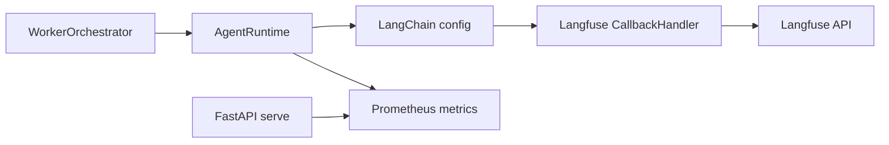

# Observability

egregore exposes two complementary observability layers:

| Layer | Tool | What it captures |
|-------|------|------------------|
| **LLM tracing** | [Langfuse](https://langfuse.com) | Prompts, model calls, tool spans, latency, tokens |
| **Platform metrics** | Prometheus | Ingress events, worker duration, HITL, RAG, cost counters |

## Langfuse (LLM traces)

### Enable tracing

Set both API keys (public + secret) in `.env`:

```bash
LANGFUSE_PUBLIC_KEY=pk-lf-...
LANGFUSE_SECRET_KEY=sk-lf-...
LANGFUSE_HOST=http://localhost:3001
```

`LANGFUSE_API_KEY` is deprecated (maps to public key only); secret key is required.

Self-host stack: [deploy/langfuse/README.md](../deploy/langfuse/README.md).

**First-time dev setup:**

```bash
make langfuse-dev-setup    # headless init env + sync API keys to .env
make dev-langfuse-fresh    # empty DB → org, project, user, keys
```

Without `LANGFUSE_INIT_*` or UI sign-up, Langfuse has no organization and egregore sends no traces (`LANGFUSE_PUBLIC_KEY` + `LANGFUSE_SECRET_KEY` must both be set).

### How it works

1. `AgentRuntime` passes LangChain `callbacks` from `LLMConnector.callbacks()`.
2. `cys_core/observability/langfuse_client.py` initializes the Langfuse SDK once and returns `CallbackHandler()`.
3. `merge_langchain_config()` adds trace **tags** and **metadata** per worker job:

| Tag / metadata | Source |
|----------------|--------|
| `persona:<name>` | Worker persona |
| `job:<id>` | Job store ID |
| `correlation:<id>` | Correlation / investigation chain |
| `investigation:<id>` | Investigation ID |
| `tenant_id`, `sandbox_id`, `memory_entries_loaded` | Metadata fields |
| `langfuse_session_id` | Groups traces in Langfuse Sessions view |
| `langfuse_trace_name` | Descriptive name, e.g. `egregore-worker-soc` |
| `langfuse_user_id` | Tenant for cost/filter attribution |

Cursor skill for Langfuse workflows: `.cursor/skills/langfuse/` (from [langfuse/skills](https://github.com/langfuse/skills)).

### Correlate traces

Search Langfuse by:

- Tag `correlation:<uuid>` — end-to-end event chain
- Tag `job:<uuid>` — single worker execution
- Metadata `persona` — filter by agent

### Short-lived CLI runs

Worker and agent CLI commands call `flush_langfuse()` on exit so batched events are sent before process termination. FastAPI `serve` flushes on shutdown via app lifespan.

### Verify locally

```bash
# Start Langfuse (see deploy/langfuse/)
cd deploy/langfuse && docker compose up -d

# First-time: ensure MinIO bucket exists (also done by make langfuse-dev-setup)
make langfuse-dev-setup

# Configure keys in egregore .env, then:
USE_MEMORY_FALLBACK=true STAGE=test uv run egregore ingest -t siem.alert -p '{"alert":"obs-test"}'
USE_MEMORY_FALLBACK=true STAGE=test uv run egregore worker --once
```

If Langfuse UI shows no traces but ingestion returns 500, check `docker logs langfuse-langfuse-web-1` for `NoSuchBucket` — run `make langfuse-dev-setup` or `docker compose run --rm minio-create-bucket`.

Open Langfuse UI → Traces; confirm tags `persona:*` and `job:*`.

## Local dev stack

From repo root:

```bash
make dev-langfuse   # Langfuse UI http://localhost:3001
make dev-obs        # Prometheus :9091, Grafana :3002, Tempo :3200
make dev-api        # scrape target http://localhost:8080/metrics
```

| Service | URL |
|---------|-----|
| Langfuse | http://localhost:3001 |
| Prometheus | http://localhost:9091 |
| Grafana | http://localhost:3002 (admin / admin) |
| Tempo | OTLP gRPC localhost:4317 (when `OTEL_ENABLED=true`) |
| Operator UI | http://localhost:3000 |

Grafana auto-loads `deploy/grafana/dashboards/cys-agi.json` via provisioning.

**Note:** Worker daemon metrics appear in Prometheus only when jobs run in a process that exposes `/metrics` (API or `worker --once`). Daemon-only workers flush Langfuse per job but do not expose a scrape endpoint yet.

## Prometheus metrics

### Scrape endpoints

| Service | Endpoint |
|---------|----------|
| Ingress API | `GET http://localhost:8080/metrics` |
| Tool gateway | `GET http://localhost:8090/metrics` |

```bash
uv run egregore serve --port 8080
curl -s localhost:8080/metrics | head
```

### Key metrics (`cys_core/observability/metrics.py`)

| Metric | Labels | Meaning |
|--------|--------|---------|
| `cys_events_ingested_total` | `event_type` | Events accepted by ingress |
| `cys_worker_job_duration_seconds` | `persona`, `status` | Worker job latency |
| `cys_tool_invocations_total` | `tool`, `result` | MCP tool gateway calls |
| `cys_job_tokens_total` | `persona` | Estimated tokens per job |
| `cys_job_cost_usd` | `persona` | Estimated USD cost |
| `cys_hitl_pending_total` | — | Jobs awaiting approval |

Grafana dashboard: `deploy/grafana/dashboards/cys-agi.json`.

## OpenTelemetry (HTTP traces)

When `OTEL_ENABLED=true`, the API exports spans to Tempo via OTLP gRPC (`OTEL_EXPORTER_OTLP_ENDPOINT`, default `http://localhost:4317`).

```bash
make dev-obs
OTEL_ENABLED=true uv run egregore serve --port 8080
```

View traces in Grafana → Explore → Tempo datasource. Langfuse remains the source for LLM prompt/tool spans; OTel covers FastAPI HTTP and (later) queue/DB instrumentation.

## Architecture



## Troubleshooting

| Symptom | Check |
|---------|-------|
| No traces in Langfuse | Both `LANGFUSE_PUBLIC_KEY` and `LANGFUSE_SECRET_KEY` set; `LANGFUSE_HOST` reachable |
| Traces missing after CLI | Ensure `flush_langfuse()` runs (built into `worker` / `agent` commands and worker daemon per job) |
| Empty Langfuse queries | ClickHouse/Postgres timezone must be UTC |
| Port conflict with Operator UI | Langfuse UI uses host port **3001**; Operator UI uses **3000** |
| Port conflict with egregore DB | Langfuse Postgres uses host port `15432`, Redis `16379` (see deploy README) |
