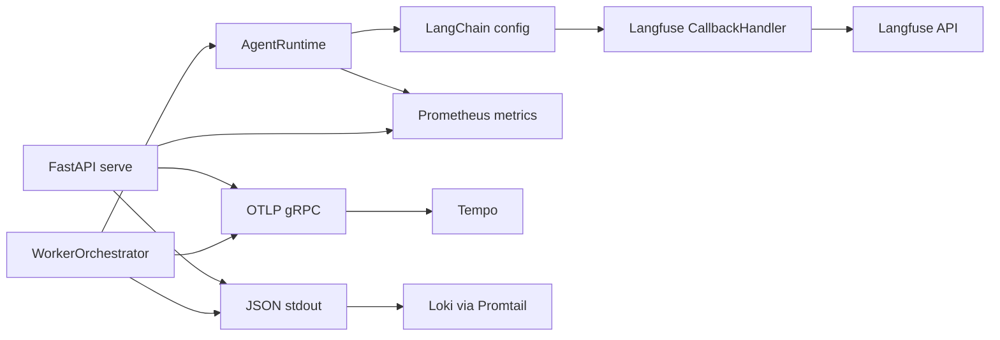

# Observability

egregore exposes complementary observability layers:

| Layer | Tool | What it captures |
|-------|------|------------------|
| **LLM tracing** | [Langfuse](https://langfuse.com) | Prompts, model calls, tool spans, latency, tokens |
| **Platform metrics** | Prometheus | Ingress events, worker duration, HITL, RAG, cost counters |
| **HTTP / worker traces** | Tempo (OpenTelemetry) | FastAPI requests, worker job spans |
| **Structured logs** | Loki (via Promtail) | JSON stdout with `correlation_id`, `trace_id`, `job_id` |

## Langfuse (LLM traces)

### Enable tracing

Set both API keys (public + secret) in `.env`:

```bash
LANGFUSE_PUBLIC_KEY=pk-lf-...
LANGFUSE_SECRET_KEY=sk-lf-...
LANGFUSE_HOST=http://localhost:3001
```

`LANGFUSE_API_KEY` is deprecated (maps to public key only); secret key is required.

Self-host stack: [deploy/langfuse/README.md](../deploy/langfuse/README.md).

**First-time dev setup:**

```bash
make langfuse-dev-setup    # headless init env + sync API keys to .env
make dev-langfuse-fresh    # empty DB → org, project, user, keys
```

Without `LANGFUSE_INIT_*` or UI sign-up, Langfuse has no organization and egregore sends no traces (`LANGFUSE_PUBLIC_KEY` + `LANGFUSE_SECRET_KEY` must both be set).

### How it works

1. `AgentRuntime` passes LangChain `callbacks` from `LLMConnector.callbacks()`.
2. `cys_core/observability/langfuse_client.py` initializes the Langfuse SDK once and returns `CallbackHandler()`.
3. `merge_langchain_config()` adds trace **tags** and **metadata** per worker job:

| Tag / metadata | Source |
|----------------|--------|
| `persona:<name>` | Worker persona |
| `job:<id>` | Job store ID |
| `correlation:<id>` | Correlation / investigation chain |
| `investigation:<id>` | Investigation ID |
| `tenant_id`, `sandbox_id`, `memory_entries_loaded` | Metadata fields |
| `langfuse_session_id` | Groups traces in Langfuse Sessions view |
| `langfuse_trace_name` | Descriptive name, e.g. `egregore-worker-soc` |
| `langfuse_user_id` | Tenant for cost/filter attribution |

Cursor skill for Langfuse workflows: `.cursor/skills/langfuse/` (from [langfuse/skills](https://github.com/langfuse/skills)).

### Correlate traces

Search Langfuse by:

- Tag `correlation:<uuid>` — end-to-end event chain
- Tag `job:<uuid>` — single worker execution
- Metadata `persona` — filter by agent

### Short-lived CLI runs

Worker and agent CLI commands call `flush_langfuse()` on exit so batched events are sent before process termination. FastAPI `serve` flushes on shutdown via app lifespan.

### Verify locally

```bash
# Start Langfuse (see deploy/langfuse/)
cd deploy/langfuse && docker compose up -d

# First-time: ensure MinIO bucket exists (also done by make langfuse-dev-setup)
make langfuse-dev-setup

# Configure keys in egregore .env, then:
USE_MEMORY_FALLBACK=true STAGE=test uv run egregore ingest -t siem.alert -p '{"alert":"obs-test"}'
USE_MEMORY_FALLBACK=true STAGE=test uv run egregore worker --once
```

If Langfuse UI shows no traces but ingestion returns 500, check `docker logs langfuse-langfuse-web-1` for `NoSuchBucket` — run `make langfuse-dev-setup` or `docker compose run --rm minio-create-bucket`.

Open Langfuse UI → Traces; confirm tags `persona:*` and `job:*`.

### LLM-as-a-Judge (evaluators)

Langfuse can score live worker generations with an LLM judge (Helpfulness, Hallucination, etc.). One-time setup from repo root:

```bash
make langfuse-setup-judge
```

This script (see `scripts/langfuse-setup-llm-judge.sh`):

1. Whitelists `LLM_BASE_URL` host in `deploy/langfuse/.env` (self-hosted SSRF bypass for private vLLM).
2. Creates an **LLM Connection** (`egregore-vllm`) pointing at the same endpoint as egregore (`LLM_BASE_URL`, `LLM_MODEL`).
3. Sets the **default evaluation model** in Langfuse (requires vLLM up and tool-calling support).
4. Deploys managed evaluators **Helpfulness** and **Hallucination** on `GENERATION` observations for worker personas (`metadata.persona`).

Re-run after vLLM restarts if the default model step failed. Tune sampling via `LANGFUSE_JUDGE_SAMPLING=0.25` in `.env`.

Verify: Langfuse → **Evaluators** → default model; **Scores** on new traces after workers run.

## Local dev stack

From repo root:

```bash
make dev-langfuse   # Langfuse UI http://localhost:3001
make dev-obs        # Prometheus :9091, Grafana :3002, Tempo :3200
make dev-api        # scrape target http://localhost:8080/metrics
```

| Service | URL |
|---------|-----|
| Langfuse | http://localhost:3001 |
| Prometheus | http://localhost:9091 |
| Grafana | http://localhost:3002 (admin / admin) |
| Tempo | OTLP gRPC localhost:4317 (when `OTEL_ENABLED=true`) |
| Operator UI | http://localhost:3000 |

Grafana auto-loads dashboards from `deploy/observability/grafana/dashboards/egregore/`.

**K8s offline:** API and worker share `PROMETHEUS_MULTIPROC_DIR` via hostPath (`/var/lib/cxado/prom-multiproc`) so worker metrics appear on the API `/metrics` scrape target.

**Local dev:** Worker daemon metrics are aggregated into the API `/metrics` scrape when `PROMETHEUS_MULTIPROC_DIR` is set (done automatically by `make dev` / `scripts/dev.sh`). Restart API and workers together after changing that directory.

## Prometheus metrics

### Scrape endpoints

| Service | Endpoint |
|---------|----------|
| Ingress API | `GET http://localhost:8080/metrics` |
| Tool gateway | `GET http://localhost:8092/metrics` |

```bash
uv run egregore serve --port 8080
curl -s localhost:8080/metrics | head
```

### Key metrics (`cys_core/observability/metrics.py`)

| Metric | Labels | Meaning |
|--------|--------|---------|
| `cys_events_ingested_total` | `event_type` | Events accepted by ingress |
| `cys_worker_job_duration_seconds` | `persona`, `status` | Worker job latency |
| `cys_tool_invocations_total` | `tool`, `result` | MCP tool gateway calls |
| `cys_job_tokens_total` | `persona` | Estimated tokens per job |
| `cys_job_cost_usd` | `persona` | Estimated USD cost |
| `cys_hitl_pending_total` | — | Jobs awaiting approval |

Grafana dashboard: `deploy/observability/grafana/dashboards/egregore/egregore-cys-agi.json`.

## OpenTelemetry (HTTP + worker traces → Tempo)

When `OTEL_ENABLED=true`, the API and worker export spans to Tempo via OTLP gRPC (`OTEL_EXPORTER_OTLP_ENDPOINT`, default `http://localhost:4317`).

For production with Langfuse, use **composite** mode:

```bash
OTEL_ENABLED=true
OBS_TRACE_BACKEND=composite
OTEL_EXPORTER_OTLP_ENDPOINT=http://tempo.cxado-obs.svc.cluster.local:4317
OTEL_SERVICE_NAME=egregore-api   # or egregore-worker
```

```bash
make dev-obs
OTEL_ENABLED=true uv run egregore serve --port 8080
```

View traces in Grafana → **Egregore / Observability** dashboard or Explore → Tempo. Langfuse remains the source for LLM prompt/tool spans; Tempo covers FastAPI HTTP and worker `worker.process_job` spans.

### Trace ↔ log correlation

Structured JSON logs include `trace_id` and `span_id` when OTEL is active. Grafana Tempo datasource is configured with `tracesToLogsV2` → Loki so you can jump from a span to related log lines.

## Structured logging (Loki)

Application logs are JSON on stdout (structlog). Key fields:

| Field | Source |
|-------|--------|
| `service` | `egregore-api` or `egregore-worker` |
| `level` | log level |
| `correlation_id` | investigation / event chain |
| `trace_id`, `span_id` | OpenTelemetry context (when enabled) |
| `persona`, `job_id` | bound during worker job execution |

Env vars:

```bash
LOG_LEVEL=INFO
LOG_FORMAT=json
```

Grafana Loki queries (Explore or **Egregore / Observability** dashboard):

```logql
{namespace="cxado-app", app="egregore-worker"} | json | correlation_id="<uuid>"
{namespace="cxado-app", app=~"egregore-.*", level="error"} | json
```

On k3s offline, Promtail in `cxado-obs` ships pod logs to Loki; no app-side Loki client required.

## Trace path matrix (CLI vs API vs worker vs UI)

Who emits Langfuse traces on k3s offline (`OBS_TRACE_BACKEND=composite`):

| Path | Langfuse trace | When | Tags / name |
|------|----------------|------|-------------|
| **CLI** `egregore worker --once` | Yes | After `AgentRuntime.ainvoke` + `flush_langfuse()` | `persona:*`, `job:*` |
| **Worker daemon** (k8s) | Yes | Same as CLI, per Kafka/Redis job | `egregore-worker-<persona>` |
| **API** advisory fast-path | **No** | Planner skips LLM (`advisory_fast_path_consultant_only`) | — |
| **API** async planner | Yes | LLM planner call only | `planner`, `LiteLLMChatModel` |
| **UI** POST investigation | Indirect | Trace appears only after **worker** runs job | Search by goal substring or `job:` tag |

OTEL spans (Tempo, not Langfuse UI):

| Span | Emitter |
|------|---------|
| `worker.process_job` | Worker orchestrator |
| `worker.agent.run` | Agent runtime |
| FastAPI HTTP | API when `OTEL_ENABLED=true` |

**Tool spans in Langfuse:** legacy tools (`playbook_*`, `ti_search_*`) may appear as CHAIN/GENERATION only unless LangChain tool callbacks are wired. Veil MCP tools require `USE_TOOL_GATEWAY=true` on worker.

Evidence: `deploy_logs/trace_audit_20260703.md`, `deploy_logs/kafka_lag_20260703.md`.

## Architecture



## Troubleshooting

| Symptom | Check |
|---------|-------|
| No traces in Langfuse | Both `LANGFUSE_PUBLIC_KEY` and `LANGFUSE_SECRET_KEY` set; `LANGFUSE_HOST` reachable |
| No traces in Tempo | `OTEL_ENABLED=true`, endpoint reachable; `OBS_TRACE_BACKEND=composite` or `otel` |
| No logs in Loki | Promtail DaemonSet running; pods emit JSON (`LOG_FORMAT=json`); filter `{namespace="cxado-app"}` |
| Trace/log mismatch | Ensure same `trace_id` in log JSON; use Tempo → View logs link in Grafana |
| Traces missing after CLI | Ensure `flush_langfuse()` runs (built into `worker` / `agent` commands and worker daemon per job) |
| Empty Langfuse queries | ClickHouse/Postgres timezone must be UTC |
| Port conflict with Operator UI | Langfuse UI uses host port **3001**; Operator UI uses **3000** |
| Port conflict with egregore DB | Langfuse Postgres uses host port `15432`, Redis `16379` (see deploy README) |
